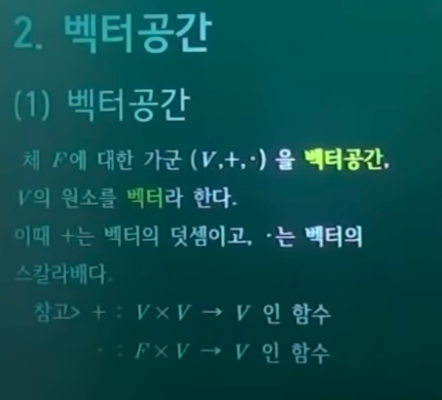
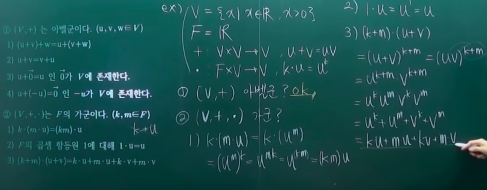
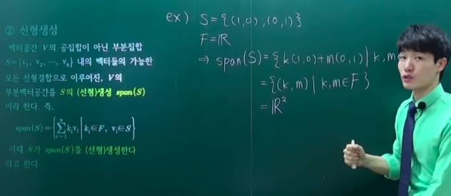

# 3. 수학적 벡터

- 대수구조
  - 대수구조
  - 여러 대수구조
- 벡터공간
  - 벡터공간
  - 선형생성
  - 선형독립
- 여러 벡터공간
  - 노름공간
  - 내적공간
  - 유클리드공간
- 기저와 차원
  - 기저
  - 차원
  - 정규기저
  - 직교기저
  - 정규직교기저

---

물리적 개념이 수학적 개념으로 추상화되거나, 수학적 개념이 물리적 개념으로 대응되는 경우가 있음

## 의문

- *왜 대수구조는, 반군 -> 모노이드 -> 군 -> 아벨군 -> 환 -> 체 의 형태로 분류가 될까?*
- *벡터공간의 정의에서 체F에 대한 가군 이라는게 정확히 무슨 말?*
  - 스칼라는 체(+, x), 벡터공간은 가군이라서?
- *선형대수학에서 대수구조를 정의할 때, 곱셈같은 것을 당연하게 여기는데, 집합론 레벨의 엄밀한 정의가 필요하지 않는가?*

## 1. 대수구조

대수학은 대수구조를 연구하는 학문

### 1-1 대수구조

- 대수구조
  - 정의
    - 수 뿐 아니라 수를 대신할 수 있는 모든 것을 대상으로 하는 집합과 그 집합에 부여된 연산이 여러 가지 공리(구조 - structure)로써 엮인 수학적 대상
      - 집합에 구조를 부여한다고 함
        - 순서구조는 집합에다가 순서관계를 부여
        - 벡터구조는 집합에다가 `B - A = D - C` 의 동치관계 부여
    - 간단히: 일련의 연산들이 주어진 집합
      - **집합 + 구조(연산)**
  - 수학은 수만을 연구하는 학문이 아님. 당장 수 역시 그저 정의한 기호들에 불과
    - 대수구조의 기본 형태는 **집합**
    - 이 집합에 구조를 부여하여
- 선형대수학의 중요성
  - 선형대수학은 벡터공간 이라는 대수 구조를 두고 연구하지만 이 벡터공간이라는 대수구조를 다루면서 익히게되는 다양한 경험들을 이후 다양한 대수구조를 연구함에 있어서 그대로 접목됨

### 1-2 여러 대수구조

- 여러 대수구조
  - 반군(semigroup)
    - 집합과 그 위의 결합법칙을 따르는 하나의 닫혀있는 이항 연산(`f: X x X -> X`)을 갖춘 대수구조
    - 연산 법칙이 부여된 대수구조들 중에서 최상위에 있는 대수구조
      - 연산 법칙이 부여가 되지 않은 대수구조도 있음(마그마)
    - 예시
      - `(R, *), x * y = 0`
  - 모노이드
    - 항등원을 갖는 반군
      - 덧셈의 항등원은 0
      - 곱셈의 항등원은 1
  - 군
    - 역원을 갖는 모노이드
      - 집합에 닫혀있는 이항연산이 하나가 부여되어있고 with 결합법칙, 항등원, 역원
    - 예시
      - `(Z, +)`
  - 아벨군(가환군)
    - 교환법칙이 성립하는 군
  - 환(ring)
    - 덧셈(임의의 연산이)에 대하여 아벨군, 곱셈에 대하여 반군을 이루고 분배법칙이 성립하는 대수구조
      - 환부터는 연산이 2개 이상이 정의 됨
      - 연산은 반드시 닫혀있음
    - 예시
      - `(Z, +, x)`
        - `(Z, +) -> 아벨군`
        - `(Z, x) -> 모노이드`
  - 가군
    - 어떤 환의 원소(체도 환의 일종이므로 가능)에 대한 곱셈이 주어지며, 분배법칙이 성립하는 아벨군
    - 예시
      - 벡터공간
  - 가환환
    - 곱셈이 교환법칙을 만족하는 환
  - 나눗셈환
    - 0이 아닌 모든 원소가 역원을 가지며, 원소의 개수가 둘 이상인 환
      - `역원을 가진다 => 항등원을 가진다`
      - 교환법칙은 아님
    - 예시
      - 사원수
  - 체(field)
    - 가환환인 나눗셈환. 즉, 사칙연산이 자유로이 시행될 수 있고 산술의 잘 알려진 규칙들을 만족하는 대수구조
      - `+`: 결, 항, 역, 교
      - `x`: 결, 항, 역(0제외), 교
    - 예시
      - Q, R, C, ...
- 대수구조의 발견사
  - 처음에는 일단 벡터가 존재
  - 벡터의 본질에 대해서 수학자가 탐구
  - 본질을 파헤치고 추상화했을 때, 어떠한 대수구조와 대응되는 지 확인해보니 가군과 대응되는것을 확인
- 연산구조가 2개 초과로 여러개 들어가는 대수구조
  - 격자(latte structure)
    - 추상대수학 / 순서론을 공부해야지 이해 가능
  - 예시
    - 불대수

## 2. 벡터공간

### 2-1 벡터공간

- 벡터공간
  - 체 `F`에 대한 가군 `(V,+,・)`을 **벡터공간**, V의 원소를 **벡터** 라 한다.
    - `+`: 벡터의 덧셈
      - `V x V -> V`인 함수
        - 벡터 공간상의 관계에서 벡터 공간으로 가는 함수
    - `・`: 벡터의 스칼라배
      - `F x V -> V`인 함수
  - 벡터는 아벨군, 스칼라는 체의 원소

*위의 두번째 예시에서 지수법칙은 어째서 성립한다고 가정할 수 있는가?*

- 벡터 공간으로 불리기 위한 조건(공리)
  - `(V, +)`는 아벨군이다.`(u,v,w∈V)`
    - `(u+v)+w=u+(v+w)`
    - `u+v=v+u`
    - `∃0∈V, u+0=u`
    - `∃-u∈V, u+(-u)=0`
  - `(V,+,・)`는 F의 가군이다.`(k,m∈F)`
    - F라는 체(환의 일부)에서부터 원소하나를 부여받아서 스칼라배가 정의가 되었을 때, 위의 `(V, +)`가 아벨군이라는 조건에다가 F에 대한 가군이 되었을 떄 벡터공간이라고 할 수 있음
    - `k・(m・u) = (km)・u`
    - F의 곱셈 항등원 1에 대해 `1・u = u`
      - *이 조건은 왜포함?*
      - 체에서 받은 원소는 반드시 스칼라배만 정의됨
        - `k+u`는 정의되지 않음
    - `(k+m)・(u+v)=k・u + m・u + k・v + m・v`
- **벡터란 벡터공간의 원소이다.**
  - 끗
  - 어떠한 임의의 벡터공간에서 새로운 정리를 발견하면 그와 다른 임의의 벡터공간에서 해당 정리가 성립함
    - 같은 대수구조이기 때문
  - 4차원 이상의 벡터의 각도나 도형을 해석하는 것과 같은 물리적 / 기하적 해석은 **수학적으로는 전혀 관심사가 아님**
    - 기하적으로 해석이 안돼도 전혀 문제가 없음

---

- 벡터공간은 위와 같이 대수구조로 분류가 되었는데 어떠한 벡터의 본질적인 성질이 이를 가능하게 하였는가?
  - 벡터의 본질
    - 방향
    - 크기
  - 만약 벡터가 유일하다면 어떤 의미가 있을까?
    - 아무 의미도 없음
    - 적어도 둘 이상의 벡터가 존재해야지, 방향이라던지 크기라던지 하는 논의가 의미가 있음(사실 방향과 크기도 정확한 개념은 아님)
    - **관계가 중요**
  - 따라서 어떤 개념을 정의할 때에는 늘 그에 수반하는 연산이라는 것을 덩달아 정의해줌
    - 가장 본질적이고 단순한 연산을 부여하는게 중요
  - 그럼 벡터라는 개념을 정립할 때(방향, 크기), 가장 본질적이고 단순하고 중요한 연산은 무엇인가?
    - **두 벡터의 합**
    - **벡터의 스칼라배**
      - 두 벡터의 **방향** 이 서로 같느냐 다르냐는 벡터의 스칼라배를 통해서 확인 가능
      - 크기는 노름공간에서 확인 가능
  - 이를 만족하는 벡터를 분류가능한 대수구조는 가군이었다.
    - 가군은 본래 환에서 원소를 가져옴
    - 스칼라를 정의함에 있어서는 환까지는 필요 없고 체까지만 있으면 되므로, 체에서 원소를 가져온 것을 벡터 공간이라고 정의
    - 대수구조의 분류로는 가군
    - 실수집합은 체에 속해서 물리적 벡터에서는 벡터와 실수곱만 다뤘음
    - 하지만 체에는 실수만 존재하는 것이 아님
      - 복소수
      - 유한체
      - 유리함수체(대수기하학)
      - 대수적수체
      - ...
    - 즉, 스칼라곱을 다양한 체의 원소들로 할 수 있는데, 이렇게 되면 추상화가 엄청 진정됨
    - 이러한 추상화된 벡터가 실생활에 어떻게 쓰일지는 아무도 모름

### 2-2 선형생성

- 부분벡터공간
  - 정의
    - 벡터공간 `V`상에서 정의된 덧셈과 스칼라배에 대하여 그 자체로서 벡터공간이 되는 `V`의 부분집합 `W`를 `V`의 부분벡터공간 또는 부분공간이라 한다.

- 선형생성(span)
  - 벡터공간 `V`의 공집합이 아닌 부분집합 `S={v1, v2, ..., vn}` 내의 벡터들의 가능한 모든 선형결합으로 이루어진, `V`의 부분벡터공간을 `S의 (선형)생성 span(S)`이라 한다.
    - `span(S) = { sigma_i^n(kivi) | ki∈F, vi∈S }`
    - 이 떄, S가 span(S)를 (선형)생성한다 라고 함

### 2-3 선형독립

집합 내의 벡터들이 서로간의 상호 연관성이 존재하는가 >> 응용분야에서 중요(계산의 복잡성을 예견)

- 정의
  - 벡터공간 `V`의 공집합이 아닌 부분집합 `S = {v1, v2, ..., vn}`에 대하여 `k1v1 + k2v2 + ... + knvn = 0 => k1=k2=k3=...=kn=0` 이면 S가 **선형독립** 이라고 함
    - 만약 `k1=k2=...=kn=0`외의 다른 해가 존재하면 S가 **선형종속** 이라고 함

## 3. 여러 벡터공간

### 3-1 노름공간

3-1 노름 공간의 앞에서 설명하던 개념들은 벡터의 노름이라는 본질이 빠져있었음. 노름공간을 따로 둠으로써, 벡터의 모든 본질을 표현할 수 있음

내적공간으로부터 노름공간이 유도되기 때문에 따로 떼어놓는 것임

- 노름공간
  - 정의
    - 노름이 부여된 `K-벡터공간 (V, ||・||)`
      - ・은 원소자리를 표현한 것
      - K-벡터공간은 기존의 벡터공간보다 한정됨(스칼라가 K집합의 원소로부터 옴)
  - 특징
    - 내적공간이 노름공간의 모태
- 노름
  - 정의
    - `∀u,v∈V, ∀k∈K`에 대해 아래 세 조건을 만족시키는 함수 `||・||: V -> [0, ∞) 이다. (K∈{R, C})`
      - `||kv|| = |k|||v||`
      - `||u+v|| <= ||u|| + ||v||`
        - 여기까지의 공리를 만족하는 노름공간은 반노름공간
      - `||v|| = 0 <=> v = 0`
  - **수학적 벡터에서는 노름은 그저 연산이고 함수일 뿐! 크기가 아닙니다.**

### 3-2 내적공간

- 내적공간
  - 정의
    - 내적이 부여된 `K-벡터공간 (V, <∵>)`
- 내적
  - 정의
    - `∀`

### 3-3 유클리드공간

## 4. 기저와 차원

### 4-1 기저

### 4-2 차원

### 4-3 정규기저

### 4-4 직교기저

### 4-5 정규직교기저
