# 선형사상

- 의문
- 기존 내용 복습 질문
- 선형사상
  - 선형사상
  - 여러 선형사상
- 선형대수학의 기본정리
- 차원정리
  - 차원정리
  - 비둘기집
- 계수정리

## 의문

- 단순히 사상이 일대일 대응인 것이랑(동형사상) 그 성질을 그대로 쓸 수 있는 것이랑은 다른 것 아닌가?
  - 선형사상의 경우, 선형사상은 대수구조의 구조를 유지한다는 성질이 있으므로 그 성질을 그대로 쓸 수 있게 된다.
- 선형대수학의 기본정리 증명(동형사상 증명)
  - `L(V,W)`의 덧셈과 스칼라배를 구조상 애초에 `(L1+L2)(v) = L1(v)+L2(v)`로 정의할 수 있는가?
    - ≡ 애초에 선형사상의 집합은 벡터공간인가?
    - 선형사상의 집합의 덧셈을 위와 같이 정의할 수 있음은 자명. 왜냐하면, `L1(v)+L2(v)`는 이미 우리가 아는 값이고 새로 정의하는 것은 `(L1+L2)(v)`라는 선형사상끼리의 덧셈이기 때문
  - M1[v]_Bv = M2[v]_Bv => M1 = M2
    - 가 어째서 성립하는지?
      - 선형사상이기 때문(직접 증명 가능)
- *기본행연산을 하면 하기전과 후의 row-space가 동일하다고 할 수 있는가?*
  - 0을제외한 스칼라배 ok
  - 행바꾸기 ok
  - *서로다른 두 행을 스칼라배 하고 더한후 기존 행과 치환*
    - 2차원 평면으로 생각하면 직관적으로 그렇다는것을 알 수 있음
    - 선택한 row가 행렬내에서 중복이 없는 경우
    - 선택한 row가 행렬내에서 중복이 있는 경우
- *비둘기집의 원리에서*
  - 선형사상인 경우에는, 같은 차원이고 유한차원인 두 차원 사이라는 조건이 필요한데, 일반적인 비둘기집의 원리는 공집합이 아닌 서로 다른 유한집합 사이 라는 조건을 전제로 하는데, 선형사상인 경우에는 유한집합이 아닌데도 불구하고 성립하는가?
    - 물론 증명은 가능한데, 따름정리와 비둘기집 원리 사이의 관계가 다소 모호함

## 기존 내용 복습 질문

다음의 질문에는 반드시 대답할 수 있어야 함

- 대수 구조란 한마디로 무엇인가?
- 대수 구조가 형성된 의의는?
- 벡터 공간은 왜 그 많은 대수구조 중에서도 가군에 해당하게 되는 것인가?
- 벡터 공간의 본질을 설명할 때, 누락된 것이 존재했는데, 그 누락된 것은 무엇이고 그것은 어떻게 보완이 되는가?
- 다른 집합들(실수 집합 등)도 대수구조상 벡터공간이 될 수 있는가?
  - 실수도 벡터가 될 수 있는가?

## 1. 선형사상(linear map / morphism)

선형대수학은 벡터공간 이라는 대수구조을 탐구하는 학문

어떤 수학적 대상을 이해하기 위해서 가장 많이 쓰는 방법 -> 수학적 대상에 대해서 정의가 되는 함수들을 관찰하는 것

고등학교때 많은 함수를 배운 이유 중 하나 => 실수 체계를 이해하기 위해서

- 사상
  - 대수구조들을 다루는 함수
  - 함수보다 포괄적인 개념(함수와 혼용해서 쓰는경우도 있음)
- 선형사상이 중요한 이유
  - **다루는 대수구조의 특성을 변형시키지 않고 그대로 보존시켜줌**
    - 가산성(additivity)
    - 동차성(homogeneity)
  - 선형사상을 정의해두면 그 보편성으로 인하여, 다른 선형사상의 조건을 만족하는 함수들의 공통적인 특성을 쉽게 파악할 수 있다.
    - 대수구조와 비슷한 느낌

**대수 구조이던 선형 사상이든 둘다 집합이고 그 집합에 속하는 원소들의 특징은 속하는 집합의 성질에 의존하게 됨**

### 1-1 선형사상

- 목표
  - 가능하다면 모든 상황을 선형사상의 언어로 표현
    - 벡터나 행렬보다 더 다루기 쉬움
- 정의
  - `V, W`가 F-위의 벡터공간일 때, 함수 `L: V -> W`가 다음 조건을 만족하면 `L`을 linear map(선형사상, linear mapping, linear transformation) from V into W 라고 부름
    - 조건
      - `L(v1+v2) = L(v1)+L(v2) (v1,v2∈V)`
      - `L(av) = aL(v) (v∈V, a∈F)`
    - linear map중에서 bijection인 것을 isomorphism이라고 부름
    - isomorphism을 이름바꾸기에 혼동이 없는 linear map으로 볼 수 있음
    - linear map은 이름 바꾸기에 혼동이 있는 그 무엇인가로 해석가능
      - e.g
        - `L(v) = w => L^-1(w)의 벡터들(L^-1(w) = {v∈V | L(v)=w})은 모두 W에서 이름이 w가 됨`
        - 만약 `L^-1(w)`들의 집합에도 벡터공간의 구조를 줄 수 있다면 그럴듯할텐데....
          - quotient space
- 특징
  - 벡터공간의 구조를 옮겨 주는 함수
  - `L: V -> W`가 linear map일 떄
    - L이 injective(단사) <=> L은 monomorphism
    - L이 surjective(전사) <=> L은 epimorphism
      - *단사라는 조건이 없으므로, 서로다른 V의 원소가 같은 함수값을 갖는 경우, 그 두 값을 집합으로 묶어주면 bijective가 되지 않을까?(아이디어)*
    - L이 bijective(전단사) <=> L은 isomorphism
    - V = W => L을 endomorphism 혹은 linear operator 혹은 간단히 operator
    - Bijective endomorphism = automorphism
  - `L: V -> W`가 linear map일 떄, 다음은 동치
    - L은 isomorphism
    - `∃M is linear map: W -> V s.t. M・L = Iv ∧ L・M = Iw`
- 관련 용어
  - `L : V -> W`가 선형사상일 때
    - 핵
      - `kerL = L^-1(0) = {v∈V | L(v) = 0}`
        - 영벡터의 원상집합
        - *여기서 0은 영벡터로 집합취급?*
    - 상
      - `imL = L(V) = {L(v)∈W | v∈V}`
- 관련 정리
  - `L: V -> W`가 linear map
    - `ker L ≦ V`
    - `im L ≦ W`
  - `L: V -> W`가 linear map
    - L이 epimorphism이기 위한 필요충분조건은 `imL = W`이다.
    - **L이 monomorphism이면, V와 imL은 isomorphic하다**
    - `U≦V => L(U)≦L(V)`
- 중요한 관찰
  - `L: V -> W`가 linear map일 떄, 다음 조건은 동치
    - L은 monomorphism
    - `u,v∈V, L(u)=L(v) => u=v`
    - `v∈V ∧ L(v)=L(0)=0 => v=0`
    - `kerL = 0`
  - `L: V -> W`가 linear이고, `S⊆V => L<S> = <L(S)>`
    - 쉬운증명
    - **센스있는 증명**
  - `L: V -> W`가 linear이고, S는 V의 subset, Bv는 V의 basis일 때
    - S가 일차독립이고 L이 monomorphism => L(S)도 일차독립
      - **`<S>`의 기저는 S...**
      - 테크닉이 정말 멋지니 꼭 참조하자(우리의 철학)
- **monomorphism과 epimorphism과 L의 관계**
  - monomorphism
    - L이 monomorphism <=> L(Bv)가 일차독립
  - epimorphism
    - L이 epimorhpism <=> L은 V의 generating set을 W의 generating set으로 옮김
  - isomorphism
    - 위의 두 조건을 만족시키면 됨
    - 즉, L은 basis를 basis로 옮김
      - 역으로, basis를 basis로 옮기는 L은 isomorphism
- coset 탐구
  - notation
    - `U≦V ∧ v∈V, v+U = {v+u | u∈U}`
  - 정리
    - `L: V -> W`가 linear map이고 `L(v) = w ∈ imL => L^-1(w) = v + kerL ∧ ker L 과 L^-1(w)사이에 bijection이 존재함 (ker L ~~ L^-1(w) 동등)`

### 1-2 여러 선형사상

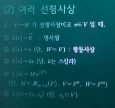

- `L : V -> W`가 선형사상이고 `v∈V`일 때,
  - `L(v) = 0`
    - 영사상
      - 선형사상임을 증명
  - `L(v) = v`
    - 항등사상
  - `L(v) = kv (단, k는 스칼라)`
  - `L(v) = Mv^T (단, M∈mxn인 행렬, V = F^n, W=F^m)`
    - `v^T`는 행으로 뻗어나가는 벡터를 열로 뻗어나가는 벡터로 전치 시킨 것
  - `L(v) = <v,v0> (단, v0∈V)`

## 2. 선형대수학의 기본정리

선형사상의 특성을 파악! 즉, 선형사상 그 자체를 대수구조화 시켜서 특성을 알아보겠다.

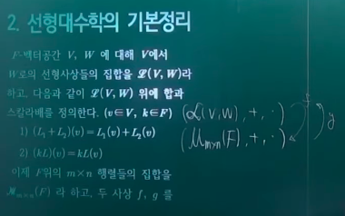

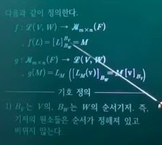

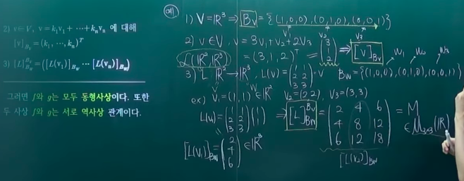

- `F-벡터공간 V, W`에 대해 `V`에서 `W`로의 선형사상들의 집합을 `L(V,W)`라 하고, 다음과 같이 `L(V,W)` 위에 합과 스칼라배를 정의한다(`v∈V, k∈F`)
  - `(L(v,w), +, ・)`
    - `(L1 + L2)(v) = L1(v) + L2(v)`
    - `(kL)(v) = kL(v)`
- 이제 `F`위의 `m x n`행렬들의 집합을 `M(F)`라 하고 두 사상 `f, g`를 다음과 같이 정의한다(행렬의 대수구조화(선형사상과 행렬의 관계를 보기 위하여))
  - `f : L(V,W) -> M(F), f(L) = [L]_BW^BV=M`
  - `g : M(F) -> L(V,W), g(M) = LM([LM(v)]_BW = M[v]_BV)`
    - 용어 설명
      - `Bv`는 `V`의, `Bw`는 `W`의 순서기저.
        - 기저의 원소들은 순서가 정해져 있고 바뀌지 않는다(순서기저).
      - `v∈V, v = k1v1+k2v2+...+knvn, [v]_Bv = (k1,...,kn)^T`
        - v라는 벡터를 Bv의 선형결합으로 표현하고, 선형결합 계수들을 나열한 벡터를 열로 만들어줌
      - `[L]_Bw^Bv = ([L(v1)]_Bw ... [L(v2)]_Bw)`
        - Bv의 각 원소 벡터(V의 기저의 벡터)를 Bw의 선형결합으로 나타냈을 때의 계수를 순서대로 나열한 것의 전치 벡터들을 나열한 것. 결과적으로 행렬이 됨
          - `(v1의 선형결합 계수 전치, v2의 ..., ..., vn ...)`
        - `L : V -> W`이므로 `[L(v1)]_Bw`로 표현
      - `LM`
        - M에 대해 서로 잡히게 되는 선형사상
- 그러면 **f와 g는 모두 동형사상이다.** 또한, 두 사상 **f와 g는 서로 역사상** 관계이다.
  - 위의 결론을 증명하기 위해서는
    - `f`와 `g`가 선형사상임을 증명
    - `f`와 `g`가 동형사상임을 증명
      - 위의 증명이 끝나면 `f`와 `g`는 동형사상
    - `f・g = g・f = 항등사상`
      - 이 증명이 끝나면 `f`와 `g`는 서로 역사상
- 그 의미
  - 선형사상과 행렬은 같다.
    - 귀찮은 선형사상을 보는 대신 행렬만 보면 됨
    - 행렬로, 벡터공간의 함수인 선형사상을 탐구할 수 있음
  - `L(V,W)`에서의 성질, 정리, 법칙, 이론이 `M(F)`에 적용 가능함
    - 일단 `L(V,W)`와 `M(F)`는 벡터공간
    - `L(V,W)`와 `M(F)`사이에 선형사상이며(대수구조의 구조가 유지) 일대일 대응인 사상이 존재하므로, 하나의 선형변환은 하나의 행렬에 중복없이 대응됨
    - 결국 둘은 같다는 결론이 나오고, 서로의 정리나 성질은 서로에게 적용 가능함

f가 선형사상임을 증명

*여기서 `[(kL)(vi)]_Bw = k[L(vi)]_BW` 라는것이 왜 자명한가?*

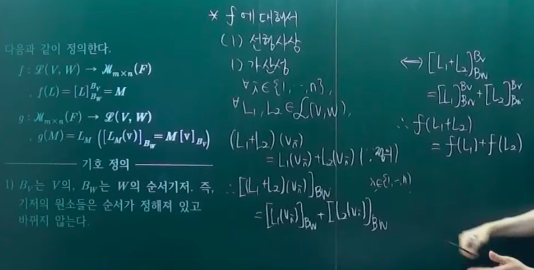

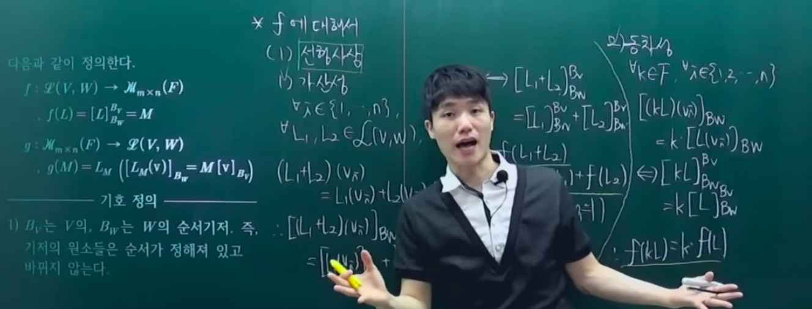

f가 동형사상임을 증명 >> *전사사상 증명이 이해가 안됨*

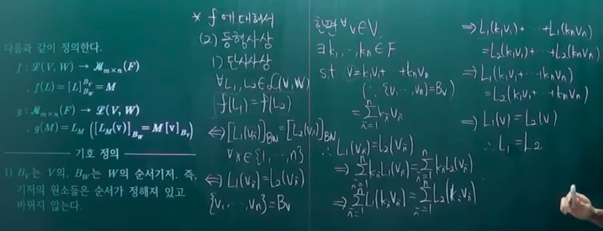

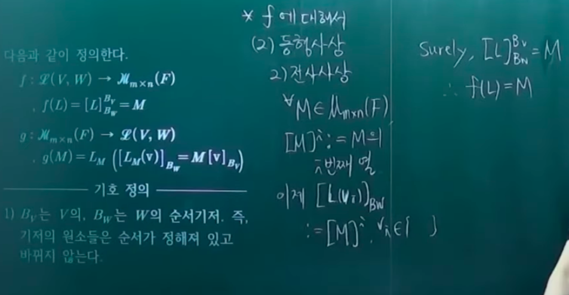

*함수가 전사임을 보일때는 공역의 원소가 치역에 원소에 대응됨을 보이면 됨 -> 위의 증명방식이 살짝 이해가 안되는 부분이 있음*

g가 선형사상임을 증명

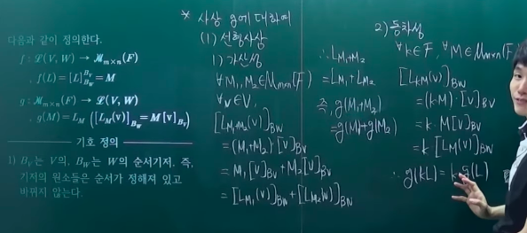

g가 동형사상임을 증명 >> *전사사상 증명이 이해가 안됨*

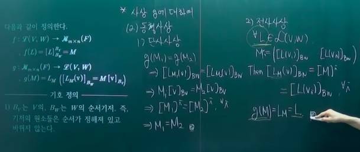

f와 g가 서로 역사상임을 증명

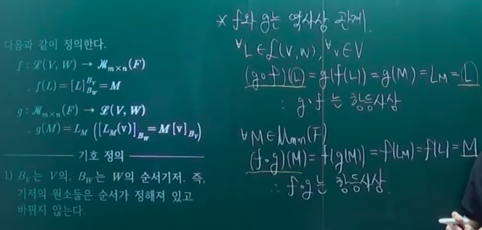

## 3. 차원정리

### 3-1 차원정리

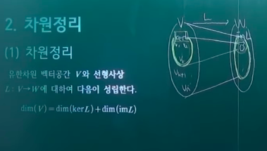

- 차원정리
  - 개요
    - 유한차원 벡터공간 `V`와 선형사상 `L: V -> W`에 대하여 다음이 성립한다
    - `dim(V) = dim(kerL) + dim(imL)`
  - 의의
    - 커널이 중요하다
      - 선형사상의 상을 파악하기 위해서, kernel에 해당하는 원소들을 제외시키고, 나머지 정의역 애들만 봐주면 상에 대한 파악이 된다.
  - 증명(아래)
    - 생성
    - 선형독립

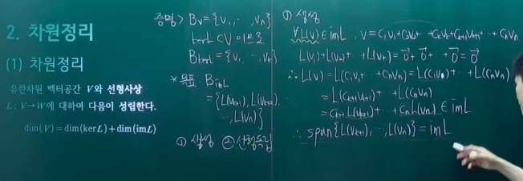

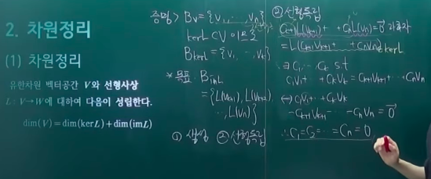

### 3-2 비둘기집 원리

- 따름정리
  - 개요
    - 차원이 같은 두 유한 차원 벡터공간 `V, W`사이에 선형사상 `L`이 정의되어 있으면 다음이 성립한다
      - `L은 전사 <=> L은 단사 <=> L은 전단사`
  - 증명
    - L이 전사 => 단사
    - L이 단사 => 전사

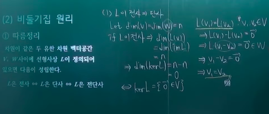

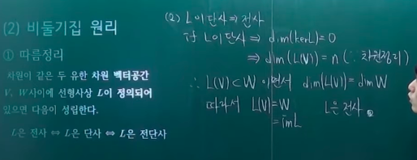

- 비둘기집 원리
  - 공집합이 아닌 두 유한집합 `A, B`의 크기가 서로 같을 때, 함수 `f: A -> B`는 다음을 만족한다.
    - `f는 전사 <=> f는 단사 <=> f는 전단사`

## 4. 계수정리

차원정리의 행렬버전

### 4-1 관련 용어

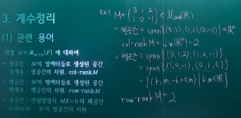

- 관련 용어
  - 행렬 `M∈Μ(F)`에 대하여
    - 열공간
      - `M`의 열벡터들로 생성(span)된 공간
    - 열계수
      - 열공간의 차원. `col-rankM`
    - 행공간
      - `M`의 행벡터들로 생성된 공간
    - 행계수
      - 행공간의 차원. `row-rankM`
    - 영공간
      - 연립방정식 `MX = 0(영행렬)`의 해공간
    - nullityM(무효차수)
      - `M`의 영공간의 차원
        - c.f) rank-nullity 정리
      - *자유변수(매개변수)의 개수*
        - 어쨰서?

### 4-2 계수정리

증명은

`col-rankM = col-rankA` (기본행 연산은 *행렬 고유의 특성(?)* 은 변화시키지 않으므로, 자명함)
`row-rankM = row-rankM` (기본행 연산은 행렬 고유의 특성은 변화시키지 않으므로, 자명함)

- 계수정리
  - 개요
    - 행렬 `M∈Μmxn(F)`에 대하여 다음이 성립한다.
      - `col-rankM = row-rankM = rankM`
    - 이때, 행렬 `M`의 행공간 및 열공간의 공통차원을 M의 계수 **rankM** 이라 한다.
  - 와닿지 않으면 사례를 들어보자

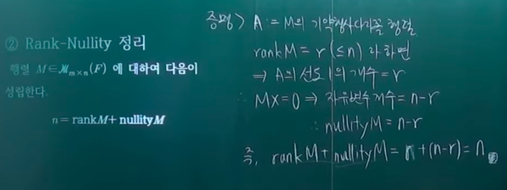

- Rank-Nullity 정리
  - 개요
    - 행렬 `M∈Mmxn(F)`에 대하여 다음이 성립한다.
      - `n = rankM + nullityM`
        - `n`은 변환전의 벡터공간의 차원(벡터가 ,로 n개 구분됨)
        - `rank(A)`는 선형변환후의 벡터공간의 차원(`col-rankA = row-rankA = rankA`)
        - `nullity(A)`는 선형변환으로 인한 커널의 차원
  - 특징
    - 앞서 선형대수학의 기본정리에 의하여, 선형 사상과 행렬이 같으므로, 선형사상의 버전으로 대응시킬 수 있음
      - `dim(V) = dim(ImL) + dim(kerL)`

---

## 연습문제

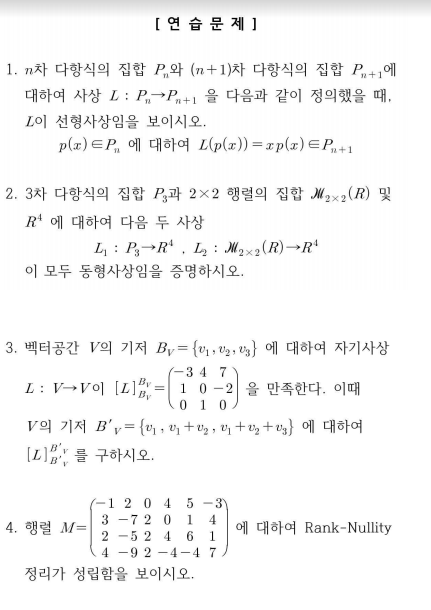
