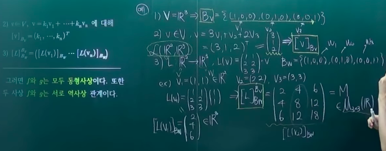
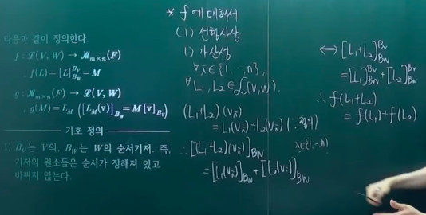
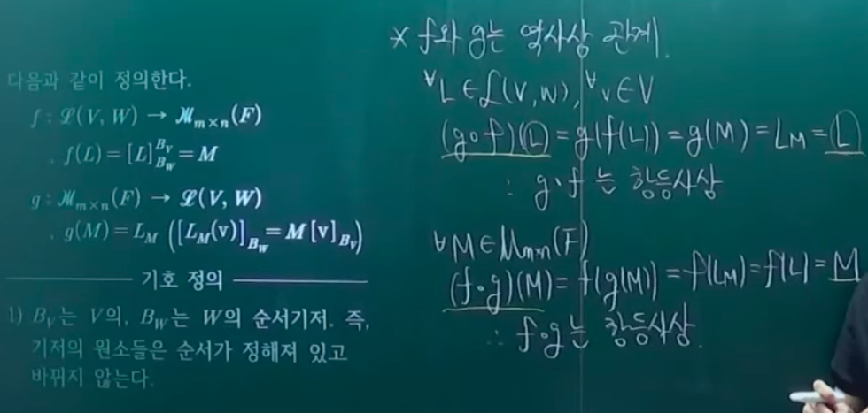

# 선형대수학의 기본정리

- 의문
- ① Vector Space of Linear Maps

## 의문

## 1. Vector Space of Linear Maps

선형 사상을 벡터로 갖는 벡터공간을 탐구

- 선형 사상의 벡터공간
  - 정의
    - `V,W`가 F-vector space일 떄,
      - `L(V,W) = {L: V -> W | L은 linear map}`
      - 연산
        - `(L+M)(v) = L(v) + M(v)`
        - `(aL)(v) = aL(v) (v∈V)`

## 2. 선형대수학의 기본정리

선형사상의 특성을 파악! 즉, 선형사상 그 자체를 대수구조화 시켜서 특성을 알아보겠다.

- `F-벡터공간 V, W`에 대해 `V`에서 `W`로의 선형사상들의 집합을 `L(V,W)`라 하고, 다음과 같이 `L(V,W)` 위에 합과 스칼라배를 정의한다(`v∈V, k∈F`)
  - `(L(v,w), +, ・)`
    - `(L1 + L2)(v) = L1(v) + L2(v)`
    - `(kL)(v) = kL(v)`
- 이제 `F`위의 `m x n`행렬들의 집합을 `M(F)`라 하고 두 사상 `f, g`를 다음과 같이 정의한다(행렬의 대수구조화(선형사상과 행렬의 관계를 보기 위하여))
  - `f : L(V,W) -> M(F), f(L) = [L]_BW^BV=M`
  - `g : M(F) -> L(V,W), g(M) = LM([LM(v)]_BW = M[v]_BV)`
    - 용어 설명
      - `Bv`는 `V`의, `Bw`는 `W`의 순서기저.
        - 기저의 원소들은 순서가 정해져 있고 바뀌지 않는다(순서기저).
      - `v∈V, v = k1v1+k2v2+...+knvn, [v]_Bv = (k1,...,kn)^T`
        - v라는 벡터를 Bv의 선형결합으로 표현하고, 선형결합 계수들을 나열한 벡터를 열로 만들어줌
      - `[L]_Bw^Bv = ([L(v1)]_Bw ... [L(v2)]_Bw)`
        - Bv의 각 원소 벡터(V의 기저의 벡터)를 Bw의 선형결합으로 나타냈을 때의 계수를 순서대로 나열한 것의 전치 벡터들을 나열한 것. 결과적으로 행렬이 됨
          - `(v1의 선형결합 계수 전치, v2의 ..., ..., vn ...)`
        - `L : V -> W`이므로 `[L(v1)]_Bw`로 표현
      - `LM`
        - M에 대해 서로 잡히게 되는 선형사상
- 그러면 **f와 g는 모두 동형사상이다.** 또한, 두 사상 **f와 g는 서로 역사상** 관계이다.
  - 위의 결론을 증명하기 위해서는
    - `f`와 `g`가 선형사상임을 증명
    - `f`와 `g`가 동형사상임을 증명
      - 위의 증명이 끝나면 `f`와 `g`는 동형사상
    - `f・g = g・f = 항등사상`
      - 이 증명이 끝나면 `f`와 `g`는 서로 역사상
- 그 의미
  - 선형사상과 행렬은 같다.
    - 귀찮은 선형사상을 보는 대신 행렬만 보면 됨
    - 행렬로, 벡터공간의 함수인 선형사상을 탐구할 수 있음
  - `L(V,W)`에서의 성질, 정리, 법칙, 이론이 `M(F)`에 적용 가능함
    - 일단 `L(V,W)`와 `M(F)`는 벡터공간
    - `L(V,W)`와 `M(F)`사이에 선형사상이며(대수구조의 구조가 유지) 일대일 대응인 사상이 존재하므로, 하나의 선형변환은 하나의 행렬에 중복없이 대응됨
    - 결국 둘은 같다는 결론이 나오고, 서로의 정리나 성질은 서로에게 적용 가능함

f가 선형사상임을 증명

*여기서 `[(kL)(vi)]_Bw = k[L(vi)]_BW` 라는것이 왜 자명한가?*

f가 동형사상임을 증명 >> *전사사상 증명이 이해가 안됨*

*함수가 전사임을 보일때는 공역의 원소가 치역에 원소에 대응됨을 보이면 됨 -> 위의 증명방식이 살짝 이해가 안되는 부분이 있음*

g가 선형사상임을 증명

g가 동형사상임을 증명 >> *전사사상 증명이 이해가 안됨*

f와 g가 서로 역사상임을 증명

