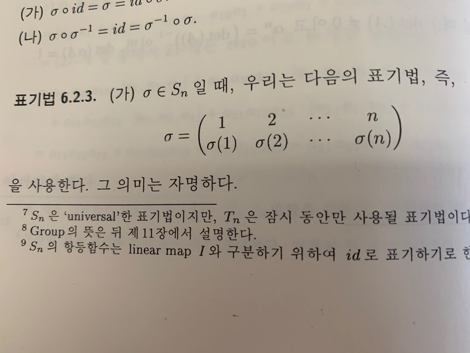
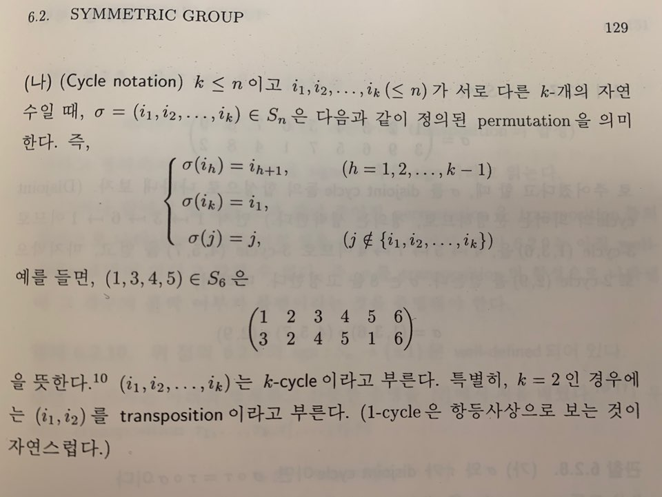

# 6. 행렬식

- 의문
- Alternating Multilinear Form
- Symmetric Group

## 의문

## 6.1 Alternating Multilinear Form

- k-linear form
  - 정의
    - `V1, ..., Vk`가 벡터공간일 떄, 함수 `mu: V1 x ... x Vk -> F`가 모든 k개의 좌표에 대하여 linear 일 때, 즉, 임의의 `i = 1, ..., k`에 대하여 `mu(..., aui+bwi, ...) = a・mu(..., ui, ...) + b・mu(..., wi, ...) (ui, wi∈Vi, a,b∈F)`
      - 일반적으로 `V1 = ... = Vk = V`인 경우를 다루고, 이때의 `mu`를 k-linear form on V라 함
- alternating k-linear form
  - 정의
    - `V`가 벡터공간이고 `mu: V x ... x V -> F`가 k-linear form 이라고 하자. `∀v∈V, mu(..., v, ..., v, ...) = 0`를 만족
  - 성질
    - `mu: V x ... x V -> F`가 k-linear form 일 때, `∀v,w∈V, mu(..., v, ..., w, ...) = -mu(..., w, ..., v, ...)`
- 정리
  - `det(In) = det(e1, ..., en) = 1`을 만족하는 alternating n-linear form `det: F^n x ... x F^n -> F`는 존재하고 유일하다. `det(A) = |A|`의 표기법도 사용한다
    - `n=2`인 경우
    - `n=3`인 경우

## 6.2 Symmetric Group

### Symmetric group

- 정의
  - `σ: {1, ..., n} -> {1, ..., n}`전체의 집합을 Tn으로 표기할 때, `Sn = { σ∈Tn | σ는 bijection }`
    - symmetric group의 원소는 permutation이라 부름
- 특징
  - `|Tn| = n^n, |Sn| = n!`

### Cycle notation

symmetric group의 다른 표현(그냥 함수의 대응을 눕혀서 나타낸 것)

cycle notation / transposition

- 관찰
  - ① `σ`와 `τ`가 disjoint cycle => `σ◦τ = τ◦σ`
  - ② 임의의 permutation은 disjoint cycle들의 합성으로 나타낼 수 있고, 그 방법은 (합성의 순서를 제외하고) 유일하다
  - ③ `∀permutation`은 transposition들의 합성으로 나타낼 수 있다
    - `(i1, ..., ik) = (i1,ik)◦(i1,ik-1)◦...◦(i1,i3)◦(i1,i2)`
- 정의
  - 함수 `sgn: Sn -> {1, -1}, sgn(σ) = (-1)^r (단 σ는 r-개 transposition의 합성)`
    - *well-defined임을 증명*
      - but 주어진 permutation을 transposition들로 나타내는 방법은 여러가지가 있을 수 있으므로, well-defined가 아직 아니며,
      - `σ`를 transposition의 합성으로 나타낼 때 그 개수의 홀짝 여부가 불변이라는 것을 증명해야 함
  - even permutation & odd permutation
    - `σ∈Sn, sgn(σ)=1 => σ는 even permutation ∧ sgn(σ)=0 => σ는 odd permutation`
  - alternating group
    - `An = {σ∈Sn | sgn(σ)=1}`
- symmetric group의 다른 관점
  - permutation matrix
    - 정의
      - `I_σ = [I]_Bv^Bv_σ`
        - `Bv = {v1, ..., vn}`이 V의 ordered basis ∧ `σ∈Sn`, 새로운 ordered basis `Bv_σ = {v_σ(1), ..., v_σ(n)}`을 생각하자.
        - 이 때, (nxn) transition matrix `[I]_Bv^Bv_σ`를 `σ`에 대응하는 permutation matrix라 부름
    - 예시
      - `σ=(1,3,2), I_σ = 1번째열을 3번쨰 열의 값으로 치환 ∧ 2번째 열을 1번째 열의 값으로 치환 ∧ 3번째 열을 2번째 열의 값으로 치환`
        - `(t(0,0,1) t(1,0,0) t(0,1,0))`
    - 성질
      - `σ=(i,j) => I_σ = I_[i]<->[j]`
    - 관찰(`σ,τ∈Sn`)
      - ① I_σ의 j-th column은 `e_σ(j)`즉, `I_σ = (e_σ(1), ..., e_σ(n))`
      - ② `A∈Mnxn(F) => A・I_σ = ([A]^σ(1), ..., [A]^σ(n))`
      - ③ `I_σ・I_τ = I_σ◦τ`
      - ④ `(I_σ)^-1 = I_(σ^-1) = t(I_σ)　∴I_σ ∈ O(n) (O(n)은 orthogonal group)`
      - ⑤ `I_σ = I_τ => σ = τ`
      - ③, ④, ⑤ 는 **symmetric group Sn과 Mnxn(F)의 subset `{I_σ ∈ Mnxn(F) | σ∈Sn}`이 곱셈에 관하여 같은 구조** 를 갖고 있음을 말하고 있음
        - *곱셈에 대한 같은 구조라는게, 곱셈에 대하여 bijection인 isomorphism이 존재한다는 것인가?*
        - 행렬과 선형사상이 같은 것이라면, permutation에 대응하는 선형사상도 있어야 할 것
