# 3. 수학적 벡터

- 의문
- 대수구조
  - 대수구조
  - 여러 대수구조
- 벡터공간
  - 벡터공간
  - 선형생성
  - 선형독립
- 여러 벡터공간
  - 노름공간
  - 내적공간
  - 유클리드공간
- 기저와 차원
  - 기저
  - 차원
  - 정규기저
  - 직교기저
  - 정규직교기저
- 연습문제

---

물리적 개념이 수학적 개념으로 추상화되거나, 수학적 개념이 물리적 개념으로 대응되는 경우가 있음

## 의문

- *왜 대수구조는, 반군 -> 모노이드 -> 군 -> 아벨군 -> 환 -> 체 의 형태로 분류가 될까?*
  - 왜 결합법칙 -> 항등원 -> 역원 -> 교환법칙 ... 의 순으로 대수구조의 순서를 나누어 놓았는가?
- 벡터공간의 정의에서 체F에 대한 가군 이라는게 정확히 무슨 말?
  - 스칼라곱을 정의할 때의 스칼라가 체의 원소
  - 가군의 정의에 의하여
    - 벡터와 스칼라곱이 분배법칙도 성립하고, 벡터는 abelian, 스칼라는 monoid
- 선형대수학에서 대수구조를 정의할 때, 곱셈같은 것을 당연하게 여기는데, 집합론 레벨의 엄밀한 정의가 필요하지 않는가?
  - 맞음
- 연산 뿐 아니라 관계도 `(V, R)`과 같이 쓰는데 이것은 연산으로 썼을 때랑 무엇이 다른가?
  - 범주론 참고: https://ko.wikipedia.org/wiki/범주_(수학)
- 대수적 구조를 정의하기 전에, 이미 "같다"라는 동치관계가 정의되어있으므로, 결과적으로 대수적 구조의 연산을 정의하기 이전에 "같다"라는 동치관계를 정의 해야 함 >> 모든 대수 구조에 그러해야하는가?
  - 동치관계가 논리전개상 필요한 대수구조에서는 당연함
- *튜플의 정의는?*
  - 집합론으로 정의하는가
    - 그러하다
  - 순서쌍과의 차이는
    - 순서쌍의 일반화
- 대수구조에 정의된 연산들은 왜 공리라고 표현하는가?
  - **연산의 성질** 은 공리라고 표현함
    - 인터페이스
  - **연산의 정의** 는 집합론기반의 구현이 필요함
    - 구현
- *Isomorphism / Homomorphism / Polymorphism*
  - 참고: http://www.ktword.co.kr/m/abbr_view.php?m_temp1=4776
  - isomorphism(동형사상)
    - 실질적 내용은 다르나, 구조 특성상으로는 상호간에 일대일 대응이 있는 것
  - homomorphism(준동형사상)
    - 두 그룹 사이의 모든 연산과 관계를 보존하는 사상
  - Polymorphism
    - 실질적으로 내용이 다른 구조 특성상으로 동일한 일대다 대응이 존재(?)
      - 함수가 아닌 관계
  - 각각의 차이?
- *데이터베이스의 이론적 근간이 되는 관계대수는 어떤 대수구조로 분류되는가?*
- 벡터를 고전벡터라는 구체적인 대상에서 추상화 할 떄, 단순히 실수만이 아니라 왜 허수까지도 스칼라배의 대상으로 취급하게 되었는가?
  - 벡터공간의 수학적 정의가 체 F에 대한 가군이므로
- 벡터 공간은 체 F에 대한 가군으로 정의되는데, 사실 스칼라는 체이므로 이미 가환군인데 왜 가군인가?
  - 체 F가 가군이라는 게 아니고, "벡터 공간"이 가군이라는 것임
  - 가군의 정의를 제대로 익히자
  - `k・v ≠ v・k`
  - `x ・ u = 1`인 x가 존재하지 않음
  - 결국 F의 가군이라는 것은, `(V,+,・)` 자체가 가군이라는 것이므로, 벡터의 덧셈은 아벨군, 스칼라곱은 모노이드이고 분배법칙이 성립한다는 것이다.
- *왜 어떤 대수구조는 "공간"이라는 말을 쓰는가?*
- 유클리드 공간에서는 벡터공간의 성질(공리)를 만족하는데, 애초에 튜플의 스칼라곱이나 튜플의 덧셈이 유클리드 공간에서 정의되어있는가???
  - 정의가 되어있는 연산들임 것임(수학자들의 합의)
  - `(a,b) + (c,d) = (a+c, b+d)`가 되도록 +를 정의
  - `k x (a,b) = (k x a, k x b)`가 되도록 x를 정의
- *무한차원에서의 벡터는 어떤 모습인가?*
  - 기저의 원소 개수가 무한개

## 1. 대수구조

대수학은 대수구조를 연구하는 학문

수학적 대상은 집합론적 구현을 필요로 하나, 그 대상의 성질은 구현과는 별개이다. 그리고 그 성질로부터 논리를 전개해 나가기 떄문에 구현에 의존하지 않는다. 이는 대수구조 역시 마찬가지이다.

예시: 벡터공간의 정의, 자연수의 정의(자연수의 확장은 페아노공리계(성질)을 바탕으로 전개. 집합론적 정의와는 별개)

### 1-1 대수구조

- 대수구조
  - 정의
    - 수 뿐 아니라 수를 대신할 수 있는 모든 것을 대상으로 하는 집합과 그 집합에 부여된 연산이 여러 가지 공리(구조 - structure)로써 엮인 수학적 대상
      - 집합에 구조를 부여한다고 함
        - 순서구조는 집합에다가 순서관계를 부여
        - 벡터구조는 집합에다가 `B - A = D - C` 의 동치관계 부여
    - 간단히: 일련의 연산들이 주어진 집합
      - **집합 + 구조(연산, 공리, 관계)**
  - 수학은 수만을 연구하는 학문이 아님. 당장 수 역시 그저 정의한 기호들에 불과
    - 대수구조의 기본 형태는 **집합**
    - 이 집합에 구조를 부여하여 대수구조를 정의
- 선형대수학의 중요성
  - 선형대수학은 벡터공간 이라는 대수 구조를 두고 연구하지만 이 벡터공간이라는 대수구조를 다루면서 익히게되는 다양한 경험들을 이후 다양한 대수구조를 연구함에 있어서 그대로 접목시킬 수 있음

### 1-2 여러 대수구조

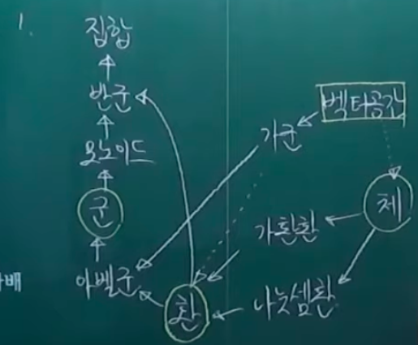

- 여러 대수구조
  - 집합이 최상위 대수구조
    - 연산이 부여되지 않음
  - 마그마(magma)
    - 집합과 하나의 이항 연산을 갖춘 대수구조
    - 연산법칙이 부여되지 않음
      - 연산법칙
        - 결합법칙
        - 교환법칙
        - 분배법칙
          - **서로 다른 두 연산이 있을 떄, 조화를 이루는가**
  - 반군(semigroup)
    - 집합과 그 위의 결합법칙을 따르는 하나의 닫혀있는 이항 연산(`f: X x X -> X`)을 갖춘 대수구조
    - 연산 법칙이 부여된 대수구조들 중에서 최상위에 있는 대수구조
      - 연산 법칙이 부여가 되지 않은 대수구조도 있음(마그마)
    - 예시
      - `(R, *), x * y = 0`
  - 모노이드(monoid)
    - 항등원을 갖는 반군
      - 덧셈의 항등원은 0
      - 곱셈의 항등원은 1
  - 군(group)
    - 역원을 갖는 모노이드
      - 집합에 닫혀있는 이항연산이 하나가 부여되어있고 with 결합법칙, 항등원, 역원
    - 예시
      - `(Z, +)`
  - 아벨군(가환군 - abelian group / commutative group)
    - 교환법칙이 성립하는 군
  - 환(ring)
    - 덧셈(임의의 연산이)에 대하여 아벨군, 곱셈에 대하여 반군을 이루고 분배법칙이 성립하는 대수구조
      - 환부터는 연산이 2개 이상이 정의 됨
      - 연산은 반드시 닫혀있음
    - 예시
      - `(Z, +, x)`
        - `(Z, +) -> 아벨군`
        - `(Z, x) -> 모노이드`
  - 가군(module)
    - 어떤 환의 원소(체도 환의 일종이므로 가능)에 대한 스칼라곱 주어지며, 분배법칙이 성립하는 아벨군
      - 아벨군을 모체로 하고 환의 원소를 스칼라곱으로서 부여받는 대수구조
    - 예시
      - 벡터공간
        - 벡터공간의 경우, 환의 하위구조인 체에서 원소를 받음
  - 가환환(commutative ring)
    - 곱셈이 교환법칙을 만족하는 환
      - 두 연산이 서로 조화를 이룸
  - 나눗셈환(division ring)
    - 0이 아닌 모든 원소가 역원을 가지며, 원소의 개수가 둘 이상인 환
      - `역원을 가진다 => 항등원을 가진다`
      - 교환법칙은 아님
    - 예시
      - 사원수
  - 체(field)
    - 가환환인 나눗셈환. 즉, 사칙연산이 자유로이 시행될 수 있고 산술의 잘 알려진 규칙들을 만족하는 대수구조
      - `+`: 결, 항, 역, 교
      - `x`: 결, 항, 역(0제외), 교
    - 예시
      - Q, R, C, ...
- 대수구조의 발견사
  - 처음에는 일단 벡터가 존재
  - 벡터의 본질에 대해서 수학자가 탐구
  - 본질을 파헤치고 추상화했을 때, 어떠한 대수구조와 대응되는 지 확인해보니 가군과 대응되는것을 확인
- 연산구조가 2개 초과로 여러개 들어가는 대수구조
  - 격자(latte structure)
    - 추상대수학 / 순서론을 공부해야지 이해 가능
  - 예시
    - 불대수

## 2. 벡터공간

벡터는 좌표축과 무관한 개념

### 2-1 벡터공간

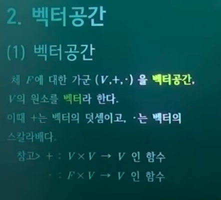

- 벡터공간
  - 정의
    - 체 `F`에 대한 가군 `(V,+,・)`을 **벡터공간**, V의 원소를 **벡터** 라 한다.
      - `+`: 벡터의 덧셈
        - `V x V -> V`인 함수
          - 벡터 공간상의 관계에서 벡터 공간으로 가는 함수
        - `(V, +)`가 아벨군
      - `・`: 벡터의 스칼라배
        - `F x V -> V`인 함수
        - `(V, +, ・)`가 결합 / 항등원 / 분배법칙 성립
    - 벡터는 아벨군, 스칼라는 체의 원소
    - 즉, 어떠한 집합이 벡터공간이라고 불리려면, 그 집합이 가군의 연산구조를 갖고 있으면 됨
      - 결국 벡터공간도 집합
  - 참고
    - (수학적)벡터는 어떤 대상을 직접 정의하는 것이 아니라, 그 대상에 대해 성립해야 하는 연산을 통하여 거꾸로 대상을 정의하는 혁명적인 관점의 산물
      - 프로그래밍에서의 클래스와 인터페이스?
- 벡터공간의 예시
  - 유클리드 공간
  - 행렬의 집합
  - 실함수의 집합(`f: R -> R`)

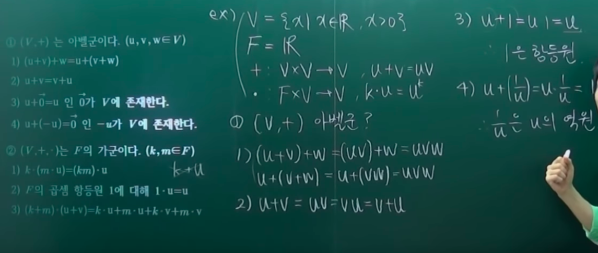

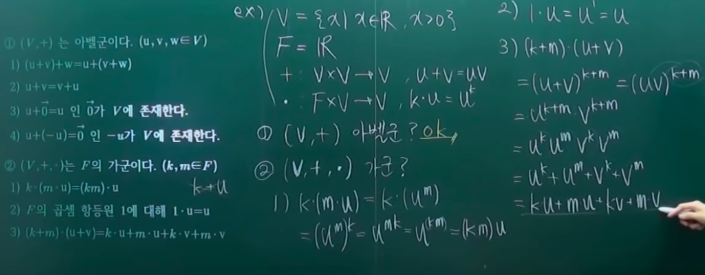

- 벡터 공간으로 불리기 위한 조건(공리)
  - `(V, +)`는 아벨군이다.`(u,v,w∈V)`
    - ① `(u+v)+w=u+(v+w)`
    - ② `u+v=v+u`
    - ③ `∃0∈V, u+0=u`
    - ④ `∃-u∈V, u+(-u)=0`
  - `(V,+,・)`는 F의 가군이다.`(k,m∈F)`
    - F라는 체(환의 일부)에서부터 원소하나를 부여받아서 스칼라배가 정의가 되었을 때, 위의 `(V, +)`가 아벨군이라는 조건에다가 F에 대한 가군이 되었을 떄 벡터공간이라고 할 수 있음
    - ① `k・(m・u) = (km)・u`
    - ② F의 곱셈 항등원 1에 대해 `1・u = u`
      - 체에서 받은 원소는 반드시 스칼라배만 정의됨
        - `k+u`는 정의되지 않음
    - ③ `(k+m)・(u+v)=k・u + m・u + k・v + m・v`
- **벡터란 벡터공간의 원소이다.**
  - 끗
  - 어떠한 임의의 벡터공간에서 새로운 정리를 발견하면 그와 다른 임의의 벡터공간에서 해당 정리가 성립함
    - 같은 대수구조이기 때문
      - 즉, 대수구조의 수학적 지식의 확장은 대수구조의 성질(연산)으로 부터 뻗어나가기 때문
- 수학적 벡터로부터 본 물리적 벡터
  - 4차원 이상의 벡터의 각도나 도형을 해석하는 것과 같은 물리적 / 기하적 해석은 **수학적으로는 전혀 관심사가 아님**
    - 기하적으로 해석이 안돼도 전혀 문제가 없음

---

벡터공간의 대수적 구조 분류 시나리오

- 벡터공간은 위와 같이 대수구조로 분류가 되었는데 어떠한 벡터의 본질적인 성질이 이를 가능하게 하였는가?
  - 벡터의 본질
    - 방향
    - 크기
- 만약 벡터가 유일하다면 어떤 의미가 있을까?
  - 아무 의미도 없음
  - 적어도 둘 이상의 벡터가 존재해야지, 방향이라던지 크기라던지 하는 논의가 의미가 있음(사실 방향과 크기도 정확한 개념은 아님)
  - **관계가 중요**
- 따라서 어떤 개념을 정의할 때에는 늘 그에 수반하는 연산이라는 것을 덩달아 정의해줌
  - 가장 본질적이고 단순한 연산을 부여하는게 중요
- 그럼 벡터라는 개념을 정립할 때(방향, 크기), 가장 본질적이고 단순하고 중요한 연산은 무엇인가?
  - **두 벡터의 합**
  - **벡터의 스칼라배**
    - 두 벡터의 **방향** 이 서로 같느냐 다르냐는 벡터의 스칼라배를 통해서 확인 가능
    - 크기는 노름공간에서 확인 가능
- 이를 만족하는 벡터를 분류가능한 대수구조는 가군이었다.
  - 가군은 본래 환에서 원소를 가져옴
  - 스칼라를 정의함에 있어서는 환까지는 필요 없고 체까지만 있으면 되므로, 체에서 원소를 가져온 것을 벡터 공간이라고 정의
  - 대수구조의 분류로는 가군
  - 실수집합이 체에 속하기 떄문에, 물리적 벡터에서는 벡터와 실수곱만 다뤘음
  - 하지만 체에는 실수만 존재하는 것이 아님
    - 복소수
    - 유한체
    - 유리함수체(대수기하학)
    - 대수적수체
    - ...
  - 즉, 스칼라곱을 다양한 체의 원소들로 할 수 있는데, 이렇게 되면 추상화가 엄청 진행됨
  - 이러한 추상화된 벡터가 실생활에 어떻게 쓰일지는 아무도 모름

### 2-2 부분벡터공간

- 부분벡터공간
  - 정의
    - 벡터공간 `V`상에서 물려받은 덧셈과 스칼라배에 대하여 그 자체로서 벡터공간이 되는 `V`의 부분집합 `W`를 `V`의 부분벡터공간 또는 부분공간이라 한다.
    - F-vector space V의 non-empty subset W가 V의 subspace일 필요충분조건은 다음과 같음
      - (S1) `w1,w2∈W => w1+w2∈W`
      - (S2) `w∈W ∧ a∈F => aw∈W`
        - W가 덧셈과 상수곱에 대해 닫혀있으면 V의 subspace가 됨
  - 표기
    - `W <= V`
      - 정의
        - W는 V의 부분집합
        - W는 V로부터 구조를 물려받은 벡터공간
      - 동치
        - W는 V의 부분집합
        - W는 V로부터 물려받은 연산에 대하여 닫혀있음
    - `<=`는 순서관계
      - 반사성
      - 비대칭성
      - 추이성
    - `W1, ..., Wk ⊆ V`
      - `sigma_i=1^k(Wi) = W1 + ... + Wk = {w1 + ... + wk | w1∈W1, ..., wk∈Wk}`
        - `W1, ..., Wk`의 합
- 주어진 벡터공간의 확장
  - Product Space
    - `V1, ..., Vn`이 벡터공간일 때, `V1, ..., Vn`의 곱집합(Cartesian(Descartes의 형용사형) product)
      - `V1 x .... x Vn = {(v1, ..., vn) | vi∈Vi, i=1, ..., n}`
      - `V1, ..., Vn`의 direct product space 혹은 product 라고 부름
    - 곱집합 위에 연산정의
      - `(v1, ..., vn) + (w1, ..., wn) = (v1+w1, ..., vn+wn)`
      - `a(v1, ..., vn) = (av1, ..., avn)`

### 2-2 선형생성

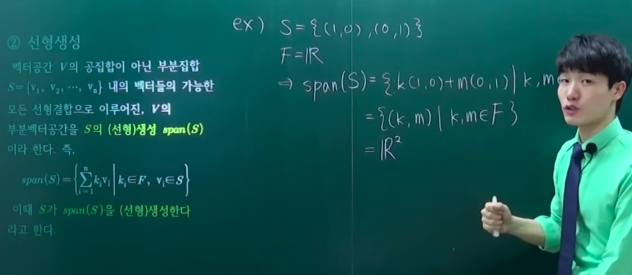

- 선형생성(span)
  - 벡터공간 `V`의 공집합이 아닌 부분집합 `S={v1, v2, ..., vn}` 내의 벡터들의 가능한 모든 선형결합으로 이루어진, `V`의 부분벡터공간을 `S의 (선형)생성 span(S)`이라 한다.
    - `span(S) = { sigma_i^n(kivi) | ki∈F, vi∈S }`
    - 이 떄, S가 span(S)를 (선형)생성한다 라고 함

### 2-3 선형독립

집합 내의 벡터들이 서로간의 상호 연관성이 존재하는가 >> 응용분야에서 중요(계산의 복잡성을 예견)

- 정의
  - 벡터공간 `V`의 공집합이 아닌 부분집합 `S = {v1, v2, ..., vn}`에 대하여 `k1v1 + k2v2 + ... + knvn = 0 => k1=k2=k3=...=kn=0` 이면 S가 **선형독립** 이라고 함
    - 만약 `k1=k2=...=kn=0`외의 다른 해가 존재하면 S가 **선형종속** 이라고 함
    - 선형종속인 경우 식을 변형하면
      - `k1=k2=...=kn=0`이외의 해가 존재한다는 것이고 그와 같은 경우
      - `av1 + bv2 + ... + mvm = -nvn`으로 나타낼 수 있는데(`n ≠ 0`)
      - `a'v1 + b'v2 + ... + m'vm = vn`으로 나타낼 수 있으므로(`a, b, ..., m, n ∈ F`)
      - `S가 선형종속이다`는 `S의 임의의 원소를 다른 원소들의 합으로 나타낼 수 있다` 와 동치

## 3. 여러 벡터공간

행렬공간도 벡터공간임

**노름공간이나 내적공간은 벡터공간에 새로운 연산을 부여하면서 생기는 공간인데, 그러한 연산들의 특징이 함수식을 주어주는것이 아니고, 함수의 특성을 주는 것에 주목하자**

### 3-0 벡터공간의 예시

- Zero space 0
- `Mmxn(F)`, `F^n`(M1xn(F)의 케이스)
  - F-vector space
  - 행렬끼리의 곱셈은 벡터공간의 관점에서는 무시(벡터공간의 요건을 충족시키고 있는가만 봄)
    - 마치 프로그래밍의 인터페이스와 비슷한 개념
- `F^1`
  - (1x1)행렬이므로 scalar로 볼 수 있음
  - F^1 = F 이므로, F자신도 F-vector space
  - vector space F의 상수곱은 scalar 들의 집합 F의 곱셈과 같음
- C는 R-vector space or C-vector space
  - R은 R-vector space C의 R-subspace
  - R은 C-vector space C의 C-subsapce가 될 수 없음
- Function Space
  - `f: R -> R`전체의 집합을 `F(R)`로 표기하고 `a∈R, f,g∈F(R)`일 때, 아래와 같이 함수 덧셈과 스칼라 곱셈을 정의하면 F(R)이 R-vector space가 됨
    - `(f+g)(x) = f(x) + g(x) (x∈R)`
    - `(af)(x) = a・f(x) (x∈R)`
- Polynomial Space
  - `F[t]`
    - F-위의 다항식 전체의 집합
      - t는 indeterminate
    - `f(t) = ant^n + ... + a1t + a0 (단, n>=0, an, ..., a1, a0∈F)`
      - `ant^n + ... + a1t + a0`이는 하나의 심볼
    - `ai`
      - `f(t)`의 i-th coefficient(i = 0,1,...,n)
    - `deg(f) = n (an ≠ 0)`
    - `an`
      - `f(t)`의 leading coefficient
        - leading coefficient가 1인 다항식 = monic polynomial
  - 동치관계
    - `f(t) = g(t) <=> f와 g의 임의의 i-th coefficient가 같다`
  - 연산
    - 전제
      - `f(t) = ant^n + ... + a1t + a0 (an, ..., a1, a0 ∈ F)`
      - `g(t) = bmt^n + ... + b1t + b0 (bm, ..., b1, b0 ∈ F)`
    - 덧셈 연산
      - `(f + g)(t) = f(t) + g(t)`
    - 스칼라 곱셈 연산(`c∈F`)
      - `(cf)(t) = cf(t)`
    - 위 두 연산이 정의 되어있으면 `F[t]`는 F-vector space
    - 다항식 곱셈
      - 아래 사진 참조

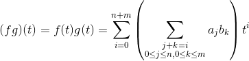

  - `Pn(F) = {f(t)∈F[t] | deg(f) <= n}`
    - `F[t]`의 F-subspace
    - `Pn(F)`는 `F^n+1`과 사실상 같은 F-vector space
  - polynomial evalutation
    - `A는 square matrix, f(t)∈F[t]`
      - `f(t) = ant^n + ... + a1t + a0`
      - `f(A) = anA^n + ... + a1A + a0I`
        - `f(A)`는 evaluation of f(t) at A라고 함
      - 성질
        - `(f+g)(A) = f(A)+g(A)`
          - 다항식을 더한 후 A에서 evaluate한 것
        - `(cf)(A) = cf(A)`
        - `(fg)(A) = f(A)・g(A)`

### 3-1 노름공간

3-1 노름 공간의 앞에서 설명하던 개념들은 벡터의 노름이라는 본질이 빠져있었음. 노름공간을 따로 둠으로써, 벡터의 모든 본질을 표현할 수 있음.

- 노름공간
  - 정의
    - 노름이 부여된 `K-벡터공간 (V, ||・||)`
      - ・은 원소자리를 표현한 것
      - K-벡터공간은 기존의 벡터공간보다 한정됨(스칼라가 K집합의 원소로부터 옴)
        - `(K∈{R, C})`
  - 특징
    - 내적공간이 노름공간의 모태
- 노름
  - 정의
    - `∀u,v∈V, ∀k∈K`에 대해 아래 세 조건을 만족시키는 함수 `||・||: V -> [0, ∞) 이다. (K∈{R, C})`
      - `||kv|| = |k|||v||`
      - `||u+v|| <= ||u|| + ||v||`
        - 여기까지의 공리를 만족하는 노름공간은 반노름공간
      - `||v|| = 0 <=> v = 0`
  - **수학적 벡터에서는 노름은 그저 연산이고 함수일 뿐! 크기가 아닙니다.**

### 3-2 내적공간

노름공간의 완벽한 상위호환 구조

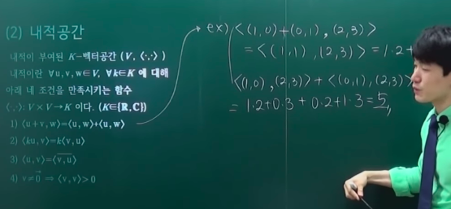

- 내적공간
  - 정의
    - 내적이 부여된 `K-벡터공간 (V, <∵>)`
      -  `<∵>` 범용적인 내적 연산 기호(복소수 공간)
      -  `・` 실수 벡터 공간의 내적 연산 기호(유클리드 공간)
- 내적
  - 정의
    - `∀u,v,w∈V, ∀k∈K`에 대해 아래 네 조건을 만족시키는 함수 `<∵>: V x V -> K(K∈{R, C})`
      - `<u+v, w> = <u,w> + <v,w>`
      - `<ku, v> = k<v,u>`
      - `<u, v> = bar<v, u>`
        - 복소수체의 경우
        - 켤레 복소수 기호
        - 실수의 경우 bar를 제거하면 됨
      - `v ≠ 0 => <v,v> > 0`
        - 결과값에 루트를 씌우면 v의 norm
    - 연산 자체는 내적연산과 같음
  - 특징
    - 노름 공간의 상위 호환
      - 벡터 자기자신을 두번 내적을 하고 루트를 씌우면 노름이 됨
        - 내적 -> 노름
      - 노름 공간에서 내적공간을 만들기 위해서는 조건이 하나 더 붙음
        - *어떤 조건이 더 붙는가?*
    - *왜 유니터리 공간으로 한정시키는가? `K(∈{R, C})`*
      - 근본적으로 자기자신에 내적을 한 값이 ordered subfield(?)에 포함이 되어야 함

### 3-3 유클리드공간

- 유클리드공간
  - 정의
    - 음이 아닌 정수 n에 대하여 n차원 유클리드 공간 `R^n`은 실수집합 `R`의 n번 곱집합이며, 이를 n차원 실수 벡터공간으로서 정의하기도 한다.
      - 집합론의 정의로 정의할 수 있고 위의 벡터공간으로서의 정의와 같다는 것은 자명
        - 튜플로 정의가 되기 때문`(a,b), e.g 2열짜리 튜플 = 순서쌍`
        - 즉 이러한 튜플들이 F에 대한 가군
  - 특징
    - 이 위에 내적 `<u,v> = sigma_1^n(ui x vi) = u・v(유클리드 공간에서)`을 정의하면, 점곱, 스칼라곱 이라고도 한다.
    - 유클리드공간과 벡터공간은 동형사상을 갖고 있다. 즉, 유클리드공간과 벡터공간은 같으며, 유클리드공간에서의 튜플은 벡터와 같다.
      - 그래서 수학적 벡터를 `(v1, v2, ..., vn)`과 같이 표현이 가능한것임
      - `fn : Vn -> R^n, fn(v) = (k1, k2, ..., kn) (v = k1v1 + k2v2 + ... knvn (v1, ..., vn∈V의 표준기저))`
        - fn은 선형사상
        - fn은 동형사상

### 3-4 Isomorphism

- 탐구
  - V와 V'은 사실상 같은 벡터공간이다
  - ⇔ V와 V'는 이름만 다를 뿐 벡터공간으로서는(즉, 덧셈과 상수곱에 관해서는) 사실상 같다
  - ⇔ V와 V'의 원소 사이에는 **이름 바꾸기** 라는 대응관계 `v <-> v'`이 존재하고(단 v∈V, v'∈V'), 다음과 같이 대응하는 vector들의 합도 서로 대응하고, scalar a∈F와의 상수곱도 서로 대응한다
    - 즉
      - `v1 <-> v1' ∧ v2 <-> v2' => v1+v2 <-> v1'+v2'`
      - `a∈F ∧ v<->v' => av <-> av'`
    - 위와 동치
- 정의
  - F-vector space V와 V'이 isomorphic이다
    - ⇔ Bijection `∃φ: V -> V' ∧`
    - `φ(v1+v2) = φ(v1) + φ(v2) (v1,v2∈V) ∧`
    - `φ(av) = aφ(v) (v∈V, a∈F)`
  - φ
    - (F-vector space) isomorphism (from V onto V')
  - isomorphism은 동형이므로, 단순히 집합사이의 일대일 대응 뿐 아니라, 집합의 구조도 같아야 함
    - 순서동형 / 순서동형함수
- isomorphism 집합 사이의 관계
  - `V ~~ V' <=> ∃φ: V -> V', φ는 isomorphism`
    - 동치관계
      - 반사성
      - 대칭성
      - 추이성
- 특징
  - The interest of isomorphisms lies in the fact that **two isomorphic objects cannot be distinguished by using only the properties used to define morphisms;**
  - thus isomorphic objects may be considered the same as long as one considers only these properties and their consequences.

## 4. 기저와 차원

### 4-1 기저와 차원

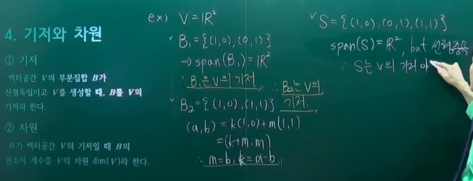

- 기저(basis)
  - 정의
    - 벡터공간 V의 부분집합 B가 선형독립이고 V를 생성(span)할 때, B를 V의 기저라 한다.
    - `F에 대한 벡터공간 V,B⊆V, B는 선형독립 ∧ span(B)=V`를 만족하는 집합`B`
- 차원(dimension)
  - 정의
    - B가 벡터공간 V의 기저일 때 B의 원소의 개수를 V의 차원 `dim(V)`라 한다.
  - 특징
    - 하나의 벡터공간은 여러 기저가 존재
      - 그럼 우리가 표준적으로 생각할 수 있는 기저는 무엇일까?
        - 마치 동치류의 대표원과 비슷한 개념(근데 동치류의 대표원은 여러개가 될 수 있음)
    - 좌표나 좌표축으로 설명하는 것은 3차원까지는 설명이 가능하나, 4차원 이상으로 넘어가면 설명이 힘들어짐
    - 차원이라는 개념이 필요한 수학 분야마다 저마다 차원이라는 개념을 정의함
      - 하지만 차원의 개념의 본질은 벡터공간에서의 차원
    - 만일 어떠한 벡터 공간 V의 기저를 유한개의 원소로서 만들 수 없다면, 그런 벡터공간을 무한차원 이라 함

### 4-2 정규기저 & 직교기저 & 정규직교기저

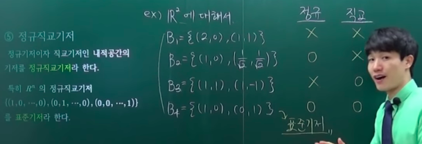

- 정규기저
  - 정의
    - 다음 조건을 만족하는 노름공간 V의 기저 B를 정규기저라 함
      - `∀b∈B, ||b||=1`
- 직교기저(orthogonal basis)
  - 정의
    - 다음 조건을 만족하는 내적공간 V의 기저 B를 직교기저라 함
      - `∀b1, b2∈B, <b1, b2> = 0`
        - 기하적으로 해석하면 직교하는 것(2,3차원)
- 정규직교기저
  - 정의
    - 정규기저이자 직교기저인 내적공간의 기저를 정규직교기저라 함
  - 특징
    - 임의의 벡터공간의 임의의 기저를 만들고 그 기저를 정규직교기저로 일정한 알고리즘을 통해 생성하는 방법이 존재(정규직교기저가 연산하기 편하고 벡터공간을 파악하기가 쉬워짐)
- 표준기저
  - 정의
    - `R^n(n차원 유클리드 공간)`의 정규직교기저 `{(1,0,...,0), (0,1,...,0), ..., (0,0,...,1)}`

## 연습문제

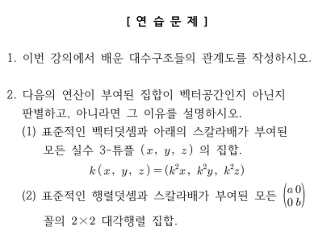

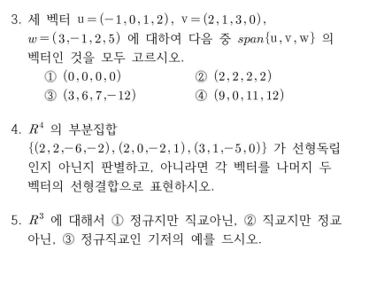

3-2번 문제 가우스-조르단 소거법 연습해보자!

---

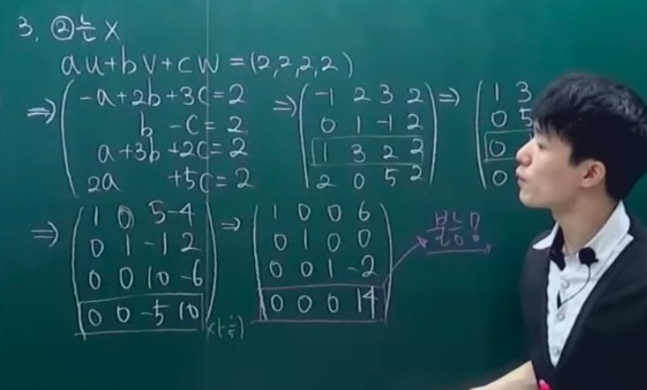
