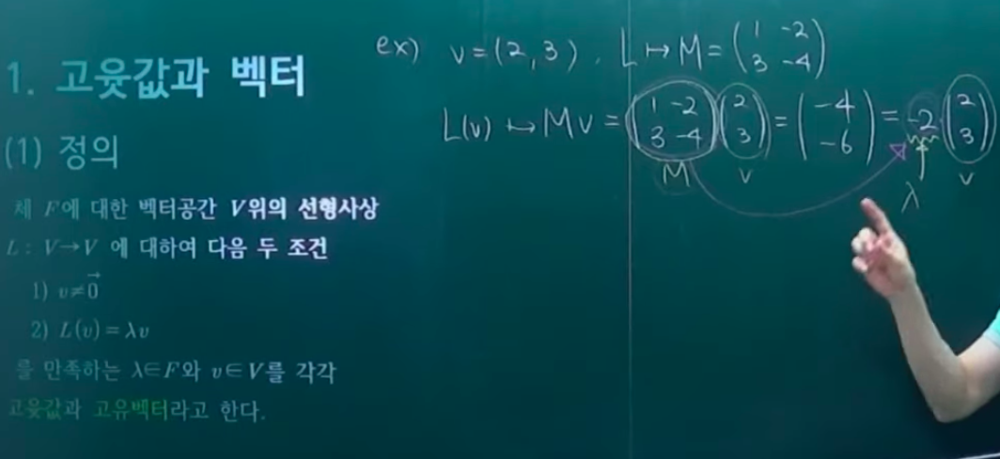
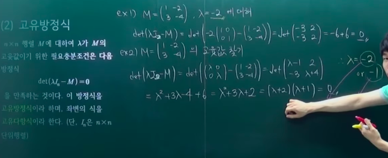
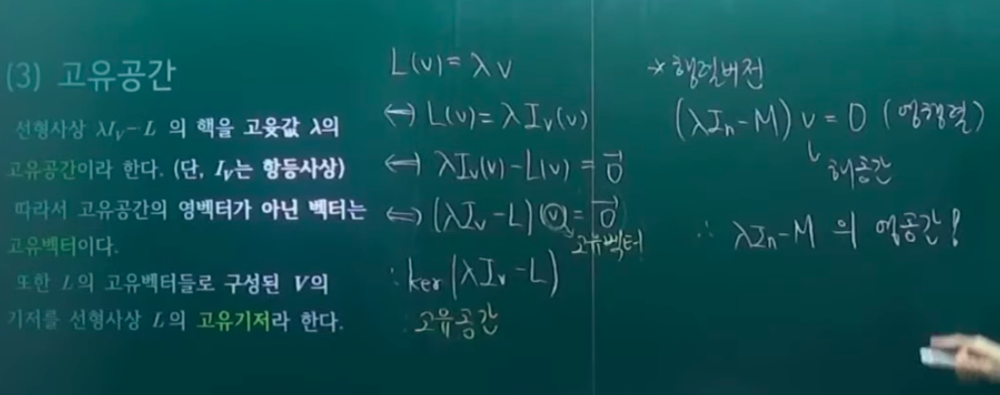
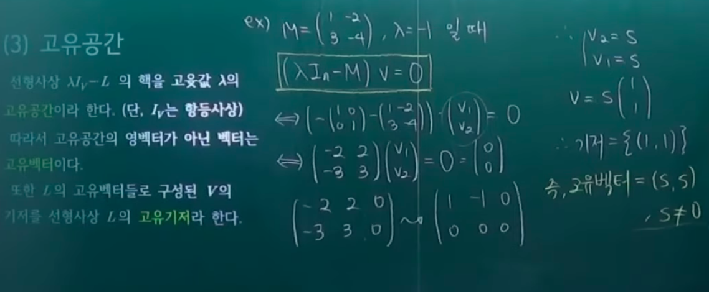
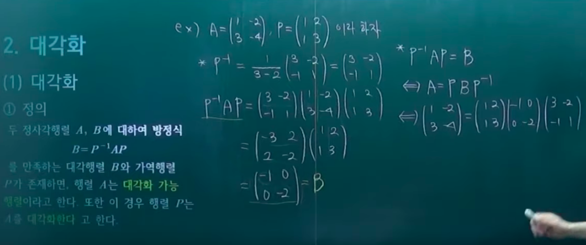
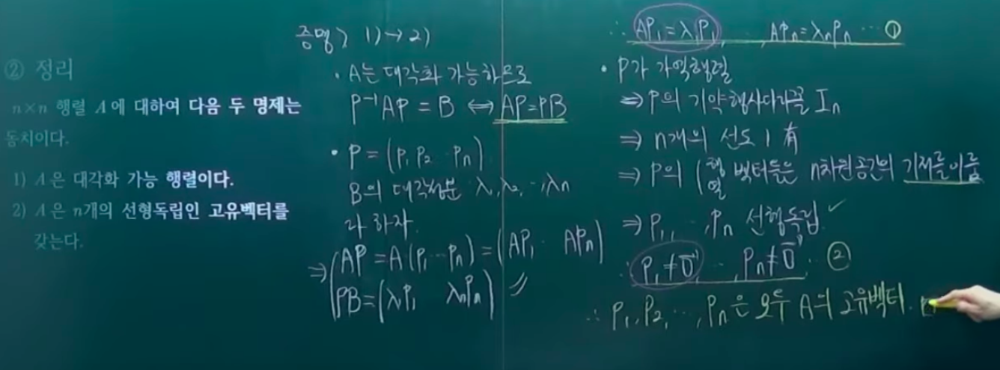
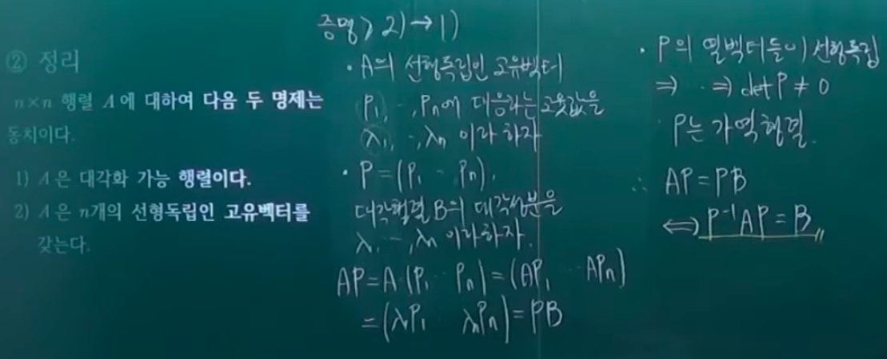
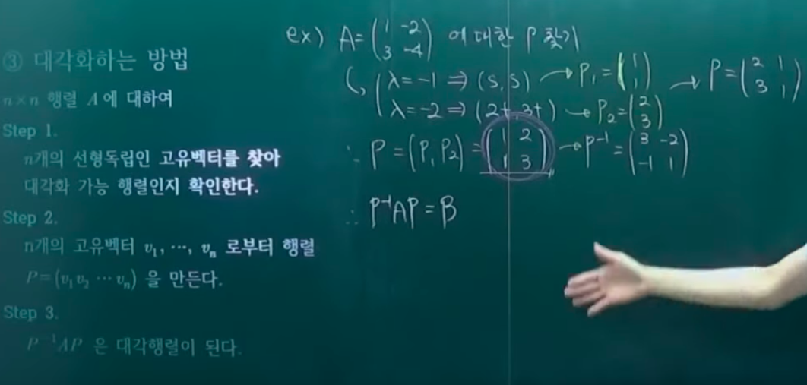

# 고유 벡터와 고윳값

- 의문
- 고윳값과 벡터
  - 정의
  - 고유방정식
  - 고유공간
- 대각화
  - 대각화
  - 중복도
  - 닮음 불변량
- C-H 정리
- 연습문제

## 의문

- *정사각행렬이 선형사상이다?*
  - *차원정리 / 계수정리*
- *열벡터가 선형독립이면 역행렬을 갖음을 증명*

## 1. 고윳값과 벡터

- eigen(자신의 / 특유의)
  - 특수한 값이나, 유일한 값은 아님
  - 행렬 변환을 위해서 만들어진 개념
- 선형사상
  - 벡터를 변환하는 함수
    - 이면서 그 자체가 벡터임
  - 개개의 선형사상마다 고윳값과 고유벡터가 존재하고, 해당 선형사상의 본질을 요약해주는 효과적인 개념
- 정사각 행렬의 고유벡터 / 고윳값
  - **정사각 행렬에 대응하는 선형사상의 고유벡터 / 고윳값**
  - 행렬에 관한 이야기를 할 때에는 선형사상에 대응해서 생각해보는 것이 필요
- 선형사상의 고유벡터 / 고윳값의 기하학적 표현(비유적)
  - 고유벡터는 선형사상의 방향 벡터
  - 고윳값은 선형사상의 크기
  - **너무 이렇게 물리적 개념에 의존하면 안된다!**

### 1-1 정의

- 정의
  - 체 F에 대한 벡터공간 V위의 선형사상 `L : V -> V`에 대하여 다음 두 조건
    - `v ≠ 0`
    - `L(v) = λv (λ∈F)`
  - 를 만족하는 `λ∈F`와 `v∈V`를 각각 고윳값과 고유벡터라고 한다.

### 1-2 고유방정식

- 개요
  - 고윳값을 찾는 방법
- 방법
  - `n x n`행렬 M에 대하여 `λ`가 `M`의 고윳값이기 위한 필요충분초건은 다음 방정식
    - `det(λIn-M) = 0 (In은 n x n 단위행렬)`
  - 를 만족하는 것이다. 이 방정식을 고유방정식이라 하며, 좌변의 식을 고유다항식이라 한다.
- 특징
  - 고윳값은 반드시 한개만 존재하는 것은 아님
- 과제
  - 고윳값에 대응하는 고유 벡터는 어떻게 찾을까?

### 1-3 고유공간

- 개요
  - 고유 벡터를 찾기 위한 과정
- 정의
  - 선형사상 `λIv - L`의 핵을 고윳값 λ의 고유공간이라 함
  - 따라서 고유공간의 영벡터가 아닌 벡터는 고유벡터이다.
  - 또한 `L`의 고유벡터들로 구성된 `V`의 기저를 선형사상 `L`의 고유기저라 함

## 2. 대각화

고윳값 / 고유벡터를 활용하는 사례

### 2-1 대각화

- 개요
  - 하나의 선형사상을 여러개의 다른 선형사상들로 분해
- 정의
  - 두 정사각행렬 `A, B`에 대하여 방정식 `B = P^-1AP`를 만족하는 대각행렬 B와 가역행렬 P가 존재하면, 행렬 A는 대각화 가능 행렬이라고 한다. 또한 이 경우 행렬 P는 A를 대각화한다 고 한다.
    - `A = PBP^-1`
  - A와 B에는 유의미한 관계가 있다
- 정리(대각화 하는 방법을 위한)
  - `n x n`행렬 A에 대하여 다음 두 명제는 동치이다.
    - A는 대각화 가능 행렬이다.
    - A는 n개의 선형독립인 고유벡터를 갖는다.
  - 증명
    - 아래

---

- 대각화하는 방법
  - `n x n`행렬 A에 대하여
    - ① n개의 선형독립인 고유벡터를 찾아 대각화 가능 행렬인지 확인한다
    - ② n개의 고유벡터 `v1, ..., vn`로부터 행렬 `P = (v1, v2, ..., vn)`을 만든다.
    - ③ `P^-1AP`는 대각행렬이 된다.

### 2-2 중복도

어떤 행렬이 대각화가 가능한지 판별할 수 있는 능력을 갖음

- 정의

### 2-3 닮음 불변량

## 3. C-H 정리

## 4. 연습문제

