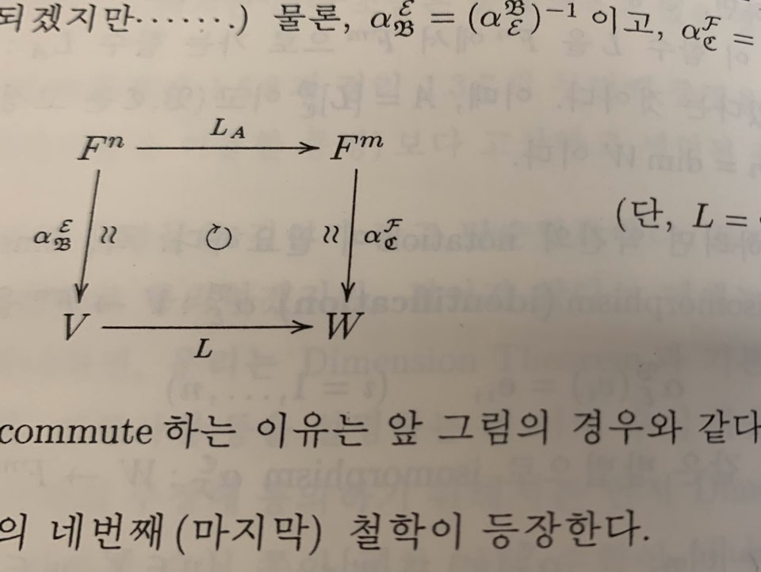
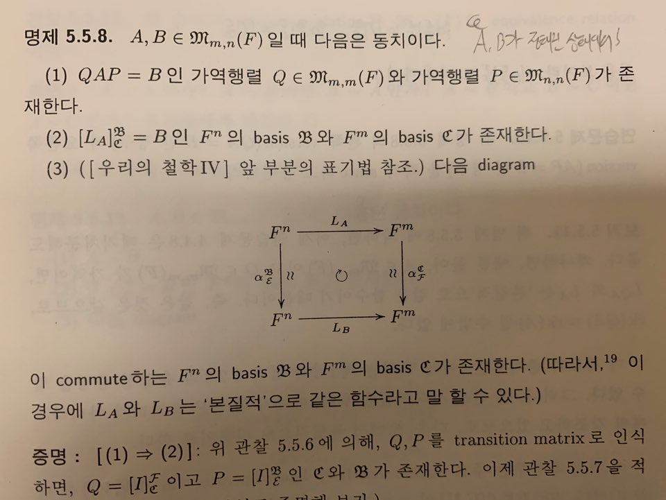
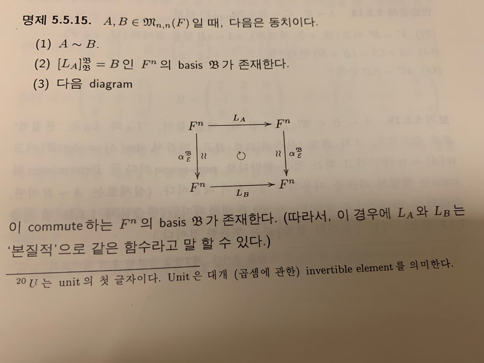
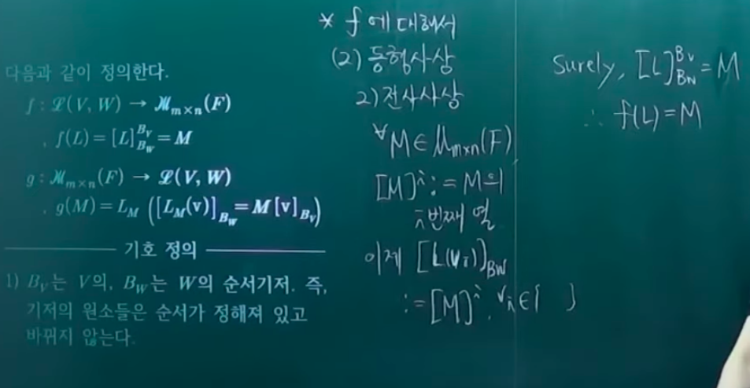
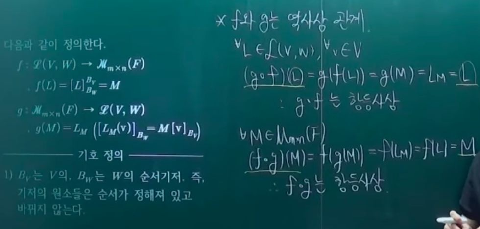

# 선형대수학의 기본정리

- 의문
- ① Vector Space of Linear Maps
  - 선형사상의 벡터공간
  - dual space
- ② 선형대수학의 기본정리; 표준기저의 경우
- ③ 선형대수학의 기본정리; 일반적인 경우
- ④ 기본정리의 결과와 우리의 철학

## 의문

- *선형대수학의 기본정리에서, 일반적인 경우에서 표준적인 경우를 어떻게 유도하는가? 특히 `φ`함수는?*
- `A∈Mnxn(F)`에 isomorphic한 선형사상은 반드시 `L(V,V)`의 원소인가?(endomorphism)
  - `dimV = n`인 경우 그렇다
- *`Eij: V -> W, Eij(vk) = δjk x wi (1≦j,k≦n, 1≦i≦m)`이 함수의 정체는?*
- *선형대수학의 기본정리가 특수한 경우에 성립하는데, `dimV = n, dimW = m`이면 V ~~ F^n, W ~~ F^m 이므로, 일반적인 경우에도 당연히 성립하는것 아닌가?*
- *어떤 벡터의 집합이 linearly independent인지 계산적으로 확인하는 방법 -> 논리적인 모순이 존재하는가?*
  - `{v1, ..., vn}`를 isomorphic한 `{t(a,b,c), t(d,e,f), t(g,h,i)}`와 같은 `F^r`형식으로 변환
  - 방법1
    - 각 원소(e.g `t(a,b,c), t(d,e,f), t(g,h,i)`)를 각각의 열로 하는 행렬 A 생성
    - 만일 `AX=0`이 trivial solution만 갖으면, 각 열의 벡터의 집합은 일차 독립, `AX=0`이 non-trivial solution도 갖으면 각 열의 벡터의 집합은 일차 종속
      - *만일, F^3의 원소를 주어주고, 집합을 {t(a,b,c), t(d,e,f)}와 같이 두개만 주어주는 경우에는 어떻게 생각해야 하는가?*
    - `AX=0`이 trivial solution만 갖는다 <=> A는 역행렬이 존재한다 <=> A의 Row-reduced echelon form = I
  - 방법2
    - 각 원소(e.g `t(a,b,c), t(d,e,f), t(g,h,i)`)를 각각의 행으로 하는 행렬 A 생성
    - A의 Row-reduced echelon form을 만들어줌
    - 만일, zero-row 가 포함되어있으면 결과적으로 일차종속, zero-row가 없으면 일차독립
      - 결국 기본행연산은 linear combination과 같으므로
      - *일차종속이어도 non-zero row만 존재하는 경우가 가능한가?*

## 1. Vector Space of Linear Maps

선형 사상을 벡터로 갖는 벡터공간을 탐구

### 1.1 선형사상의 벡터공간

- 선형사상의 벡터공간
  - 정의
    - `V,W`가 F-vector space일 떄,
      - `L(V,W) = {L: V -> W | L은 linear map}`
      - 연산정의
        - `(L+M)(v) = L(v) + M(v)`
        - `(aL)(v) = aL(v) (v∈V)`
      - `L(V,W)`는 vector space이다.
- *evaluation of f(t) at L*
  - `f(t) = ant^n + ... + a1t + a0 (an, ..., a0 ∈ F)`가 `F[t]`의 polynomial일 떄
  - `f(L) = anL^n + ... + a1L + a0I`
    - `(f+g)(L) = f(L)+g(L)`
    - `(cf)(L) = cf(L)`
    - `(fg)(L) = f(L)◦g(L)`
- 새로운 벡터공간을 조우했을 때 팁
  - **Classificiation Theorem을 생각하여, 그것의 dimension에 대해서 파악하자**

### 1.2 dual space(쌍대공간)

*dual space가 이해가 잘 안되니 다시 복습이 필수!*

- 개요
  - `V* = L(V,F)`
    - V*의 원소를 linear functional(linear form)이라고 부름
  - dual의 dual(double dual)
    - `(V*)* = V** = L(V*, F)`
  - Bv의 dual basis
    - `Bv* = {v1*, ..., vn*}`
      - `vi*(vj) = δij (1≦i,j≦n)`
- 예시
  - `tr ∈ Mnxn(F)*`
- 정리
  - V가 f.d.v.s이면, `dim V* = dim V`이다
  - V,W가 f.d.v.s이면, `dim L(V,W) = (dimV)・(dimW)`
    - 기저: `Eij: V -> W, Eij(vk) = δjk x wi (1≦j,k≦n, 1≦i≦m)`

## 2. 선형대수학의 기본정리; 표준기저의 경우

기저가 표준기저로 주어진 경우를 다룸

- 개요
  - 행렬과 선형사상은 같은 것
- 표기법
  - `V = F^n; dimV = n, [F^n의 표준기저] = ε = {e1,...,en}`
  - `W = F^m; dimW = m, [F^m의 표준기저] = F = {f1,...,fm}`
  - `U = F^r; dimU = r, [F^r의 표준기저] = ζ = {g1,...,gr}`
    - 위의 표준기저들은 모두 ordered basis로 생각
- 정의
  - `L∈L(F^n,F^m), L(e1)=t(a11,...,am1), ..., L(en)=t(a1n,...,amn) (aij∈F)`
    - `≡ L(ej) = sigma_i=1^m(aij x fi) (j=1,...,n)`
  - 표준기저 ε과 F에 관한 L의 행렬(행렬표현)
    - 개요
      - `[L]_F^ε = [L] = (L(e1), ..., L(en)) (aij) ∈ Mmxn(F)`
    - 표기
      - 표준기저 ε과 F에 관한 L의 행렬(행렬표현)이라고 부름(matrix of (associated with) L with respect to ε and F)
      - `[L]`은 그의 j-번쨰 column이 `L(ej)`인 (mxn)행렬이다
    - 특징
      - `[L]`은 행렬 `[L]_F^ε`에 의해 유일하게 결정 됨
- 선형대수학의 기본정리
  - `φ_F^ε = φ: Mmxn(F) -> L(F^n, F^m), φ(A) = LA (A∈Mmxn(F))`
  - `ψ_F^ε = ψ: L(F^n,F^m) -> Mmxn(F), ψ(L) = [L]_F^ε = [L], (L∈L(F^n,F^m))`
  - 와 같이 정의하면 다음이 성립함
    - φ는 isomorphism이고, ψ가 그의 inverse map
    - `B∈Mrxm(F) ∧ A∈Mmxn(F) => φ_g^F(B)・φ_F^ε = φ_g^ε(BA) 즉 LB・LA = LBA`
    - `L∈L(F^n,F^m) ∧ M∈L(F^m,F^r) => ψ_g^F(M)・ψ_F^ε(L) = ψ_g^ε(M・L) 즉 [M]_g^F・[L]_F^ε = [M・L]_g^ε`
- 따름정리
  - ① **모든 linear map `L: F^n -> F^m`은 LA의 꼴이고, 이때, `A∈Mmxn(F)`는 유일하게 결정된다**
    - 결국 `∃LA∈L(F^n, F^m), L = LA (∵ L에 대응하는 A가 존재하고, A는 LA를 유일하게 결정시킴)`
  - ② `A∈Mmxn(F) => [LA]_F^ε = A`
  - ③ `L∈L(F^n,F^m), L_[L] = L <=> L(X) = [L]・X (X∈F^n)`

## 3. 선형대수학의 기본정리; 일반적인 경우

기저가 임의로 주어진 경우를 다룸

- 표기법
  - `V; dimV = n, [V의 기저] = Bv = {v1,...,vn}`
  - `W; dimW = m, [W의 기저] = Bw = {w1,...,wm}`
  - `U; dimU = r, [U의 기저] = Bu = {u1,...,ur}`
    - 기저들은 ordered이고, fixed이다
- 정의
  - `L∈L(V,W), L(vj) = sigma_i=1^m(aij x wi), (j=1,...,n)`
    - `[L]_Bw^Bv = (aij) = ([L(v1)]_Bw, ..., L(vn)_Bw)`
      - 기저 Bv와 Bw에 관한 L의 행렬(행렬표현)
      - L은 `[L]_Bw^Bv`에 의해 completely and uniquely determined됨
- 선형대수학의 기본정리
  - `φ_Bw^Bv: Mmxn(F) -> L(V,W), [(φ_Bw^Bv(A))(v)]_Bw = A・[v]_Bv (A∈Mmxn(F), v∈V)`
  - `ψ_Bw^Bv: L(V,W) -> Mmxn(F), ψ_Bw^Bv(L) = [L]_Bw^Bv (L∈L(V,W))`
  - 다음이 성립
    - 결과 ①
      - `φ_Bw^Bv`는 isomorphism이고, `ψ_Bw^Bv`가 그의 inverse map
    - 결과 ②
      - `B∈Mrxm(F) ∧ A∈Mmxn(F) => φ_Bu^Bw(B)・φ_Bw^Bv(A) = φ_Bu^Bv(BA)`
      - `L∈L(V,W) ∧ M∈L(W,U) => ψ_Bu^Bw(M)・ψ_Bw^Bv(L) = ψ_Bu^Bv(M・L), 즉 [M]_Bu^Bw・[L]_Bw^Bv = [M・L]_Bu^Bv`
- 따름정리
  - `L∈L(V,W) ∧ v∈V => [L(v)]_Bw = [L]_Bw^Bv・[v]_Bv`

## 4. 기본정리의 결과와 우리의 철학

- 선형대수학의 기본정리의 교훈
  - **① `Mmxn(F), L(V,W)`는 벡터공간으로서는 이름만 다를 뿐 사실상 같음(isomorphic)**
    - `Mmxn(F)`의 벡터들은 행렬이라고 불리우고 `L(V,W)`의 벡터들은 선형사상이라고 불리운다는 차이만 있을 뿐, 그들의 덧셈과 상수곱의 구조는 같음
    - **행렬과 선형사상은 같은 것**
    - 예시
      - ① `Mmxn(F)`와 `L(V,W)`
        - `Mmxn(F)`와 `L(V,W)`가 isomorphic이므로 `dimL(V,W) = mn = (dimV)・(dimW)`
        - `φ_Bw^Bv(eij) = Eij, [Eij]_Bw^Bv = eij`
          - 증명해보자(직접 계산)
          - `{Eij}`가 어떻게 `L(V,W)`의 기저가 되었는지 예측했는지 분명함
            - `{eij}에 isomorphic한 것이 {Eij}`
      - ② `LE: F^n -> F^n, (E는 elementary matrix)`
        - 모든 elementary matrix는 가역이고, 그 역행렬도 elementary matrix이다 는 자명
          - `LE`만 `LE1, LE2, LE3`3가지 종류의 elementary linear map 이라고 생각하고서 각각의 linear map 에 역행렬을 찾아주면 됨
    - 주의
      - **`φ_Bw^Bv`와 그의 inverse `ψ_Bw^Bv`는 ordered basis Bv,Bw의 선택에 의존**
        - 행렬과 선형사상을 identify할 때에는 어떤 기저를 선택했는지 분명히 밝혀야 함
          - 그래서 증명단계에서 Bv, Bw, Bu를 명시했던 것임. 명시하지 않으면 표준기저를 뜻하는 것으로 약속
  - **② 곱셈 구조의 동일성**
    - **`Mmxn(F)`와 `L(V,W)`는 단순히 vector space로서만 같은 것이 아니고, 그 곱셈 구조도 같다**
    - 선형사상의 곱셈은 함수의 합성을 의미
  - **③ 행렬과 선형사상은 같은 것이다(단, 곱셈 = 합성)**
    - **행렬의 곱셈의 정의가 그렇게 부자연스러운 이유는, 행렬의 곱셈을 선형사상의 합성에 대응되도록 정의한 것이기 때문**
      - `LB・LA = LC`인 유일한 C를 BA라고 정의
      - `(CB)A = C(BA)`는 함수의 합성의 결합법칙에 대응 `(LC・LB)・LA = LC・(LB・LA)`
    - 전략
      - **행렬과 선형사상은 같은 것이니, 행렬이 다루기 쉬울 떄는 행렬을 다루고, 선형사상을 생각하는 것이 더 쉬울 떄는 선형사상을 생각하는 것이 우리의 작전**
- 기본정리에서 `V = W = U`이고, `Bv = Bw = Bu`인 경우
  - `Mnxn(F)`와 `L(V,V)`자신이 곱셈(합성)이라는 연산을 갖고 있음
    - `φ_Bv^Bv`와 `ψ_Bv^Bv`는 `Mnxn(F)`와 `L(V,V)`의 덧셈, 상수곱, 그리고 곱셈의 구조를 그대로 옮겨줌
      - e.g `φ_Bv^Bv(In) = Iv ∧ ψ_Bv^Bv(Iv) = In`
    - Mmxn(F)과 L(V,W) 역시도 자기자신이 연산을 갖고 있는거 아닌가? 무슨차이를 말하는 것인지?
      - 행렬의 곱에서는 `Mrxm(F)`의 원소와 `Mmxn(F)`의 원소를 차례대로 곱하면 `Mrxn(F)`의 원소가 생성된다. 그런데, 기본정리에서와 같이 `V=W=U, Bv=Bw=Bu`인 경우에서는, `Mnxn(F)`만 생각하면 되므로 `Mnxn(F)`의 원소와 `Mnxn(F)`의 원소를 곱하면 `Mnxn(F)`의 원소가 생성된다. 마찬가지로 linear map도 `L(V,V)`의 원소에 `L(V,V)`의 원소를 합성하면 `L(V,V)`의 원소가 나오므로, 곱셈과 사상 합성이라는 연산이 `Mnxn(F)`와 `L(V,V)`의 집합의 연산구조내에서 완결되게 됨을 뜻함(다른 집합 구조로 파생되지 않음 - 닫혀있음)
  - `A∈Mnxn(F)`일 떄 다음은 동치
    - A는 invertible matrix
    - `LA: F^n -> F^n`은 isomorphism
    - 이떄, `(LA)^-1 = LA^-1` 이다
  - `A=(aij)∈Mnxn(F)`가 가역이고, `{v1,...,vn}`이 V의 기저일 때, `wj = sigma_i=1^n(aij x vi) (j = 1,...,n)`이라고 정의하면, `w1,...,wn`도 V의 기저이다
    - `[L]_Bv^Bv = A`로 정의하면, L은 A가 invertible이므로 L도 isomorphism
    - `L: V->V`는 isomorphism이며, 기저를 기저로 옮김을 생각했을 떄 `L(vj) = wj`이므로 `wj`는 V의 기저
- `imLa`의 기저 찾기
  - `EA=R`
  - `R`에서 최초1이 있는 columns 에 주목
  - ...
- `BA = I <=> AB = I`의 증명
  - `A <-> La`
- `A∈Mnxn(F)`일 떄, 다음은 동치
  - 1 A는 invertible matrix
  - 2 A는 left inverse를 갖는다. 즉, `BA=I`인, `B∈Mnxn(F)`가 존재
  - 3 A는 right inverse를 갖는다. 즉, `AB=I`인, `B∈Mnxn(F)`가 존재
  - 4 `LA: F^n -> F^n`은 isomorphism
  - 5 `LA: F^n -> F^n`은 monomorphism
  - 6 `LA: F^n -> F^n`은 epimorphism
  - 7 `{[A]^1, ..., [A]^n}`은 F^n의 basis
  - 8 `{[A]^1, ..., [A]^n}`은 일차독립
  - 9 `<[A]^1, ..., [A]^n> = F^n`
  - 10 `rank(A) = n`
  - 11 `(**)AX = B는 unique solution을 갖는다`
    - `AX = B`
  - 12 `(*)AX = 0은 trivial solution만을 갖는다`
  - 13-24 위 A대신 `tA`를 대입, 7-9 는 A의 row들 `{[A]1, ..., [A]n}`에 관한 statement로 바뀐다
    - 19 `{[A]1, ..., [A]n}`은 `M1xn(F)`의 basis
    - 20 `{[A]1, ..., [A]n}`은 일차독립
    - 21 `<[A]1, ..., [A]n> = M1xn(F)`
  - **추상적인 단어들로 이루어진 새로운 언어의 힘**
    - 우리가 배운 새로운 언어가 매우 강력한 도구가 되었다

우리의 철학4 commutative diagram 1

우리의 철학4 commutative diagram 2

- 위 그림에 보충 설명을 더해보자면, `[L]_Bw^Bv = A = [LA]_f^ε` 이므로 isomorphism의 성격으로 볼 때, 직관적으로 `Bv와 ε을 대응시키고, Bw와 f를 대응시키는 것`이 자명해보임
  - 그러므로, 위 그림에서 `a_ε^Bv`과 `a_f^Bw`의 대응도 직관적으로 당연한 수순으로 보임
  - 직관적이라기 보다는, 선형대수학의 기본정리에서 `L: V -> W`에 대해서는 ordered basis `Bv, Bw`를 대응시켰고, `LA: F^n -> F^m`에 대해서는 ordered basis `ε, f`를 대응시켰으므로 `a_ε^Bv`와 `a_f^Bw`의 배치도 자명해보임
    - 기저를 기저로 옮길 뿐
    - `[L]_Bw^Bv = A = [LA]_f^ε`

우리의 철학4 commutative diagram 3

- 우리의 철학4
  - **선형사상 `L: V -> W`는 `LA: F^n -> F^m`과 같은 함수이다**
    - 선형사상 `L: V -> W`은 `LA: F^n -> F^m`과 identify할 수 있음 (`n=dimV, m=dimW`)
      - 왜냐하면, 우리의 철학3에서 행렬과 선형사상은 같은 것이라고 했는데, 어떠한 선형사상 `L: V -> W`에 isomorphic한 `A행렬`이 있으면, 결국 `L`은 `LA`와도 같은 역할을 하기 때문
        - *L의 정의가 완전 LA와 같은 것은 아니나, L의 역할이 LA와 근본적으로 같으므로, `L(v)`를 구할 때에는, `a_ε^Bv(v)` 같은 isomorphism으로 기저 change이후 `LA`의 연산을 적용하고 다시 `a_Bw^F(v)`를 적용하면 `L(v)`와 같다*
        - `L(v) = (a_Bw^f◦LA◦a_ε^Bv)(v)`
      - `A = [L]_Bw^Bv`
        - `L ~~ A ~~ LA`
      - 설명
        - `a_ε^Bv(vi) = ei, a_F^Bw(wi) = fi`
          - **a라는 함수는 어떤 벡터의 기저표현에서 기저만 다른 기저로 치환하는 함수**
  - 전략
    - 구체적인 `LA: F^n -> F^m`이 더 다루기 편하면 `LA`를 다루고, 추상적인 `L: V -> W`가 다루기 편하면 L을 생각하면 됨

## 5. Change of Bases

선형대수학의 기본정리에서 기저를 바꾸면 어떻게 되는지

- 기본 논리 흐름
  - 선형대수학의 기본정리(우리의 철학3)
    - 본질은 기저의 변환!
  - `[L]_Bw'^Bv' = [I]_Bw'^Bw・[L]_Bw^Bv・[I]_Bv^Bv'`
  - `[LA]_Bw^Bv = [I]_Bw^f・[LA]_f^ε・[I]_ε^Bv ([LA]_f^ε = A)`
    - 특정 행렬 `A`에 trainsition matrix(invertible인 행렬)을 오른쪽이든 왼쪽이든 곱해도 `A`와 isomorphic함
    - 어라, 근데, 행렬이 그러면 그것과 isomorphic한 선형변환도 같을텐데...?
      - 특정 선형변환 `LA`에 isomorphism을 오른쪽이든 왼쪽이든 합성해도 `LA`와 isomorphic함
      - **근데 이걸 commutative diagram으로 표현하면 우리의 철학4!!**
  - `[LA]_Bv^Bv = [I]_Bv^ε・[LA]_ε^ε・[I]_ε^Bv`
    - `A ~ B <=> A,B∈Mnxn(F), ∃U∈Mnxn(F)∧U는 invertible s.t. U^-1AU = B`
    - 복잡한 matrix를 간단한, similar matrix를 가지고 계산하자
      - 주로 대각행렬

---

- 표기법
  - `V의 기저; Bv' = {v1', ..., vn'}`
  - `W의 기저; Bw' = {w1', ..., wm'}`
- 선형대수학의 기본정리에서 기저를 바꾸면 어떻게 되는가?
  - = `L∈L(V,W)`일 떄, `[L]_Bw^Bv`와 `[L]_Bw'^Bv'`의 관계식은 무엇일까
  - 정리
    - `[L]_Bw'^Bv' = [I]_Bw'^Bw・[L]_Bw^Bv・[I]_Bv^Bv'`
    - 따름정리
      - `[L]_Bw^Bv' = [L]_Bw^Bv・[I]_Bv^Bv'`
      - `[L]_Bw'^Bv = [I]_Bw'^Bw・[L]_Bw^Bv`
- transition matrix
  - 정의
    - V의 기저 `Bv, Bv'`에 대해, `[I]_Bv^Bv'` 혹은 `[I]_Bv'^Bv`
      - 기저 변환의 정보를 갖음
      - `[I]_Bv^Bv'`는 V의 기저인 `Bv'`들을 Bv의 일차결합의 계수로 표현한 행렬
        - `(Bv)'`의 세계에서 나타내던 좌표(기저의 일차결합 표현)를 `Bv`의 세계의 좌표로 변경하기 위함
  - 성질
    - `[I]_Bv^Bv'・[I]_Bv'^Bv = I`즉, transition matrix는 가역이고 `([I]_Bv'^Bv)^-1 = [I]_Bv^Bv'`
    - **역으로 가역행렬은 항상 transition matrix로 인식할 수 있음**
  - 관찰
    - `U∈Mnxn(F)`가 가역행렬이고 `Bv`가 `V`의 기저라면, 다음이 성립(`dimV = n`)
      - `U = [I]_Bv^Bv'`인 V의 기저 `Bv'`가 존재
      - 따라서, `U=[I]_Bv''^Bv`인 V의 기저 `Bv''`가 존재한다

- transition matrix의 특수한 경우
  - 정의
    - `Bv, Bw가 각각 F^n, F^m의 basis이고, A∈Mmxn(F), V = F^n, W = F^m, L = LA`인 경우
      - `[LA]_Bw^Bv = [I]_Bw^F・A・[I]_ε^Bv ([LA]_F^ε = A)`
  - 우리의 철학4의 관점에서의 해석(왜 이게 우리의 철학 4와 관계가 있는 것인가? -> 3번 명제)
    - `A,B∈Mmxn(F)`일 때, 다음은 동치
      - ① `QAP = B`인 가역행렬 `Q∈Mmxm(F)`와 가역행렬 `P∈Mnxn(F)`가 존재
        - 그런데 그 행렬Q,P는 `Q = [I]_Bw^F`를 만족하고, `P = [I]_ε^Bv`를 만족한다
      - ② `[LA]_Bw^Bv = B`인 `F^n`의 basis Bv와 `F^m`의 basis Bw가 존재
        - 위의 정의에서 자명(대수적으로 행렬 B로 치환한것일 뿐임)
      - ③ ...
    - 응용
      - `A∈Mmxn(F), Q∈Mmxm(F)`가 가역 => `LQA, LA`는 본질적으로 같은 함수이다. 그러므로 `rank(QA) = rank(A)`
        - `by 2, [LA]_Bw^ε = QA인 F^m의 기저 Bw가 존재`
        - `=> LA ~~ A ~~ QA (LA ~~ A)`
        - `=> rank(A) = rank(QA)`
    - **특정 행렬 `A`에 trainsition matrix(invertible인 행렬)을 오른쪽이든 왼쪽이든 곱해도 `A`와 isomorphic함**
      - `QAP = B`인 가역행렬 `Q∈Mmxm(F)`와 가역행렬 `P∈Mnxn(F)`가 존재 => `[LA]_Bw^Bv = B`인 `F^n`의 basis Bv와 `F^m`의 basis Bw가 존재
        - 위의 명제가 성립하기 때문에, 선형대수학의 기본정리에 의하여 `LA ~~ B`인데, `A ~~ LA ~~ B=QAP` 이므로, `A`와 `QAP`는 isomorphic
        - 즉, 특정 행렬에 trainsition matrix를 지지고 볶아도 처음 행렬과 isomorphic
        - 그래서 `Q, P가 가역일 때, rank(QA)=rank(A), rank(AP)=rank(A)`임은 자명한것
- 각종 관찰
  - ① `L∈L(V,V)` Bv, Bw가 V의 basis
    - `[L]_Bw^Bw = [I]_Bw^Bv・[L]_Bv^Bv・[I]_Bv^Bw`
      - Bw로 표현된 일차결합의 계수표현을 Bv의 계수표현으로 바꾼 다음에 "본질적으로 같은 선형변환"을 시행한 뒤에 다시 Bw로 표현된 일차결합의 계수표현으로 변환
  - ② `A∈Mnxn(F)`, Bv가 F^n의 basis
    - `[LA]_Bv^Bv = [I]_Bv^ε・A・[I]_ε^Bv`

- **`A` is similar to `B`**
  - `A ~ B <=> A,B∈Mnxn(F), ∃U∈Mnxn(F)∧U는 invertible s.t. U^-1AU = B`
    - U는 Unit matrix이고, 곱셈에 관한 invertible element를 의미
  - 관련 중요 정리(이 정리는 위의 각종 관찰의 두번째와 관련이 있음)
    - `A,B∈Mnxn(F)`일 때, 다음은 동치이다
      - ① `A ~ B`
      - ② `[LA]_Bv^Bv = B`인 F^n의 basis Bv가 존재
      - ③ ...
  - `A ~ B`의 의미
    - **basis를 standard basis에서 Bv로 바꾸면 LA의 행렬표현이(`[LA]_ε^ε = A -> [LA]_Bv^Bv = B`) A에서 B로 바뀜**
      - 기저를 바꾼다는 것은, 선형대수학의 기본정리에서의 ordered basis를 바꾼다는 것을 의미
    - 이 때, LA와 LB는 본질적으로 같은 함수
      - e.g) Bv의 벡터공간에서 90도 회전 선형변환은, standard basis 벡터공간에서 90도 회전 선형변환과 근본적으로 같음(대신 기저변환에 따른 벡터값의 변화도 추적해야 함)
  - 성질
    - `A ~ B ∈ Mnxn(F)`이면 다음이 성립(∵ `A ~ B => A ~~ B`)
      - ① `dim kerLA = dim kerLB`
      - ② `dim imLA = dim imLB`
      - ③ `rank(A) = rank(B)`
    - `A,B∈Mnxn(F)`이고 `dimV = n`일 때, 다음은 동치
      - ① `A ~ B`
        - ① => ②
          - L을 linear extension theorem 으로 `[L]_Bv^Bv = A`로 정의가능
          - U를 `[I]_Bv^Bw`로 정의할 수 있는 `Bw`가 존재
          - B는 그럼 자연스럽게 `[L]_Bw^Bw`로 정의
      - ② `A,B`는 어떤 한 개의 선형사상의 두 가지 행렬표현이다
        - `[L]_Bv^Bv = A ∧ [L]_Bw^Bw = B`인 `L∈L(V,V)`와 V의 basis Bv, Bw가 존재한다
  - 우리의 strategy
    - 기저를 바꾸어서 다루기 쉬운 similar matrix로 만들자
      - **특히 대각 행렬이 다루기 쉬우므로, 대각행렬로 similar matrix를 만들자**
  - 주의
    - **1 어떤 basis를, 어떤 가역행렬 U를 선택했는지 혼동하면 안됨**
    - **2 또한, `A~B∈Mnxn(F)`라고 해서, `LA, LB`가 본질적으로 같고, A와 B가 본질적으로 같으므로 `det(A) = det(B)`이고 `tr(A) = tr(B)`라고 하는것은 non-sense이다.**
      - determinant와 trace는 행렬의 좌표를 사용하여 정의하기 때문(하지만 실제로는 `A ~ B => det(A)=det(B) ∧ tr(A)=tr(B)`이긴 하나, 우리의 철학과는 무관한 것)
- **우리의 철학을 자유자재, 적재적소에 사용할 수 있는 능력이 mathematical maturity이다.**

## 6. Row-reduced Echelon Form

- row-reduced echelon form
  - `A∈Mmxn(F)`에 elementary row operation을 시행하는 것은 그에 대응하는 elementary matrix를 A의 왼쪽에 곱하는 것과 같음
  - elementary row operation을 시행 => 그에 대응하는 elementary matrix를 A의 왼쪽에 곱하는 것과 같음
  - A의 왼쪽에 가역행렬 U를 곱하는 것과 같음
    - `U = [I]_Bw^F`
  - `UA = [I]_Bw^F・[LA]_F^ε = [LA]_Bw^ε`
- 이야기의 중요한 전환점
  - 만약, elementary matrix를 `A∈Mmxn(F)`의 왼쪽에 곱하는 것뿐만 아니라, A의 오른쪽에 곱하는 것도 허용하면 다음과 같이 됨
    - `[LA]_Bw^Bv = (t(I, 0), t(0, 0))` 인 F^n의 기저 Bv와 F^m의 기저 Bw가 존재한다
    - *이 경우에는 모든 선형사상의 행렬포현을 너무나 가장 이쁜 형태로 바꿀 수 있으므로, 더 이상 공부할 것이 없음(중요하긴함)*
  - 이 책의 후반부에서는 square matrix와 linear operator를 다루게 되고, `L∈L(V,V)`의 matrix는 주로 `[L]_Bv^Bv`의 꼴을 생각하게 되고, similarity relation이 가장 재미 있다는 것을 뜻함
- 정리 1.2.3의 재해석과 증명
  - 재해석
    - `A∈Mmxn(F) => [LA]_Bw^ε이 row-reduced echelon form인 F^m의 기저 Bw가 존재한다. 이때, A의 row-reduced echelon form은 유일하게 결정된다`
      - `F^m의 기저Bw`가 유일한것이 아님에 주의
  - 증명(존재성)
    - `dim imLA = r ∧ Vk = <e1, ..., ek> (k=1, ..., n)`
    - `dim LA(Vk) = dim LA(Vk-1)+1 <=> LA(ek)!∈LA(Vk-1) <=> dimension jump`
    - dimension jump가 일어나는 횟수는 정확히 r번이고, 그러한 경우는 `LA(eki) !∈ LA(Vki-1), (i = 1, ..., r), (k1 < k2 < ... < kr)`
    - `LA(eki) = Yi ∈ F^m (i=1, ..., r)`이라고 표기
    - `Yi !∈ LA(Vki-1) = <Y1, ..., Yi-1>, (i=1, ..., r)`
    - `{Y1, ..., Yr}`은 F^m의 일차독립인 부분집합
    - `{Y1, ..., Yr}`을 basis extension theorem으로 F^m의 기저 `Bw = {Y1, ..., Ym}`으로 확장
    - `[LA]_Bw^ε`이 row-reduced echelon form인 것을 확인 가능
  - 증명(유일성)
    - A가 주어짐
    - => dimension jump가 일어나는 위치 `k1, ..., kr`이 유일하게 결정
    - => `{Y1, ..., Yr}`이 유일하게 결정
    - => F^m의 기저 `Bw = {Y1, ..., Ym}`로 확장하는 방법은 유일하지 않지만, 이 기저의 `{Yr+1, ..., Ym}`부분은 row-reduced echelon form에 아무런 영향을 주지 못함
      - `RRE(A) = [LA]_Bw^ε`인데,
      - `LA(e1), ..., LA(en) ∈ imLA`이고
      - `{Y1, ..., Yr}`이 imLA의 기저이므로 아랫쪽 (n-r)개의 행은 zero
        - `∵ [L]_Bw^ε = (L(e1), ..., L(en))_Bw 여기서 Bw의 첫 r개가 imLA의 기저이므로, 나머지는 어떻게 결정이 되던 [L]_Bw^ε의 r번쨰 행 부터는 전부 0이 될 수 밖에 없다`
    - => 결국 RRE(A)의 유일성 증명끝

---

## 8. 선형대수학의 기본정리(이상엽샘)

선형사상의 특성을 파악! 즉, 선형사상 그 자체를 대수구조화 시켜서 특성을 알아보겠다.

- `F-벡터공간 V, W`에 대해 `V`에서 `W`로의 선형사상들의 집합을 `L(V,W)`라 하고, 다음과 같이 `L(V,W)` 위에 합과 스칼라배를 정의한다(`v∈V, k∈F`)
  - `(L(v,w), +, ・)`
    - `(L1 + L2)(v) = L1(v) + L2(v)`
    - `(kL)(v) = kL(v)`
- 이제 `F`위의 `m x n`행렬들의 집합을 `M(F)`라 하고 두 사상 `f, g`를 다음과 같이 정의한다(행렬의 대수구조화(선형사상과 행렬의 관계를 보기 위하여))
  - `f : L(V,W) -> M(F), f(L) = [L]_BW^BV=M`
  - `g : M(F) -> L(V,W), g(M) = LM([LM(v)]_BW = M[v]_BV)`
    - 용어 설명
      - `Bv`는 `V`의, `Bw`는 `W`의 순서기저.
        - 기저의 원소들은 순서가 정해져 있고 바뀌지 않는다(순서기저).
      - `v∈V, v = k1v1+k2v2+...+knvn, [v]_Bv = (k1,...,kn)^T`
        - v라는 벡터를 Bv의 선형결합으로 표현하고, 선형결합 계수들을 나열한 벡터를 열로 만들어줌
      - `[L]_Bw^Bv = ([L(v1)]_Bw ... [L(v2)]_Bw)`
        - Bv의 각 원소 벡터(V의 기저의 벡터)를 Bw의 선형결합으로 나타냈을 때의 계수를 순서대로 나열한 것의 전치 벡터들을 나열한 것. 결과적으로 행렬이 됨
          - `(v1의 선형결합 계수 전치, v2의 ..., ..., vn ...)`
        - `L : V -> W`이므로 `[L(v1)]_Bw`로 표현
      - `LM`
        - M에 대해 서로 잡히게 되는 선형사상
- 그러면 **f와 g는 모두 동형사상이다.** 또한, 두 사상 **f와 g는 서로 역사상** 관계이다.
  - 위의 결론을 증명하기 위해서는
    - `f`와 `g`가 선형사상임을 증명
    - `f`와 `g`가 동형사상임을 증명
      - 위의 증명이 끝나면 `f`와 `g`는 동형사상
    - `f・g = g・f = 항등사상`
      - 이 증명이 끝나면 `f`와 `g`는 서로 역사상
- 그 의미
  - 선형사상과 행렬은 같다.
    - 귀찮은 선형사상을 보는 대신 행렬만 보면 됨
    - 행렬로, 벡터공간의 함수인 선형사상을 탐구할 수 있음
  - `L(V,W)`에서의 성질, 정리, 법칙, 이론이 `M(F)`에 적용 가능함
    - 일단 `L(V,W)`와 `M(F)`는 벡터공간
    - `L(V,W)`와 `M(F)`사이에 선형사상이며(대수구조의 구조가 유지) 일대일 대응인 사상이 존재하므로, 하나의 선형변환은 하나의 행렬에 중복없이 대응됨
    - 결국 둘은 같다는 결론이 나오고, 서로의 정리나 성질은 서로에게 적용 가능함

f가 선형사상임을 증명

*여기서 `[(kL)(vi)]_Bw = k[L(vi)]_BW` 라는것이 왜 자명한가?*

f가 동형사상임을 증명 >> *전사사상 증명이 이해가 안됨*

*함수가 전사임을 보일때는 공역의 원소가 치역에 원소에 대응됨을 보이면 됨 -> 위의 증명방식이 살짝 이해가 안되는 부분이 있음*

g가 선형사상임을 증명

g가 동형사상임을 증명 >> *전사사상 증명이 이해가 안됨*

f와 g가 서로 역사상임을 증명

