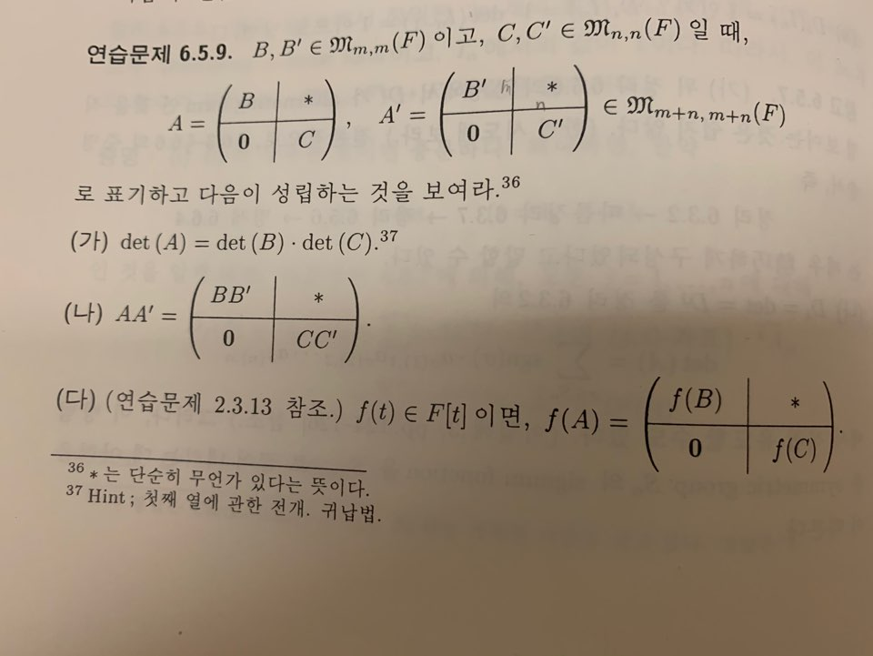
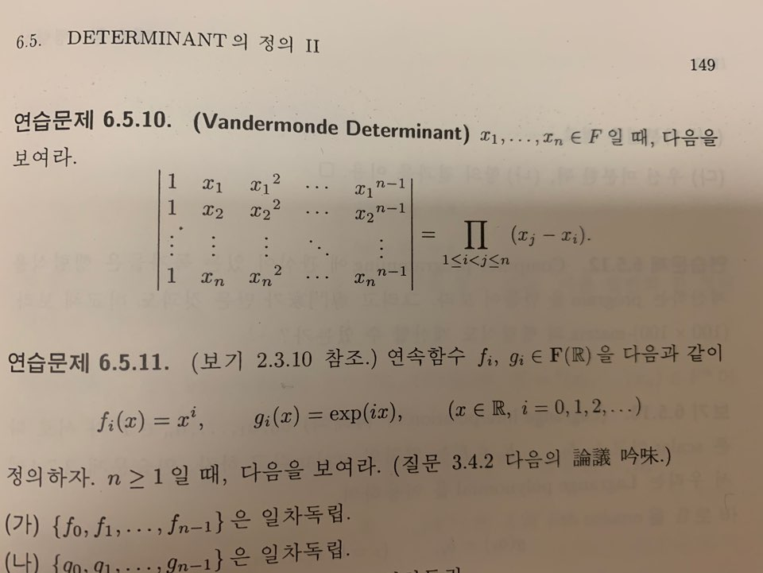

# 6. 행렬식

- 의문
- Alternating Multilinear Form
- Symmetric Group

## 의문

## 6.1 Alternating Multilinear Form

- k-linear form
  - 정의
    - `V1, ..., Vk`가 벡터공간일 떄, 함수 `mu: V1 x ... x Vk -> F`가 모든 k개의 좌표에 대하여 linear 일 때, 즉, 임의의 `i = 1, ..., k`에 대하여 `mu(..., aui+bwi, ...) = a・mu(..., ui, ...) + b・mu(..., wi, ...) (ui, wi∈Vi, a,b∈F)`
      - 일반적으로 `V1 = ... = Vk = V`인 경우를 다루고, 이때의 `mu`를 k-linear form on V라 함
      - `mu(..., aui+bwi, ...) = mu(..., aui, ...) + mu(..., bwi, ...) = a・mu(..., ui, ...) + b・mu(..., wi, ...)`
- alternating k-linear form
  - 정의
    - `V`가 벡터공간이고 `mu: V x ... x V -> F`가 k-linear form 이라고 하자. `∀v∈V, mu(..., v, ..., v, ...) = 0`를 만족
  - 성질
    - `mu: V x ... x V -> F`가 k-linear form 일 때, `∀v,w∈V, mu(..., v, ..., w, ...) = -mu(..., w, ..., v, ...)`
- 정리
  - **`det(In) = det(e1, ..., en) = 1`을 만족하는 alternating n-linear form `det: F^n x ... x F^n -> F`는 존재하고 유일하다. `det(A) = |A|`의 표기법도 사용한다**
    - `n=2`인 경우
    - `n=3`인 경우
- 행렬식의 정의
  - `det: F^n x ... x F^n -> F ∧ det는 alternating n-linear form ∧ det(In)=1`
    - 존재하며, 유일함
- **결국 det가 존재하고 유일하다는 것** 을 보이는 것이 이번 장의 목표이며, 이를 보이기 위해서는 `det(e1, ..., en)` 과 같은 값을 분석할 수 있어야 한다. 여기서 det는 alternating n-linear form이므로, `det(e1, ..., ej, ..., ei, ..., en) = -det(e1, ..., ei, ..., ej, ..., en) = -|In| = -1 (by det의 정의)` 인 것을 효율적으로 보여줄 수 있어야 하며, 이를 가능하게 하는 것이 **symmetric group** 이다.

## 6.2 Symmetric Group

### Symmetric group

- 정의
  - `Tn: σ전체의 집합 (σ: {1, ..., n} -> {1, ..., n})`전체의 집합
  - `Sn = { σ∈Tn | σ는 bijection }`
    - symmetric group의 원소는 permutation이라 부름
- 특징
  - `|Tn| = n^n, |Sn| = n!`

### Cycle notation

symmetric group의 다른 표현(그냥 함수의 대응을 눕혀서 나타낸 것)

cycle notation / transposition

- 개인적 관찰
  - 임의의 permutation은 `id`혹은 cycle notation으로 나타낼 수 있다
- 관찰
  - ① `σ`와 `τ`가 disjoint cycle => `σ◦τ = τ◦σ`
  - ② 임의의 permutation은 disjoint cycle들의 합성으로 나타낼 수 있고, 그 방법은 (합성의 순서를 제외하고) 유일하다
  - ③ `∀permutation`은 transposition들의 합성으로 나타낼 수 있다
    - `(i1, ..., ik) = (i1,ik)◦(i1,ik-1)◦...◦(i1,i3)◦(i1,i2)`
      - 한번에 `i1, ..., ik`를 한칸식 뒤로 자리바꿈하는 것은, 두 명씩 자리 바꾸기를 여러 번하면 이룰 수 있다.
      - 여기서 i1, i2는 자리에 있는 '사람'을 의미하는 것이 아니라, '자리'그 자체를 의미함
        - 즉, `(i1,i3)◦(i1,i2) = 첫째자리와 둘째자리에 있는 사람 교환 후, 첫째자리와 셋쨰자리에 있는 사람 교환`
- 정의
  - 함수 `sgn: Sn -> {1, -1}, sgn(σ) = (-1)^r (단 σ는 r-개 transposition의 합성)`
    - *well-defined임을 증명*
      - but 주어진 permutation을 transposition들로 나타내는 방법은 여러가지가 있을 수 있으므로, well-defined가 아직 아니며,
      - `σ`를 transposition의 합성으로 나타낼 때 그 개수의 홀짝 여부가 불변이라는 것을 증명해야 함
  - even permutation & odd permutation
    - `σ∈Sn, sgn(σ)=1 => σ는 even permutation ∧ sgn(σ)=0 => σ는 odd permutation`
  - alternating group
    - `An = {σ∈Sn | sgn(σ)=1}`
- **symmetric group** 의 다른 관점
  - **permutation matrix**
    - 정의
      - `I_σ = [I]_Bv^Bv_σ`
        - `Bv = {v1, ..., vn}`이 V의 ordered basis ∧ `σ∈Sn`, 새로운 ordered basis `Bv_σ = {v_σ(1), ..., v_σ(n)}`을 생각하자.
        - 이 때, (nxn) transition matrix `[I]_Bv^Bv_σ`를 `σ`에 대응하는 permutation matrix라 부름
    - 예시
      - `σ=(1,3,2), I_σ = (t(0,0,1) t(1,0,0) t(0,1,0))`
    - 성질
      - `σ=(i,j) => I_σ = I_[i]<->[j]`
        - i열과 j열 or i행과 j행 자리 바꾸기
          - i열과 j열 자리 바꾸기
            - `I_(1,3,2) = I_(1,2)◦(1,3) = I_(1,2)・I_(1,3) = I・I_(1,2)・I_(1,3) = ((I・I_(1,2))・I_(1,3))`
          - i행과 j열 자리 바꾸기
            - `I_(1,3,2) = I_(1,2)◦(1,3) = I_(1,2)・I_(1,3) = I_(1,2)・I_(1,3)・I = (I_(1,2)・(I_(1,3)・I))`
    - 관찰(`σ,τ∈Sn`)
      - ① I_σ의 j-th column은 `e_σ(j)`즉, `I_σ = (e_σ(1), ..., e_σ(n))`
      - ② `A∈Mnxn(F) => A・I_σ = ([A]^σ(1), ..., [A]^σ(n))`
      - ③ `I_σ・I_τ = I_σ◦τ`
        - 재미있음
      - ④ `(I_σ)^-1 = I_(σ^-1) = t(I_σ)　∴I_σ ∈ O(n) (O(n)은 orthogonal group)`
        - `p.f) (I_σ)^-1 = t(I_σ)`
        - `let) σ^-1(i) = k_i`
        - `t[I]_σ = t(e_σ(1), ..., e_σ(n))`
        - `= t(te_σ(1), ..., te_σ(n))`
        - `= (ek_1, ..., ek_n) (∵ t(te_σ(1), ..., te_σ(n))중에서 i번째 column이 1이 되는 것은 te_σ(k_i)이고, 이는 k_i행의 te_σ(k_i)에 해당하기 때문 by σ^-1(i) = k_i)`
        - `= (e_σ^-1(1), ..., e_σ^-1(n))`
        - `= [I]_Bv^Bv_σ^-1`
        - `= I_σ^-1`
      - ⑤ `I_σ = I_τ => σ = τ`
      - ③, ④, ⑤ 는 **symmetric group Sn과 Mnxn(F)의 subset `{I_σ ∈ Mnxn(F) | σ∈Sn}`이 곱셈에 관하여 같은 구조** 를 갖고 있음을 말하고 있음
        - *곱셈에 대한 같은 구조라는게, 곱셈에 대하여 bijection인 isomorphism이 존재한다는 것인가?*
        - 행렬과 선형사상이 같은 것이라면, permutation에 대응하는 선형사상도 있어야 할 것
  - **permutation operator**
    - 정의
      - `Bv = {v1, ..., vn}`이 V의 고정된 ordered basis이고, `σ∈Sn`일 때
      - Linear Extension Theorem을 이용하여, 선형사상 `P_σ: V -> V`를 `P_σ(vi) = v_σ(i) (i=1, ..., n)`인 `P_σ`
    - 주의
      - `P_σ`는 ordered basis `Bv`의 선택에 dependent함
    - 관찰(`σ,τ∈Sn`)
      - ① `[P_σ]_Bv^Bv = I_σ`
      - ② `P_σ◦P_τ = P_(σ◦τ)`
      - ③ `(P_σ)^-1 = P_(σ^-1)`
      - ④ `P_σ = P_τ => σ = τ`
  - 결론
    - **symmetric group `Sn`과 permutation matrix, permutation operator 는 모두 곱셈에 관하여 같은 구조를 갖고 있음을 알 수 있다**
- `L∈L(V,V)`일 때, `[L]_Bv^Bv`와 `[L]_Bvσ^Bvσ`를 비교해 보자 (`Bv = {v1, ..., vn}`이 V의 ordered basis이고, `σ∈Sn`)
  - ① `[L]_Bvσ^Bvσ = [I]_Bvσ^Bv・[L]_Bv^Bv・[L]_Bv^Bvσ = (I_σ)^-1・[L]_Bv^Bv・I_σ = t(I_σ)・[L]_Bv^Bv・I_σ`
  - ② `σ = (1,2)∈S3, [L]_Bv^Bv = (aij) (aij∈F), [L]_Bvσ^Bvσ = [L]_Bv^Bv`를 첫번째 열과 두번째 열을 바꾸고, 첫번쨰 행과 두번쨰 행을 바꾼 것과 같음 (행과 열의 변환은 순서 상관 없음 - 결합법칙)
    - `= (I_σ)^-1・[L]_Bv^Bv・I_σ = t(I_σ)・[L]_Bv^Bv・I_σ`인데,
    - `t(I_σ)・A' = tt(t(I_σ)・A) = t(tA・I_σ) = tA의 첫번째 열과 두번째 열을 자리바꿈한 뒤에 transpose = A의 첫번째 행과 두번째 행을 자리바꿈`
  - ③ `[L]_Bv^Bv = diag(λ1, λ2, λ3) (λi∈F) => [L]_Bvσ^Bvσ = diag(λ2, λ1, λ3) = diag(λσ(1), λσ(2), λσ(3))`
    - `λi∈F, (i,i)-성분이 λi인 (nxn)-대각행렬을` `diag(λ1, ..., λn)`으로 표기한다
      - `diag(..., λj(i번째), ...) = 대각행렬인데 (i,i)의 값이 λj가 되는 경우`
    - `ai∈F ∧ σ∈Sn, diag(a1, ..., an) ~ diag(a_σ(1), ..., a_σ(n))`

## 6.3 Determinant의 정의 1

*매우 어려운 구간*

**`det(In) = det(e1, ..., en) = 1`을 만족하는 alternating n-linear form `det: F^n x ... x F^n -> F`는 존재하고 유일하다.** 의 증명을 해보자!!

- 구체적 예시
  - `A = M3x3(F), det(A) = det(a11e1+a21e2+a31e3, a12e1+a22e2+a32e3, a13e1+a23e2+a33e3) = a11det(e1, ...) + a21det(e2, ...) + a31det(e3, ...) (∵ det is n-linear form)`
  - `(e3, e2, e4, e1) -> (e3, e2, e1, e4) -> (e1, e2, e3, e4)`
    - determinant의 논의 에서나온 위의 분석
    - `σ = (1, 3, 4), (1,3)◦((1,4)◦σ) = id` or `σ = (1,4)^-1◦(1,3)^-1 = (1,4)◦(1,3)` 이고
    - 따라서 `det(e3, e2, e4, e1) = (-1)^2・det(I) = sgn(σ)・det(I) = 1`
- 관찰
  - ① `D: Mnxn(F) -> F`가 위의 정리의 조건을 만족한다면, `A∈Mnxn(F)`이고 `σ∈Sn`일 때, 다음이 성립
    - **`D([A]^σ(1), ..., [A]^σ(n)) = sgn(σ)・D([A]^1, ..., [A]^n) = sgn(σ)・D(A)`**
      - 자리 바꾸기 문제와 같기 때문(D는 alternating n linear form임을 명심(그것의 성질은 자리를 바꾸면 -1을 곱한 것과 같다))
  - ② `D(e_σ(1), ..., e_σ(n)) = sgn(σ)`
- 정리
  - `det: Mnxn(F) -> F`는 다음과 같이 주어진다
    - `det(A) = |A| = det(aij) = sigma_{σ∈Sn}{sgn(σ)・a_σ(1),1・a_σ(2),2 ... a_σ(n),n}`
      - 증명
        - det가 k-linear form 임을 보임
        - det가 alternating form 임을 보임
        - `det(In) = 1` 임을 보임
        - det의 성질(`det는 alternating k-linear form ∧ det(In)=1`)로부터 uniqueness를 보임
- 연습문제
  - V가 벡터공간일 때, alternating k-linear form on V 전체의 집합은 `Alt^k(V)`라고 표기하면, `dim(Alt^n(F^n)) = 1`이다.
    - 당연하게도 `det^n`이 유일한 basis가 될 것 같은 직감
    - 임의의 `let) Alt∈Alt^n(F^n), Alt(B) = Alt([B]^1, ..., [B]^n) = Alt(b11e1+ ... + bn1en, ... , b1ne1+ ... + bnnen) .... (B∈Mnxn(F))`
      - 임의의 `Alt(B)`를 `det`로 표현하면 됨
- 중요한 따름정리
  - `A∈Mnxn(F) => det(A) = det(tA)`
  - `det: Mnxn(F) -> F를 n개의 row들에 관한 함수로 보더라도, det는 det(I)=1인 유일한 alternating n-linear form이다`
    - *column기반 증명시, A대신 tA를 생각*

## 6.4 Determinant의 성질

- `A,B∈Mnxn(F) => det(AB) = det(A)・det(B)`
  - 증명이 재미있음
  - 따름정리
    - `det(A^-1) = 1/det(A) = det(A)^-1`
    - `A∈Mnxn(F), det(tA) = det(A)`
    - `A∈Mnxn(F), {[A]^1, ..., [A]^n}이 linearly dependent => det(A)=0`
- **다음은 동치이다**
  - ① `A`는 invertible
  - ② `det(A)!=0`
    - ② => ①
      - `{[A]^1, ..., [A]^n}`이 linearly dependent가 아님을 이용
- Determinant의 기하학적 의미
  - **volume**
    - `R^n`의 n-개의 vector `{[A]^1, ..., [A]^n}`이 결정하는 n-dimensional parallelogram의 부피는 `Voln([A]^1, ..., [A]^n) = |det(A)|` 이다.
      - 이를 증명하기 위해서는 부호를 무시한 부피 `voln: Mnxn(F) -> R`이 `alternating n-linear map ∧ voln(In) = 1`을 만족하는 것을 보여야 할 것이다.
      - 그러면 alternating n-linear form인 것을 그림으로 보여야 할 것인데... 애초에 부피란 무엇인가?
      - S. Lang의 ch7 pp 202-211을 꼭 참조하세요
- *`A∈Mnxn(F)`일 때, A의 rank를 계산하는 가장 효과적인 방법은 A의 row-reduced echelon form - 즉, Gaussian Elimination - 을 이용하는 것*
  - Determinant와 sub-determinant를 이용하는 계산법도 S.Lang의 7장을 확인하세요.
    - *sub-determinant*가 무엇일까
- **Gaussian Elimination과 Determinant 행렬식은 다음 성질을 갖는다**
  - ① 어떤 한 column에 다른 column의 상수배를 더해 주어도, 행렬식은 변하지 않는다. 즉 `i!=j ∧ c∈F, i-th column에 j-th column의 c배 를 더해주면 det(...,[A]^i + c[A]^j, ..., [A]^j, ...) = det(A)`이다.
  - ② 위의 내용에서 column을 row로 바꾸어도 좋다
  - 참고(elementary operation)
    - ① 두 column(row)의 교환
      - `det(..., [A]^j, ..., [A]^i, ...) = -det(A)`
        - (∵ alternating form의 정의로부터)
    - ② 한 column(row)에 다른 column(row)의 k배를 더함
      - `det(..., [A]^i + k・[A]^j, ..., [A]^j, ...) = det(A)`
        - (∵ alternating n-linear form의 정의로부터)
    - ③ 한 column(row)에 k(k != 0)배를 곱함
      - `det(..., k[A]^i, ...) = k・det(A)`
        - (∵ n-linear form의 정의로부터)

## 6.5 Determinant의 정의 2

- 개요
  - Determinant의 두번째 construction은 **inductive method**
    - `((n-1)x(n-1))-matrix`의 determinant를 이용하여 `(nxn)-matrix`의 determinant를 construct함
- 표기법
  - `A=(aij)∈Mnxn(F)`일 때, `Mij`를 A에서 i-th row와 j-th column을 제거한 `((n-1)x(n-1))-행렬`이라고 하고, `^Aij(원래는 ^기호가 A의 위에 존재) = det(Mij)`로 표기한다. `^Aij`를 A의 (i,j)-minor라고 부름
    - `(-1)^(i+j) ^Aij`는 (i,j)-cofactor라고 부름
- 정의
  - j-th column에 관한 전개 `D^j: Mnxn(F) -> F`를 `D^j(A) = sigma_{i=1}^{n}{(-1)^(i+j)・aij・^Aij} (j=1, ..., n)`
  - i-th row에 관한 전개 `D_i: Mnxn(F) -> F`를 `D_i(A) = sigma_{j=1}^{n}{(-1)^(i+j)・aij・^Aij} (i=1, ..., n)` 로 정의한다
  - 위의 2n개의 함수가 모두 `alternating n-linear form ∧ det와 같은 함수` 라는 것을 증명해야 함
    - 예시
      - `D^1(A) = a11^A11 - a21^A21 + a31^A31 - ... + (-1)^(n+1)an1^An1`
- `D_i, D^j`가 det와 같다는 것을 증명
  - `D_i = D^i`임을 증명
    - `^Aij = det(Mij)`임을 명심
  - `D_i가 n-linear form`임을 증명
    - 왜 `[A]^k = [A]^(k+1)`인 경우에만 `D_i(A) = 0`임을 증명하면 되는가?
      - `D_i([A]^1, ..., [A]^k, ..., [A]^l, ... [A]^n) = -D_i([A]^1, ..., [A]^l, ..., [A]^k, ..., [A]^n)`
  - `D_i가 alternating form`임을 증명
  - `D_i(In) = 1`임을 증명
- **행렬식을 계산하는 strategy**
  - ① 어떤 열에 다른 열의 상수배를 더하거나, 어떤 행에 다른 행의 상수배를 더하는 작업을 반복하여 0이 많이 나타나도록 한다
    - elementary column, row operation 중에서 어떤 행에 다른 행의 상수배를 더하는 작업을 해도 `det`값은 불변
    - elementary row opeartion 중 다른 행 상수배 더하기 => `det(A) = det(tA) = det(tA의 column에 다른 column상수배 더하기) = det(t(tA의 column에 다른 column상수배 더하기)) = det(A의 row에 다른 row상수배 더하기)`
  - ② 0이 가장 많은 행이나 열에 관해 전개한다
- 앞서 정의한 `D^j, D_i: Mnxn(F) -> F`함수는 모두 laternating n-linear form ∧ D^j(In) = 1 = D_i(In) 이며 따라서, 2n개의 함수가 모두 `det: Mnxn(F) -> F`와 같은 함수이다.
- Cartan Matrix
  - `An-1 = (aij) 단, aij = { 2 (if i=j), -1 (if |i-j|=1), 0 (otherwise) }`

자주 이용되는 행렬의 성질1

Vandermonde Matrix and its determinant

- Vandermonde matrix
  - 응용
    - 연속함수 `fi, gi ∈ F(R)`을 다음과 같이 정의하자 `fi(x)=x^i, gi(x)=e^(i・x) (x∈R, i=0,1,...)` `n≥1`일 때, 다음이 성립함을 보여라
      - `{f0, ..., fn-1}은 일차독립`
      - `{g0, ..., gn-1}은 일차독립`
      - `{f0, ..., fn-1, g1, ..., gn-1}은 일차독립`
    - Lagrange Interpolation
      - 다항식 보간법

## 6.6 Cramer's Rule

- Cramer's Rule
  - `A∈Mnxn(F), X = t(x1, ..., xn)∈F^n이 연립방정식 AX = B의 solution => xi・det(A) = det([A]^1, ..., B, ..., [A]^n) (i=1, ..., n)` 이어야 한다
    - 주의
      - 해가 존재한다면 값이 이렇게 정해져야 한다는 것이지, 해의 존재는 여부는 기본정리로부터 알 수 있음
- Cramer's Rule에서 역행렬 도출하기
  - `A가 invertible`
  - `=> ∃Xj∈F^n, AXj = ej (j=1, ..., n)`
  - `=> B = (bij) = (X1, ..., Xn)∈Mnxn(F)`
  - `=> AB = I ∧ bij = det([A]^1, ..., ej, ..., [A]^n)/det(A) = (-1)^(i+j)・^Aji/det(A)`

## 6.7 Adjoint Matrix

- Adjoint matrix
  - `A∈Mnxn(F), adj(A) = t((-1)^(i+j)^Aij)`
    - `[adj(A)]_i^j = (-1)^(i+j)^Aji`
  - 가역행렬과 adjoint matrix
    - `A^-1 = 1/det(A)・adj(A) = (-1)^(i+j)・^Aji/det(A)`
- **정리**
  - `A∈Mnxn(F), A・adj(A) = det(A)・In = adj(A)・A (A가 가역일 필요가 없다)`
    - 좌변 증명 `[A]_i・[adj(A)]^j = [det(A)・In]_i^j` 임을 보이자(매우 재미있음, 우겨넣기식 증명)
    - 우변 증명
      - 좌변 증명에서 `tA`를 넣자
    - `adj(tA) = t(adj(A))`
      - `adj(A) = (-1)^(i+j)・aij・det(Mij)`
        - 여기서 `det(Mij)`에서 row를 기준으로 하던, column으로 기준으로하던 det값은 같음
        - 결국 `adj(tA)`에서의 column기준 det값 산출은 `adj(A)`에서 row기준으로 det값을 산출하는 것과 같음
- 따름정리
  - `A = (aij)∈Mnxn(F) => sigma_{k=1}^{n}((-1)^(k+j)aik^Ajk = δij・det(A) = sigma_{k=1}^{n}((-1)^(i+j)・aki・^Akj) (i,j = 1, ..., n))`
- `A∈Mnxn(F)가 가역 => det(adj(A)) = (det(A))^(n-1)`
  - *`A∈Mnxn(F)가 가역이 아니라면?`*
