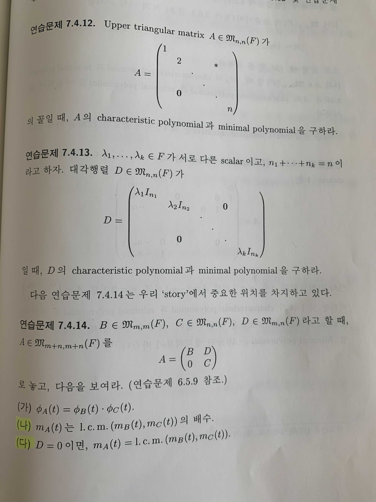
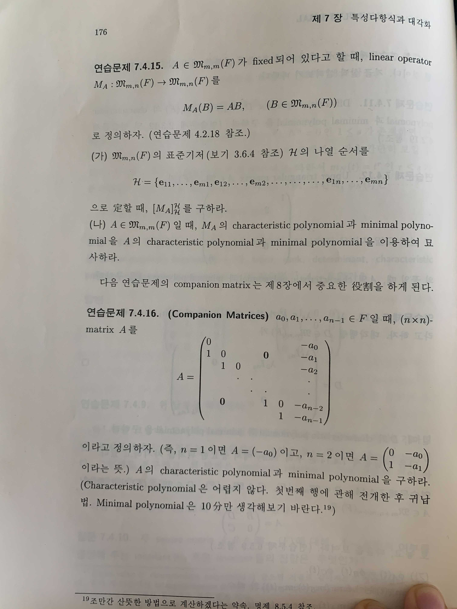

# 7. 특성다항식과 대각화

- 의문
- 정리
- 7.1 Eigen-vector와 Eigen-value
- 7.2 Diagonalization
- 7.3 Caley-Hamilton Theorem
- 7.4 Minimal Polynomial
- 7.5 Direct Sum과 Eigen-space Decomposition

## 의문

## 정리

- mission
  - 행렬을 diagonalization을 통하여 더 간단한 행렬로 분해하고 싶음
- 큰 그림
  - T∈LM의 eigen-value 구하기
    - characteristic polynomial
  - T∈LM의 eigen-value에 대한 eigen-vector 구하기
    - eigen-space decomposition
  - 해당 행렬이 diagonalizable인지 확인
    - 충분조건
    - 필요충분조건
  - diagonalization

## 7.1 Eigen-vector와 Eigen-value

- eigen-value, eigen-vector
  - eigen-vector의 정의를 eigen-value를 이용해서 하는 것에 대한 직관적인 이해로는, 일반적으로, eigen-vector를 구할 떄, characteristic polynomial을 이용해서 eigen-value를 구하고, 그것에 대응하는 eigen-vector를 구함
  - `A∈Mnxn(F)` X는 eigen-value λ를 갖는 A의 eigen-vector
    - `∃λ∈F, ∃0≠X∈F^n AX = λX`
  - `L∈L(V,V)` v는 eigen-value λ를 갖는 L의 eigen-vector
    - `∃λ∈F, ∃0≠v∈V L(v) = λv`
  - 위의 두 정의는 우리의 철학이므로 그것을 하나로 합쳐도 됨(같은것은 정말 똑같다)
    - `T∈LM` v는 eigen-value λ를 갖는 T의 eigen-vector
      - `∃λ∈F ∧ ∃0≠v∈V Tv = λv`
        - `T∈LM => (T∈L(V,V) ∨ T∈Mnxn(F)) ∧ dimV = n ∧ I_V = I_n = I ∧ V≠0`
      - 어차피 둘이 같은거면, 그냥 하나로 치자
- 정리
  - `T∈LM ∧ v가λ에 대응하는 T의 eigen-vector일 때 다음이 성립`
    - *`T가 invertible <=> 0이 T의 eigen-value가 아님`*
      - *<= 증명에서는, 그냥 역함수를 정의해주고, 이것이 well-defined인 것을 보여주면 됨*
        - 단순히 그렇게 증명할 수 있는게 아닌거같은데..
    - `T가 invertible <=> v는 λ^-1에 대응하는 T^-1의 eigen-vector이다 (λ≠0)`
  - 선형미분 방정식의 출발점
    - `λ∈R, e^(λx)들은 differential operator D:C^∞(R) -> C^∞(R)의 eigen-vector임을 보여라`
- `주어진 T∈LM의 eigen-vector와 eigen-value찾기`
  - `Tv = λv`
  - `=> λv - Tv = 0`
  - `=> (λI-T)v = 0`
  - `=> det(λI-T) = 0`
    - 우리에 철학에서는 같은 것은 같으므로, `L∈L(V,V)의 determinant역시 존재하며, 대응하는 행렬의 determinant일 것`
- `L∈L(V,V)`의 determinant
  - `det(L) = det([L]_Bv^Bv) (Bv는 V의 임의의 기저)`
    - 이것은 well-defined 되어있음
      - Bv를 다른 V의 기저로 바꾸어도 성립
    - similar matrix의 invariant(similar한 matrix의 공유하는 성질)
      - determinant
- 특성다항식(characteristic polynomial)
  - `T∈LM ∧ T혹은 [T]_Bv^Bv의 좌표를 aij로 표기할 때, T의 특성다항식 φ_T(t)∈F[t]를 φ_T(t) = det(tI-T) (t는 마치 scalar 인 것으로 생각)`
    - similar matrix의 invariant이므로, `L∈L(V,V)`까지 고려해도 well-defined
    - monic polynomial
  - `T∈LM일 때, λ∈F가 T의 eigen-value <=> φ_T(λ) = 0`
    - `λI-T가 not invertible => ∃v∈V, v≠0 ∧ (λI-T)v = 0`
      - dimension theorem을 이용한 증명
      - RREF를 이용한 증명
- similar matrix의 invariant
  - isomorphic
    - rank
  - etc
    - determinant
    - characteristic polynomial
    - eigen-value
    - trace
    - minimal polynomial
- eigen vector, eigen value 찾기
  - `F=R, F=C`어느쪽이냐에 따라서, characteristic polynomial의 root 개수가 달라지고, 이는 diagonalization에 큰 영향을 끼침
- Fundamental Theorem of Algebra
  - `모든 non-constant polynomial f(t)∈C[t]는 (C에서) 근을 갖는다. (즉, 인수정리에 의해, f(t)∈C[t]는 C-위의 일차식들의 곱으로 인수 분해 된다)`
- 보기
  - `φ_I(t) = (t-1)^n 이고, I는 eigen-value 1을 갖는다. 그리고 F^n의 모든 non-zero vector들이 eigen-vector가 된다`

## 7.2 Diagonalization

- 배경
  - Diagonalizable matrix를 정의하고, 우리의 철학에 의해서 diagonalizable linear operator도 저절로 정의됨
- diagonalizable matrix
  - `A∈Mnxn(F) s.t. ∃D∈Mnxn(F), D는 diagonal ∧ A~D`
- `A∈Mnxn(F)`일 때, 다음은 동치
  - `A가 diagonalizable`
  - `A의 eigen-vector들로 이루어진 F^n의 basis가 존재`
    - 이는 change of basis에서 정리 1,2,3과 유사 고로, 자명함
- diagonalizable linear operator
  - `L이 diagonalizable <=> ∃Bv∈V, Bv는 V의 기저 ∧ [L]_Bv^Bv가 diagonalizable matrix`
- **diagonalizable**
  - `T∈LM, T가 diagonalizable <=> ∃Bv∈V, Bv는 V의 기저 ∧ [T]_Bv^Bv가 diagonalizable matrix`
- diagonalizability의 충분조건 하나
  - `T∈LM, φ_T(t)가 F에서 서로 다른 n개의 root를 가짐(n개의 eigen-value가 서로 다름) => T는 diagonalizable (dimV = n)`
  - `<= T∈LM, v1, ..., vk가 T의 eigen-vector, vi의 eigen-vector λi들이 mutually distinct(λi≠λj if i≠j) => {v1, ..., vk}는 일차독립`
    - Artin style 증명
    - *Vandermonde determinant를 이용한 증명*
      - *마지막 vandermonde부분에서 이해가 안됨*
- `A = (1 1; 0 1)`은 절대로 diagonalizable하지 않음
  - 만약, diagonalizable하다면, `A ~ I2`인데, `I2`는 오직 `I2`와만 similar
  - diagonalizability의 필요충분조건은 무엇일까?
  - diagonalizability를 말해주는 invariant는 무엇일까?
- `T∈LM늬 diagonalizability를 결정해주는 invariant는 무엇인가?`

## 7.3 Caley-Hamilton Theorem

- 정의
  - `T∈LM, I_T = {f(t)∈F[t] | f(T) = 0}`
- `T∈LM => I_T ≠ {0}`
- Caley-Hamilton Theorem
  - `T∈LM => φ_T(T) = 0 (φ_T(t)∈I_T)`
    - 어거지 증명(잘못됨)
      - `φ_T(t) = det(t・I - T)`
      - `=> φ_T(T) = det(T・I - T) = det(0) = 0`
        - **`φ_T(t)의 계산은, det(t・I - T)∈F[t]를 전개한 뒤에 t로 evaluate를 해야함`**
    - Quotient space와 triangularization을 이용한 증명
    - T-cyclic subspce를 이용한 증명
    - Adjoint matrix를 이용한 증명
      - 소름 포인트
        - `adj(tI - A) = B(t) = Bn-1・t^(n-1) + ... + B1・t + B0`
- 그 다음 motivation
  - `g(t)∈F[t], g(t) = φ_A(t)q(t) + r(t)`
    - `q(t)`는 몫, `r(t)`는 나머지
    - `g(A) = r(A)`
  - `A = (1, 0, 1; 0, 3, 0; 0, 0, 3)`
    - `=> φ_A(t) = (t-1)(t-3)^2`
    - `=> φ_A(A) = (A-I)(A-3I)^2 = 0`
    - `근데, 계산해보면, (A-1)(A-3I) = 0 임을 알 수 있음`
    - `m(A)=0`인 최소 차수 다항식 `m(t)`찾기
      - 일단 우리는 해당 최소 차수 다항식의 차수가 characteristic polynomial의 차수 이하라는 사실은 알고 있음

## 7.4 Minimal Polynomial

- minimal polynomial 정의
  - `T∈LM, minimal polynomial m_T(t) = I_T의 non-zero polynomial ∧ monic ∧ 해당 조건을 만족시키는 최소 degree polynomial`
    - 우리의 관심사
      - minimal polynomial은 similar matrix의 invariant인지 여부(A~B => m_A(t)=m_B(t))
        - 기저를 바꾸어도 T의 minimal polynomial은 불변인가?
    - 참고
      - 우리는 Caley-Hamilton theorem에서, `φ_T(T) = 0`임을 이미 알고 있는데, `φ_T(T)∈F[t]`보다 더 작은 최소 차수의 monic polynomial에 관심이 생기는 것
        - 복잡한 다항식을 보다 간단한 form으로 변경
  - 존재성
    - Caley-Hamilton 정리에 의하여 자명
  - 유일성
  - 따름 정리
    - `T∈LM, f(t)∈I_T => f(t)는 m_T(t)의 배수`
    - `φ_T(t)도 m_T(t)의 배수`
  - `T∈LM, deg(m_T)=1 <=> ∃a∈F, a≠0 ∧ T=aI`
    - 다시 증명
  - minimal polynomial 찾기
    - characteristic polynomial이, minimal polynomial의 배수이고, 둘의 monic irreducible divisor의 집합이 같은 것을 이용해서 minimal polynomial을 구함
      - 거기부터는 노가다
  - nilpotent와 minimal polynomial
    - `A∈Mnxn(F)가 nilpotent => ∃r∈N, A^r = 0 (r≤n)`
      - `N∈LM이 nilpotent
      - `=> ∃s∈N, 1≤s ∧ N^s = 0`
      - `=> t^s ∈ I_N`
      - `=> m_N(t)는 t^s의 약수`
      - `=> φ_N(t) = det(t・I - N) = t^n (∵ det(t・I - N)는 t^n이 최고차항인 monic polynomial ∧ m_N(t)의 배수 )`
      - `=> ∃r∈N, r≤s ∧ N^r = 0 (∵ m_N(t)는 φ_N(t)의 약수)`
- `A,B∈Mnxn(F), 지금까지의 similar matrix의 invariant들(trace, rank, determinant, characteristic polynomial,  minimal polynomial)이 같음 -> A~B`
  - 거짓
    - `A=(1 1 0 0; 0 1 0 0; 0 0 1 0; 0 0 0 1), B=(1 1 0 0; 0 1 0 0; 0 0 1 1; 0 0 0 1)`
  - 그렇다면, `A,B∈Mnxn(F), A~B인지 여부를 결정해주는 invariant는, 혹은 invariant의 집합은 무엇인가?`
- 다양한 minimal polynomial
  - `Differential operator D: P_n(F) -> P_n(F)`
    - characteristic polynomial
    - minimal polynomial
  - Companion Matrices
    - characteristic polynomial
    - minimal polynomial

다양한 minimal polynomial1

연습문제 7.4.14

- (가)
  - 쉽게 보일 수 있음
- (나)
  - `f(t)∈F[t], f(A) = (f(B) f(D) ; 0 f(C))`임을 이용
  - *증명이 힘들지만 재미있음*
    - `L_BC(t) = l.c.m(m_A(t), m_B(t))`
    - `L_BC(A) = ?`

다양한 minimal polynomial2

## 7.5 Direct Sum과 Eigen-space Decomposition

### U,W의 direct sum

- `V가 벡터공간, U,W가 V의 부분공간, U∩W=0 => U+W = U⊕W로 표기`
  - `U+W`는 U,W의 direct sum
    - 우리가 관심이 있는 것은 `U+W=V`인 경우
- V가 vector space ∧ U,W가 V의 subspace라고 할 때 다음은 동치
  - 1 `V = U⊕W`
  - 2 `V = U+W ∧ U∩W=0`
    - `U를 W의 direct complement라 부름`
  - 3 `∀v∈V, v = u+w (u∈U, w∈W)으로 나타낼 수 있고, 방법은 하나 뿐이다`
    - `1 => 2`증명법
      - `v = u1+w1 = u2+w2`
      - `=> u1-u2 = w2-w1`
      - `=> u1-u2 = w2-w1 ∈ U∩W = 0`
        - 하나의 벡터가 u1,u2의 조합, 그리고 w1, w2의 조합으로 나타나졌으므로 이 벡터는 `U∧W`에 속함
      - `=> u1=u2 ∧ w1=w2`
  - 4 `V = U+W ∧ V의 zero vector 0을 u+w(u∈U, w∈W)의 꼴로 쓰는 방법은 하나(0 = 0+0)뿐이다`
    - 1,2,3,4 loop
  - 5 `Bv = Bu ∐ Bw는 V의 basis (∐는 disjoint union을 의미, Bw는 W의 기저, Bu는 U의 기저)`
    - `<Bu ∐ Bw> = <Bu> ⊕ <Bw>`

### 여러 개 부분공간의 direct sum으로의 확장

- `sigma_{i=1}^{k}(Wi)는 W1, ..., Wk의 direct sum`
  - `<=> sigma_{i=1}^{k}(W_i) = W_1 + ... + W_k = W_1 ⊕ ... ⊕ W_k = ⊕_{i=1}^{k}(W_i)`
    - `W_1, ..., W_k는 ⊕_{i=1}^{k}(W_i)의 direct summand`
- V가 v.s ∧ W1, ..., Wk ≤ V 일때, 다음은 동치
  - `V = ⊕_{i=1}^{k}(W_i)`
  - `∀v∈V, v = w1 + ... + wk (wi∈Wi)으로 나타낼 수 있고, 방법은 하나 뿐이다`
    - 이게 위의 2번 버전보다 더 본질적인 statement
  - `V = W1 + ... + Wk ∧ V의 zero vector 0을 w1 + ... + wk (wi ∈ Wi)꼴로 쓰는 방법은 하나(0 = 0 + ... + 0)뿐이다`
  - `Bv = Bw1 ∐ ... ∐ Bwk는 V의 basis`
    - 1 => 2
      - `∀v∈V, v = w1 + ... + wk (wi∈Wi)으로 나타낼 수 있고, 방법은 하나 뿐이다`
      - `w_i는 Bwi에 의해서 unique하게 결정됨 ∧ Bwi ∩ Bwj = 0 (i ≠ j)`
      - `Bv = Bw1 ∐ ... ∐ Bwk`
    - 2 => 1
      - `<Bv> = <Bw1 ∐ ... ∐ Bwk>`
      - `= <Bw1> ⊕ ... ⊕ <Bwk>`
      - `= W1 ⊕ ... ⊕ Wk`
    - 참고
      - `Wi ∩ Wj = 0 <=> Bwi_∩_wj = 0 <=> Bwi ∩ Bwj = 0 (i≠j)`
  - 의미
    - V를 부분공간들의 direct sum으로 나타냄 = V의 기저에 partition을 둠
  - 주의
    - `U,W1,W2 ≤ V ∧ U⊕W1 = U⊕W2 -> W1 = W2`
      - 거짓
        - `V = R^2`
        - `Bu = {t(1,0)}`
        - `Bw1 = {t(1,1)}`
        - `Bw2 = {t(0,1)}`

### Eigen Space

- λ에 대응하는 T의 eigen space(Vλ= VT,λ)
  - `T∈LM, λ∈F, Vλ = VT,λ = {v∈V | Tv = λv}`
    - Vλ는 eigen-value λ를 갖는 T의 eigen-vector(zero vector제외)들의 집합
    - `λ가 T의 eigen-value <=> Vλ≠0`
- T∈LM, 다음은 동치
  - `T는 diagonalizable`
  - *`V = Vλ1 ⊕ ... ⊕ Vλk인, 서로 다른 eigen-value λ1, ..., λk가 존재`*
    - **diagonalizable T에 관한 V의 eigen-space decomposition**
    - *아직 증명이 이해가 안됨*
  - 주의
    - **`Vλ≠0 -> dimVλ = 1`은 거짓**
      - 하나의 λ에 여러개의 eigen-vector가 대응될 수 있음
- T가 diagonalizable => V를 eigen-space들로 decompose하는 아이디어가 Primary Decomposition Theorem을 생각하는 첫 motivation
