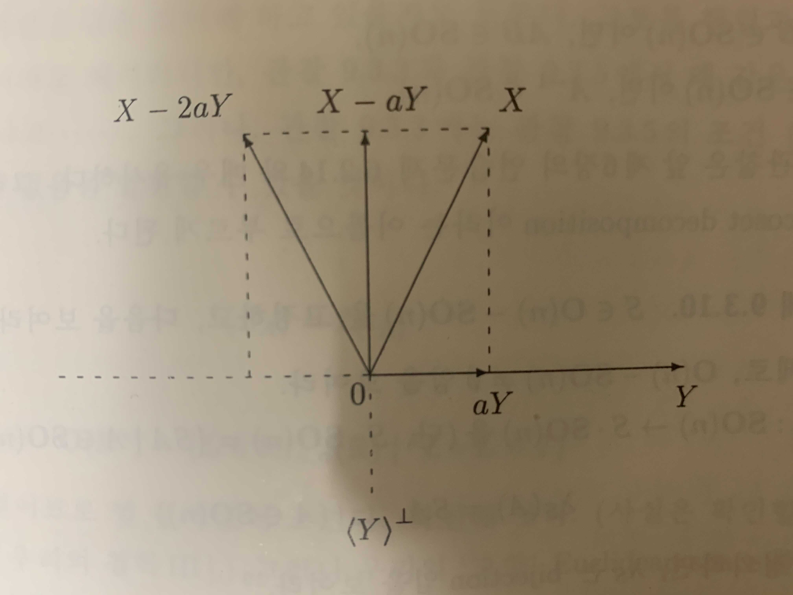

# 9. R^n의 Rigid Motion

- 의문
- 큰 그림 정리
- 9.1 R^n공간의 Dot Product와 Euclidean Norm
- 9.2 R^n공간의 Rigid Motion
- 9.3 Orthogonal Operator / Matrix
- 9.4 Reflection
- 9.5 O(2)와 SO(2)
- 9.6 O(3)와 SO(n)

## 의문

- *Euclidean space의 거리, 사이각 등의 개념은 선형대수학적으로 정의되는 것인가? 아니면, 다른 수학 분야에서는 다르게 정의할 수 있는가?*

## 큰 그림 정리

Rigid motion = 길이와 거리가 변하지 않는 '딱딱한' 운동

- `R^n`공간에 dot product 연산 부여
  - 기하적 구조 생성
    - norm
    - 사이각
    - 거리
    - 수직

## 9.1 R^n공간의 Dot Product와 Euclidean Norm

- `Euclidean space`
  - dot product가 주어진 R^n공간
    - dot product는 R^n 공간에 기하적인(topological) 구조를 줌
      - dot product가 정의됨 -> norm이 정의 됨 -> 사이각, 거리, 수직 등이 정의됨
      - 근데, 우리의 스토리에서는 `<X,Y> = ||X||·||Y||cosθ`가 항상 성립한다고 얼버무리고 넘어감
        - 이걸 어떻게 스토리상에서 설정파괴하지 않고 연역적으로 증명할 수 있을까?
- `Euclidean geometry`
  - Euclidean space를 공부하는 것
- `R^n의 dot product`
  - `X=t(a1, ..., an), Y=t(b1, ..., bn), <X,Y> = tX·Y = ∑_{i=1}^{n}(ai·bi)`
    - dot product은 bilinear form
  - 성질
    - `R^n x R^n -> R로 가는 함수 (X,Y) -> <X,Y>는 R^n의 bilinear form`
    - `X,Y∈R^n => <X,Y> = <Y,X>`
    - `X∈R^n => <X,X> ≥ 0 ∧ <X,X>=0 <=> X=0`
  - 연습문제
    - `X∈R^n, ∀Y∈R^n, <X,Y>=0 => X=0`
- `X의 Euclidean norm`
  - `X∈R^n, ||X|| = √<X,X>`
    - 벡터의 길이(크기)
  - 성질(`X∈R^n, c∈R`)
    - `||X||≥0 ∧ ||X||=0 <=> X=0`
    - `||cX|| = |c|·||X||`
    - `||(1/||X||)・X|| = 1`
    - unit vector
      - norm이 1인 벡터
  - 사이각
    - `<X,Y> = ||X||·||Y||cosθ`
      - *`R^2`이 아닌경우는?*
    - vector X, Y의 사이각 θ의 정의
      - 두 벡터 X, Y가 generate하는 R^n의 2-dimensional subspace `<X> ⊕ <Y> = R^2`이므로
      - `R^2`에서 사이각을 재면 된다(`0≤θ≤π`)
        - *그래서 사이각이 뭔데?*
        - X,Y가 정의되는 공간에서 사이각을 잰다는 말인듯
    - 코시 슈바르츠 부등식
      - `|<X,Y>| ≤ ||X||·||Y||`
        - 등호가 성립할 필요충분조건은?
    - Triangle Inequality
      - `||X+Y|| ≤ ||X||+||Y||`
        - 양변을 제곱
  - 거리(metric)
    - `X와 Y사이의 거리 = ||X-Y||`
    - 성질
      - `||X-X|| = 0`
      - `||X-Y|| = ||Y-X||`
      - `||X-Y|| ≤ ||X-Z|| + ||Z-Y||`
  - 수직(orthogonal, perpendicular)
    - `X,Y∈R^n, X⊥Y <=> X,Y는 서로 수직 <=> <X,Y>=0`
    - `S,T⊆R^n, S⊥T <=> S,T는 서로 수직 <=> ∀X∈S,∀Y∈T, <X,Y>=0`
    - 성질
      - `X,Y∈R^n, 다음이 동치`
        - `X⊥Y`
        - `||X+Y||^2 = ||X||^2 + ||Y||^2 (Pythagoras의 정리)`
        - `||X+Y|| = ||X-Y||`
          - 살짝 신기하다
  - orthogonal subset & orthonormal subset
    - orthogonal subset
      - `non-zero vector {X1, ..., Xm}, ∀1≤i≠j≤m, Xi⊥Xj`
    - orthonormal subset
      - `orthogonal subset ∧ ∀1≤k≤m, ||Xk||=1`
    - orthogonal basis
      - `R^n의 basis Bv가 orthogonal subset`
    - orthonormal basis
      - `R^n의 basis Bv가 orthonormal subset`
      - 주어진 orthogonal basis로부터 언제나 orthonormal basis를 만들 수 있음
    - 연습문제
      - `R^n의 orthogonal subset {X1, ..., Xm}은 일차독립`
      - `Bv = {X1, ..., Xn}이 R^n의 orthonormal basis <=> ∀1≤i,j≤m, <Xi,Xj> = δij`
  - `S^⊥`(S perp) & orthogonal complement
    - `S^⊥`
      - `S⊆R^n, S^⊥ = {X∈R^n | ∀Y∈S, X⊥Y}`
    - orthogonal complement
      - `W≤R^n, W^⊥를 W의 orthogonal complement`
    - 성질
      - `S^⊥는 R^n의 subspace`
      - `S^⊥ = <S>^⊥`
      - `Bw^⊥ = W^⊥`
        - 임의의 벡터가 W에 수직이기 위해서는 W의 basis Bw에 수직이기만 하면 충분
    - motivation
      - `0^⊥ = R^n ∧ (R^n)^⊥ = 0`
      - `W≤R^n => W ∩ W^⊥ = 0`
      - `W≤R^n => W ≤ (W^⊥)^⊥`
        - `W≤R^n => W = (W^⊥)^⊥`인가?
    - 질문
      - `∀W≤R^n, dimW^⊥ = n-dimW`인가?
        - `=> dim(W^⊥)^⊥ = n - (n - dimW) = dimW`
        - `=> R^n = W ⊕ W^⊥`

## 9.2 R^n공간의 Rigid Motion

- Rigid motion
  - `R^n공간에서 물체의 모습을 변화시키지 않는 운동 = 거리와 크기를 보존하는 운동`
  - 역으로 rigid motion에 의해 보존되는 성질을 공부하는 것 = Euclidean geometry
- isometry
  - 함수 `M: R^n -> R^n`이 조건 `||M(X)-M(Y)|| = ||X-Y|| (X,Y∈R^n)`을 만족
  - 예시
    - translation(평행이동)
      - `T_Y: R^n -> R^n, T_Y(X) = X+Y`
        - translation by Y
        - T_Y는 bijection
        - `(T_Y)^-1 = T_(-Y)`
    - rotation(회전이동)
      - `Rθ = (cosθ -sinθ; sinθ cosθ), Rθ = L_Rθ: R^2 -> R^2`
        - Rθ는 bijection
        - `(Rθ)^-1 = R-θ`
    - reflection(대칭이동)
      - `S = (1 0; 0 -1), Ls = S`
        - S는 bijection
        - `S^-1 = S`
  - 성질(`M: R^n -> R^n이 R^n의 rigid motion`)
    - `M은 injective`
    - `M은 연속함수`
      - *?!*
      - *벡터 함수의 연속성?*
    - `R^n의 rigid motion은 항상 bijection`
      - **임의의 rigid motion은 translation과 linear rigid motion의 합성으로 나타낼 수 있음**
  - 성질2
    - `R^n의 rigid motion의 합성은 rigid motion`
    - `R^n의 bijective rigid motion의 역함수는 rigid motion`
    - `L = T_{-M(0)}∘M => L(0)=0 ∧ M = T_M(0)∘L`
- 우리의 주장
  - `L(0)=0 인 R^n의 rigid motion L은 linear map`
    - 이 주장의 증명은 지금까지 공부한 추상적인 언어가 우리의 고향 R^n에서 매우 강력한 툴이 되었음을 보여 줌
    - 애초에 `L(0)≠0`인 rigid motion이 있다?
      - translation
  - `L(0)=0인 R^n의 rigid motion L의 성질`
    - `||L(X)|| = ||X||`
    - `∀X∈R^n, <L(X),L(X)> = <X,X>`
    - `∀X,Y∈R^n, <L(X),L(Y)> = <X,Y>`
    - `Bv가 R^n의 orthonormal basis => L(Bv)도 R^n의 orthonormal basis`
  - 관찰
    - `A∈Mnxn(R)의 column들 {[A]^1, ..., [A]^n}이 R^n의 orthonormal basis => linear map LA는 rigid motion`
    - `L(0)=0인 R^n의 rigid motion L이 R^n의 orthonormal basis Bv={Xi}의 원소를 모두 고정하면(∀j=1, ..., n, L(Xj)=Xj) => L은 항등사상`
  - 우주의 신비
    - `L(0)=0 인 R^n의 rigid motion L은 linear map`
      - `그리고 ∃A∈Mnxn(R), L = LA`
    - `R^n의 rigid motion M은 translation과 linear rigid motion의 합성으로 쓸 수 있다`
      - **이렇게 되면, 임의의 R^n의 rigid motion을 이해하는것 = translation과 linear rigid motion을 이해하는 것**
        - 아름답다....
  - 우주의 신비 따름정리
    - `R^n의 rigid motion은 항상 bijection`
- (real) orthogonal operator & orthogonal matrix
  - orthogonal operator
    - `R^n의 linear rigid motion`
  - orthogonal matrix
    - `L이 R^n의 orthogonal operator ∧ L=LA일 때의 A`
  - 성질
    - `A∈Mnxn(R)이 orthogonal matrix ∧ Y∈R^n, T_Y◦LA = LA ◦ T_(A^-1Y)`

## 9.3 Orthogonal Operator / Matrix

R^n의 rigid motion M은 translation과 linear rigid motion의 합성으로 쓸 수 있다

그러므로, R^n의 linear rigid motion을 이해하는 것이 임의의 rigid motion을 이해하는 key!

- `O(R^n) & O(n)`
  - `O(R^n)`
    - orthogonal group on R^n
    - `O(R^n) = {L∈L(R^n,R^n) | ∀X,Y∈R^n, ||L(X)-L(Y)|| = ||X-Y||}`
      - R^n의 linear rigid motion전체
  - `O(n)`
    - orthogonal group
    - `O(n) = {A∈Mnxn(R) | ∀X,Y∈R^n, ||AX-AY|| = ||X-Y||}`
- 우주의 신비 재정의
  - `M:R^n -> R^n이 rigid motion => ∃A∈O(n),B∈R^n, M(X)=AX+B (B∈R^n) ∧ A,B는 유일`
- O(n)의 주요 성질
  - `A,B∈O(n) => AB∈O(n)`
  - `A∈O(n) => A^-1∈O(n)`
    - 위 두 성질을 만족하는 집합이 group
      - *엥, 그런데, 결합법칙이 성립한다는 것이 어디에 나와있는가?*
- `O(R^n)`의 성질
  - `L: R^n -> R^n, 다음은 동치`
    - 1 `∀X,Y∈R^n, ||LX-LY|| = ||X-Y|| (즉, L∈O(R^n))`
      - 거리 보존
    - 2 `∀X∈R^n, ||LX|| = ||X||`
      - 길이 보존
    - 3 `∀X∈R^n, <LX,LX> = <X,X>`
    - 4 `∀X,Y∈R^n, <LX,LY> = <X,Y>`
      - dot product 보존
    - 5 `Bv가 R^n의 orthonormal basis => L(Bv)도 R^n의 orthonormal basis`
      - orthonormal basis 보존
    - *이 이외에는 없나?*
      - `||X|| = 1 => ||LX|| = 1`
        - L은 unit vector를 보존
      - `L(Bv)가 R^n의 orthonormal basis인 R^n의 orthonormal basis Bv가 존재`
        - *위의 5와 차이는?*
- `O(n)`의 성질
  - `A∈Mnxn(R)일 떄, 다음은 동치`
    - 1 `||AX-AY|| = ||X-Y||`
    - 2 `∀X∈R^n, ||AX|| = ||X||`
    - 3 `∀X∈R^n, <AX,AX> = <X,X>`
    - 4 `∀X,Y∈R^n, <AX,AY> = <X,Y>`
    - 5 `A의 column들의 집합 {[A]^1, ..., [A]^n}은 R^n의 orthonormal basis`
    - 6 `tA・A = I = A・tA (A^-1 = tA)`
    - 7 `tA∈O(n)`
    - 8 `A의 row들의 집합 {[A]_1, ..., [A]_n}은 M1xn(R)의 orthonormal basis`
  - `O(n) = {A∈Mnxn(R) | tA・A = I}`
    - 6번 성질로 부터
  - `tL`을 정의하는것이 우리의 중요한 목표
- `SO(n) & SO(R^n)`
  - `SO(n) (Special orthogonal group)`
    - `SO(n) = {A∈O(n) | det(A)=1}`
    - 기하학에서
      - `A∈SO(n) => LA는 R^n의 orientation preserving orthogonal operator`
  - `SO(R^n)`
    - `SO(R^n) = {L∈O(R^n) | det(L)=1}`
    - 기하학에서
      - `A∈O(n)-SO(n) => orientation reversing orthogonal operator`

## 9.4 Reflection

Reflection

- `R^n 공간의 reflection`
  - 배경
    - X,Y∈R^3 ∧ Y≠0, X를 Y와 평행한 성분과 Y에 수직인 성분으로 나눠보자
    - Y에 평행한 성분을 `aY`라고 놓으면 `(a∈R)`, Y에 수직인 성분은 `X-aY`
    - `<X-aY, Y> = 0`
    - `=> a<Y,Y> = <X,Y>`
    - `=> a = <X,Y>/<Y,Y>`
    - `Y에 수직인 평면 <Y>^⊥에 대해서, X를 대칭이동 => X - 2<X,Y>/<Y,Y>・Y`
- SY는 Y에 관한 reflection(symmetry)
  - `0≠Y∈R^n, SY: R^n -> R^n, SY(X) = X - 2<X,Y>/<Y,Y>・Y (X∈R^n)`
    - **X를 X의 Y방향 분해량의 2배만큼 반대방향으로 더한 결과**
      - 이렇게 생각해낼 수 있는 내가 대견하다
  - `SY∈O(R^n)`
  - e.g)
    - `x축에 관한 대칭이동 = t(0,1)에 관한 relection S_t((0,1))`
  - 성질
    - `1. 0≠c∈R => SY = ScY`
    - `2. SY(Y) = -Y`
    - `3. X⊥Y(X∈<Y>^⊥) => SY(X) = X`
- **reflection에서의 우리의 사고방식**
  - reflection을 만나면 아래와 같이 대수적 사고방식을 갖고 대하자
  - 위의 2,3 성질이 linear operator SY를 결정해줌
    - `Y≠0, dim<Y>^⊥ = n - dim<Y> = n-1`
    - `<Y>∩<Y>^⊥ = 0`
    - `R^n = <Y> ⊕ <Y>^⊥`
    - `=> B<Y>^⊥ = {X2, ..., Xn}`
    - `=> BR^n = {Y, X2, ..., Xn}`
    - `=> SY(Y) = -Y, SY|<Y>^⊥ = I<Y>^⊥`
    - `=> Linear Extension Theorem에 의하여, SY는 2,3 두조건에 의하여 uniquely determined`
    - `=> [SY]_{BR^n}^{BR^n} = diag(-1, 1, ..., 1)`
  - `SY`의 성질
    - `(SY)^2 = I, (SY)^-1 = SY`
    - `0≠Y∈R^n, det(SY)=-1`
  - `SY = LA`인 `A∈Mnxn(R)`
    - `A = [SY]_ε^ε = [I]_ε^B・[SY]_B^B・[I]_B^ε = [I]_ε^B・diag(-1,1,...,1)・[I]_B^ε`
      - `diag(-1,1, ..., 1) ∈ O(n)`
      - `[I]_ε^B ∈ O(n) 이어야만 할 이유가 없음`
        - `[I]_ε^B ∈ O(n) <=> B가 orthonormal basis`
          - `B가 orthonormal basis 이려면 ||Y|| = 1 이어야 함`
            - `SY = S_{1/||Y||・Y}`
            - `||Y||=1`로 가정해도 됨
          - `B가 orthonormal basis <=> {X2, ..., Xn}가 <Y>^⊥의 orthonormal basis`
      - 결국, `A, [I]_ε^B, diag(-1,1,...,1), [I]_B^ε ∈ O(n)`
- 질문
  - `W≤R^n => W의 orthonormal basis를 항상 찾을 수 있는가?`
    - Gram-Schmidt Orthogonalization Process
    - Yes!

## 9.5' O(1)와 SO(1)

`O(1) = {1, -1}, SO(1) = {1}`

## 9.5 O(2)와 SO(2)

- `O(2), SO(2)`
  - 평면의 rigid motion
- 정리
  - `SO(2)의 원소는 2-dimensional rotation뿐이다`
    - `SO(2) = {(cosθ -sinθ; sinθ cosθ) | 0≤θ≤2π} = {(x -y; y x) | x,y∈R, x^2+y^2=1}`
      - 고등학생의 증명
      - Freshman's proof
      - Sophomore's proof
  - `O(2)의 구조는 다음과 같다`
    - `O(2) = SO(2) ∐　{(x y; y -x) | x,y∈R, x^2 + y^2 = 1}`
      - 증명은 앞에서 이미 증명?
      - `S∈O(2)-SO(2), O(2)-SO(2) = S・SO(2)`
- 표기법
  - `Rθ = (cosθ -sinθ; sinθ cosθ)`
  - `Sθ = (cosθ sinθ; sinθ -cosθ)`
- 질문
  - `θ∈R, Sθ는 R^2의 reflection?`
  - `det(SY◦SZ) = (-1)・(-1) = 1 => SY◦SZ = Rθ`인데 이때, θ는 어떻게 구할까?
- 관찰
  - `θ∈R, Sθ = S_{t(-sinθ/2, cosθ/2)}`
  - 따라서, R^2의 모든 reflection은 Sθ꼴이다
- 따름정리
  - `R^2의 orthogonal operator L은 rotation이거나 reflection둘 중 하나이다. det(L)=1 => L은 rotation　∧ det(L) = -1 => L은 reflection`

## 9.6 O(3)와 SO(n)
