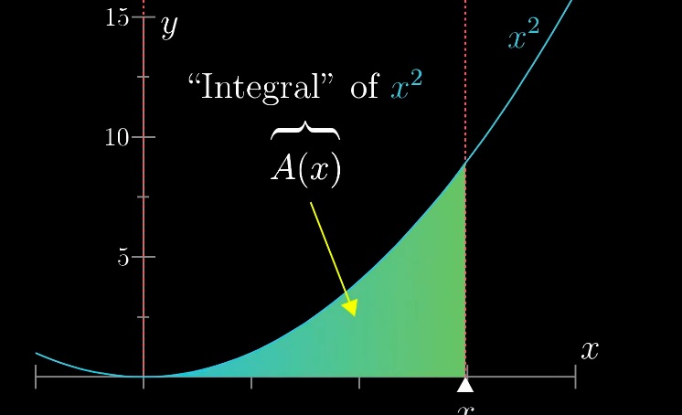
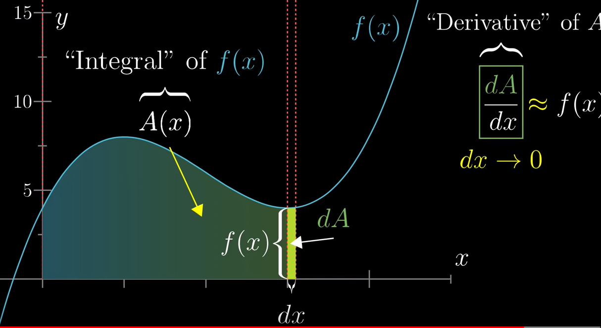

# 미적분학(Calculus)

움직임의 현상을 다루는 수학

- 미적분학 이전의 수학이 다루던 범위
  - 정수론
  - 부피 계산
  - 도형의 넓이
- 미적분학 이후의 수학이 다루던 범위
  - 속도
  - 가속도
  - 힘
  - 압력
  - 변화율
  - 일
  - 끊임없이 변화하는 현상세계 대상을 다루는 과학과 미적분학이 결합해서 깊이 있는 과학을 탐구 가능하게 함

## 좋은 자료

- [Essence of Calculus chapter 1](https://www.youtube.com/watch?v=9vKqVkMQHKk&list=PLZHQObOWTQDMsr9K-rj53DwVRMYO3t5Yr&index=2)

## Essence of calculus 정리

> Invent Math

> Hard problem = Sum of many small values

### 1. Essence of calculus, chapter 1

- 너무 어려운 문제에 부딪혔을 때
  - Play with the idea!
- Integral
- Derivative
  - loosely
    - 어떠한 함수가 작은 변화에 얼마나 민감한지를 측정한 것
- Fundamental theorem of calculus
  - 그래프 아래의 면적 사상의 derivative가 그 면적을 결정하는 사상 자체를 나타냄
    - integral과 derivative를 이어줌
    - integral이 derivative의 inverse이고 derivative가 integral의 inverse임
