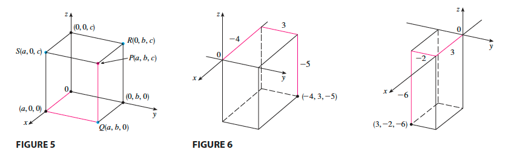
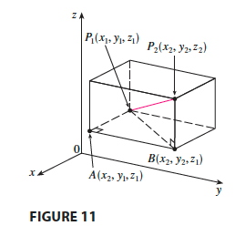
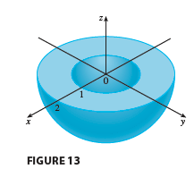

# 12. Vectors and the Geometry of Space

- 의문
- 12.1 Three-Dimensional Coordinate Systems
- 12.2 Vectors
- 12.3 The Dot Product
- 12.4 The Cross Product
- 12.5 Equations of Lines and Planes
- 12.6 Cylinders and Quadric Surfaces

## 12.1 Three-Dimensional Coordinate Systems

Three dimensional rectangular coordinate system

Distance formula in three dimensions

- three-dimensional analytic geometry
  - Surfaces
    - x,y,z로 나타나는 식
    - e.g)
      - `z = 3`
      - `y = 5`
  - Distance
    - `|P1P2| = root((x2-x1)^2 + (y2-y1)^2 + (z2-z1)^2) (P1(x1,y1,z1), P2(x2,y2,z2))`
  - Sphere
    - 중심 `C(h,k,l)`, 반지름 r
      - `(x-h)^2 + (y-k)^2 + (z-l)^2 = r^2`
    - e.g)
      - `1 ≤ x^2+y^2+z^2 ≤ 4, z≤0`

`1 ≤ x^2+y^2+z^2 ≤ 4, z≤0`

