# 1. Functions and Limits

- 의문
- 용어
- 1.1 Four Ways to Represent a Function
- 1.2 Mathematical Models: A Catalog of Essential Functions
- 1.3 New Functions from Old Functions
- 1.4 The Tangent and Velocity Problems
- 1.5 The Limit of a Function

## 의문

- *자유도랑 기저의 관계?*
- *수열은 x: N -> F를 정의로 갖고 있는데, 함수는 보통 정의역을 실수로 갖는 경우도 많다. 그러므로 수열에서의 수렴은 함수에서의 수렴에 적용할 수 없을텐데(왜냐면 실함수의 정의역은 실수로 자연수보다 크기 때문) 두 "수렴"의 차이는 무엇이며 어떻게 정의되는 것일까?*

## 용어

- parabola
  - 포물선
- piecewise defined functions
  - 다수의 sub functions으로 구성되어 있으며, 각 sub function들은 main function의 특정 정의역(sub domain)구간에 정의가 되어있다
- amplitude
  - 진폭
- asymptote
  - 점근선

## 1.1 Four Ways to Represent a Function

- four ways
  - 종류
    - an equation(algebrically)
    - a graph(visually)
    - a table(numerically)
    - in words(verbally)
  - 특징
    - 각각의 form에 대해서 장단점이 존재하고, 현상을 분석할 때 네가지의 방식 모두를 사용할 수 있음
- function
  - definition
    - each element x in a set D(domain) exactly one element, called f(x) in a set E
  - **4ways to picture a function**
    - an equation(algebrically)
      - 꼭 식이 주어져야만 calculus를 할 수 있는 것은 아님
    - a graph(visually)
      - 단순히 값들만 주어져있을 때에는, approximation을 이용한 그래프를 그려줄 수 있음
    - a table(numerically)
    - in words(verbally)
- function의 특징에 따른 분류
  - piecewise defined functions
    - 정의
      - 다수의 sub functions으로 구성되어 있으며, 각 sub function들은 main function의 특정 정의역(sub domain)구간에 정의가 되어있다
    - 예시
      - `f(x) = `
        - `1 - x if x ≦ -1`
        - `x^2 if x > -1`
      - absolute value function
        - `f(x) = |x|`
      - step functions
  - Symmetry
    - **even function(우함수/짝함수)**
      - 정의
        - `f(-x) = f(x)`
        - 덧셈 역원의 상이 서로 같은 함수
    - **odd function(기함수/홀함수)**
      - 정의
        - `f(-x) = -f(x)`
  - Increasing and Decreasing Functions
    - 구간 I에서 increasing function(`I = [a,b]`)
      - `f가 [a,b]에서 증가 <=> ∀x1,x2∈[a,b], x1 < x2 => f(x1) < f(x2)`
    - 구간 I에서 decreasing function(`I = [a,b]`)
      - `f가 [a,b]에서 감소 <=> ∀x1,x2∈[a,b], x1 < x2 => f(x2) < f(x1)`

## 1.2 Mathematical Models: A Catalog of Essential Functions

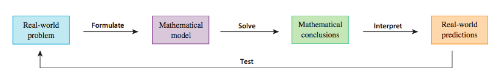

- Mathematical model
  - 정의
    - 현실 세계의 현상에 대한 수학적 기술(함수나 식을 통한)
      - 인구, 제품의 수요, 낙하하는 물체의 속도, 사람의 기대수명
  - 목적
    - 현상 이해
    - 미래 예측 등
  - 과정
    - ① 실제 세상의 문제 파악
      - 다양한 경로를 통해서 정보 획득
      - 데이터를 바탕으로 그래프를 그려서 알맞은 대수 공식을 파악하기도 함
    - ② 수학적 모델 생성
      - independent, dependent variables를 파악
      - apply the mathematics that we know (such as the calculus that will be developed throughout this book) to the mathematical model that we have formulated in order to derive mathematical conclusions
    - ③ 수학적 결론
      - 얻은 수학적 결론을 해석하여, 실제 세상의 문제에 대한 데이터를 정보화 시킴
    - ④ 실제 세상의 예측(문제해결)
      - 실제 대이터를 체크 하면서 수학적 결론(예측)을 테스트 함
      - 데이터와 기존의 결론이 잘 맞지 않으면, 모델을 더 개량하거나 새로운 모델을 만들기 위해서 위의 사이클을 반복함
  - 특징
    - 수학적 모델은 실제 세상 완벽히 같지 않음
      - **idealization**의 성질을 갖음
      - 애초에 수학적 모델은 한계를 가짐
    - 좋은 수학적 모델
      - **현실 세상의 문제를 수학적 계산이 가능하도록 단순화 하면서도, 충분히 가치있는 결론을 가져야 함**
    - 현실 세계에서 관찰된 수학적 모델을 기술하기 위한 다양한 타입의 함수들이 존재함
    - 주어진 현상에 수학적 모델을 구성하기 위한 물리적인 법칙이나, 원리가 존재하지 않으면, **empirical model** 즉, 수집된 데이터를 바탕으로 수학적 모델을 구성하는 수 밖에 없다
      - 수집한 데이터에 잘 적합된 curve를 찾으려고 노력해야 함(captures basic trend of the data points)

### 1.2.1 Linear Models

선형 모델의 예시1

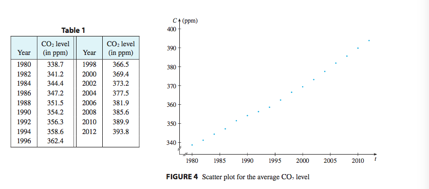

선형 모델의 예시2 & 최소제곱법

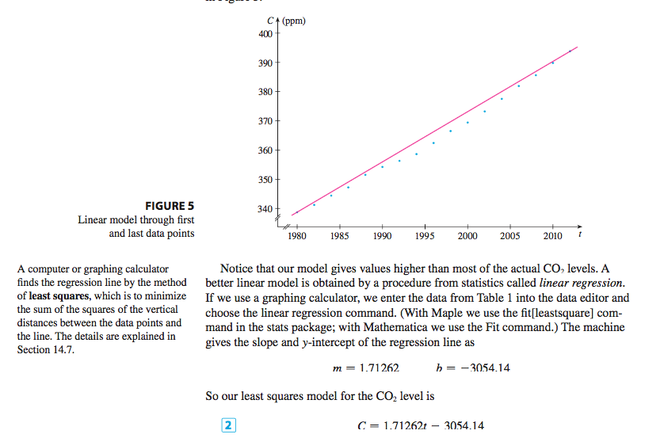

- 정의
  - `y = f(x) = mx + b` 형태
- 특징
  - 일정한 비율로 grow함

### 1.2.2 Polynomials

다항 모델의 예시1

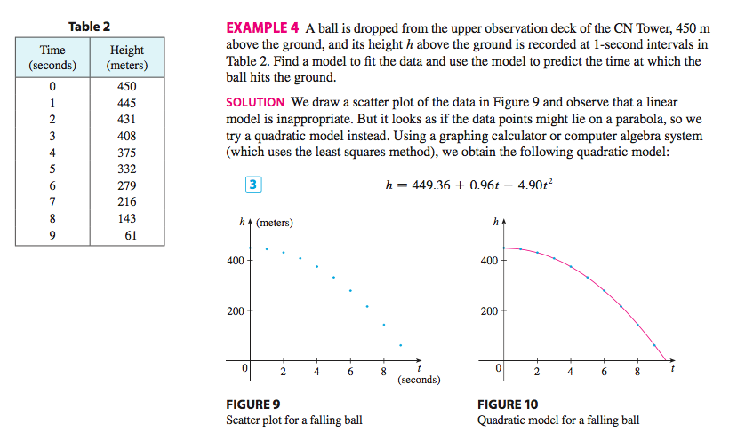

- 정의
  - `P(x) = anx^n + an-1x^n-1 + ... + a2x^2 + a1x + a0 (n > 0인 정수)`
    - `a0, ..., an`은 계수(coefficient)
    - 정의역
      - `R = (-∞, ∞)`
    - degree of polynomial(위의 경우)
      - n
- 특징
  - polynomial of degree
    - 1인 경우: linear function
    - 2인 경우: quadratic function
      - `P(x) = ax^2 + bx + c`는 포물선 `y = ax^2`를 이동시키면서 얻을 수 있음
    - 3인 경우: cubic function
      - `P(x) = ax^3 + bx^2 + cx + d (a≠0)`
  - 자연과 사회 과학에서 일어나는 다양한 양들을 모델링할 때 널리 사용됨
    - 예시
      - 상품의 개수x에 대한 비용을 나타내기 위해서 `P(x)`를 사용
  - 최소제곱법으로 다항식의 곡선의 방정식을 구할 수 있음

### 1.2.3 Power Functions

case1 `a = n (n > 0인 정수)`

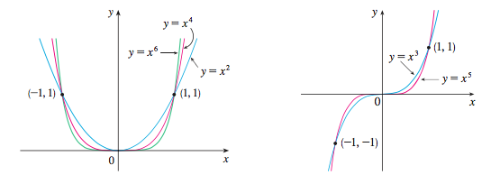

case2 `a = 1/n (n은 양인 정수)`

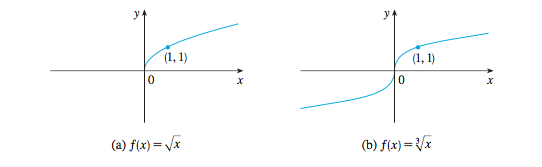

case3 `a = -1`

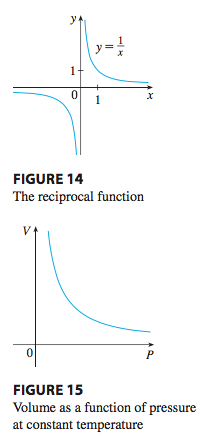

- 정의
  - `f(x) = x^a (a는 정수)`
    - case1 `a = n (n > 0인 정수)`
    - case2 `a = 1/n (n은 양인 정수)`
    - case3 `a = -1`

### 1.2.4 Rational Functions

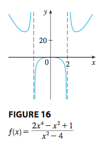

- 정의
  - ratio of polynomials:
    - `f(x) = P(x) / Q(x) (P, Q는 다항함수)`
    - domain
      - `{x∈R | Q(x)≠0}`
- 예시
  - `f(x) = 1/x`
  - `f(x) = (2x^4-x^2+1)/(x^2-4) (x ≠ +-2)`

### 1.2.5 Algebraic Functions

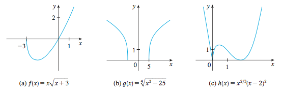

- 정의
  - 다항함수와 algebraic operations(덧셈, 뺄셈, 곱셈, 나눗셈, 제곱근 구하기)으로 구성되는 함수
  - 임의의 유리함수(rational function)은 자동적으로 algebraic function이다
- 예시
  - `f(x) = root(x^2+1), g(x) = (x^4-16x^2)/(x+root(x)) + (x-2)(x+1)^(1/3)`

### 1.2.6 Trigonometric Functions(삼각함수)

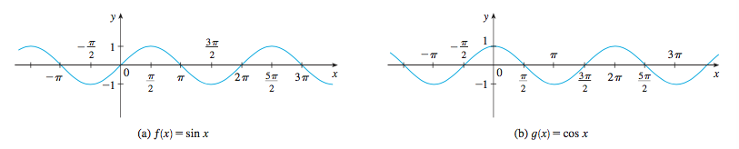

- 참고
  - 각의 단위로서 라디안을 사용
- 정의
  - `f(x) = sin(x), f(x) = cos(x), f(x) = tan(x) = sin(x)/cos(x)`
    - 정의역
      - `(-∞,∞)`
    - 치역
      - `[-1,1]`
  - `tan(x+π) = tan(x) (x≠±π/2 + nπ (n∈Z))`
  - `cosecant, secant, cotangent`도 존재
- 특징
  - `sin(x+2π) = sin(x), cos(x+2π) = cos(x)`
    - 함수의 주기성으로 인하여, 반복적인 현상(물결, 음파) 등을 모델링하기에 적합
- `f(x) = tan(x)`는 trigonometric function으로 취급하지 않는 것인가?
  - 취급한다

### 1.2.7 Exponential Functions

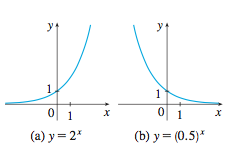

- 정의
  - `f(x) = b^x (b>0)`
- 예시
  - `f(x) = 2^x, f(x) = 0.5^x`
    - 정의역
      - `(-∞, ∞)`
    - 치역
      - `(0, ∞)`
- 특징
  - 자연현상을 기술하는데에 유용
    - e.g) 인구 증가, 방사선동위원소 반감

### 1.2.8 Logarithmic Functions

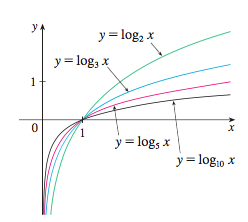

- 정의
  - `f(x) = log_b^x (b>0)`
    - exponential function의 역함수

## 1.3 New Functions from Old Functions

1.2 에서 알아본 기본적인 함수들을, 평행이동(shifting)하거나, 늘리거나(stretching), 대칭해서(reflecting) + 함수 공간 생성 + 함수 합성(역으로 분해도 가능) 등으로 새 함수를 만듬

평행이동과 늘리기, 대칭이동의 예시

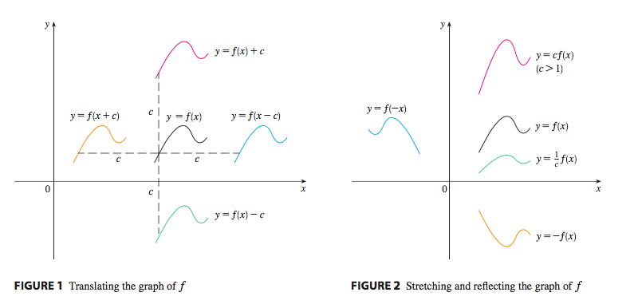

- Transformations of Functions
  - 평행이동(`c>0`)
    - `y = f(x)+c`
      - `y = f(x)`그래프를 c만큼 위로 옮김
    - `y = f(x)-c`
    - `y = f(x-c)`
      - `y = f(x)`그래프를 c만큼 오른쪽으로 옮김
        - `g(x) = f(x-c)`라고 두면, x에 특정한 값 a를 대응시키면, `g(a) = f(a-c)`가 되므로, g의 그래프는 f의 그래프를 오른쪽으로 c만큼 평행이동 시킨 것으로 생각할 수 있다(그래야지 `f(a-c)`와 대응되니까) -> 그래프를 그려보면 쉽게 이해할 수 있음
    - `y = f(x+c)`
  - 늘리기, 대칭이동(`c>1`)
    - `y = cf(x)`
      - `y = f(x)`그래프를 수직으로 c만큼 늘림
    - `y = (1/c)f(x)`
      - `y = f(x)`그래프를 수직으로 c만큼 수축함
    - `y = f(cx)`
      - `y = f(x)`그래프를 평행으로 c만큼 수축함
    - `y = f(x/c)`
      - `y = f(x)`그래프를 평행으로 c만큼 늘림
    - `y = -f(x)`
      - `y = f(x)`그래프를 x축에 대하여 대칭이동
    - `y = f(-x)`
      - `y = f(x)`그래프를 y축에 대하여 대칭이동
  - 절댓값
    - `y = |f(x)|`
      - `f(x) >= 0`일 떄
      - `f(x) < 0`일 때
    - `y = f(|x|)`
      - `x >= 0`일 떄
      - `x < 0`일 떄
- Combinations of Functions
  - 함수 공간(funciton space)
    - 참고
      - **함수의 개념을 다룰 때 중요한것은, `f: X -> Y, y = f(x)`와 같이, 함수의 정의역과 공역을 명시하고, 함수식이 존재하는 것이다**
        - 함수식이 같아도 정의역과 공역이 다르면 다른 함수!
          - 순서쌍으로 생각해보면 당연한 것
        - 함수는 사실 관계의 종류이며, 결국은 일정한 규칙이 있는 순서쌍일 뿐
    - 선형 대수학에서
      - `(f+g)(x) = f(x)+g(x)`
        - 정의역: `dom f ∩ dom g`
      - `(cf)(x) = c(f(x))`
        - 정의역: `dom f`
    - 그외
      - `(fg)(x) = f(x)g(x)`
        - 정의역: `dom f ∩ dom g`
      - `(f/g)(x) = f(x)/g(x)`
        - - 정의역: `{x∈dom f ∩ dom g | g(x)≠0}`
  - 함수 합성(composition)
    - 개요
      - `(g・f)(x) = g(f(x))`
        - `f: X -> Y, g: Y -> Z, g・f 가 존재 <=> ∀x∈X, f(x)∈Y ∧ g(f(x))∈Z`
    - 예시
      - `f(x) = root2(x), g(x) = root2(2-x)`일 때, 다음 함수를 정의하고, 정의역을 구하시오
        - `f・g`
          - `dom = (-∞, 2]`
        - `g・f`
          - `dom = [0, 4]`
        - `f・f`
          - `dom = [0, ∞)`
        - `g・g`
          - `g・g: [-2, 2] -> R, (g・g)(x) = root2(2-root2(2-x))`
  - 함수 분해(decomposition)
    - 개요
      - 합성이 된 복잡한 함수에서 간단한 함수의 합성으로 다시 재구성하는 것
    - 예시
      - `F(x) = cos^2(c+9) = h・g・f`
        - `f: R -> R, f(x) = x+9`
        - `g: R -> [-1,1], g(x) = cos(x)`
        - `h: R -> [0,∞), h(x) = x^2`
  - **함수의 합성이나 분해를 할 때는 각 함수의 정의역과 치역을 잘 살펴보자.**
    - 그냥 항상 정의역과 공역을 생각하는 습관을 들이자.
    - `함수 = 정의역, 공역, 함수식` or `순서쌍`

## 1.4 The Tangent and Velocity Problems

극한을 이용해서 접선을 구하는 방법

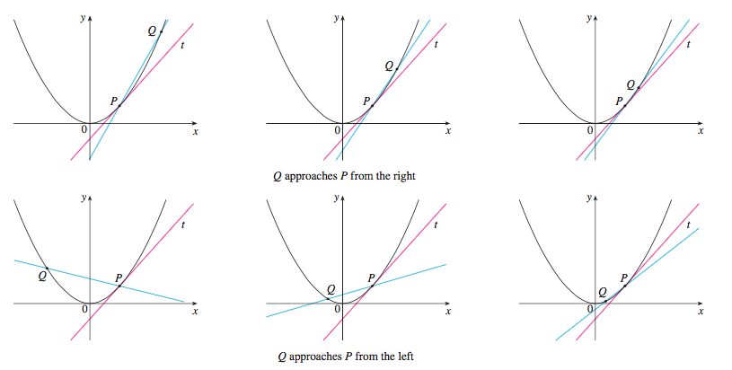

속도와 접선

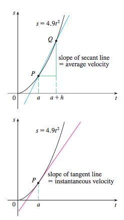

- The Tangent Problem
  - 개요
    - 극한을 사용한 접선 구하기
    - **과학에서 발견되는 많은 함수들은 명확한 식으로 관찰되지 않고, 실험적인 데이터로 발견되는 경우가 많다.**
      - 그럴때는, 다른 아는 데이터의 평균 변화율로 구하거나, 직접 그래프와 접선을 그려서 격자상의 근사값으로 구함

## 1.5 The Limit of a Function

### 1.5.1 함수의 극한

함수의 극한의 예시

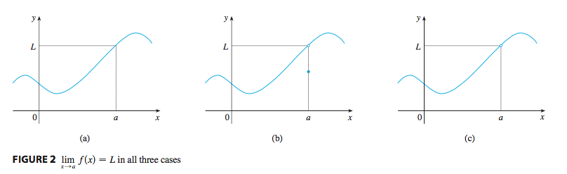

함수의 극한을 구할 떄 주의해야 하는 경우1

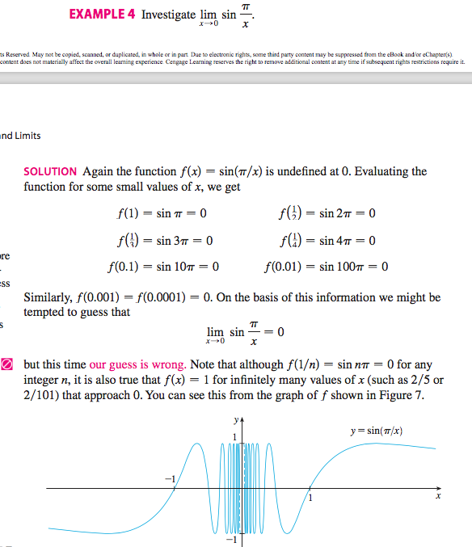

함수의 극한을 구할 떄 주의해야 하는 경우2

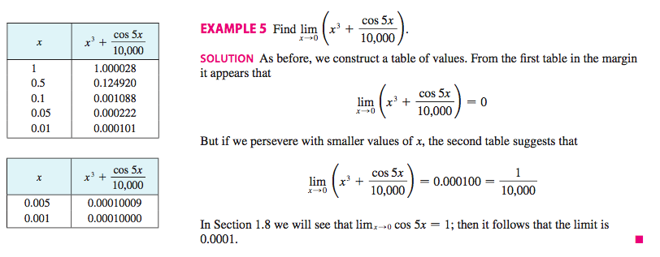

- intuitive definition
  - 정의
    - 함수 `f(x)`가 어떠한 정수 a의 주변에서 정의 되었을 때, `lim_(x->a)(f(x)) = L`은 "x가 a로 접근할 떄(`x≠a`)의 함수 f(x)의 극한값은 L과 같다" 라고 함
    - 다른 표기
      - `f(x) -> L (x -> a일 때)`
  - 주의
    - `f(x)`는 `x=a`에서 정의 되지 않아도, a의 주변에서 정의되어있다면 극한값을 구할 수 있음
    - **직접 특정 값 a에 가까운 값을 넣어가면서 값을 추정하는것이 기본이다.** 식을 변형 시켜서 극한값을 구하는 것 역시 올바르긴 하지만, 모든 식을 변형할 수 있다는 보장이 없으며, 기본 아이디어는 위의 굵은 글씨와 같다.
      - table of value를 사용하자
    - **함수의 극한을 구할 떄 주의해야 할 것**
      - ① digit이 너무 커지면 컴퓨터가 제대로 값을 계산하지 못함
      - ② 특정한 규칙을 갖는 값만 대입하고 극한값을 도출해내면 오류가 생길 수 있음 e.g) x = 0.1, 0.01, 0.001, ...
      - ③ 특정 정수에 가까운 값을 충분히 많이 가까워지게 대입한 후 생각해야 함(e.g 위의 극한을 구할 때 주의해야 하는 경우2)

### 1.5.2 한쪽 극한

한쪽 극한의 예

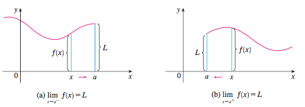

- 정의
  - `lim_(x->a-)(f(x)) = L`
    - x가 a로 접근할 때(`x<a`)의 좌극한이 L과 같다
  - `lim_(x->a+)(f(x)) = L`
    - x가 a로 접근할 때(`x>a`)의 우극한이 L과 같다
- 함수의 극한과의 관계
  - `lim_(x->a)(f(x)) = L <=> lim_(x->a-)(f(x)) = L ∧ lim_(x->a+)(f(x)) = L`

### 1.5.3 무한 극한

infinite limit 양의 방향, 음의 방향

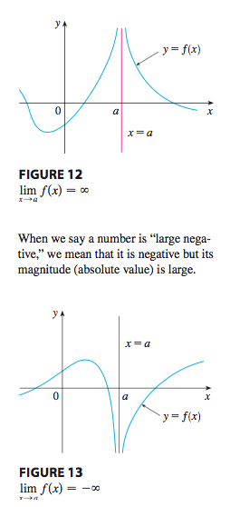

좌우극한과 무한 극한

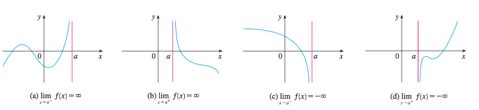

- Intuitive difinition of an infinite limit
  - infinite limit
    - 함수 f가 a의 양쪽에서 정의되어있을 떄, `lim_(x->a)(f(x)) = ∞`는 `f(x)`가 x를 a가 아닌 a에 충분히 가까운 값으로 잡을 때, 임의로 크게 된다는 것을 의미
      - 극한이 존재하지 않음을 보이는 특별한 방법
      - ∞는 숫자가 아님
    - 표기방법
      - `lim_(x->a)(f(x)) = ∞` or
      - `f(x) -> ∞ (x -> a)일 떄`
  - vertical asymptote(수직 점근선)
    - `y = f(x)`가 다음의 조건을 하나라도 만족하는 경우 `x=a`를 수직 점근선이라 부름
      - `lim_(x->a+)(f(x)) = ∞`
      - `lim_(x->a-)(f(x)) = ∞`
      - `lim_(x->a+)(f(x)) = -∞`
      - `lim_(x->a-)(f(x)) = -∞`

## 1.6 Calculating Limits Using the Limit Laws

### 1.6.1 Limit Laws

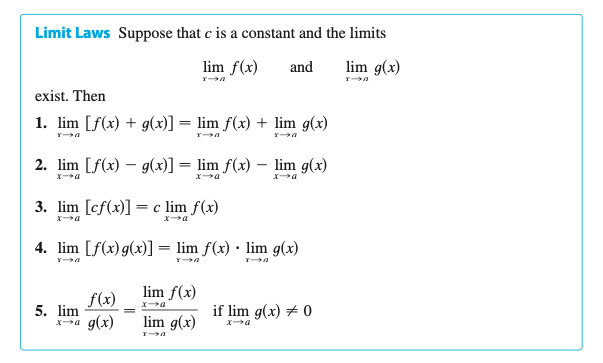

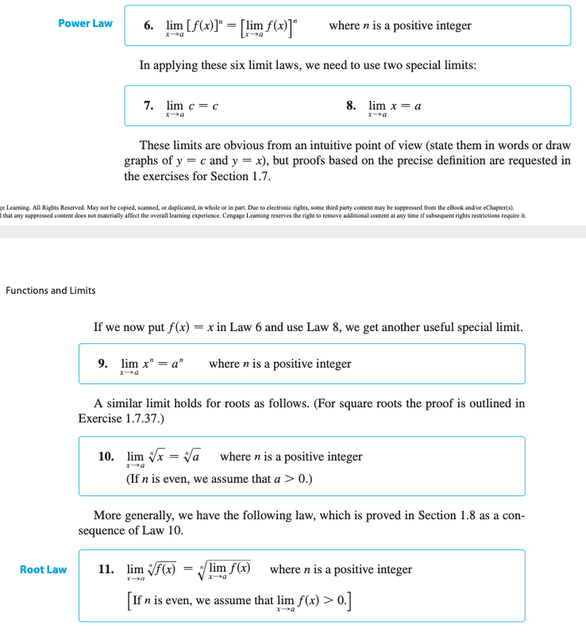

### 1.6.2 Direct Substitution Property

- 정의
  - f가 다항함수 혹은 분수함수(**함수가 a에서 연속**) 일 때, `a∈Dom f` => `lim_(x->a)(f(x)) = f(a)`
    - x에 a를 대입하면 풀림
    - *근데, 일부 무리함수는(약분해야 하는애들) 그냥 대입하면 0/0, ∞/∞ 로 나와서 안되지 않는가?*
      - *lim_(x->1)(x^2-1/x-1) 같은 경우는 바로 x대신 1을 대입할 수 없는데, 그럼 어떻게 해야하는가?*

### 1.6.3 주의

- `lim_(x->1)(x^2-1/x-1)`인 경우
  - we were able to compute the limit by replacing the given function fsxd − sx2 2 1dysx 2 1d by a simpler function, tsxd − x 1 1, with the same limit. This is valid because f sxd − tsxd except when x − 1, and in computing a limit as x approaches 1 we don’t consider what happens when x is actually equal to 1. In general, we have the following useful fact.
- `f(x) = g(x) (x != a) => lim_(x->a)(f(x)) = lim_(x->a)(g(x)) (단, 극한값이 존재할 경우)`
  - 왜나하면, `x->a`에 대한 극한값이 `x=a`일 떄의 함숫값에 의존하지 않으므로
    - *구체적으로 왜?(아마 극한의 정의와 큰 관련이 있을 듯 싶다)*

### 1.6.4 좌극한 우극한을 이용해서 극한을 찾는 경우 및 극한에 관한 기본 정리

- 기반 정리
  - ① `lim_(x->a)(f(x)) = L <=> lim_(x->a-)(f(x)) = L = lim_(x->a+)(f(x))`
    - 예시
      - `lim_(x->0)(|x|) = 0`임을 보여라
      - `lim_(x->0)(|x|/x)`가 존재하지 않음을 보여라
  - ② `(f(x) ≦ g(x) (단, x는 a근처에서) 그리고 f,g가 x의 a에 대한 극한값이 존재) => lim_(x->a)(f(x)) <= lim_(x->a)(g(x))`
  - ③ (샌드위치 정리) `f(x) ≦ g(x) ≦ h(x) (단, x는 a의 근처에서) ∧ lim_(x->a)(f(x)) = lim_(x->a)(h(x))=L => lim_(x->a)(g(x))=L`
    - *사실, 샌드위치 정리는 ②의 정리의 따름정리다?*
    - 예시
      - `lim_(x->0)(x^2sin(1/x))`

## 1.7 The Precise Definition of a Limit

### 극한의 엄밀한 정의

입실론 델타 논법의 기하학적 표현1

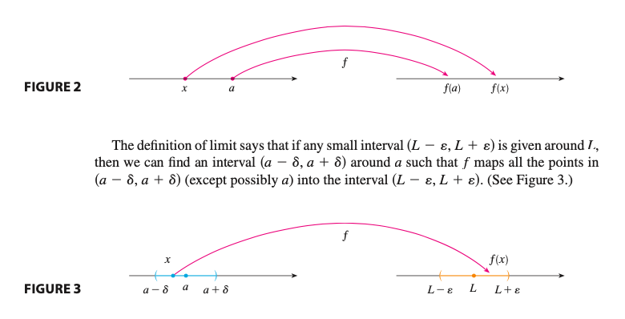

입실론 델타 논법의 기하학적 표현2

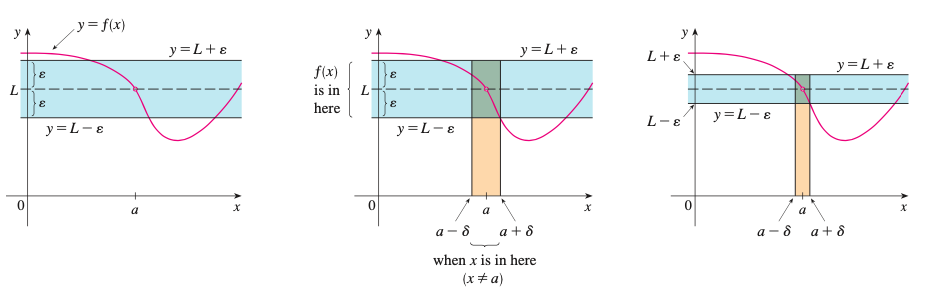

- 배경
  - 함수 f(x)가 5와 0.1미만의 차이를 보이기 위해서, x는 3에 얼마나 가까워야 하는가?(δ가 얼마나 가까워야 하는지 기준)
    - `|f(x)-5| < 0.1` if `|x-3| < δ`
- 극한의 정의
  - 함수 `f`가 실수 a를 포함하는 열린구간에서 정의되어 있을 떄(a자체는 정의되지 않아도 됨), **x가 a로 접근할 때의 극한값은 L** 를 다음과 같이 표현한다. 즉,
    - `lim_(x->a)(f(x))=L <=> ∀ε>0, ∃δ>0 s.t. 0<|x-a|<δ => |f(x)-L|<ε`
      - *c.f) 수열의 수렴과 유사함*
      - `0<|x-a|<δ`임에 주의 `|x-a|<δ`가 아님
  - 의미
    - `f(x)`와 `L`사이의 거리는 임의 거리보다 작게 될 수 있다. x와 a사이의 거리를 충분히 작게 한다면(단, 0이 아니어야 함)
    - 임의의 `ε>0`에 대하여, `δ>0`을 찾을 수 있는데, 어떤 δ냐면, `개구간 (a-δ, a+δ) ∧ x != a => f(x)가 개구간 (L-ε, L+ε)`
  - 예시
    - `lim_(x->3)(4x-5) = 7`임을 증명하라
- 좌극한의 정의
- 우극한의 정의
