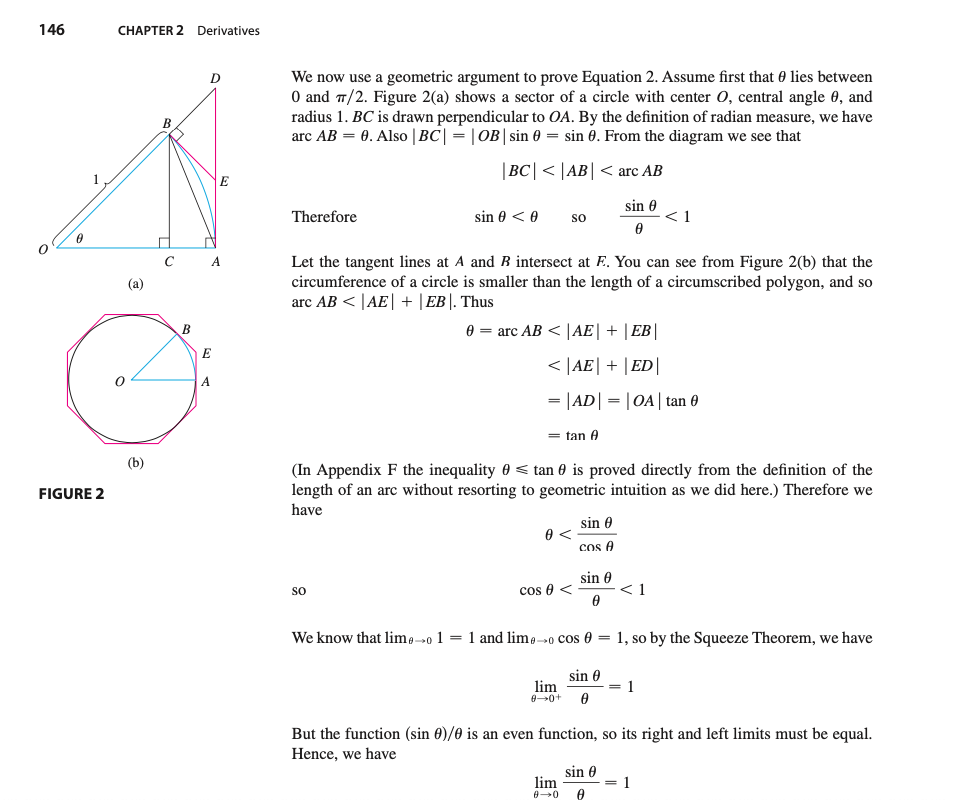

# 2. Derivatives

## 의문

## 2.1 Derivatives and Rates of Change

- `y = f(x)`의 점 `P(a, f(a))`에서의 접선의 기울기는 만일 존재한다면 아래와 같음
  - `m = lim_{x->a}{(f(x)-f(a))/(x-a)}`
  - `m = lim_{h->0}{(f(a+h)-f(a))/h}`
  - 과학이나 공학에서의 변화율(rate of change)를 계산할 때 사용됨
- 도함수(derivative)
  - 함수 f의 a에서의 도함수가 존재하는 경우 아래와 같음
    - `f'(a) = lim_{h->0}{(f(a+h)-f(a)) / h} = lim_{x->a}{(f(x)-f(a)) / (x-a)}`
  - `f'(a)`는 `y=f(x)`가 `x=a`에서의 순간변화율과 같음

## 2.2 The Derivative as a Function

- 도함수
  - `f'(x) = dy/dx(not ratio) = df/dx = lim_{h->0}{(f(x+h)-f(x)) / h}`
    - `(x, f(x))`에서의 접선의 기울기
    - 정의역
      - `{x | f'(x)가 존재}`
- `f'(a)`가 존재한다 => 함수 f가 a에서 미분가능하다
  - f가 열린구간 `(a, b)`에서 미분가능하다 => f가 해당 구간의 모든 값에서 미분가능하다
- 연속과 미분가능성의 관계
  - `f`가 a에서 미분가능 => f는 a에서 연속
    - 역의 반례
      - `f(x) = |x|`

미분 불가능한 케이스

higher derivatives

- Higher Derivatives
  - 배경
    - f가 미분가능한 함수 => f'역시 함수
    - f'가 미분가능한 함수 => f''역시 함수
  - 개요
    - f''
      - second derivative of f
      - `y=f'(x)`의 점`(x,f'(x))`에서의 기울기
      - 변화율의 변화율
        - 예시
          - 가속도(속도의 변화율)
    - f'''
    - f'''' 역시 정의 가능

## 2.3 미분 공식

- `d(c)/dx = 0`
- `d(x^n)/dx = nx^(n-1) (n∈R)`
- New Derivatives from Old
  - `d(cf(x))/dx = c・df/dx (단, c는 상수이고, f는 미분가능)`
  - `d(f(x)+g(x))/dx = df/dx + dg/dx (단, f,g는 미분가능)`
  - `d(f(x)・g(x))/dx = f(x)g'(x) + f'(x)g(x) (단, f,g는 미분가능)`
  - `d(f(x)/g(x))/dx = (g(x)・df/dx - f(x)・dg/dx) / g(x)^2 (단, f,g는 미분가능)`
  - **어떠한 polynomial도 R에서 미분가능 ∧ 어떠한 유비함수도 해당 정의역에서 미분가능**

## 2.4 Derivatives of Trigonometric Functions

- term
  - `1 radian`
    - `Θ` = l/r = 1 인 각
    - 1 라디안은 원 위에 반지름과 원호가 같은 길이를 갖을 때의 각 Θ를 말함
  - `csc(Θ)`
    - `1/sin(Θ)`
  - `sec(Θ)`
    - `1/cos(Θ)`
  - `cot(Θ)`
    - `1/tan(Θ)`
    - *이러한 친구들이 이름을 별도로 갖고 있는 이유가 존재하는가?*

`lim_{Θ->0}{sin(Θ)/Θ} = 1`임의 증명

- 삼각함수의 미분
  - `d(sin(x))/dx = cos(x)`
  - `d(cos(x))/dx = -sin(x)`
  - `d(tan(x))/dx = sec^2(x)`
  - `d(csc(x))/dx = -csc(x)・cot(x)`
  - `d(sec(x))/dx = sec(x)・tan(x)`
  - `d(cot(x))/dx = -csc^2()`

## 2.5 The Chain Rule

*완전한 증명?*

Chain Rule의 증명

- The Chain Rule
  - g가 x에서 미분가능 ∧ f가 g(x)에서 미분가능 => 합성함수 `y = F = f◦g`가 x에서 미분가능 ∧ F'이 다음과 같이 주어짐 `F'(x) = f'(g(x))・g'(x)`
    - `<=> dy/dx = dy/du・du/dx`
      - `dy/dx`와 같은 표기는 분수 표기가 아님에 주의!
- 응용
  - Deep Learning의 Neural Network에서, back-propagation을 사용할 때, 하나의 레이어가 하나의 함수의 역할을 하므로, 각 레이어의 구성요소에 관한 미분 e.g) `dL/dW`를 구할 때, 직접 계산하지 말고, 역전파법으로 뒤에서부터 차례차례 chain rule을 이용한 미분 계산을 행함 `dL/dW = dL/dZ・dZ/dW`

## 2.6 Implicit Differentiation

*implicit differentiation을 할 수 있는 것에 대한 증명은?*

- 배경
  - `x^3 + y^3 = 6xy` 과 같은 식은 어떻게 미분하는가?
    - `y`가 x에 대한 함수임에 주의
- c.f) explicit
  - 개요
    - 식에서 한 변수가 명시적으로 다른 변수의 항에 의해서 표현되는 것
  - e.g)
    - `y = root(x^3+1)`
    - `y = xsin(x)`
- implicit differentiation
  - 개요
    - 식이 explicit하지 않을 경우, implicit differentiation 방법을 사용하여, 도함수를 구할 수 있음
  - 방식
    - 식의 양쪽에 대해서 x에 대해서 미분하고, `y'`에 대해서 결과 식을 품
      - `y`는 x에 대해서 항상 미분가능하는 가정이 있어야 함
  - 문제
    - `x^4 + y^4 = 16`의 `y''`을 구하시오
