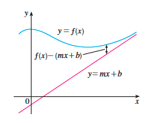
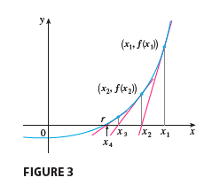
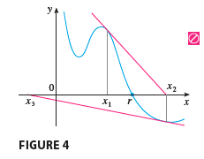

# 3. Applications of Differentiation

- 의문
- 3.1 Maximum and Minimum Values
- 3.2 The Mean Value Theorem
- 3.3 How Derivatives Affect the Shape of a Graph
- 3.4 Limits at Infinity; Horizontal Asymptotes
- 3.5 Summary of Curve Sketching
- 3.6 Graphing with Calculus and Calculators
- 3.7 Optimization Problems
- 3.8 Newton's Method
- 3.9 Antiderivatives

## 의문

## 3.1 Maximum and Minimum Values

- 개요
  - 최적화 문제의 해결
    - 예시
      - 제조 비용의 최대 / 최솟값
      - 우주선의 최대 가속도
      - ...
- absolute(global) maximum(minimum) value
  - 정의
    - `c∈D, D is domain of f`
      - `∀x∈D, f(c)≥f(x)` <=> f(c)는 f의 D에서의 **absolute maximum value**
      - `∀x∈D, f(c)≤f(x)` <=> f(c)는 f의 D에서의 **absolute minimum value**
    - extreme values
      - absolute maximum value
      - absolute minimum value
- local maximum(minimum) value
  - 정의
    - `f(c)≥f(x) (x≈c)` <=> f의 local maximum
    - `f(c)≤f(x) (x≈c)` <=> f의 local minimum
- **Extreme Value Theorem**
  - `f`가 닫힌 구간`[a,b]`에서 연속 => f는 구간 `[a,b]`에서 absolute maximum value를 `f(c)`로 갖음 ∧ 구간 `[a,b]`에서 absolute minimum value를 `f(d)`로 갖음 (단, `c,d ∈ [a,b]`)
- **Fermat's Theorem**
  - `c∈D (D는 함수f의 domain), f(c) is local minimum or maximum ∧ ∃f'(c) => f'(c) = 0 (c is critical number of f)`
    - 역이 성립하지 않음에 주의!!
- critical number
  - critical number of function f
    - `c∈D, s.t f'(c)=0 or f'(c) does not exist`
- The Closed Interval Method
  - **by Extreme Value Theorem and Fermat's Theorem**
  - absolute maximum, minimum값을 닫힌구간 `[a, b]`위의 연속함수f에서 찾는 방법
    - `f(a)`, `f(b)`의 값을 구함
    - `(a, b)`구간에서 f의 극값을 구함
    - 위의 모든 값들중에서 가장 큰 값과 작은 값이 구간 `[a,b]`에서의 최대, 최솟값

## 3.2 The Mean Value Theorem

- Rolle's Theorem
  - f가 다음을 만족 => `∃c∈(a,b), f'(c)=0`
    - f가 닫힌 구간 `[a,b]`에서 연속
    - f가 열린 구간 `(a,b)`에서 미분가능
    - `f(a)=f(b)`
- Mean Value Theorm
  - `f가 닫힌구간 [a,b]에서 연속 ∧ f가 열린구간 (a,b)에서 미분가능` => `∃c∈(a,b), f'(c) = (f(b)-f(a))/(b-a)`
  - 해석
    - 한 기간동안의 평균 변화율이 그 사이의 순간 변화율과 같게되는 경우는 반드시 존재한다.
  - 따름정리1
    - `∀x∈(a,b), f'(x)=0 => f is constant on (a,b)`
  - 따름정리2
    - `∀x∈(a,b), f'(x)=g'(x) => f-g is constant on (a,b) <=> f(x)=g(x)+c`

## 3.3 How Derivatives Affect the Shape of a Graph

- Increasing / Decreasing Test
  - `f'(x)>0 on an interval => f is increasing on the interval`
  - `f'(x)<0 on an interval => f is decreasing on the interval`
- First Derivative Test
  - `c`가 연속함수 f의 critical number
    - `f'가 c에서 양에서 음으로 변화 => f는 c에서 local maximum을 갖음`
    - `f'가 c에서 음에서 양으로 변화 => f는 c에서 local minimum을 갖음`
    - `f'가 c의 왼쪽 오른쪽 둘다 음이나 양의 값을 갖음 => f는 c에서 local maximum or minimum을 갖지 않음`
- `f''`와 `f`와의 관계
  - `f''`가 `f'`의 특정 구간에서의 increasing, decreasing을 나타냄
  - `f' > 0`
    - `f'`의 increasing(`f''>0`)은 f의 순간변화율이 점점 커지고 있다는 것이므로, 값의 증가폭이 커지는 것을 나타냄
    - `f'`의 decreasing(`f''<0`)은 f의 순간변화율이 점점 줄어들고 있다는 것이므로, 값의 증가폭이 작아지는 것을 나타냄
  - `f' < 0`
    - `f'`의 increasing(`f''>0`)은 f의 순간변화율이 점점 커지고 있다는 것이므로, 값의 감소폭이 작아지는 것을 나타냄
    - `f'`의 decreasing(`f''<0`)은 f의 순간변화율이 점점 줄어들고 있다는 것이므로, 값의 감소폭이 커지는 것을 나타냄
  - concave upward
    - 정의
      - 그래프 `f`가 특정 구간 `I`에서 모든 접선보다 위에 위치하는 경우
    - 특징
      - `f is concave upward on I <=> ∀x∈I, f''(x) > 0`
        - 도함수의 순간변화율이 0보다 큰 경우
        - 기울기가 양으로 증가하는 경우
  - concave downward
    - 정의
      - 그래프 `f`가 특정 구간 `I`에서 모든 접선보다 아래에 위치하는 경우
    - 특징
      - `f is concave downward on I <=> ∀x∈I, f''(x) < 0`
- inflection point(변곡점)
  - 정의
    - 곡선 `y=f(x)`에서, 특정 점 P에서 concave의 방향이 바뀌면, 그 점P를 inflection point라고 함
- Second Derivative Test
  - `f''`가 `c`근처에서 연속일 때
    - `f'(c)=0 ∧ f''(c)>0 => f는 c에서 local minimum을 갖음`
    - `f'(c)=0 ∧ f''(c)<0 => f는 c에서 local maximum을 갖음`

## 3.4 Limits at Infinity; Horizontal Asymptotes

- theorem
  - `r>0 (r is rational number) => lim(x->∞)(1/x^r)=0`
  - `r>0 s.t x^r is defined for all x (r is rational number) => lim(x->-∞)(1/x^r)=0`
- Limit at Infinity
  - `lim(x->∞)(f(x)) = L <=> ∀e>0, ∃N∈R, x>N => |f(x)-L|<e`
  - `lim(x->-∞)(f(x)) = L <=> ∀e>0, ∃N∈R, x<N => |f(x)-L|<e`
- Infinite limit at infinity
  - `lim(x->∞)(f(x)) = ∞ <=> ∀M>0, ∃N>R, x>N => f(x)>M`
  - `lim(x->-∞)(f(x)) = -∞ <=> ∀M<0, ∃N>R, x<N => f(x)<M`

### c.f) Slant Asymptotes

Example of Slant asymptote

`lim(x->∞)(f(x)-(mx+b))=0 (m≠0)`

## 3.5 Summary of Curve Sketching

- 그래프의 스케치를 위한 정보
  - ch1
    - domain, range, symmetry, limits, continuity, vertical asymptotes
  - ch2
    - derivatives, tangents
  - ch3
    - extreme value, intervals of increase, decrease, concavity, points of inflection, horizontal asymptotes
- 그래프를 그리기 위한 가이드라인
  - $1 Domain
  - $2 Intercepts
    - x
    - y
  - $3 Symmetry
    - even
    - odd
    - periodic
  - $4 Asymptotes
    - horizontal
    - vertical
    - slant(oblique)
  - $5 intervals of increase or decrease
  - $6 local maximum and minimum values
  - $7 concavity and points of inflection
  - $8 sketch the curve

## 3.6 Graphing with Calculus and Calculators

## 3.7 Optimization Problems

- First Derivatives Test for Absolute Extreme Values
  - c가 연속함수 f의 한 구간에서의 critical number일 때
    - `∀x<c, f'(x)>0 ∧ ∀x>c, f'(x)<0 => f(c)는 함수 f의 absolute maximum value`
    - `∀x<c, f'(x)<0 ∧ ∀x>c, f'(x)>0 => f(c)는 함수 f의 absolute minimum value`

## 3.8 Newton's Method

Newton's method good example

Newton's method bad example

- 배경
  - 굉장히 복잡하거나, 해가 존재하지 않는 방정식은 **approximation**을 구함
- Newton's method
  - `x(n+1) = x(n) - f(x(n))/f(x(n))`
  - `lim(n->∞)(xn)=r`
- 주의
  - Newton's method는 초기값을 잘 잡아야 함
    - `f'(x1)`이 0에 가까우면 좋지 않은 값 (기울기의 절댓값이 계속 커져야 함)

## 3.9 Antiderivatives

- 배경
  - 물리학자는 대상의 속도로부터 어떠한 시간에 대상의 위치를 알고 싶어함
  - 공학자는 오염물질이 나오는 탱크의 유출 변화율로부터 특정 기간 동안의 유출된 오염물질의 양을 알고 싶어함
  - 생물학자는 박테리아 인구의 증식률로부터 특정 시간이 지났을 때의 인구를 추정하고 싶어함
- antiderivative
  - `function F s.t ∃I, ∀x∈I, F'(x)=f(x)`
  - theorem
    - `F가 I구간에서 f의 antiderivative => F(x) + C 이 유일한 antiderivative (단 C는 상수)`
