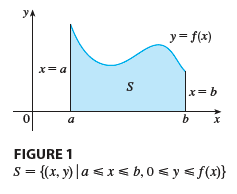
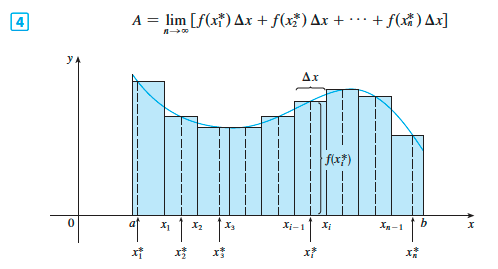
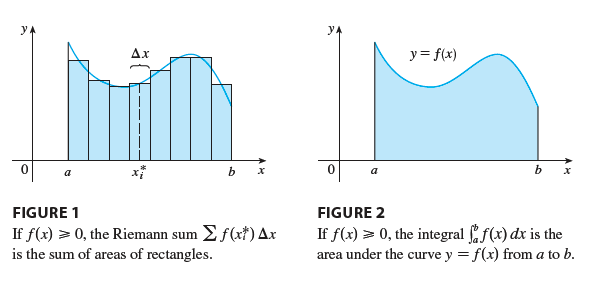
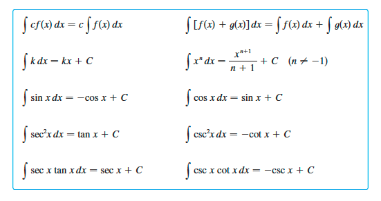
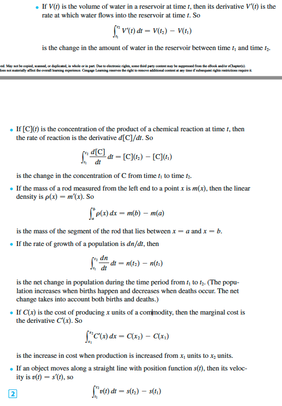

# 4. Integrals

- 4.1 Areas and Distances
- 4.2 The Definite Integral
- 4.3 The Fundamental Theorem of Calculus
- 4.4 Indefinite Integrals and the Net Change Theorem
- 4.5 The Substitution Rule

## 의문

## 4.1 Areas and Distances

Area of curve

Area of curve generalized

- area
  - `S = {(x,y) | a≤x≤b, 0≤y≤f(x)}`
- 연속함수 f의 region S의 area A는 다음과 같음
  - `A = lim(n->∞)R(n) = lim(n->∞)(f(x1)Δx + f(x2)Δx + ... + f(xn)Δx) = lim(n->∞)(f(x0)Δx + f(x1)Δx + ... + f(xn-1)Δx)`
    - A는 항상 존재 (∵f는 연속함수)
  - 특징
    - 사실, left endpoiint, right endpoint뿐 아니라, `∀xi* ∈ [xi-1, xi]`이어도 성립하고 이러한 `xi*`을 sample point라고 함
    - **A는 임의의 upper sum보다는 작고 임의의 lower sum보다는 큰 unique number**
- 거리 문제
  - 특정 시간동안 한 물체가 움직인 거리 구하기
- 다양한 예시
  - 일정시간 동안 변화하는 힘에 의한 작용된 일 구하기
  - cardiac output of the heart
  - area under a curve

## 4.2 The Definite Integral

리만 합과 Definite integral

- 배경
  - `lim(n->∞)(sigma_(i=1)^(n)(f(xi*)Δx)) = lim(n->∞)(f(x1*)Δx + f(x2*)Δx + ... + f(xn*)Δx)`
    - 이 식은 다양한 곳에서 확인 가능(generalized)
    - 따라서 특별한 이름을 부여
- Definite Integral
  - `int_a^b(f(x))dx = lim(n->∞)sigma_(i=1)^(n)(f(xi*)Δx) <=> a에서 b까지의 definite integral`
    - `f는 [a,b]에서 정의되어 있고, Δx = (b-a)/n, xi*는 [xi-1, xi]사이에 존재하는 sample point`
  - 용어 정리
    - `int`
      - integral sign
    - `f(x)`
      - integrand
    - limits of integration
      - `a`
        - lower limit
      - `b`
        - upper limit
    - `dx`
      - 독립 변수가 x임을 나타냄
    - integration
      - integral을 계산하는 절차
    - `int_a^b(f(x))dx`
      - 전체가 하나의 심볼
      - 숫자
        - 이 심볼자체가 dx에 의존하지 않음
  - 특징
    - `int_a^b(f(x))dx = int_a^b(f(t))dt = int_a^b(f(r))dr = ...`
    - `int_a^b(f(x))dx`에서 일반적으로 같은 너비의 subinterval들로 나눴으나, unequal width로 하는것이 더 유리할 떄가 있음
      - 속도 데이터가 equally spaced되지 않은 경우
  - 리만 합
    - `sigma_(i=1)^n(f(xi*)Δx)`
    - f가 주어진 범위에서 양의 값을 갖을 경우, 리만 합은 직사각형으로 근사시킨 영역의 합을 의미
    - integral의 approximation
      - sample point는 approximation이 목적일 경우, 구간의 midpoint로 두는 것이 바람직
  - integrable
    - 모든 함수가 integrable인 것은 아니나 다음 theorem에 의하여 대부분의 함수가 integrable
- integrable theorem
  - `f가 [a,b]에서 연속 ∨ f가 오직 유한개의 discontinuities를 갖음 => (f는 [a,b]에서 integrable <=> int_a^b(f(x)dt)가 존재)`
    - 증명은 해석학에서
- properties of the definite integral
  - `f`, `g`는 연속함수일 때
  - `int_b^a(f(x))dx = -int_a^b(f(x))dx`
    - `Δx`가 `(b-a)/n`에서 `(a-b)/n`으로 변함
  - `int_a^a(f(x))dx = 0`
    - `Δx=0`
  - properties
    - 1: `int_a^b(c)dx = c(b-a)`
    - 2: `int_a^b(f(x)+g(x))dx = int_a^b(f(x))dx + int_a^b(g(x))dx`
    - 3: `int_a^b(cf(x))dx = cint_a^b(f(x))dx`
    - 4: `int_a^b(f(x)-g(x))dx = int_a^b(f(x))dx - int_a^b(g(x))dx`
      - 2,3 corollary
    - 5: `int_a^c(f(x))dx + int_c^b(f(x))dx = int_a^b(f(x))dx`
  - comparison peroperties
    - 6: `a≤x≤b, f(x)≥0 => int_a^b(f(x))dx ≥ 0`
    - 7: `a≤x≤b, f(x)≥g(x) => int_a^b(f(x))dx ≥ int_a^b(g(x))dx`
    - 8: `a≤x≤b, m≤f(x)≤M => m(b-a) ≤ int_a^b(f(x))dx ≤ M(b-a)`

## 4.3 The Fundamental Theorem of Calculus

- 개요
  - differential calculus과 integral calculus의 연결고리
- **Fundamental theorem of calculus part1(FTC1)**
  - `f가 [a,b]에서 연속 ∧ g(x)=int_a^x(f(t))dt (a≤x≤b)이 [a,b]에서 연속 ∧ g가 (a,b)에서 미분가능 => g'(x)=f(x)`
  - `d/dx int_a^x(f(t))dt = f(x)`
    - integrate f한 뒤에 그 결과를 differentiate하면 원래 함수 f를 얻을 수 있음
  - 참고
    - `d/dx int_1^(x^4)(sec(t))dt = 4x^3・sec(x^4)`
- **Fundamental theorem of calculus part2(FTC2)**
  - `f가 [a,b]에서 연속 => int_a^b(f(d))dx = F(b)-F(a) (단, F는 f의 antiderivative (F'=f))`
    - differentiate한 뒤에 integrate하면 original function인 `F`로 돌아오나, `F(b)-F(a)`형태
- 의의
  - Fundamental theoroem of calculus덕분에, 복잡한 합의 극한을 구할 필요가 없게 됨
    - **antiderivative로 쉽게 구하자**

## 4.4 Indefinite Integrals and the Net Change Theorem

table of indefinite integrals

- **antiderivative(indefinite integral)**
  - `int(f(x))dx = F(x) <=> F'(x) = f(x)`
  - 주의
    - definite integral = number
    - indefinite integral = function
- **net change theorem**
  - `int_a^b(F'(x))dx = F(b)-F(a)`
      - integral of 변화율 = 순 변화량

Application of FTC

## 4.5 The Substitution Rule

- **Substitution Rule**
  - `u=g(x)가 I에서 미분가능 ∧ f가 I에서 연속 => int(f(g(x))g'(x))dx = int(f(u))du`
    - *`du/dx = g'(x) => du = g'(x) dx` 가 성립하는 이유는 무엇인지?*
    - integral sign뒤에 있는 `dx`와 `du`를 마치 미분할 수 있는 것 처럼 연산할 수 있음을 의미
  - 의의
    - 기존의 복잡한 integral을 쉬운 형태의 integral로 변화
