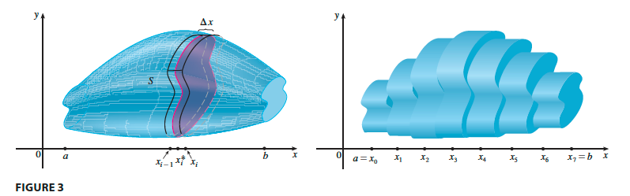

# 5. Application of Integration

- 의문
- 5.1 Area Between Curves
- 5.2 Volumes
- 5.3 Volumes by Cylindrical Shells
- 5.4 Work
- 5.5 Average Value of a Function

## 의문

## 5.1 Area Between Curves

- Area Between Curves
  - `f,g는 연속`
    - `A = lim(n->∞)(sigma_{i=1}^{n}(|f(xi*) - g(xi*)|Δx))`
    - `= int_a^b|f(xi*) - g(xi*)|dx`

## 5.2 Volumes

Volume intuition

- Volume
  - `S는 x=a와 x=b사이의 solid, 평면 Px에서의 S의 단면적이 A(x) ∧ A는 연속 함수 => V = lim_{n->∞}^n(A(xi*)Δx) = int_a^b(A(x))dx`

## 5.3 Volumes by Cylindrical Shells

## 5.4 Work

## 5.5 Average Value of a Function
