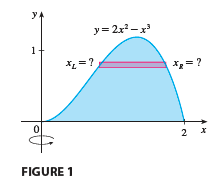
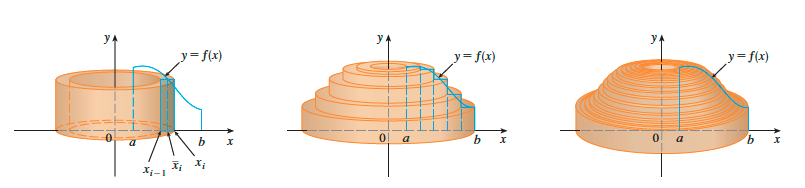

# 5. Application of Integration

- 의문
- 5.1 Area Between Curves
- 5.2 Volumes
- 5.3 Volumes by Cylindrical Shells
- 5.4 Work
- 5.5 Average Value of a Function

## 의문

## 5.1 Area Between Curves

- Area Between Curves
  - `f,g는 연속`
    - `A = lim(n->∞)(sigma_{i=1}^{n}(|f(xi*) - g(xi*)|Δx))`
    - `= int_a^b|f(xi*) - g(xi*)|dx`

## 5.2 Volumes

Volume intuition

- Volume
  - `S는 x=a와 x=b사이의 solid, 평면 Px에서의 S의 단면적이 A(x) ∧ A는 연속 함수 => V = lim_{n->∞}^n(A(xi*)Δx) = int_a^b(A(x))dx`

## 5.3 Volumes by Cylindrical Shells

일반적인 방법으로 부피를 구하기 어려운 경우가 존재

method of cylindrical shells intuition

- method of disks and washers
  - outer area에서 inner area를 빼는 식으로 텅 빈 실린더의 부피를 구함
- method of cylindrical shells
  - 텅 빈 실린더의 합을 내부에서 외부로 확장시키며 부피를 구함
    - y에 대응하는 x좌표를 직접 구하기 힘드므로, 실린더의 부피와 integration을 이용해서 전체 부피를 구하게 함
  - `lim_{n->∞}sigma_{i=1}^n(2π・xi・f(xi)・Δx) = sigma_a^b(2π・xf(x))dx (0≤a<b)`

어느 방법을 사용할 것인지는 직접 그려보면서 판단

## 5.4 Work

- 정의
  - 일반
    - 하나의 태스크를 시행하는데에 필요한 노력의 총 합
  - 물리학
    - `W = Fd (J)`
      - Joule단위

## 5.5 Average Value of a Function

- average value of function
  - 정의
    - `f_ave = 1/(b-a) int_a^b(f(x))dx`
  - 유도
    - `(f(x1*)+f(x2*)+ ... + f(xn*)/n)` 으로 부터 시작
    - `Δx = (b-a)/n`
- Mean Value Theorem for Integrals
  - `f가 [a,b]에서 연속 => ∃c∈[a,b], f(c) = f_ave = 1/(b-a) int_a^b(f(x))dx`
