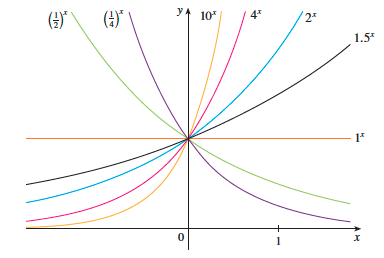
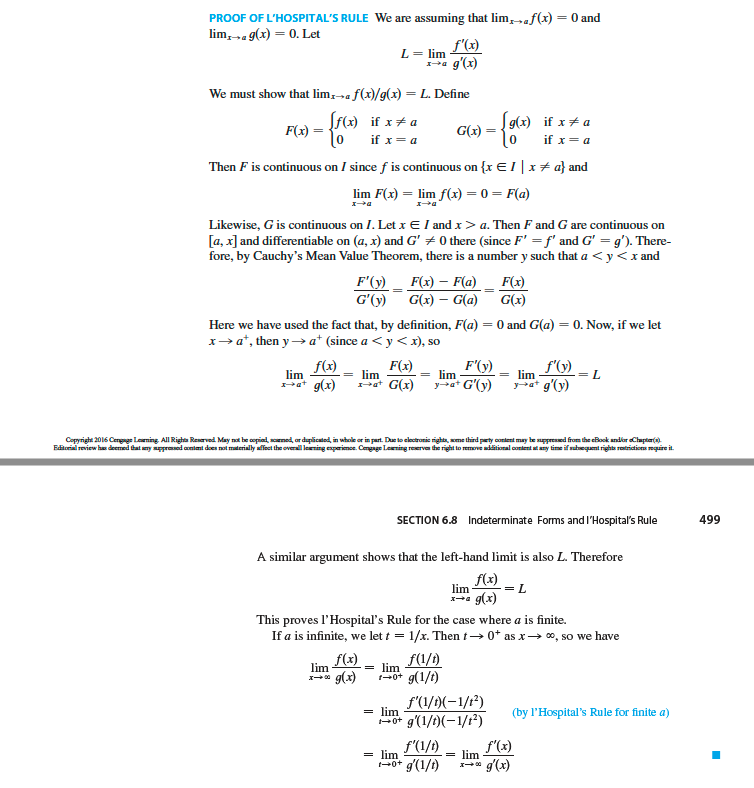

# 6. Inverse Function

- 의문
- 6.1 Inverse Functions
- 6.2 Exponential Functions and Their Derivatives
- 6.3 Logarithmic Functions
- 6.4 Derivatives of Logarithmic Functions
- 6.5 Exponential Growth and Decay
- 6.6 Inverse Trigonometric Functions
- 6.7 Hyperbolic Functions
- 6.8 Indeterminate Forms and l'Hospital's Rule

## 의문

## 6.1 Inverse Functions

- inverse continuous theorem
  - `f가 단사함수 ∧ 특정 구간 I에서 연속 => f^-1도 I에서 연속`
    - *f가 invertible이 아니어도, 특정 구간에서 연속이기 때문에 그 구간안에서는 자동적으로 invertible이 되는가?*
- inverse differntial theorem
  - `f가 전단사함수 ∧ 미분가능 ∧ f'(f^-1(x)) ≠ 0 => (f^-1)'(x) = 1/f'(f^-1(x))`

## 6.2 Exponential Functions and Their Derivatives

Exponential functions

- exponential function
  - `f: R -> R, f(x) = b^x (b>0)`
    - x=양의 정수
      - `b^n = b x b x ... x b`
    - x=0
      - `b^0 = 1`
    - x=음의 정수
      - `b^-n = 1/b^n`
    - x=유비수(`p/q`)
      - `b = b^(p/q) = qroot(b^p) = (qroot(b))^p`
    - x=무리수
      - 2^1.7 < 2^root(3) < 2^1.8
  - 특징
    - `b^x = lim_{r->x}(b^r) (r은 유비수)`
      - *`b^x`를 unique하게 specify하고, `f(x) = b^x`는 연속임을 보여줌*
        - *증명?*
  - 종류
    - `b>1`
    - `b=1`
    - `0<b<1`
- exponential function theorem
  - `b>1 => f:R -> (0,∞), f(x)=b^x는 연속 ∧ ∀x∈R, b^x>0 ∧ 증가함수`
  - `0<b<1 => f:R -> (0,∞), f(x)=b^x는 연속 ∧ ∀x∈R, b^x>0 ∧ 감소함수`
  - `a,b>0 ∧ x,y∈R`
    - `b^(x+y)=b^x・b^y`
    - `b^(x-y)=b^x/b^y`
    - `(b^x)^y=b^xy`
    - `(ab)^x=a^x・b^x`
  - `b>1 => lim_{x->∞}(b^x)=∞ ∧ lim_{x->-∞}(b^x)=0`
  - `0<b<1 => lim_{x->∞}(b^x)=0 ∧ lim_{x->-∞}(b^x)=∞`
- e
  - 정의
    - `e∈R s.t lim_{h->0}((e^h-1)/h) = 1`
  - 특성
    - `d/dx(e^x) = e^x`
    - `d/dx(e^u) = e^u・du/dx`
    - domain R
    - increasing
    - continuous
    - range (0, ∞)
    - `∀x∈R, e^x>0`
    - `lim_{x->-∞}(e^x)=0, lim_{x->∞}(e^x)=∞`
    - `int(e^x)dx = e^x + C`

## 6.3 Logarithmic Functions

- log의 의미
  - `log_{b}(x) = 밑이 b일때 이 로그를 지수로 하면, 그 값은 x이다`
- logarithmic function
  - `f: (0,∞) -> R, f(x) = log_{b}(x)`
- logarithmic function theorem
  - `b>1 => f: (0,∞) -> R, f(x) = log_{b}(x), f는 일대일 대응 ∧ 연속 ∧ 증가 함수`
  - `x,y>0 ∧ r∈R`
    - `log_{b}(xy) = log_{b}(x) + log_{b}(y)`
    - `log_{b}(x/y) = log_{b}(x) - log_{b}(y)`
    - `log_{b}(x^r) = rlog_{b}(x)`
  - `b>1 => lim_{x->∞}(log_{b}(x))=∞ ∧ lim_{x->0+}(log_{b}(x))=-∞`

## 6.4 Derivatives of Logarithmic Functions

- `d/dx(ln(x)) = 1/x`
- `d/dx(ln(|x|)) = 1/x`
  - **`int(1/x)dx = ln(|x|)+C`**
- `int(tanx)dx = ln(|sec(x)|)+C`
- `d/dx(log_b(x)) = 1/(xlnb)`
- `d/dx(b^x) = b^x・ln(b)`
- `int(b^x)dx = b^x/ln(b)+C`

## 6.5 Exponential Growth and Decay

- Law of natural growth(decay)
  - `dy/dt = ky`
    - `k>0`: growth
    - `k<0`: decay
    - differential equation
  - e.g)
    - 복리
    - 인구 증가
    - 방사능 물질의 반감기
- theorem
  - 미분방정식 `dy/dt = ky`의 유일한 해집합
    - `y(t) = y(0)・e^(kt)`
- Population Growth
  - `1/P・dP/dt`
    - relative growth rate
      - growth rate is proportional to population size
      - == relative growth rate is constant
- Radioactive Decay
- Countinuously Compounded Interest

## 6.6 Inverse Trigonometric Functions

- arcsine function
  - 식
    - `sin^-1(x) = y (-π/2 ≤ y ≤ π/2)`
  - cancellation equations
    - `sin^-1(sin(x)) = x (-π/2 ≤ x ≤ π/2)`
    - `sin(sin^-1(x)) = x (-1 ≤ x ≤ 1)`
  - 미분
    - `d/dx(sin^-1(x)) = 1/root2(1-x^2) (-1 < x < 1)`
  - 적분
    - `int(1/root2(1-x^2))dx = sin^-1(x)+C`
- arccosine
  - 식
    - `cos^-1(x) = y (0 ≤ y ≤ π)`
  - 미분
    - `d/dx(cos^-1(x)) = -1/root2(1-x^2) (-1 < x < 1)`
- arctan
  - 식
    - `tan^-1(x) = y (-π/2 ≤ y ≤ π/2)`
  - 미분
    - `d/dx(tan^-1(x)) = 1/(x^2+1)`
  - 적분
    - `int(1/(x^2+1))dx = tan^-1(x)+C`
- `y = csc^-1(x) (|x| ≥ 1, y∈(0, π/2] U (π, 3π/2]) `
  - 미분
    - `d/dx(csc^-1(x)) = -1/(x・root2(x^2-1))`
    - universally agreed되지 않음(y의 범위가 다를경우 식이 달라짐)
      - 위의 식은 간단한 버전
- `y = sec^-1(x) (|x| ≥ 1, y∈[0, π/2) U [π, 3π/2))`
  - 미분
    - `d/dx(sec^-1(x)) = 1/(x・root2(x^2-1))`
    - universally agreed되지 않음(y의 범위가 다를경우 식이 달라짐)
- `y = cot^-1(x) (x∈R, y∈(0,π))`
  - 미분
    - `d/dx(cot^-1(x)) = -1/(1+x^2)`
- `int(1/(x^2+a^2))dx = 1/a・tan^-1(x/a)+C`

## 6.7 Hyperbolic Functions

- hyperbolic 함수
  - 개요
    - 삼각함수와 유사한 성질을 갖음
  - 종류
    - `sinh(x) = (e^x - e^(-x))/2`
    - `cosh(x) = (e^x + e^(-x))/2`
    - `tanh(x) = sinh(x)/cosh(x)`
    - `csch(x) = 1/sinh(x)`
    - `sech(x) = 1/cosh(x)`
    - `coth(x) = cosh(x)/sinh(x)`
  - 활용
    - light
    - velocity
    - electricity
    - radioactivity
    - shape of a hanging wire
- hyperbolic Identities
  - `sinh(-x) = -sinh(x)`
  - `cosh(-x) = cosh(x)`
  - `cosh^2(x) - sinh^2(x) = 1`
  - `1 - tanh^2(x) = sech^2(x)`
  - `sinh(x+y) = sinh(x)cosh(y) + cosh(x)sinh(y)`
  - `cosh(x+y) = cosh(x)cosh(y) + sinh(x)sinh(y)`
- Derivatives of Hyperbolic Functions
  - `d/dx(sinh(x)) = cosh(x)`
  - `d/dx(cosh(x)) = sinh(x)`
  - `d/dx(tanh(x)) = sech^2(x)`
  - `d/dx(csch(x)) = -csch(x)・coth(x)`
  - `d/dx(sech(x)) = -sech(x)・tanh(x)`
  - `d/dx(coth(x)) = -csch^2(x)`
- Inverse Hyperbolic Functions
  - `sinh^-1(x) = ln(x+root2(x^2+1)) (x∈R)`
  - `cosh^-1(x) = ln(x+root2(x^2-1)) x≥1`
  - `tanh^-1(x) = 1/2・ln(1+x/1-x) (-1<x<1)`
- Derivatives of Inverse Hyperbolic Functions
  - `d/dx(sinh^-1(x)) = 1/root2(x^2+1)`
  - `d/dx(cosh^-1(x)) = 1/root2(x^2-1)`
  - `d/dx(tanh^-1(x)) = 1/(1-x^2)`
  - `d/dx(csch^-1(x)) = -1/(|x|root2(x^2+1))`
  - `d/dx(sech^-1(x)) = -1/(xroot2(1-x^2))`
  - `d/dx(coth^-1(x)) = 1/(1-x^2)`

## 6.8 Indeterminate Forms and l'Hospital's Rule

BigO notation과 로피탈의 법칙이 관계가 있어보임

- indeterminate form
  - indeterminate form of type 0/0
    - `lim_{x->a}(f(x)/g(x))`에서 `f(x)->0 ∧ g(x)->0`인 경우의 limit의 형태
  - indeterminate form of type ∞/∞
    - `lim_{x->a}(f(x)/g(x))`에서 `f(x)->∞(or -∞) ∧ g(x)->∞(or -∞)`인 경우의 limit의 형태
  - indeterminate form of type 0・∞
    - `fg = f/(1/g)`로 변형해서 l'Hospital's Rule적용
  - indeterminate form of type ∞-∞
    - difference를 quotient로 변경
  - indeterminate form of powers
    - `lim_{x->a}((f(x))^g(x))`
      - `lim_{x->a}(f(x))=0 ∧ lim_{x->a}(g(x))=0 (type 0^0)`
      - `lim_{x->a}(f(x))=∞ ∧ lim_{x->a}(g(x))=0 (type ∞^0)`
      - `lim_{x->a}(f(x))=1 ∧ lim_{x->a}(g(x))=∞ (type 1^∞)`
      - *0^∞는 indeterminate form이 아님*
    - 구하는 방법
      - natural logarithm
        - `ln(y) = g(x)ln(f(x))`
      - writing the function as exponential
        - `[f(x)]^g(x) = e^(g(x)ln(f(x)))`
- l'Hospital's Rule
  - 개요
    - indeterminate form을 evaluation하기 위한 방법
  - 정의
    - `f`와 `g`가 미분가능 ∧ `g'(x)≠0 on open interval I that contains a`
      - if `lim_{x->a}(f(x))=0 ∧ lim_{x->a}(g(x))=0` or
      - if `lim_{x->a}(f(x))=±∞ ∧ lim_{x->a}(g(x))=±∞`
      - then
    - `lim_{x->a}(f(x)/g(x)) = lim_{x->a}(f'(x)/g'(x)) (if right side llimit is exist(or ±∞))`
- c.f) Cauchy's Mean Value Theorem
  - `f,g가 [a,b]에서 연속 ∧ (a,b)에서 미분가능 ∧ ∀x∈(a,b), g'(x)≠0`
    - `=> ∃c∈(a,b), f'(x)/g'(x) = (f(b)-f(a))/(g(b)-g(a))`
  - proof
    - `h(x) = f(x)-f(a) - (f(b)-f(a))/(g(b)-g(a)) * (g(x)-g(a))`

L'hospital's rule proof

