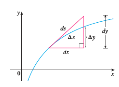
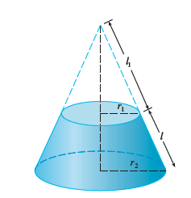
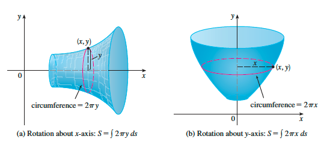

# 8. Further Applications of Integration

- 의문
- 8.1 Arc Length
- 8.2 Area of a Surface of Revolution
- 8.3 Applications to Physics and Engineering
- 8.4 Applications to Economics and Biology
- 8.5 Probability

## 의문

## 8.1 Arc Length

- Arc length formula
  - `f'가 [a,b]에서 연속 => y = f(x)의 a≤x≤b 에서의 길이 L = int_{a}^{b}(root(1+(f'(x))^2))dx = int_{a}^{b}(root(1+(dy/dx)^2))dx`
    - 때로는 계산이 아에 안되는 경우도 있으므로, Simpson's Rule을 사용해서 approximation을 구하는것에 만족하는 경우도 존재

Arc Length Function geometric interpretation

- Arc length function
  - `s(x) = int_{a}^{x}(root(1+(f'(t))^2))dt`
    - `ds = root(1+(dy/dx)^2)dx`
    - `(ds)^2 = (dx)^2 + (dy)^2`
    - `ds = root(1+(dx/dy)^2)dy`

## 8.2 Area of a Surface of Revolution

Cone surface of revolution

- Cone surface area of revolution
  - `A = π(r1l + r2l) = 2πrl (r = (r1+r2)/2)`
- Surface area of revolution
  - `S = int_{a}^{b}(2πf(x)·(√1+(f'(x))^2))dx`
    - `S = int_{a}^{b}(2πy·(√1+((dy/dx)^2))dx`
    - 함수가 `x = g(y), c≤y≤d`로 묘사된 경우
      - `S = int_{c}^{d}(2πy·(√1+((dx/dy)^2))dy`
        - 이 경우의 의미는, Arc length를 `x = g(y)`를 이용해서 구할때의 넓이임
    - arc length를 이용한 공식 intuition
      - x-axis rotation `S = int(2πy)ds`
        - `ds = (√1+(dy/dx)^2)dx`
      - y-axis rotation `S = int(2πx)ds`
        - `ds = (√1+(dx/dy)^2)dy`

Arc length를 이용한 공식 intuition

## 8.3 Applications to Physics and Engineering

## 8.4 Applications to Economics and Biology

## 8.5 Probability
