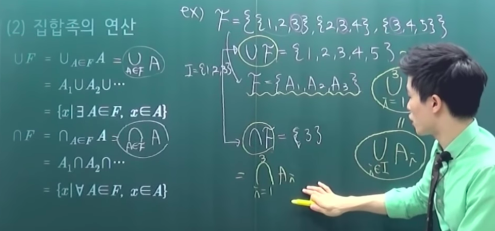
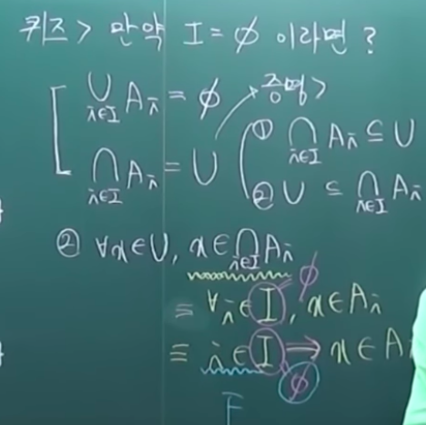
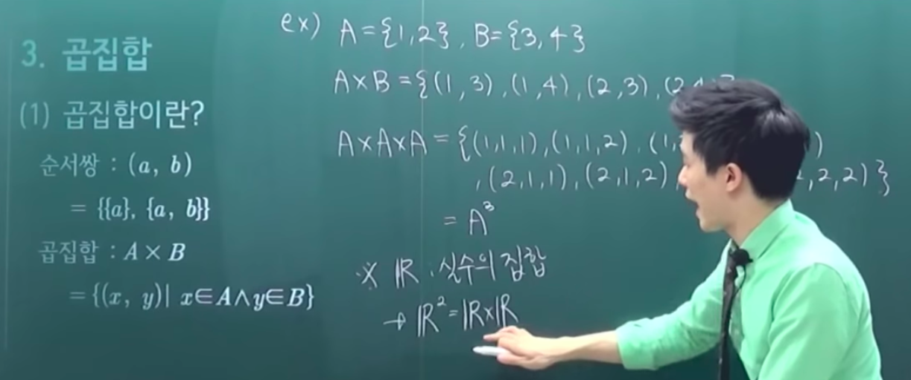
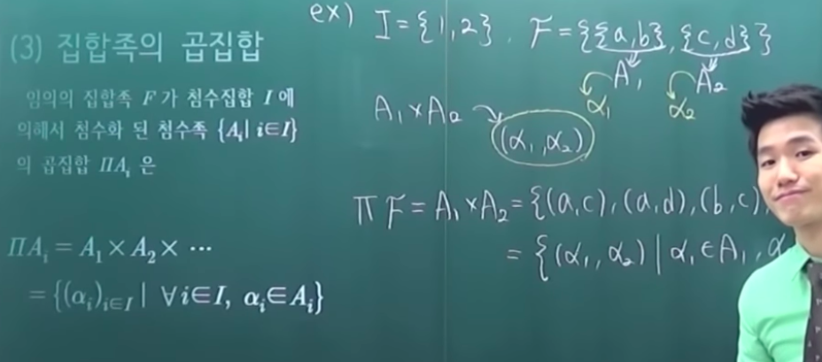
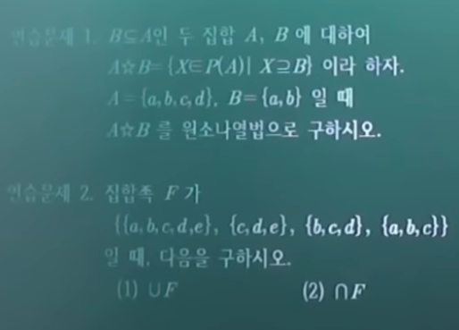
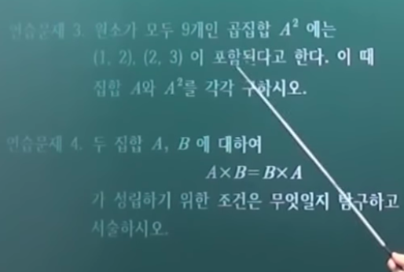

# 집합의 확장

- 1 기본용어정리
  - 1-1 집합의 용어
  - 1-2 집합간의 용어
- 2 집합족
  - 2-1 집합족이란?
  - 2-2 집합족의 연산
- 3 곱집합
  - 3-1 곱집합이란?
  - 3-2 곱집합의 연산
  - 3-3 집합족의 곱집합

## 의문

- *`∀i∈I, x∈Ai ≡ i∈I -> x∈Ai`라고 할 수 있는가?*
- *집합족의 곱집합을 집합으로 표현했을 떄, 그것을 어떻게 해석한 것인가?*
  - 정의가 이해가 잘 안됨

## 1. 기본용어정리

### 1-1 집합의 용어

- 집합과 원소
  - 집합
    - 명확한 기준으로 이루어진 서로다른 대상들로 이루어진 새로운 대상
    - `A, B, C`
  - 원소
    - 집합을 이루는 개체
    - `a, b, c`
- 원소나열법과 조건제시법
  - 원소나열법
    - 집합을 표현할 때, 중괄호를 이용해서 해당 집합의 원소들을 전부 열거하는 방법
  - 조건제시법
    - 집합을 표현할 때, 집합의 원소들의 공통적인 성질을 조건으로 제시하는 방법
- 공집합과 전체집합
  - 공집합
    - 원소가 하나도 없는 집합
    - 공집합은 모든 집합들의 부분집합
  - 전체집합
    - 모든 대상을 원소로 갖는 집합
    - 러셀의 역설에 의해서 사실상 수학의 전체를 포함하는 전체집합은 존재하지 않는것을 암
      - 특정 영역에서는 전체집합 정의 가능
- 중복집합
  - 중복적인 원소를 허용하는 집합
  - 원소가 중복되는 횟수는 중복도

### 1-2 집합간의 용어

- 벤 다이어그램
  - 서로 다른 집합의 관계를 나타내는 그림
- 같은 집합
  - `x∈A <=> x∈B`
- 부분집합(`A⊆B`)
  - 어떠한 집합 A의 임의의 원소가 다른 집합 B의 원소에 포함되는 경우 집합 A는 집합 B의 부분집합이라고 함
  - `∀x∈A, x∈B ≡ A⊆B`
  - `x∈A => x∈B ≡ A⊆B`
    - 임의의 A의 원소 x가 B에 포함되면, A는 B의 부분집합이다.
  - 다음을 증명하라
    - `A⊆B <=> AUB = B`
- 진부분집합과 초집합
  - `A⊆B ∧ A≠B ≡ A⊂B`
    - 진부분집합(`A`)
      - 어떠한 집합 A가 집합 B의 부분집합이고 A집합이 B집합과 같지 않는 집합 A
    - 초집합(`B`)
      - 위의 진부분집합을 부분집합으로 포함하는 집합 B
- 합집합과 교집합
  - 합집합
    - `AUB = {x|x∈A ∨ x∈B}`
    - 집합 A에 포함되는 원소들 또는 집합 B에 포함되는 원소들을 원소로 하는 집합
  - 교집합
    - `A∩B = {x|x∈A ∧ x∈B}`
    - 집합 A에 포함되고 집합 B에 포함되는 원소들을 원소로 하는 집합
  - 이항연산
- 여집합
  - `A^c = {x∈U|x!∈A}`
  - compliment set
  - 전체 집합의 원소들중에 해당 집합의 원소가 아닌 원소들을 전부 원소로 갖는 집합
    - 단항 연산
- 차집합
  - `A-B = {x∈A|x!∈B} = {x|x∈A ∧ x!∈B} = A∩B^c`
  - 집합 A에는 속하지만 B에는 속하지 않는 원소들을 갖는 집합
  - 이항연산

위의 합집합, 교집합, 여집합, 차집합을 하나의 연산이라고 생각한다면, 수학에서 위의 연산의 결과는 immutable이다. 그래서 함수형 프로그래밍에서는 수학의 immutable적인 성질을 따온것이 아닐까 라는 생각이 들었다.

c.f) 연산이란: 수학에서 하나 이상의 피연산자를 연산자의 정의에 따라 계산하여 하나의 결과값을 도출해 내는 과정. 피연산자가 1개일 경우 단항연산, 2개일 경우 이항연산, n개일 경우 n항연산이라고 한다. 단항연산은 함수에 대응되는 개념이며 n항연산은 n개의 정의역으로 1개의 치역을 도출하는 사상에 대응되는 개념이라고 할 수 있다. (a1, a2, ... , an) → (b) - 나무위키

## 2. 집합족

### 2-1 집합족이란?

- 집합족
  - 집합을 원소로 갖는 집합
    - `F`
  - e.g
    - `{공집합, {1, 2}} = F(Family)`
    - 멱집합
  - 서로소 집합족
    - `i,j∈I, i≠j => Ai∩Aj = φ`
- 첨수족
  - 첨수(번호)가 부여된 대상들로 이루어진 집합
  - 첨수집합
    - 집합족에 부여하는 인덱스
      - 컴퓨터과학의 배열이나 해시맵이랑 비슷한 개념
    - `I`
  - e.g
    - `A = {1, 2}`
      - `P(A) = {공집합, {1}, {2}, {1, 2}} = F`
      - 집합족의 원소가 매우 많아지면 F를 나타내기가 매우 난감해짐
      - 그래서 I를 이용해서 쉽게 나타내려고 함
      - `I = {1, 2, 3, 4}`
      - `F = {Ai | i∈I}`
  - 집합족의 표현을 간단히 하기 위해서 첨수족의 개념을 등장시킴

### 2-2 집합족의 연산

- `UF`
  - `{x | ∃A∈F, x∈A}`
- `∩F`
  - `{x | ∀A∈F, x∈A}`

**정말 신기하다!! > 중요**

직관을 뛰어넘은 논리

- 2번 증명의 경우 `I = φ`인 경우에 위의 명제가 항진명제임을 보여주면 됨
- 위의 증명에서 아래에서 두번째와 세번째줄 사이의 논리가 아주 섹시하다. 이맛에 수학한다 취한다!

## 3. 곱집합

### 3-1. 곱집합이란?

- 순서쌍
  - 정의
    - `(a, b)`
    - `= {{a}, {a, b}}`
  - **순서쌍 자체를 집합으로 정의하고 있음을 유념!!**
  - 연습문제
    - `(a,b) = (c,d) => a=c ∧ b=d`임을 증명
- 곱집합
  - 정의
    - `A X B`
    - `{(x, y) | x∈A ∧ y∈B}`
    - R이 실수의 집합일때, `R^2 = R * R` 을 데카르트 평면, 카르테지안 평면이라고도 함(좌표평면)

### 3-2. 곱집합의 연산

- `A x φ = φ x A = φ`
- `A x (B ∩ C) = (A x B) ∩ (A x C)`
  - `A x (B U C) = (A x B) U (A x C)`
- **`A x (B - C) = (A x B) - (A x C)`**

마지막 차집합의 곱집합의 증명이 재미있음!

### 3-3. 집합족의 곱집합

- 곱집합
  - `ΠXi = { f∈(UiXi)^I | f(i)∈Xi, i∈I }`
- 사영
  - `πi : ΠXi -> Xi, πi(f) = f(i)`
    - 여기서 순서쌍 대신 f가 들어가갈 수 있는, f역시 곱집합의 부분집합이기 때문

---

연습문제

