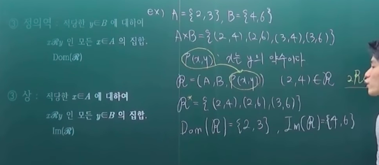
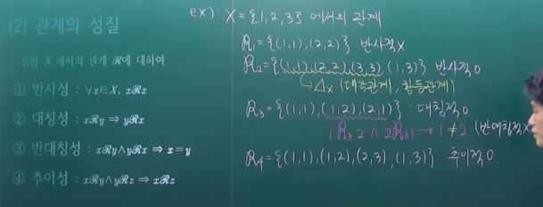
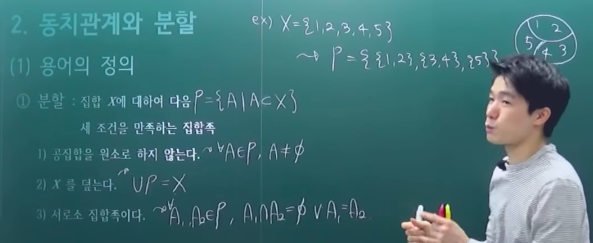
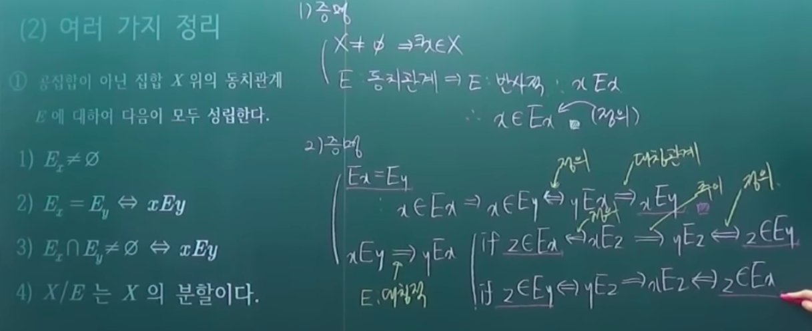
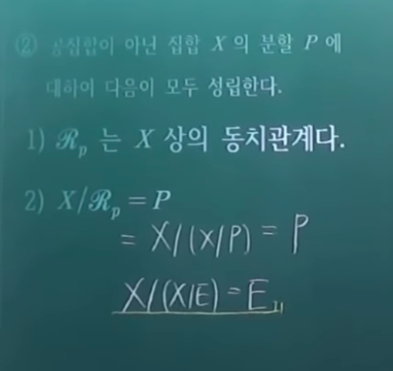
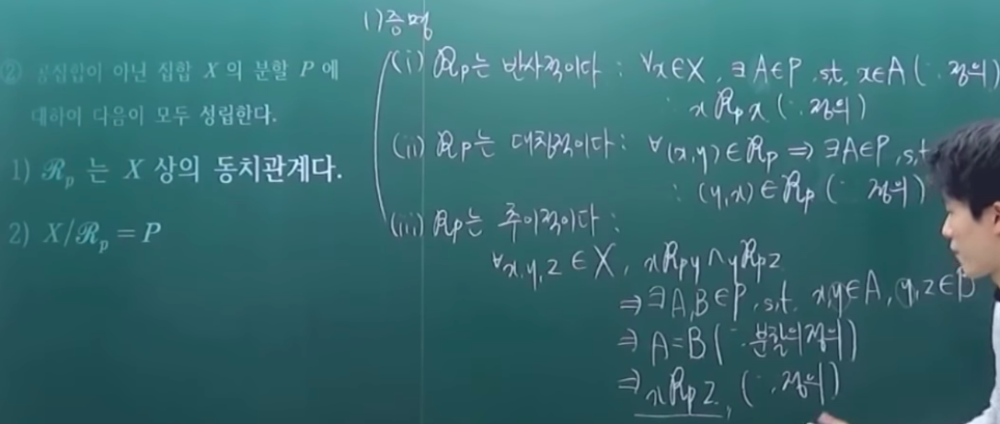
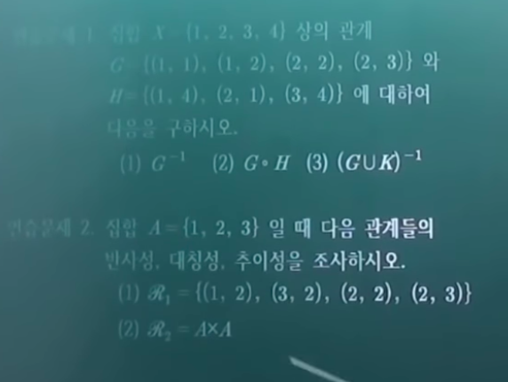
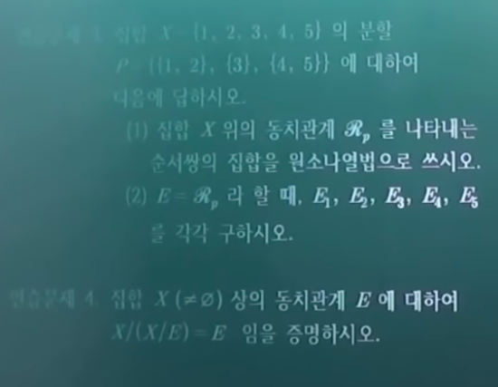

# 관계와 분할

- 관계
  - 용어의 정의
  - 관계의 성질
  - 여러 가지 성질
- 동치관계와 분할
  - 용어의 정의
  - 여러 가지 정리

## 의문

- 반사적 / 대칭적 / 반대칭적 / 추이적 이라는 관계의 성질은 어떻게 발견되어진 것인가?

## 1. 관계

### 1-1. 용어의 정의

- 관계
  - 곱집합 `A x B`의 부분집합
    - 관계도 집합이다!!
    - 관계도 집합과 같이 단순히 곱집합의 원소로서 순서쌍만 나열할 수 있으나, 그 대신에 명제 함수 `P(x, y)`를 정의하여서, 해당 명제함수를 참으로 하는 순서쌍 처럼 집합의 조건제시법과 같이 나타낼 수 있다.
      - 관계의 원소 나열법
        - `(1, 1), (1, 2), ...`
      - 관계의 조건 제시법
        - `m, n ∈ N, m ~ n <=> m+n ∈ N`
  - `R = (A, B, P(x, y)) = R : A -> B; P(x, y)`
    - A에서 B로의 관계
      - A와 B가 같은 집합이면 `A에서의 관계` 라고 함
    - `P(x, y)`는 명제함수
      - 이 명제함수에 의해서 관계가 특정짓게 됨
    - `R = (A, B, P(x, y))`
      - 라는 정의에서 다음과 같이도 표현 가능(`a ~ b`는 a와 b가 특정 동치관계를 만족한다는 뜻)
      - `m,n ∈ Z, m ~ n <=> m-n은 2의 배수이다`
        - `P(m, n) = m-n은 2의 배수이다`
- 관계 R의 해집합
  - `{(x, y)| A에 포함되는 x와, B에 포함되는 y에 대해서 P(x, y)는 참}`
  - e.g
    - `A = {2, 3}, B = {4, 6}`, `A x B = {(2,4), (2,6), (3,4), (3,6)}`
    - 여기서 `P(x, y)` x는 y의 약수
      - `R* = {(2,4), (2,6), (3,6)}`
      - `(2,4)는 R에 속한다 == 2R4`
        - 2는 4에 관계한다
- 정의역
  - 적당한 `y ∈ B` 대해서, `xRy`인 모든 `x ∈ A`의 집합 `Dom(R)`
- 상
  - 적당한 `x ∈ A`에 대하여 `xRy`인 모든 `y 포함 B`의 집합 `Im(R)`

### 1-2. 관계의 성질

- 집합 X 에서의 관계 R에 대하여 주어진 성질을 갖고 있으면 아래의 명칭을 부여
  - 1 반사성
    - `∀x∈X, xRx`
    - 예시
      - `X = {1, 2, 3} R* = {(1, 1), (2, 2)}` 반사적(x)
      - `X = {1, 2, 3} R* = {(1, 1), (2, 2), (3, 3), (1, 3)}` 반사적(o)
    - 어떠한 관계가 반사적으로 되기 위한 최소의 관계는 **대각 관계**, **항등 관계** 라고 함
        - 따라서 어떤 관계가 반사적이라고 하면, 그러한 관계가 대각 관계나 항등 관계를 포함한다는 것과 같다.
  - 2 대칭성
    - `xRy => yRx`
    - 예시
      - `R* = {(1, 1), (1, 2), (2, 1)}` 대칭적(o)
  - 3 반대칭성
    - `xRy ∧ yRx => x=y`
    - 예시
      - `R* = {(1, 1), (1, 2), (2, 1)}` 반대칭적(x)
    - 대칭성을 갖는 관계는 반대칭성을 갖지 않음 / 역도 성립
  - 4 추이성
    - `xRy ∧ yRz => xRz`
    - 예시
      - `R* = {(1,1), (1,2), (2,3), (1,3)}` 추이적(o)

### 1-3 여러 가지 관계

- 1 역관계 `R^-1`
  - `xRy` 이면 오직 그 때에만 `yR^-1x` 즉, `R^-1 = {(y, x)|(x, y)∈R}`
- 2 합성관계
  - 집합 X에서 관계 G와 H에 대하여 합성관계 `H・G`
    - 합성의 순서는 G부터 H
  - `{(x,y)| ∃z, (x,z)∈G ∧ (z,y)∈H}`
  - **역관계와 합성관계에 관한 정리**
    - 집합 X에서r의 관계 F, G, H에 대해서 다음이 모두 성립한다
    - `(F^-1)^-1 = F`
    - `(H・G)・F = H・(G・F)`
    - `(G・F)^-1 = F^-1・G^-1`
- **3 동치관계**
  - 반사적, 대칭적, 추이적인 관계
    - 같다라는 것은 동치관계의 일종
    - 합동도 동치관계의 일종
  - R대신 E로 나타냄
  - 예시
    - `=`
    - `동치`
    - `합동`
    - `닮음`
    - `곱집합`
      - **가장 크기가 큰 동치관계**
    - `대각 관계, 항등관계`
      - **가장 크기가 작은 동치관계**
      - 예시
        - `X = {1, 2, 3} 인 경우 {(1,1), (2,2), (3,3)}`
- 4 순서관계
  - 반사적, 반대칭적, 추이적인 관계
  - 예시
    - `{(1,1), (1,2), (1,3), (2,2), (3,3)}`
      - 순서관계

## 2. 동치관계와 분할

- `X/E = { Ex | x ∈ X } = P`
- `X/P = { (x,y) | ∃A∈P, x,y∈A } = E`

### 2-1 용어의 정의

- 1 분할(`P = X/E = X/~, 여기서 ~는 집합 X위의 동치관계`)
  - 개요
    - 동치관계 `E(~)`에 의하여 정의된 분할
    - 집합 X에 대하여 다음 세 조건을 만족하는 집합족
      - 공집합을 원소로 하지 않는다
        - `∀A∈P, A≠φ`
      - X를 덮는다
        - `UP = X`
      - 서로소 집합이다
        - `∀A1,A2∈P, A1∩A2=φ ∨ A1=A2`
  - 예시
    - `X = {1, 2, 3, 4, 5}`
      - `{{1, 2}, {3, 4}, {5}}`
- 2 동치류
  - 집합 X 상의 하나의 동치관계를 E 라고 할 때, `Ex = { y∈X | xEy }`
    - 혹은 `x∈X, [x] = { z∈Z | z ~ x }`
  - x와 동치인 모든 집합X의 요소를 모아둔 것
- 3 상집합(몫집합 - quotient set)
  - 개요
    - 집합 X 에서의 모든 동치류의 집합족
      - 집합 X에 동치관계 혹은 분할에 의하여 얻은 집합 `X/~`
    - `X/E = X/~ = { E_x | x∈X }`
  - 몫사상
    - 개요
      - `q : X -> X/~, q(x) = [x]`
    - 성질
      - 전사사상
    - 활용
      - 함수 `f : X -> Y`가 다음 조건 `x ~ y => f(x) = f(y)`를 만족한다고 가정하면 새 함수 `f~ : X/~ -> Y, f~([x]) -> f(x)`를 정의할 수 있다.
      - `f~ ・ q = f`가 성립하는 함수 `f~ : X/~ -> Y`가 존재하면 `x ~ y => f(x) = f(y)`를 만족하는 것도 당연하다.
    - 정리
      - 집합 X 및 동치관계 ~ 와 함수 `f : X -> Y`에 대하여 다음은 동치이다
        - `f~ ・ q = f`인 함수 `f~ : X/~ -> Y`가 유일하게 존재한다.
        - `x ~ y => f(x) = f(y)`
  - 예시
    - `X = {1, 2, 3, 4, 5}, E = {(1,1),(2,2),(3,3),(4,4),(5,5),(1,3),(3,1),(2,4),(4,2)}`
      - `E1 = {1,3} = E3`
      - `E2 = {2,4} = E4`,
      - `E3 = {3,1}`,
      - `E4 = {4,2}`,
      - `E5 = {5}`
      - `X/E = {{1,3}, {2,4}, {5}}`
        - `P(분할)`
        - **집합 X의 동치관계를 알면, 분할을 이끌어낼 수 있다.**
- 4 Rp (`= X/p = ~p`)
  - 개요
    - 분할 `P={Xi | i∈I}`에 의하여 정의된 다음 조건을 만족하는 관계
      - `{(x,y) | ∃A∈P, x,y∈A}`
      - `x ~ y <=> x,y ∈ Xi 인 i∈I 가 존재한다`
    - 동치 관계임
  - 예시
    - `X = {1,2,3,4,5}`, `P = {{1,2}, {3,4}, {5}}`
    - `A1 = {(1,1),(1,2),(2,1),(2,2)}`
    - `A2 = {(3,3),(3,4),(4,3),(4,4)}`
    - `A3 = {(5,5)}`
    - `Rp = A1 U A2 U A3 = E`
  - **집합 X의 분할을 알면, 동치관계를 끌어낼 수 있다.**

### 2-2 여러 가지 정리

- 집합 `X`에 의하여 정의된 동치관계 `~`에 대하여
  - `~ = ~(X/~)`이 성립
    - 동치관계 ~에 의해 정의된 X의 분할에 의하여 정의된 동치관계가 그 동치관계와 같다.
  - `∀P, P = X/~p`
    - 분할 P에 의하여 정의된 동치관계 ~p에 의하여 정의된 분할은 분할 P와 같다.
  - `∀x,y∈X, A∈2^X,`
    - `x ~ y <=> x ~(X/~) y`
    - `A ∈ P <=> A ∈ X/~p`

어려움!!

직접 증명해보자. 재미있음.

두 집합이 같다 <=> 한쪽이 다른 한쪽의 부분집합이 되고, 다른 한쪽이 한쪽의 부분집합이 된다.

---

연습문제

