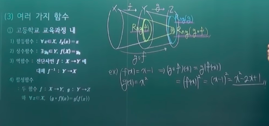

# 함수

- 함수
- 집합의 함수

## 의문

## 1. 함수

### 1-1 함수의 정의

**함수 정의에서는 보통, 정의역, 공역, 함수식으로 이루어짐**

- 함수
  - 다음을 만족하는 X에서 Y로의 관계 `f : X -> Y`
    - `모든 x 포함 X, 어떤 y 포함 Y에 대해서 (x,y) 포함 f`
    - `(x,y1) 포함 f 이고 (x,y2) 포함 f => y1 = y2`
  - 모든 x에서 하나의 y에 대응해야 함
    - 함수의 정의에 부합하지 않지만, 함수라고 부르는 것도 있음
  - `(x,y) 포함 f` 는 `y=f(x)`로도 쓴다.
  - 함수 `f : X -> Y`에서 `y = f(x)`일 때
    - y를 f에 의한 x의 상
    - x를 f에 의한 y의 원상
    - X를 f의 정의역 `Dom(f)`
    - Y를 f의 공역(codomain)
    - `{f(x) | x 포함 X} = f(X)`를 f의 치역 `Rng(f)`
  - **함수식이 같아도 정의역이 다르면 다른 함수다**
    - `f(x)=x^2, Dom(f)=R`
    - `g(x)=x^2, Dom(g)=C`
    - `f ≠ g`
    - **함수식이 다른것과 함수가 다른것을 명확히 구분하자**
- 함수 `f : X -> Y`에 대하여 A 부분집합 X 일때
  - `f|A` 는 X를 A로 축소한 함수
    - `{(x,y) 포함 f | x 포함 A}`
  - `g=f|A` 이면 f는 g의 A에서의 확대함수

### 1-2 함수의 성질

- 함수 `f : X -> Y`
  - 전사(unt, surjective)
    - `Rng(f) = Y`
      - `Rng(f) = {f(x)| x 포함 X} = Y`
      - `모든 y 포함 Y, 어떤 x 포함 X, f(x) = y`
    - 치역과 공역이 같음
  - 단사(int, injective)
    - `x1 ≠ x2 포함 X => f(x1) ≠ f(x2)`
    - 공역의 하나의 y는 하나의 x에만 대응되어야 함
  - 전단사
    - 전사이고 단사인 함수
    - **일대일 대응**

### 1-3 여러 가지 함수

수학에서는 엄청나게 다양한 함수가 존재한다.

- 고등학교 교육과정 내
  - 항등함수
  - 상수함수
  - 역함수
    - 모든 y가 x를 하나씩 가짐
      - 모든 y가 => 전사의 성질
      - x를 하나씩 => 단사의 성질
    - 전단사인 `f : X -> Y`에 대해 `f^-1 : Y -> X`
  - 합성함수
    - 두 함수 `f : X -> Y`, `g : Y -> Z`와 `모든 x 포함 X, (g・f)(x) = g(f(x))`
    - 아래의 합성함수의 성질을 잘 공부해두자

- 고등학교 교육과정 외
  - 집합 A(≠공집합)가 A 부분집합 X일 때
  - 포함함수
    - `모든 x 포함 A, i : A -> X`가 `i(x) = x (포함 A)`
    - 항등함수의 축소함수
      - 항등함수에서 정의역이 줄어든 것(X에서 A로)
  - 특성함수(지시 함수) Characteristic function
    - `모든 x 포함 X, 카이A : X -> {0, 1}`가 `카이A(x) = { 1 (z 포함 A) 혹은 0 (z 포함안함 A)}`
    - 어떤 값이 특정 집합에 포함되는지 아닌지
    - 조합론 확률론 해석학에서 많이 쓰임
  - 선택함수
    - 집합 X(≠ 공집합)의 부분집합들의 집합족을 `{Ai}`이라 할 때 `모든 i 포함 I`에 대해서 `f(Ai) 포함 Ai`로 정의되는 함수 `f : {Ai} -> X`
    - 선택 공리에서 매우 중요하게 쓰이는 함수

### 함수의 여러 가지 정리

**수학적 명제를 증명할 때에는 수식과 수학적 기호를 사용해서 증명하자**

**항상 정의에서 시작하자**

- 함수 `f`에 대하여 역함수 `f^-1`가 존재하면 `f`는 전단사이다.
  - 전사
  - 단사
- 합성함수 `g・f`가 단사이면 `f`는 단사이고, `g・f`가 전사이면 `g`는 전사이다.
- 정수집합 `Z`과 자연수집합 `N`사이에는 일대일 대응이 존재한다.
  - **어떻게 함수를 세팅할 것인가?**
  - 전사
  - 단사

## 2. 집합의 함수

정의역의 부분집합을 함수에 대응시켜서 다루는 확장된 개념의 함수

### 2-1 개념과 정의

- 함수 `f : X -> Y`에서 `A 부분집합 X`이고, `B 부분집합 Y`일 때 다음이 성립한다
  - f에 대한 A의 상
    - `f(A) = { f(x) 포함 Y | x 포함 A }`
  - f에의한 B의 역상
    - `f^-1(B) = { x 포함 X | f(x) 포함 B } 부분집합 X`
      - *애초에 `f^-1`이 존재하는 조건 <=> f는 전단사 함수 가 아닌지?*
      - 우리는 역함수를 생각하는 것이 아니라, 역상을 생각하는 것임

### 2-2 여러 가지 정리

> 증명이 어떠한 흐름으로 가고 있는가를 파악. 증명을 어떠한 의도로 어떠한 방향을 잡고, 그 흐름을 이어 나아가는가.

> 직관력을 귀납적으로 키우자. 자신이 직접 여러가지 사례를 만들어봐서 정리의 구체적 사례를 느껴보자. 구체적 사례를 4-5개 정도만 만들어보세요.

- 함수 `f : X -> Y`에서 `A 부분집합 X`이고 `B 부분집합 Y`일 때 다음이 성립한다
  - `f(공집합) = 공집합`
  - `모든 x 포함 X, f({x}) = {f(x)}`
  - `f^-1(f(A)) = A <=> f는 단사`
    - *f^-1은 역함수이고 이것이 이미 존재한다고 가정하고 있는데, 그럼 당연히 f는 단사가 아닌가?*
  - `f(f^-1(B)) = B <=> f는 전사`

---

이제는 정의역의 부분집합족을 함수에 대응시켜서 다루는 함수의 확장

- 함수 `f : X -> Y`에 대하여 `{Aα | α ∈ I}`를 X의 부분집합족이라 하면 다음이 성립
  - `f(Uα∈I Aα) = Uα∈I f(Aα)`
  - `f(∩α∈I Aα) ⊆ ∩α∈I f(Aα)`
  - f가 단사이면 `f(∩α∈I Aα) = ∩α∈I f(Aα)`
