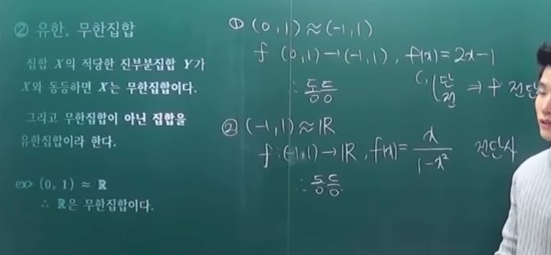
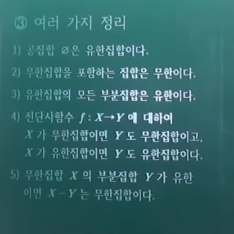
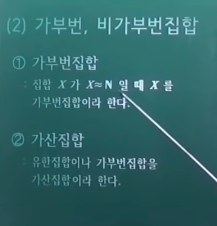
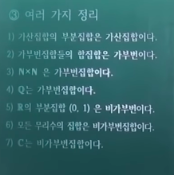

# 집합의 크기

- 집합의 분류
  - 유한, 무한집합
    - 동등
    - 유한, 무한집
    - 여러 가지 정리
  - 가부번, 비가부번집합
    - 가부번집합
    - 가산집합
    - 여러 가지 정리
- 기수
  - 기수의 개념
  - 기수의 연산
  - 기수의 지수

## 의문

- *집합의 크기와 집합의 원소의 개수의 차이는?*
- *2차원 실수 공간의 점의 개수와 1차원 실수 공간의 점의 개수는 다르다?!*

## 1. 집합의 분류

### 1-1 유한, 무한집합

- 동등(equipotent)
  - 두 집합 X, Y에 대하여 전단사함수 `f : X -> Y`가 존재하면 X와 Y는 동등이다
    - X라는 집합의 크기와 Y라는 집합의 크기가 둘다 무한집합이어도 일대일 대응이라면 크기는 같다.
    - c.f) 유한 vs 무한
      - 유한
        - 유한집합 X, Y가 일대일 대응 => 두 집합의 크기가 같다
        - 유한집합 X, Y가 일대일 대응 => 두 집합의 원소의 개수가 같음
      - 무한
        - 무한집합 X, Y가 일대일 대응 => 두 집합의 크기가 같다
        - 집합의 전체 개수를 파악하는 것이 비합리적
  - `X ~~ Y`또는 `f : X ~~ Y`
    - 위로 두줄짜리 물결
  - 동치관계의 일종

- 유한, 무한집합
  - 무한집합
    - 집합 X의 적당한 진부분집합 Y가 X와 동등하면 X는 무한집합이다.
  - 유한집합
    - 무한집합이 아닌 집합
  - 예시
    - `(0, 1) ~~ R(실수의 집합)`
    - ∴ R은 무한집합이다.

- 여러 가지 정리
  - 공집합은 유한집합이다.
  - 무한집합을 포함하는 집합은 무한이다.
  - 유한집합의 모든 부분집합은 유한이다.
  - 전단사함수 `f : X -> Y`에 대하여
    - X가 무한집합이면 Y도 무한집합이고, X가 유한집합이면 Y도 유한집합이다.
  - 무한집합 X의 부분집합 Y가 유한이면 X - Y는 무한집합이다.
- **직접 증명해보자!!**

### 1-2 가부번, 비가부번집합

> 무한집합의 급을 나누는 기준

- 가부번집합(enumerable set)
  - 번호를 붙일 수 있는 집합
    - 무한집합에서 쓰이는 용어
  - 집합 X가 `X ~~ N`일 때, X를 가부번집합이라고 함
    - 자연수 집합과 같은 크기를 갖는 집합
  - 예시
    - 자연수의 집합
      - 1다음에는 2, 3, 4, 와 같이 번호를 붙일 수 있음
    - 실수의 집합
      - 1다음에 오는 수는 무엇이냐
      - 어떠한 실수와 다른 실수 사이에는 무한히 많은 실수가 존재
- 비가부번집합
  - 번호를 붙일 수 없는 집합
  - 실수의 집합과 같은 크기를 갖는 집합
- 가산집합(countable set)
  - 유한집합이나 가부번집합을 가산집합이라 함

- 여러 가지 정리
  - 가산집합의 부분집합은 가산집합이다.
  - 가부번집합들의 합집합은 가부번이다.
  - `N x N`은 가부번집합이다.
  - Q는 가부번집합이다.
  - R의 부분집합 (0, 1)은 비가부번이다.
  - 모든 무리수의 집합은 비가부번집합이다.
  - C는 비가부번집합이다.

**가부번과 비가부번의 경계를 기억하자**

**가부번과 가부번을 연산했을 때, 반드시 가부번 집합이 된다고 할 수 없다**

**비가부번 집합이 집합의 연산에 사용 된다 하더라도, 가부번 집합이 되는 경우가 존재한다.**

## 2. 기수
