# 집합의 크기

- 집합의 분류
  - 유한, 무한집합
    - 동등
    - 유한, 무한집합
    - 여러 가지 정리
  - 가부번, 비가부번집합
    - 가부번집합
    - 가산집합
    - 여러 가지 정리
- 기수
  - 기수의 개념
  - 기수의 연산
  - 기수의 지수

## 의문

- *집합의 크기와 집합의 원소의 개수의 차이는?*
- *2차원 실수 공간의 점의 개수와 1차원 실수 공간의 점의 개수는 다르다?!*

## 1. 집합의 분류

### 1-1 유한, 무한집합

- 동등(equipotent)
  - 두 집합 X, Y에 대하여 전단사함수 `f : X -> Y`가 존재하면 X와 Y는 동등이다
    - X라는 집합과 Y라는 집합이 둘다 무한집합이어도 일대일 대응이라면 그 크기는 같다.
    - c.f) 유한 vs 무한
      - 유한
        - 유한집합 X, Y가 일대일 대응 => 두 집합의 크기가 같다
        - 유한집합 X, Y가 일대일 대응 => 두 집합의 원소의 개수가 같음
      - 무한
        - 무한집합 X, Y가 일대일 대응 => 두 집합의 크기가 같다
        - 집합의 전체 원소의 개수를 파악하는 것이 비합리적
  - `X ~~ Y`또는 `f : X ~~ Y`
    - 위로 두줄짜리 물결
  - **동치관계**
    - 반사적
    - 대칭적
    - 추이적
- 동등 증명 전략
  - 동등은 동치관계임을 이용
    - 예시
      - `N ~~ Q`임을 보이기 위하여 `N ~~ N x N`임을 보이고, `N -> Q`인 단사함수가 존재함을 보이고 `Q -> NxN`인 단사함수가 존재함을 보이면 된다.(`∵ Q -> NxN 이 존재 => Q -> N 이 존재`)

- 유한, 무한집합
  - 무한집합
    - 집합 X의 적당한 진부분집합 Y가 X와 동등하면 X는 무한집합이다.
  - 유한집합
    - 무한집합이 아닌 집합
  - 예시
    - `(0, 1) ~~ R(실수의 집합)`
      - **이를 증명할 때, 주어진 구간에서의 그래프를 생각해보면 좋음**
      - 임의의 두 선분 사이에는 항상 전단사 함수가 존재
        - 두선분을 평행하게 두고 끝점의 연장선을 그어서 만나는 점을 O라고 하면 명확
    - ∴ R은 무한집합이다.

- 여러 가지 정리
  - 공집합은 유한집합이다.
  - 무한집합을 포함하는 집합은 무한이다.
    - **증명은 알기 쉬운 집합론 책에 있음**
  - 유한집합의 모든 부분집합은 유한이다.
  - 전단사함수 `f : X -> Y`에 대하여
    - X가 무한집합이면 Y도 무한집합이고, X가 유한집합이면 Y도 유한집합이다.
  - 무한집합 X의 부분집합 Y가 유한이면 X - Y는 무한집합이다.
- **직접 증명해보자!!**

### 1-2 가부번, 비가부번집합

> 무한집합의 급을 나누는 기준

- 가부번집합(enumerable set)
  - 번호를 붙일 수 있는 집합
    - 무한집합에서 쓰이는 용어
  - 집합 X가 `X ~~ N`일 때, X를 가부번집합이라고 함
    - 자연수 집합과 같은 크기를 갖는 집합
  - 예시
    - 자연수의 집합
      - 1다음에는 2, 3, 4, 와 같이 번호를 붙일 수 있음
    - 실수의 집합은 비가부번집합
      - 1다음에 오는 수는 무엇이냐
      - 어떠한 실수와 다른 실수 사이에는 무한히 많은 실수가 존재
        - 실수의 완비성 등등 참고
- 비가부번집합
  - 번호를 붙일 수 없는 집합
  - 실수의 집합과 같은 크기를 갖는 집합
- 가산집합(countable set)
  - 유한집합이나 가부번집합을 가산집합이라 함

- 여러 가지 정리
  - 가산집합의 부분집합은 가산집합이다.
  - 가부번집합들의 합집합은 가부번이다.
  - `N x N`은 가부번집합이다.
  - Q는 가부번집합이다.
  - R의 부분집합 (0, 1)은 비가부번이다.
    - 가부번집합 사이에 단사 함수를 적용하면 그 함수는 전단사가 된다.
  - 모든 무리수의 집합은 비가부번집합이다.
  - C는 비가부번집합이다.

**가부번과 비가부번의 경계를 기억하자**

**가부번과 가부번을 연산했을 때, 반드시 가부번 집합이 된다고 할 수 없다**

**비가부번 집합이 집합의 연산에 사용 된다 하더라도, 가부번 집합이 되는 경우가 존재한다.**

## 2. 기수

### 2-1 기수의 개념

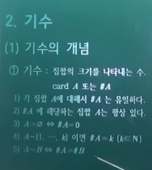

- 기수(cardinal number)
  - 집합의 크기를 나타내는 수
  - 다양한 정의가 있음
    - 동치류에 의한 정의
    - 폰노이만에 의한 정의
  - `card A` 또는 `#A`
  - 성질
    - 각 집합 A에 대해서 `#A`는 유일하다
    - `#A`에 해당하는 집합 A는 항상 있다
    - `A = 공집합 <=> #A = 0`
    - `A ~ [1, ..., k] 이면 #A=k (k ∈ N)`
      - `~`은 동등
    - `A ~ B <=> #A = #B`

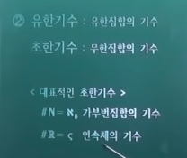

- 유한기수
  - 유한집합의 기수
- 초한기수
  - 무한집합의 기수
  - 예시
    - `#N = 알레프0` 가부번집합의 기수
    - `#R = ζ(시그마)` 연속체(실수집합)의 기수

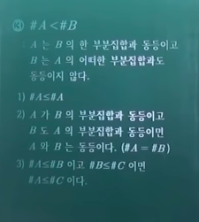

- `#A < #B`
  - A는 B의 한 부분집합과 동등이고 B는 A의 어떠한 부분집합과도 동등이지 않다.
  - 성질
    - `#A ≦ #A`
    - A가 B의 부분집합과 동등이고 B도 A의 부분집합과 동등이면, A와 B는 동등이다.
      - **칸토어 번슈타인 정리**
      - 수학전공자는 반드시 증명을 외우고 있어야 한다!
    - `#A ≦ #B`이고 `#B ≦ #C`이면 `#A ≦ #C`이다.

### 2-2 기수의 연산

기수도 자연수와 닮아서 어느정도 연산을 할 수 있더라

- 기수의 합
  - 서로소인 두 집합 A, B의 기수를 각각 a, b 라고 할 때, `a + b = #(A U B)`
- 기수의 곱
  - 집합 A, B의 기수를 각각 a, b 라고 할 때 `ab = #(A x B)`
- 연산 법칙
  - 임의의 기수 x, y, z에 대하여 다음이 성립한다.(증명은 생략)
  - 교환법칙
    - `x + y = y + x`
    - `xy = yx`
  - 결합법칙
    - `(x + y) + z = z + (y + z)`
    - `(xy)z = x(yz)`
  - 분배법칙
    - `x(y + z) = xy + xz`
- **여러 가지 정리**
  - `알레프0 + 알레프0 = 알레프0`
  - `ς + ς = ς`
  - `알레프0 + ς = ς`
  - `알레프0 * 알레프0 = 알레프0`
  - `ς * ς = ς`
  - `알레프0 * ς = ς`
  - 결론적으로, 알레프0끼리 곱하고 더하면 알레프0, 연산 속에 시그마(연속체의 기수)가 들어가면 결과는 무조건 시그마

> 기수들에 해당하는 무한집합의 개념을 떠올리고, 연산의 결과들을 집합들의 개념으로 연관시켜서 생각하는 것이 중요함.

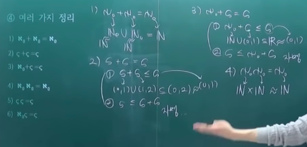

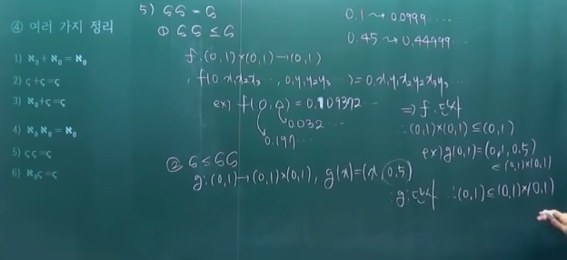

- 기수의 연산은 실수의 연산과 혼동을 하는 경우가 많음.
  - "기수의 연산과 실수의 연산은 같다"의 반례
    - `알레프0 + 알레프0 = 알레프0 = 알레프0 + 1 => 알레프0 ≠ 1`
    - `알레프0 * 알레프0 = 알레프0 = 알레프0 * 1 => 알레프0 ≠ 1`

### 2-3 기수의 지수

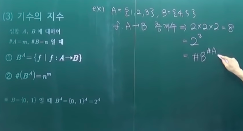

- 집합 A, B에 대하여 `#A = m`, `#B = n`일 때
  - `B^A = { f | f : A -> B }`
    - 지수 A에서 밑 B로 가는 함수들의 집합 `B^A`
  - `#(B^A) = n^m`

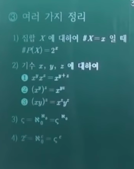

- 여러 가지 정리
  - 집합 X에 대하여 `#X = x`일 때, `#P(X) = 2^x`
  - 기수 x, y, z에 대하여
    - `x^y * x^z = x^(y+z)`
      - Y에서 X로 가는 함수의 개수 * Z에서 X로 가는 함수의 개수 = Y ∪ Z 에서 X로 가는 함수의 개수
      - *근데 위의 경우는 Y, Z가 서로소집합이어야만 가능한 것 아닌가?*
    - `(x^y)^z = x^(yz)`
    - `(xy)^z = x^zy^z`
  - `ς = 알레프0 ^ 알레프0 = ς^알레프0`
    - 이 정리가 어떻게 생각을 확장시킬 수 있을까? 하는 것을 생각해보자
  - `2^c = 알레프0 ^ c = ς ^ c`
    - 실수 집합의 멱집합
    - 기수를 지수로 올려주면 더 큰 집합으로 확장시켜 나갈 수 있음

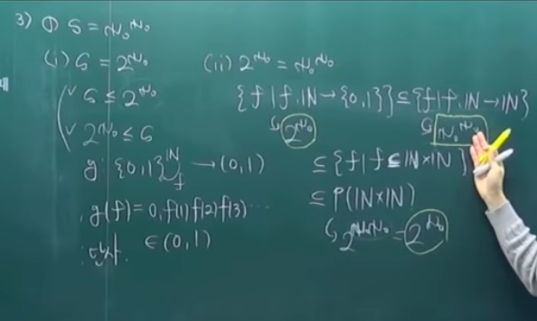

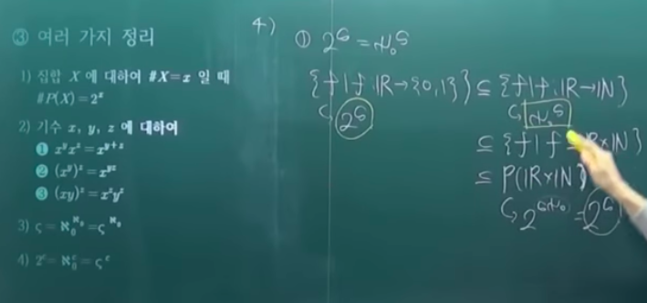

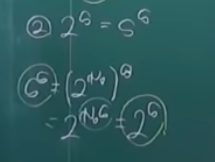

---

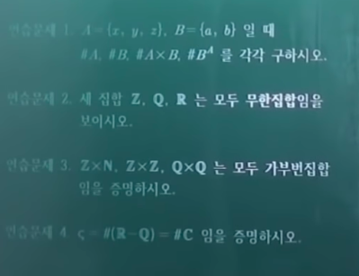

- 보이시오 -> 쉬운 문제
- 증명하시오 -> 어려운 문제
