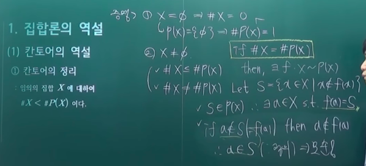

# 연속체 가설

- 집합론의 역설
  - 칸토어의 역설
  - 러셀의 역설
- 공리적 집합론
  - ZFC
  - 그 외의 집합론
- 연속체 가설
  - 정의
  - ZFC 와의 관계
  - 다른 공리와의 관계

## 1. (소박한)집합론의 역설

### 1-1 칸토어의 역설

- 칸토어의 정리
  - 임의의 집합 X에 대하여 `#X < #P(X)`이다.

- 칸토어의 역설
  - 모든 집합들의 집합을 `U`, 그 기수를 `#U = K`라고 하자.
  - 그러면 칸토어의 정리에 따라서 `U`의 멱집합의 기수 `#P(U)`는 `#P(U) = 2^K > K = #U`이지만, 이는 `#U ≧ #P(U)` 이어야 하는 가정에 모순

### 1-2 러셀의 역설(1901?)

이발사의 역설

- 모든 집합들의 집합을 `U`라고 하자.
- 그러면 `S = {A ∈ U | A !∈ A}` 은 하나의 집합이 된다.
- 만약 `S ∈ S`라고 하자. 그러면 S의 정의에 의해 `S !∈ S`이다.
- 만약 `S !∈ S`이라고 하자. 그러면 S의 정의에 의해 `S ∈ S`이다.
- 따라서 U는 존재하지 않는다.

애초에 모든 집합들의 집합이라는 것은 존재하지 않는다.

- 두 역설의 의의
  - 집합론이 허술했다는 것을 보임
    - 집합이 될 수 있는것의 대상이 수학적으로 엄밀하게 정의되지 못했음을 증명

## 2. 공리적 집합론(Axiomatic Set Theory)

- 공리
- 공리꼴
  - 하나의 명제이나, 그 명제로부터 무수히 많은 공리들이 동시적으로 함의하게 되는 공리의 꼴
- 공리계

### 2-1 ZFC(Zermelo–Fraenkel set theory with the axiom of Choice)

- 현대 수학의 표준적인 수학기초론으로, 다음 10가지 공리 및 공리꼴을 가지고 집합론을 구성한다.
  - 확장공리, 짝공리, 공집합공리, 무한공리, 합집합공리, 멱집합공리, 분류공리풀
    - Zermelo
  - 정착성공리, 치환공리꼴
    - 폰노이만
    - Fraenkel
  - 선택공리
    - 폰노이만

서로 독립적인 공리들을 선택하는 것이 생각보다 쉽지 않음

- 보존적 확장
  - 공리를 추가하므로써, 기존에 공리로 부터 도출된 모든 정리를 만족하고 그 위에 새로운 정리들을 추가할 수 있는 확장
  - 무모순적
    - 공리계 사이의 관계(충돌이 있는가)
- 공리계를 만들 떄에는 기존의 공리계와의 관계를 잘 확인해야 한다.

### 2-2 그 외의 집합론

- NBG
  - 폰노이만, 베르나이스, 괴델
  - ZFC의 보존적 확장 형태로
  - 고유 모임(proper class - 집합의 상위개념 - 집합으로 분류되지 않는 수학적 대상)을 포함하는 집합론
    - ZFC에서 참인 명제들을 그대로 가져오면서 더 확장됨
    - 모임 존재 정리
- MK
  - 모스, 켈리
  - ZFC의 보존적 확장 형태
  - NBG에서 재귀적 정의를 허용한 집합론
    - 순환논리와 다름

## 3. 연속체 가설

### 3-1 정의

- 칸토어의 연속체 가설(힐베르트의 23문제 1번문제)
  - 두 초한기수 `알레프0`과 `ς`에 대하여 `알레프0 < x < ς`를 만족하는 기수 x는 존재하지 않는다.
- 일반화 연속체 가설
  - 임의의 초한기수 K(Kappa)에 대하여, `K < x < 2^K`를 만족하는 기수 `x`는 존재하지 않는다.

### 3-2 ZFC 와의 관계

- **연속체 가설은 ZFC와 독립적이다.**
  - ZFC의 공리들과 독립적
- 즉, ZFC에서는 연속체 가설을 증명할 수도, 반증할 수도 없다.
  - 반증할 수 없다
    - 괴델
  - 증명할 수 없다
    - 폴 코헨
    - forcing 기법

그럼 연속체가설을 ZFC에 공리로 추가시키면 되는것 아니냐? No!

수학의 자유도를 해친다.

수학자의 공리계에 따라서는 연속체 가설을 받아들이고 논리를 전개하는 것도 있고 받아들이지 않고 논리를 전개하는 것도 있다.

### 3-3 다른 공리와의 관계

- 구성 가능성 공리
  - ZFC에 구성 가능성 공리를 추가하면 일반화 연속체 가설이 참이다.
- 고유 강제법 공리
  - 고유 강제법 공리를 가정하면, 칸토어의 연속체 가설은 거짓이다.
