# 집합의 순서

- 부분순서집합
  - 정의
  - 상한과 하한
  - 절편과 절단
  - 순서동형
- 전순서집합
  - 전순서집합
  - 쇄
  - 정렬집합
- 서수
  - 서수의 개념
  - 서수의 순서
  - 서수의 연산

## 의문

- 부분순서집합은 그림으로 나타냈을 시에 그래프이론의 트리구조와 같은가?
  - 그렇지 않다. 폐로(회로)가 존재함
- *극대원소의 정의가 이해가 안감*

## 1. 부분순서집합

### 1-1 정의

- 순서관계
  - `∀x∈X => x <= x`
  - `x<=y ∧ y<=x => x=y`
  - `x<=y ∧ y<=z => x<=z`
- 부분순서관계(partial order relation)
  - 개요
    - **반사적, 반대칭적, 추이적인 관계**
    - 우리가 순서로 생각하는 거의 모든것들이 위의 조건을 만족하고 있음
  - 예시
    - 두 집합 A, B에 대하여 `A⊆B`
      - `A⊆A, A⊆B ∧ B⊆A => A=B, A⊆B ∧ B⊆C => A⊆C`
    - 두 실수 x, y에 대하여 `x≦y`
      - `x<=x, x<=y ∧ y<=x => x=y, x<=y ∧ y<=z => x <= z`
    - 두 자연수 n, m에 대하여 `n이 m의 배수인 관계`

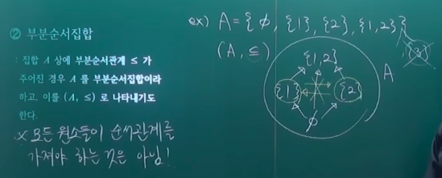

- 부분순서집합
  - 개요
    - 집합 A 상에 부분순서관계 `<=`가 주어진 경우 A를 부분순서집합이라고 하고, 이를 (A, <=)로 나타내기도 한다.
    - 모든 원소들이 순서관계를 가져야 하는 것은 아님
  - 예시
    - `A = {φ, {1}, {2}, {1,2}}`
      - `(A, <=)`
      - 화살표를 이용해서 순서관계 정의

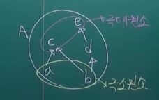

- **극대원소(maximal element)와 극소원소(minimal element)**
  - 개요
    - A가 부분순서집합이라 할 때
      - 극대원소
        - `∀x∈A, a<=x => x=a`를 만족하는 A의 원소 a
        - 정의가 이해감
      - 극소원소
        - `∀x∈A, x<=b => x=b`를 만족하는 A의 원소 b
    - 유일하지 않음!!
    - 유한집합에서 적용가능
      - 무한집합에서는 적용 불가능
        - (0, 1)
  - 예시
    - 멱집합 `P(X)`에서 `φ`, `X`
- 최대원소와 최소원소
  - 개요
    - A가 부분순서집합이라 할 때
      - 최대원소
        - `∀x∈A, x<=a`를 만족하는 A의 원소 a
      - 최소원소
        - `∀x∈A, x>=b`를 만족하는 A의 원소 b

### 1-2 상한(Supremum)과 하한(Infimum)

유한집합의 극대 / 극소의 개념을 무한집합에서 보완하기 위한 개념

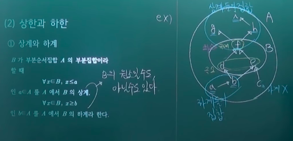

- 상계(Upper Bound)와 하계(Lower Bound)
  - 개요
    - B가 부분순서집합 A의 부분집합이라 할 때
      - B의 상계
        - `∀x∈B, x<=a`인 `a∈A`
      - B의 하계
        - `∀x∈B, x>=b`인 `b∈A`
    - 상계 하계는 B의 원소일 수 있고 아닐 수 있음
- 유계
  - 상계가 있는 부분집합은 위로 유계라고 하고
  - 하계가 있는 부분집합은 아래로 유계라고 함

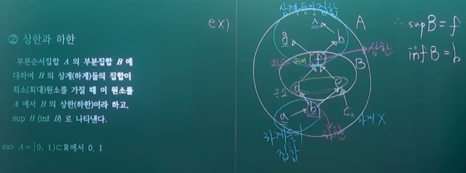

- 상한과 하한
  - 개요
    - 부분순서집합 A의 부분집합 B에 대하여 B의 상계(하계)들의 집합이 최소(최대)원소를 가질 때, 이 원소를 A에서 B의 상한(하한)이라 하고, `sup B (inf B)`로 나타낸다.
    - 무한집합에서도 아래로유계, 위로유계일 때, 각각의 하계 상계의 최대 최소를 갖고 있으면 상한과 하한을 이야기 할 수 있음
  - 엄밀한 조건
    - 순서집합 X의 부분집합 `S⊆X`와 한 원소 `a∈X`가 다음 두 조건을 만족하면 a를 S의 최소상계 혹은 상한이라고 함
      - `a는 S의 상계`
        - `x∈S => x <= a`
      - `b가 S의 상계 => a <= b`
        - `(∀x∈S, x <= b) => a <= b`
    - 위의 두 조건으로 인하여, 상한은 오직 하나밖에 존재하지 않음
  - 예시
    - `A=(0, 1)⊂R`
      - `sup (0,1) = 1`
      - `inf (0,1) = 0`
    - `X의 멱집합 P(X)에 포함관계에 의한 순서를 부여, A<=B <=> A⊆B`집합족 `F⊆P(X)`가 주어졌을 때
      - `sup(F) = UF`
      - `inf(F) = ∩F`

#### c.f) 격자와 완비격자와 이항연산

- 순서집합 `X`의 두 원소 `x,y∈X`에 대하여 `x v y = sup{x,y}`, `x ∧ y = inf{x,y}` 일 때
  - 격자
    - 임의의 두 원소 `x,y∈X`에 대하여 `x v y`및 `x ∧ y`가 존재하면 X를 격자라고 함
    - `{x,y}`역시 부분집합
  - 완비격자
    - 임의의 부분집합이 상한과 하한을 가지는 경우
    - 성질
      - `x <= x v y, y <= x v y`
        - 상한 조건 1
      - `(x <= z ∧ y <= z) => x v y <= z`
        - 상한 조건 2
  - 이항연산
    - `f : X x X -> X`
    - 예시
      - 자연수의 더하기, 곱하기

#### 이항연산

-

### 1-3 절편(Initial Segment)과 절단(Cut)

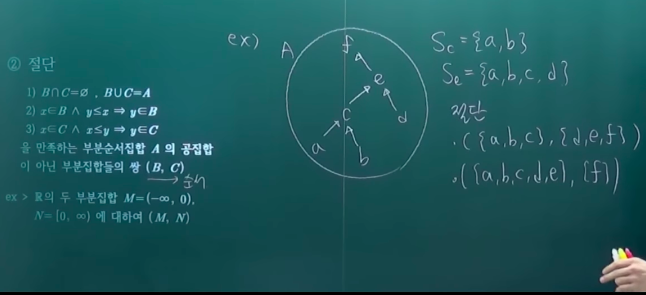

- 절편
  - 개요
    - 부분순서집합 A의 원소 a 에 대하여 `Sa = {x∈A | x<a}`
      - 부분순서집합에서 a보다 작은 원소들을 싹 다모은 집합
  - 예시
    - `R`의 절편 `S0 = (-∞, 0)`
    - `N`의 절편 `S3 = {1, 2}`
- 절단(분할과 비슷한 개념)
  - 개요
    - `B∩C=φ, BUC=A`
    - `x∈B ∧ y<=x => y∈B`
    - `x∈C ∧ x<=y => y∈C`
    - 위의 세 조건을 만족하는 부분순서집합 A의 공집합이 아닌 부분집합들의 쌍 `(B, C)`
  - 예시
    - R의 두 부분집합 `M=(-∞, 0)`, `N=[0, ∞)`에 대하여 `(M, N)`

### 1-4 순서동형

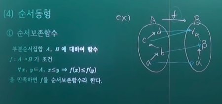

- 순서보존함수(Order preserving function)
  - 개요
    - 부분순서집합 A, B에 대하여 함수 `f : A -> B`가 조건 `∀x,y∈A, x<=y => f(x)<=f(y)`를 만족하면 `f`를 순서보존함수라 한다.

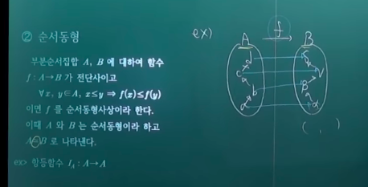

- 순서동형
  - 개요
    - 부분순서집합 A, B에 대하여 함수 `f : A -> B`가 전단사이고, `∀x,y∈A, x<=y => f(x)<=f(y)`이면 f를 **순서동형사상** 이라 한다.
    - 이 때, A와 B는 **순서동형** 이라 하고 `A~-B`로 나타낸다.
  - 특성
    - 동치관계의 일종
  - 예시
    - 항등함수 `IA : A -> A`

## 2. 전순서집합

### 2-1 전순서집합

- 비교가능
  - 개요
    - 부분순서집합 `A`의 두 원소 `x`, `y`가 `x <= y ∨ y <= x`이면 x와 y는 비교가능하다고 한다.
    - **여기에 나오는 <= 기호는 단순히 작다는 것이 아니고, 순서에 관한 기호임**
- 전순서집합(totally ordered set -> 토셋(t-o-set)이라고 부름)
  - 개요
    - 부분순서집합 A의 임의의 두 원소가 비교가능하면 A를 전순서집합이라고 한다.
  - 예시
    - `(N, <=)`
    - `((0,1), <=)`
    - `(N, <)`는 안됨!

### 2-2 쇄

- 개요
  - 부분순서집합 A의 전순서 부분집합 B를 A에서의 쇄라고 한다.

### 2-3 정렬집합(Well-ordered-set)

- 개요
  - 부분순서집합 A의 공집합이 아닌 모든 부분집합 B가 **최소원소** 를 가지면, 그리고 그 때에만 집합 A를 정렬집합이라 한다.
    - 정렬을 한다 => 첫번쨰오는 원소를 기준으로 정렬하자 => 그것이 최소원소
    - 부분집합을 어떻게 잡는다 하더라도 반드시 최소원소가 존재해야 함
  - 정렬집합 => 전순서집합
- 예시
  - `((0, 1), <=)`
    - 전순서집합이나, 정렬집합은 아님
  - `(N, <=)`
    - 전순서집합이고, 정렬집합임

## 3. 서수(Ordinal number)

### 3-1 서수의 개념

- 서수(순서수)
  - 개요
    - **집합의 길이를 나타내는 수**
      - 구체적인 정의는 여기서 다루지 않음
    - 기수와 서수의 가장 큰 차이
      - 구조가 들어가는가 아닌가
  - 특성
    - 모든 정렬집합 A에 대하여 서수가 존재하며, 모든 순서수 a에 대하여 `ord(A) = o(A) = a`인 정렬집합 A가 존재한다
    - `A~-B <=> o(A)=o(B)`
    - `A=φ <=> o(A)=0`
    - `A={1,2,...,k} <=> o(A) = k`
- 유한서수 / 초한서수
  - 유한서수
    - 유한정렬집합의 서수
  - 초한서수
    - 무한정렬집합의 서수
    - 어떤 한 집합이 다른 한 집합과 순서동형이면 어떤 집합의 서수와 다른 한 집합의 서수는 같다
    - 예시
      - `w = o(N)` 자연수집합의 서수
      - `=o({0, 1, 2, ...})`
      - `=o({2, 4, 6, ...})`

### 3-2 서수의 순서

- 개요
  - 정렬집합 A, B에 대하여 `o(A) = a`, `o(B) = b`일 때 A가 B의 절편과 순서동형이면 a는 b보다 작거나 같다고 하며, `a<=b`(<날카로운 <)로 나타내고, 이 때 특히 `a≠b`이면 `a<b`로 나타낸다
- 특징
  - A라는 집합에 순서구조를 넣으면, 서수가 나옴. 그런식으로 모여진 서수들로 집합을 만들면 서수는 comparable하므로 그러한 집합도 서수가 존재. 서수들의 집합의 서수또 존재
    - 비가산무한서수 = 오메가1 = 알레프1
- 예시
  - `A={1}, B={3,4,5}`일 때, `o(A) = 1 < o(B) = 3`

### 3-3 서수의 연산

- 서수 합
  - 개요
    - 서로소인 두 집합 A, B의 서수를 각각 a, b라고 할 때, `a+b=o(AUB)`
      - 물론 순서구조가 부여되어있어야 함
  - 예시
    - `A={1}, B={a, b} ~- {2, 3}`
      - `o(A) = 1, o(B) = 2`
      - `o(AUB) = o(AUB1) = o({1,2,3}) = 3`
- 서수 곱
  - 개요
    - 집합 A, B의 서수를 각각 a, b라고 할 때, `ab=o(BxA)`
  - 왜 `ab=o(BxA)`가 되는가? (정의)
    - 순서쌍의 순서에서는 `(m, n)` 가 있으면 m을 먼저 고려하고 n을 나중에 고려
      - e.g
        - `(1,2) < (3,1)`
        - `(1,2) < (1,3)`
        - `(b,0) > (a, 10)`
    - `A={1,2}, B={a,b,c}`
      - `2 * 3 = 2 + 2 + 2 = o(B x A) = o({(a, 1), (a, 2), (b, 1), (b, 2), (c, 1), (c, 2)})`

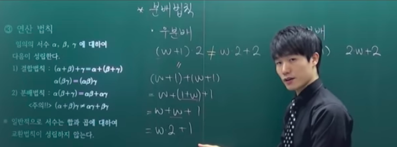

- 서수의 연산 법칙
  - 임의의 서수 a, b, c 에 대하여 다음이 성립한다.
    - 결합법칙
      - `(a+b)+r = a+(b+r)`
      - `a(br) = (ab)r`
    - (좌)분배법칙
      - `a(b+r) = ab+ar`
      - 주의!!`(a+b)r ≠ ar+br`
  - **일반적으로 서수는 합과 곱에 대하여 교환법칙이 성립하지 않는다.**
  - 각종 반례들(서수는 구조를 보는 것임을 주목)
    - 합 교환 반례
      - `1+w`, `w+1`
        - 서수가 같으므로 두 정렬 집합이 순서 동형이다.
        - `1 -> {a}`, `w -> N`
          - `1+w` => `{a} U N`
            - 마지막 원소가 존재(x)
          - `w+1` => `N U {a}`
            - 마지막 원소가 `a`
          - 두 순서구조는 동형이 아님
    - 곱 교환 반례
      - `2 * w`, `w * 2`
        - `2 -> {0, 1}`, `w -> N`
          - `2 * w` = `o{(1,0), (1,1), (2,0), (2,1), ...}`
            - 무한으로 가는 페이즈가 한가지
          - `w * 2` = `o{(0,1), (0,2), (0,3), ..., (1,1), (1,2), ...}`
            - 무한으로 가는 페이즈가 복수 존재
          - 두 서수는 크기가 다름
    - 분배법칙
      - 우분배
        - `(w+1)*2 ≠ w*2+2`

---

연습문제

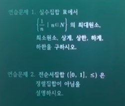

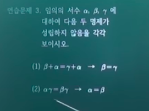

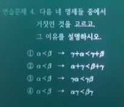
