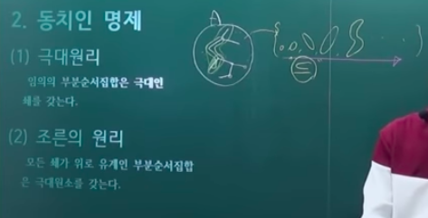

# 선택공리(Axiom of choice)

- 의문
- 개괄
- 선택공리
  - 선택함수
  - 선택공리
- 선택공리와 동치인 명제
  - 극대원리
  - 조른의 원리
  - 정렬원리
  - 그 외의 명제들(선택공리와 동치)
- 선택공리로부터 함의되는 명제

## 의문

## 개괄

> 공리 하나하나가 미치는 영향력은 매우 엄청나다.

> 결국, 수학은 정형화된 완성본이란 없습니다. 여러분의 언어로 풀어낼 수 있어야 해요. 저마다 모든 사람들이 자기가 느끼고 자기가 받아들이는 세계라는 것은 저마다의 것이어야 합니다. 절대 정석이라는 것이 없다는 것을 명심하세요. 이제부터 집합론을 공부하실 분들은, 여러 책과 여러 교재를 보시면서 어떻게 집합론을 표현하고 바라보는지 느껴보세요. 그리고 중요한 것은 여러분의 언어로 풀어낼 수 있어야 합니다. 나의 버전의 집합론이라는 세계를 만드시기 바랍니다. 이 이후로도 나의 버전의 선형대수학, 미적분학을 만들어 보시기 바랍니다. 그게, 진 수학을 오랫동안 즐길 수 있고, 보다 수학의 본질과 진리에 가깝다고 생각합니다. 정형화된 진리란 없습니다.

## 1. 선택공리

당시 수학자들은 선택공리를 사용했는데, 이런게 있는줄도 몰랐음

### 1-1 선택함수

- 개요
  - 집합 `X(≠φ)`의 부분집합들의 집합족을 `{Ai}`이라 할 때, `∀i∈I, f(Ai)⊂Ai`인 `f : {Ai} -> X`

### 1-2 선택공리

- 개요
  - 공집합이 아닌 임의의 집합에 대한 선택함수가 존재한다.
    - 유한집합 뿐 아니라 무한집합도
    - 공집합을 원소로 갖지 않는 서로소인 집합족 F의 원소들에서 하나씩 원소를 선택하여 갖는 집합이 존재한다
  - 정렬원리를 증명하기 위하여 도입된 개념
- 역사
  - 괴델이 ZF와 무모순적임을 증명
  - 이 명제를 직관적으로는 당연하게 느껴지나, ZF공리계에서의 기존의 공리와는 독립임이 밝혀짐
    - 폴 코헨의 강제법(1963)
  - 위의 발견으로 인하여 선택공리를 참으로 받아들일 수 있었음

## 2. 선택공리와 동치인 명제

### 2-1 극대원리(하우스도르프 - Hausdorff maximal principle)

- 개요
  - 임의의 부분순서집합은 극대인 쇄를 갖는다.
    - 쇄들의 집합의 순서(포함)관계를 만들었을 때, 극대인 쇄를 항상 가질 수 있음

### 2-2 조른의 원리(Zorn's lemma - 1939)

- 개요
  - 모든 쇄가 위로 유계인 부분순서집합은 극대원소를 갖는다.

### 2-3 정렬원리(1904)

모든 집합은 정렬집합이 될 수 있다(적절하게 순서 관계를 준다면)

- 개요
  - 모든 집합은 정렬가능하다.
    - 모든 집합은 적당한 순서관계를 부여하여 정렬집합으로 만들 수 있다.
- 심지어 실수 집합도 가능하다?!
  - 고민해보세요

### 2-4 그 외의 명제들(선택공리와 동치)

대부분 집합론이 아닌 다른 분야의 정리들이지만 선택공리와 동치. 즉, 선택공리가 참이 아니면 아래의 원리들은 다 무너져버림

- 라그랑주의 원리(군론)
- 타르스키 원리(집합론)
- 타호노프 원리(위상수학)
- 타이히뮐러-투키 원리
- 임의의 두 기수의 비교가능원리
- 모든 벡터공간의 기저존재원리
- ...

## 3. 선택공리로부터 함의되는 명제

- 괴델의 완전성 원리
- 베르의 범주원리
- 한-바나흐 원리
- 바나흐-타르스키 역설
- 닐센-슈라이어 원리
- 모든 체의 대수적 폐포존재원리
