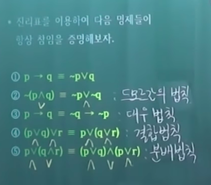
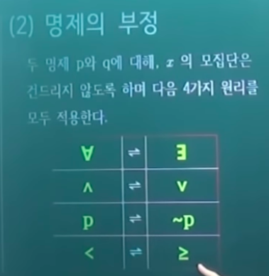
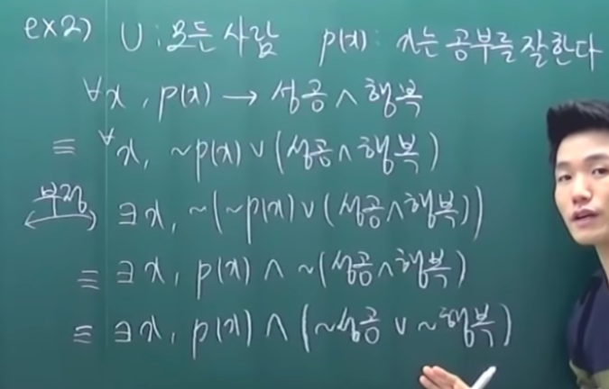
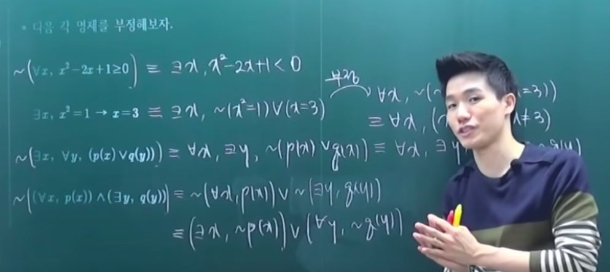
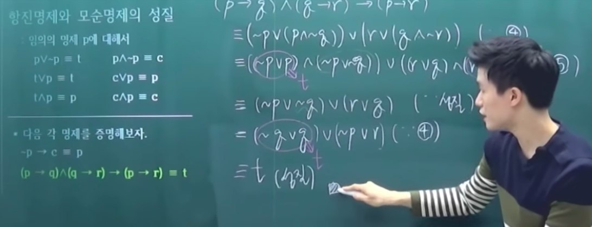
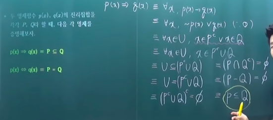
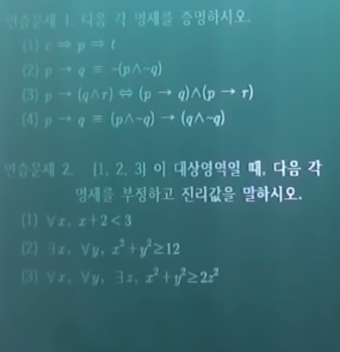

# 집합론

- 의문
- 0 공리적 집합론의 등장
  - 1 무한집합의 등장
  - 2 연속체 가설
  - 3 러셀의 역설
- 1 명제와 논리
  - 1-1 명제와 증명
  - 1-2 명제함수
  - 1-3 함의와 동치

## 의문

- `집합의 원소의 개수 = 집합의 크기 인가?`
- `p->q`의 진리값을 어떻게 진리집합으로 이해할 수 있는가?
- *어쨰서 `p(x) => q(x) ≡ ∀x, p(x) -> q(x)` 인가?*

## 0. 공리적 집합론의 등장

전체는 부분보다 크다 -> 긴 선분이 작은 선분보다 결코 더 많은 점을 포함하지는 않는다 -> 무한의 조명

### 0-1. 무한집합의 등장

19세기 데데킨트가 무한집합을 정의함

- 무한집합
  - 고등학교때의 순환논리적 정의
    - 무한집합은 유한집합이 아닌 집합
    - 유한집합은 원소의 개수가 무한개가 아닌 집합
  - 데데킨트
    - 자기자신의 진부분집합과 1-1대응이 가능한 집합
    - 참고: 집합의 크기비교
      - 두 집합의 원소의 크기의 비교는 각각의 원소를 서로의 집합의 원소로 일대일 대응을 해서 비교하면 됨
        - 집합의 원소의 개수를 전부 셀 필요는 없음
  - 칸토어
    - 무한집합의 크기는 무한집합의 세계에서도 대소가 있다.
    - 칸토어의 정리
      - **무한집합에서 멱집합의 크기는 항상 원래 집합의 크기보다 크다**
        - 멱집합은 그 집합의 모든 부분집합을 모은 집합을 말한다.

### 0-2. 연속체 가설

- 칸토어
  - 자연수 집합 => 원소개수: 알레프 제로
  - (0, 1) 실수 개수 => 원소개수: 시그마 제로
  - 시그마 제로 집합의 크기가 알레프 제로 집합의 크기보다 크다.
- 연속체 가설
  - 시그마 제로의 집합보다 크기가 크고 알레프 제로의 집합보다 크기가 작은 집합은?
    - *시그마 제로의 집합의 멱집합이면서 알레프 제로의 집합을 멱집합으로 갖는 집합??*
    - 하지만 이 연속체 가설은 거짓이라고 증명이 불가능 - 괴델
    - 참이라고도 증명 불가능 - 코헨
    - 즉, 수학적인 명제이면서 참과 거짓을 결정할 수 없는 명제
    - *그렇다면 명제와 조건의 차이는 무엇인가?*

### 3. 러셀의 역설

- `알레프 제로 < 시그마 제로 < ?`
  - ?에 들어갈 수 있는 집합이 있을까?
  - 칸토어의 정리에 의하여 시그마 제로의 멱집합이 ?에 들어갈 것
- `모든것을 포함하는 절대 집합 X가 존재할까?`
  - X가 존재한다고 가정하고, X의 멱집합을 P(X)라 하면, P(X)는 칸토어의 정리에 의하여 X보다 크기가 크므로, X가 모든 집합을 포함한다고 가정한것은 모순
  - 러셀의 역설
- 러셀의 역설과 같은 논리적인 모순을 극복하기 위해서 집합이 될 수 있는것과 집합이 될 수 없는것을 정하는 공리화를 진행
- 공리화 이전의 집합론
  - 소박한 집합론
- 공리화 이후의 집합론
  - 공리적 집합론
  - 무한의 세계를 집합론으로 끌어올때 등장
  - 무한의 세계는 직관으로 이해하기 힘드므로 철저한 공리들과 논리로 접근 시도

## 1. 명제와 논리

### 1-1 명제와 증명

- 명제와 연결사
  - 명제
    - 참, 거짓이 분명히 판단되는 문장
    - 단순 명제
      - p, q, r 로 추상화
    - 합성 명제
      - 몇 개의 단순명제들이 연결사에 의해서 결합된 명제
      - e.g
        - 지수는 블랙핑크의 멤버이고 로제도 블랙핑크의 멤버이다
  - 조건
    - 특정한 변수의 값에 따라서 '참' 이거나 '거짓'을 명확하게 알 수 있는 식이나 문장
  - 연결사
    - 두 명제 p와 q에 대해
    - 무정
      - `~p`
    - 논리곱
      - `p ^ q`
    - 논리합
      - `p v q`
    - 조건
      - `p -> q`
    - 쌍조건
      - `p <-> q`
- *진리표*
  - 명제의 진리값(T, F)을 표로 나타낸것
  - 진리 집합
    - 정의
      - 해당 명제가 참이 되도록하는 모든 원소들의 집합
      - 변수가 속해 있는 전체집합 U의 원소 중에서 어떤 조건을 참이 되게 하는 값 전체의 집합
    - `p -> P`, `q -> Q`
    - e.g
      - `p : 누군가는 블랙핑크의 멤버이다`
      - `P = {지수, 로제, 제니, 리사}`
      - `q : 대한민국에는 키가 160cm 이상의 남성이 적어도 한 명 존재한다`
      - `P = {나, ...}`
    - 명제 p가 참이다
      - 명제 p의 진리집합(P)의 원소가 존재한다.
    - 명제 p가 거짓이다
      - 명제 p의 진리집합(P)이 공집합이다.
  - 진리표에서
    - `~p`
      - 정의로부터 p가 참이면 거짓이고, 거짓이면 참임
      - `~p의 진리집합은 P의 여집합`
        - 왜냐하면 진리집합의 정의에서 P는 명제p가 참이 되도록 하는 모든 원소들의 집합
        - ~p의 진리집합은 명제 p가 거짓이 되도록 하는 모든 원소들의 집합
        - 따라서 ~p의 진리집합은 P의 여집합
    - `p->q`
      - 정의로부터 오직 p가 참이고 q가 거짓일 경우 해당 명제는 거짓
      - 정의로부터 `p->q`이 참이라는 것은 `진리집합 P가 Q의 부분집합이 될 경우`
        - p의 명제를 만족하는 진리집합의 원소들이 q의 명제를 만족하는 진리집합의 원소가 된다
    - `p<->q`
      - 정의로부터 p가 참, q가 참 혹은 p가 거짓, q가 거짓일 때만 참
- 연역적 추론
  - 이미 알고 있는 판단을 근거로 새로운 판단을 유도하는 것

### 1-2 명제함수

- 명제함수
  - 정의
    - 변수 x가 결정되어야지만 참, 거짓이 판단되는 문장
    - `p(x)`
    - 어떠한 대상(x)에는 반드시 범위가 반드시 존재한다
      - 대상영역(domain) / 모집단(universal)
  - 한정기호
    - 전칭기호 : for every
    - 존재기호 : for some
- 명제의 부정

### 1-3 함의와 동치

- 항진명제와 모순명제
  - 항진명제
    - 모든 논리적 가능성의 진리값들이 참인 명제
    - `t`
      - Tautology
    - 진리집합은 전체집합인 U
      - 어떠한 U의 원소라도 모든 논리적 가능성의 진리값이 참임
  - 모순명제
    - 모든 논리적 가능성의 진리값들이 거짓인 명제
    - `c`
      - contradiction
    - 진리집합은 공집합
  - 추이법칙(삼단논법)
    - `(p->q and q->r) -> (p->r)`는 참진명제
- 함의와 동치
  - 함의
    - 참진인 조건문 `p->q`를 논리적 함의라 하고, `p=>q`로 나타내며 p는 q의 **충분조건**, q는 p의 **필요조건** 이라 한다.
      - `인간=>동물`
        - 인간은 동물로 분류되기 충분한 조건
        - 무엇인가가 인간으로 분류되기 위해서는 동물로 분류될 필요가 있음
  - 동치
    - 참진인 쌍조건문 `p<->q`를 동치라 하고 `p<=>q`로 나타내며 p와 q는 서로의 **필요충분조건** 이라 한다.

