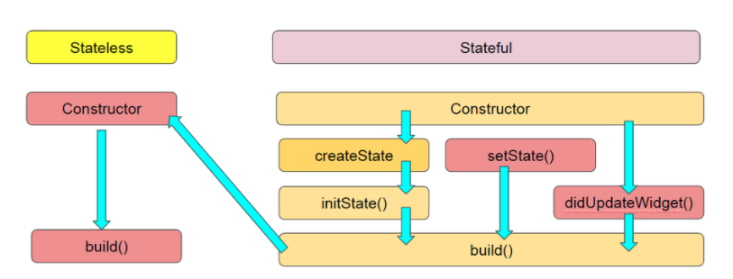

# CH1. 개발 환경 세팅

## 0. 기본 설치

- MAC
  - Iterm2 설치하기

## 1.1 설치

- [설치](https://flutter.dev/docs/get-started/install)
  - 각자 컴퓨터에 맞는 OS를 선택

### MAC

- 1 Get the Flutter SDK에 있는 `flutter_macos_...-stable.zip`를 바탕화면에 클릭해서 다운로드
- 2 binary file Path 추가
  - 이 부분은 안중요하므로, 그냥 따라하라고 하거나, 직접 해주기
- 3 `flutter doctor`를 터미널에서 실행하기
  - Android studio
  - XCode
  - VSCode

## 2. 첫 예시

### Flutter

- Material app
  - 모바일과 웹의 표준 디자인 언어(스펙같은 느낌)
- Flutter는 Material 다양한 widget의 집합을 제공

### Stateful Widget

- `StatefulWidget` class
  - immutable and can be thrown away and regenerated
- `State` class
  - persists over the lifetime of the widget

### Simple example code

```dart
import 'package:flutter/material.dart';
import 'package:english_words/english_words.dart';

// pubspec.yaml
// // publication spec definition

// one line function or method uses =>
void main() => runApp(MyApp());

// extends StatelessWidget -> makes app itself a widget
// In flutter, almost everything is a widget(e.g alignment, padding, layout)
// Stateless widgets are immutable
class MyApp extends StatelessWidget {
  @override
  Widget build(BuildContext context) {
    return MaterialApp(
      title: 'Startup Name Generator',
      home: RandomWords(),
    );
  }
}

// App
// -- Stateless Widget
// -- -- MaterialApp
// -- -- -- title
// -- -- -- home
// -- -- -- -- appBar
// -- -- -- -- -- title
// -- -- -- -- body
// -- -- -- -- -- child

// enforce privacy
// generic State class specialized for use with RandomWords
class _RandomWordsState extends State<RandomWords> {
  final _suggestions = <WordPair>[];
  final _biggerFont = TextStyle(fontSize: 18.0);

  Widget _buildSuggestions() {
    return ListView.builder(
      padding: EdgeInsets.all(16.0),
      // callback
      // called once per suggested word pairing
      itemBuilder: /*1*/ (context, i) {
        if (i.isOdd) return Divider();

        final index = i ~/ 2;
        if (index >= _suggestions.length) {
          _suggestions.addAll(generateWordPairs().take(10));
        }

        return _buildRow(_suggestions[index]);
      },
    );
  }

  Widget _buildRow(WordPair pair) {
    return ListTile(title: Text(pair.asPascalCase, style: _biggerFont));
  }

  @override
  Widget build(BuildContext context) {
    return Scaffold(
        appBar: AppBar(
          title: Text('Startup Name Generator'),
        ),
        body: _buildSuggestions());
  }
}

class RandomWords extends StatefulWidget {
  @override
  State<RandomWords> createState() => _RandomWordsState();
}

```

## 두번쨰 예시

### 패키지

- `pubspec.yaml`
  - python3의 `requirements.txt`와 같은 역할
- `flutter pub get`
  - `pubspec.yaml`에 적힌 library설치

### Lifecycle

Flutter Widget lifecycle



- `Constructor()`
  - life cycle에 포함되지는 않음
  - widget 속성의 state는 비어있음
- `createState()`
  - `StatefulWidget`를 build하도록 지시받으면 바로 `createState()`호출
- `initState()`
  - object가 tree로 삽입되는 경우에 호출됨
    - lifecycle에서 오직 한 번만
- `setState()`
  - 우리가 알고있는 그 `setState()`
- `didChangeDependencies()`
  - *this State object의 의조성이 변화할 때, 호출됨*
    - 예시?
- `didUpdateWidget()`
  - *widget configuration이 변화할때 호출됨*
- `deactivate()`
  - this object가 tree로부터 제거되면 호출됨
  - `dispose`전에 이 함수 호출
- `dispose()`
  - this object가 tree로부터 완전히 제거되면 호출됨
- `didChangeAppLifecycleState()`
  - system이 app을 background에 두거나, app을 foreground로 가져올 떄 호출됨ㄷ

### Route

- `Navigator`
  - app의 route들을 포함하는 스택을 관리
  - route를 `Navigator`의 스택에 푸시하면 해당 라우트로 display update함

### Simple example code

```dart
import 'package:flutter/material.dart';
import 'package:english_words/english_words.dart';

// pubspec.yaml
// // publication spec definition

// one line function or method uses =>
void main() => runApp(MyApp());

// extends StatelessWidget -> makes app itself a widget
// In flutter, almost everything is a widget(e.g alignment, padding, layout)
// Stateless widgets are immutable
class MyApp extends StatelessWidget {
  @override
  Widget build(BuildContext context) {
    return MaterialApp(
      title: 'Startup Name Generator',
      theme: ThemeData(
        primaryColor: Colors.white,
      ),
      home: RandomWords(),
    );
  }
}

// App
// -- Stateless Widget
// -- -- MaterialApp
// -- -- -- title
// -- -- -- home
// -- -- -- -- appBar
// -- -- -- -- -- title
// -- -- -- -- body
// -- -- -- -- -- child

// enforce privacy
// generic State class specialized for use with RandomWords
class _RandomWordsState extends State<RandomWords> {
  final _suggestions = <WordPair>[];
  final _saved = Set<WordPair>();
  final _biggerFont = TextStyle(fontSize: 18.0);

  void _pushSaved() {
    Navigator.of(context).push(
      MaterialPageRoute<void>(
        builder: (BuildContext context) {
          final tiles = _saved.map(
            (WordPair pair) {
              return ListTile(
                title: Text(
                  pair.asPascalCase,
                  style: _biggerFont,
                ),
              );
            },
          );
          final divided = ListTile.divideTiles(
            context: context,
            tiles: tiles,
          ).toList();

          return Scaffold(
            appBar: AppBar(
              title: Text('Saved Suggestions'),
            ),
            body: ListView(children: divided),
          );
        },
      ),
    );
  }

  Widget _buildSuggestions() {
    return ListView.builder(
      // Design
      padding: EdgeInsets.all(16.0),
      // callback -> Widget
      // called once per suggested word pairing
      itemBuilder: /*1*/ (context, i) {
        if (i.isOdd) return Divider();

        final index = i ~/ 2;
        if (index >= _suggestions.length) {
          _suggestions.addAll(generateWordPairs().take(10));
        }

        return _buildRow(_suggestions[index]);
      },
    );
  }

  Widget _buildRow(WordPair pair) {
    final alreadySaved = _saved.contains(pair);
    return ListTile(
      // Design
      title: Text(
        pair.asPascalCase,
        style: _biggerFont,
      ),
      // Design
      trailing: Icon(
        alreadySaved ? Icons.favorite : Icons.favorite_border,
        color: alreadySaved ? Colors.red : null,
      ),
      // Interaction
      onTap: () {
        setState(() {
          if (alreadySaved) {
            _saved.remove(pair);
          } else {
            _saved.add(pair);
          }
        });
      },
    );
  }

  @override
  Widget build(BuildContext context) {
    return Scaffold(
        appBar: AppBar(
          title: Text('Startup Name Generator'),
          actions: [
            IconButton(
              icon: Icon(Icons.list),
              onPressed: _pushSaved,
            ),
          ],
        ),
        body: _buildSuggestions());
  }
}

class RandomWords extends StatefulWidget {
  @override
  State<RandomWords> createState() => _RandomWordsState();
}
```

### Widget

- Widget
  - 정의
    - app의 UI의 기본적인 building block
  - widget이 정의하는 것
    - **structural element**
      - button or menu
    - **stylistic element**
      - font, color scheme
    - **aspect of layout**
      - padding, alignment
- Widget Tree
  - 정의
    - widget들의 계층
  - 특징
    - 각 widget은 parent widget으로 nest inside하고, parent로부터 속성을 상속받음
    - application object도 widget
      - root widget
