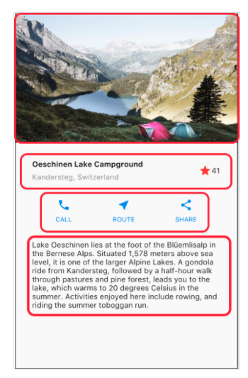
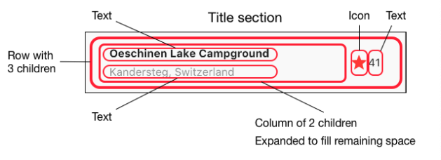
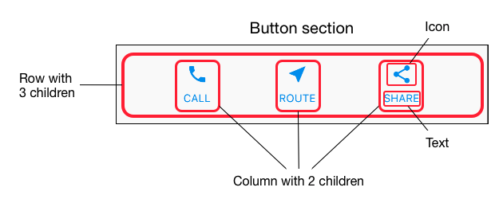
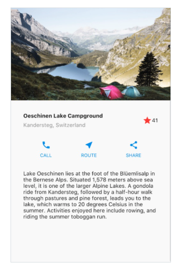

# Ch2 Layout

- 의문
- 2.1 Layout을 도식화(diagram) 하기

## 의문

## 2.1 Layout을 도식화(diagram) 하기

Layout 도식화 과정1



Layout 도식화 과정2



Layout 도식화 과정3



- 큰 요소 -> 작은 요소
- 각 row마다 도식화 하기

## 2.2 Code 작성하기

- `Container`가 HTML의 `<div>`와 같은 개념인듯
- `Child`가 `<div>`의 node의 child노드를 가리키는 개념인듯
- `margin`, `padding`은 HTML의 그것을 그대로 차용
- `Row`
  - children
    - 가로로 배치
  - `mainAxis`
    - 가로
- `Column`
  - children
    - 세로로 배치
  - `mainAxis`
    - 세로

Layout 코드 모습



Layout demo code

```dart
import 'package:flutter/material.dart';

void main() {
  runApp(MyApp());
}

class MyApp extends StatelessWidget {
  // This widget is the root of your application.
  @override
  Widget build(BuildContext context) {
    return MaterialApp(
      title: 'Flutter layout demo',
      theme: ThemeData(
        // This is the theme of your application.
        //
        // Try running your application with "flutter run". You'll see the
        // application has a blue toolbar. Then, without quitting the app, try
        // changing the primarySwatch below to Colors.green and then invoke
        // "hot reload" (press "r" in the console where you ran "flutter run",
        // or simply save your changes to "hot reload" in a Flutter IDE).
        // Notice that the counter didn't reset back to zero; the application
        // is not restarted.
        primarySwatch: Colors.blue,
        // This makes the visual density adapt to the platform that you run
        // the app on. For desktop platforms, the controls will be smaller and
        // closer together (more dense) than on mobile platforms.
        visualDensity: VisualDensity.adaptivePlatformDensity,
      ),
      home: ViewPage(),
    );
  }
}

class ViewPage extends StatelessWidget {
  @override
  Widget build(BuildContext context) {
    Color color = Theme.of(context).primaryColor;

    return Scaffold(
      appBar: AppBar(
        title: Text('Flutter layout demo'),
      ),
      body: ListView(
        children: [
          Image.asset(
            'assets/images/lake.jpg',
            width: 600,
            height: 240,
            fit: BoxFit.cover,
          ),
          titleSection,
          createButtonSection(color),
          createTextSection(),
        ],
      ),
    );
  }
}

Widget titleSection = Container(
  padding: const EdgeInsets.all(32),
  child: Row(
    children: [
      Expanded(
        child: Column(
          crossAxisAlignment: CrossAxisAlignment.start,
          children: [
            Container(
              padding: const EdgeInsets.only(bottom: 8),
              child: Text(
                'Oeschinen Lake Campground',
                style: TextStyle(
                  fontWeight: FontWeight.bold,
                ),
              ),
            ),
            Text(
              'Kandersteg, Switzerland',
              style: TextStyle(
                color: Colors.grey[500],
              ),
            ),
          ],
        ),
      ),
      Icon(
        Icons.star,
        color: Colors.red[500],
      ),
      Text('42'),
    ],
  ),
);

Column _buildButtonColumn(Color color, IconData icon, String label) {
  return Column(
    // ??
    mainAxisSize: MainAxisSize.min,
    // Column: mainAxis => y
    mainAxisAlignment: MainAxisAlignment.center,
    children: [
      Icon(icon, color: color),
      Container(
        margin: const EdgeInsets.only(top: 8),
        child: Text(
          label,
          style: TextStyle(
            fontSize: 12,
            fontWeight: FontWeight.w400,
            color: color,
          ),
        ),
      ),
    ],
  );
}

Widget createButtonSection(Color color) {
  Widget buttonSection = Container(
    child: Row(
      // Row: mainAxis => x
      mainAxisAlignment: MainAxisAlignment.spaceEvenly,
      children: [
        _buildButtonColumn(color, Icons.call, 'CALL'),
        _buildButtonColumn(color, Icons.near_me, 'ROUTE'),
        _buildButtonColumn(color, Icons.share, 'SHARE'),
      ],
    ),
  );

  return buttonSection;
}

Widget createTextSection() {
  return Container(
    padding: const EdgeInsets.all(32),
    child: Text(
      'Lake Oeschinen lies at the foot of the Blüemlisalp in the Bernese '
      'Alps. Situated 1,578 meters above sea level, it is one of the '
      'larger Alpine Lakes. A gondola ride from Kandersteg, followed by a '
      'half-hour walk through pastures and pine forest, leads you to the '
      'lake, which warms to 20 degrees Celsius in the summer. Activities '
      'enjoyed here include rowing, and riding the summer toboggan run.',
      softWrap: true,
    ),
  );
}

```
