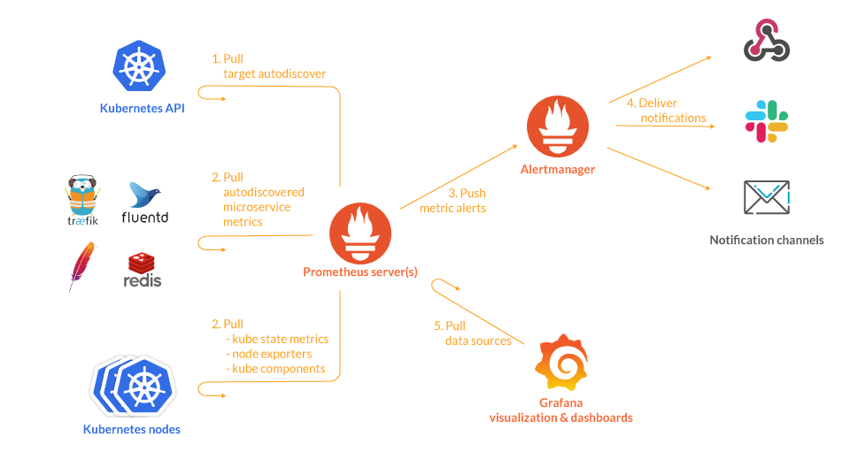

# 프로메테우스

## 의문

## 개요

## 구성 요소

### Node exporter

- 개요
  - 서버 시스템(CPU, LoadAverage, Memory) 및 네트워크 정보를 수집하여 메트릭 API로 제공하는 프로그램
  - 프로메테우스에서 노드 익스포터 매트릭 API를 target으로 등록하여 데이터 스크랩 가능

## 쿠버네티스와 연동시, 일반적인 아키텍쳐(feat. k8s)

쿠버네티스와 연동시, 일반적인 아키텍처

