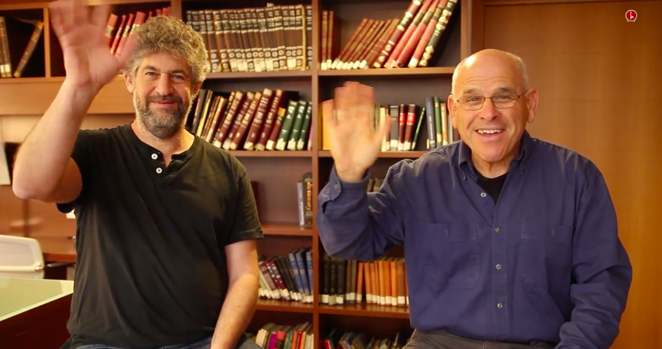

# Nand to tetris

## I really appreciate Noam And Shimon!

## 컴퓨터 과학의 기본 사상

컴퓨터 구조의 추상화

추상화와 구현

## 강의법

- 모든 컴퓨터 과학에 필요한 내용을 배움
- 이미 제공된 소프트웨어 툴을 사용
- 제공된 API로 부터 모든 시스템을 만듬
- 각각의 모듈을 독립적으로 테스트(많은 테스트 케이스)
- **즐기자!**
