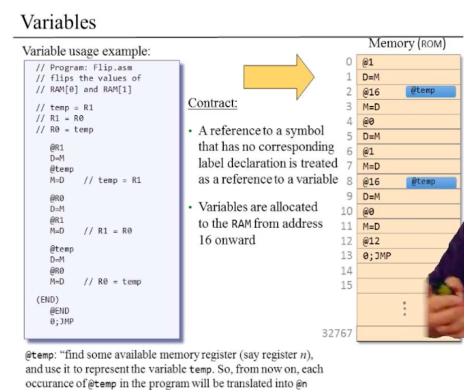

# Machine Language


- 컴퓨터는 한가지 이상의 기능을 가짐
- 같은 하드웨어가 많은 다른 소프트웨어를 실행

## 기계어

오직 기계어만이 하드웨어가 무엇을 해야하는지 직접적으로 지시해줌

다른 고수준의 언어는 어떠한 방법으로든 기계어로 번역됨

- 프로그램
  - 연산의 조합
- 컴퓨터가 무엇을 하게 만들것인가?
- 컴퓨터의 작업 순서를 어떻게 제어할 것인가?
  - Program Counter
- 어디에서 그러한 작업을 하게 할 것인가? 결과는 어디에 놓을 것인가?
  - Addressing

### 고려해야할 점

- 연산
  - 비트의 연속으로 되어있음
  - 매우 프로그래밍 하기 힘듬
  - 해석
    - 방법1: 0100010대신에 ADD라는 말을 차용
    - 방법2: 단순히 차용할 뿐 아니라, 기계어와 1:1대응 되는 어셈블리 언어를 사용해서 비트 형식에서 인간이 더 다루기 쉬운 형식으로 바꿈
- 심볼
  - 메모리의 위치를 정확하게 기입하는게 중요한 것이 아니고, 그냥 비어있는 메모리의 위치를 쓴다라는 사실이 중요함.
  - 어셈블러가 자동적으로 해석하게 함
  - e.g `ADD 1, index` == `ADD 1, Mem[129]`

## 기계어의 구성 요소

- 하드웨어와 소프트웨어 인터페이스의 명세
  - 무엇이 지원되는 동작인가?
  - 그것들이 정확히 무엇을 하는가?
  - 프로그램이 어떻게 제어되는가?
- 보통 하드웨어 설계에 밀접한 관계가 있음(하드웨어 기능과 1:1관계)
  - 항상 그런것은 아님
- 비용-성능의 트레이드오프
  - 비용의 종류
  - Silicon Area
  - Time to Complete Instruction

### 기계어: 기계의 연산(Operations)

- 일반적으로 하드웨어에 이미 구현이 된것과 1:1대응
  - 수학적 연산: add, subtract
  - 논리적 연산: and, or,
  - 흐름 제어: goto instruction X, if C then goto instruction Y
- 기계어들 사이의 차이점
  - 연산 집합의 풍부함(Richness)
    - 나눗셈, 복사
  - 데이터 타입
    - width, floating point ...
  - 하드웨어 에서 구현하는 것이 더 빠르다. 대신 비용이 증가.

### 기계어: 어드레싱(Addressing)

- 어떠한 데이터로 작업을 할 것인가?
- 하드웨어가 어떠한 타입의 데이터를 사용하게 할 것인가?
- 결국 메모리가 중요

#### 메모리 계층


- 메모리 위치에 접근하는 것은 비쌈
  - 긴 주소를 제공해야 함(큰 메모리를 사용할 때)
  - 메모리에 담긴 내용을 CPU에 제공하는 데에 시간이 걸림
- 해결: 메모리 계층
  - 메모리는 계층에 따라서 크기가 다름
  - CPU랑 가까운 작은 메모리는 적은 데이터를 저장 가능 개수도 적음
    - 주소값이 크지 않음
  - CPU랑 거리가 먼 메모리는 많은 데이터를 저장 가능 개수가 많음(Cache)

#### 레지스터(Registers)

- CPU는 아주 적은수의 쉽게(빠르게) 접근할 수 있는 레지스터를 갖고 있음
- 그것들의 숫자와 기능들이 기계어의 핵심
- 종류
  - 데이터 레지스터
    - `Add R1, R2`
  - 주소 레지스터
    - 메인 메모리의 위치를 저장
    - `Store R1, \@A`
    - 주소 레지스터인 A에 있는 메모리 주소에 R1레지스터 안의 값을 저장함

#### Addressing Mode


- 어떠한 데이터가 지시를 어떠한 식으로 따르는 가의 유형
  - Register: `Add R1 R2`
  - Direct: `Add R1, M[200]`
  - Indirect: `Add R1, @A`
  - Immediate: `Add 73, R1`
- IO
  - 많은 타입의 IO 장치가 존재
    - 키보드, 마우스, 카메라, 센서, 프린터 ...
  - CPU는 각각에 대해서 대화하기 위한 통신 규약(protocol)이 있어야 함
    - 소프트웨어 드라이버가 이러한 프로토콜을 알고 있음
  - 인터렉션의 방법으로 사용되는 대표적인 예: **memory mapping**
    - 장치들을 컨트롤하는 레지스터들을 메모리의 일부로 제어함
    - 운영체제(OS)의 드라이버는 어떠한 주소의 메모리가 장치와 연결되어있는지, 어떠한 용도인지를 관리함
    - 메모리 위치 12345는 마우스가 움직인 마지막 방향의 값을 가짐
    - 메모리 위치 45678은 실제 메모리 위치는 아니나, 프린터가 어떠한 종이를 사용할지를 구별하기 위한 방법

### 기계어: 흐름 제어(Flow Control)


- 보통 CPU는 기계 지시의 연속을 순차적으로 실행
- 무조건적으로 다른 위치의 지시로 넘어가야하는 경우가 있음
  - e.g 루프문
- 조건에 따라서 다른 위치의 지시로 넘어가야하는 경우가 있음

Q) 연산은 CPU의 레지스터에서 하고, 그러한 지시(명령)은 어디에 위치하는가? 레지스터? 아니면 메모리?

## 핵컴퓨터 기계어

### 핵 컴퓨터: 하드웨어


- 16비트 기계의 구성
  - 데이터 메모리(RAM)
    - 16비트 레지스터의 연속
    - RAM[0], RAM[1], ...
  - 명령 메모리(ROM)
    - 16비트 레지스터의 연속
    - ROM[0], ROM[1], ...
  - 중앙 처리 장치(CPU)
    - 16비트 명령을 처리
  - 데이터를 옮겨주는 버스(bus)
    - 명령 버스
      - 명령을 명령 메모리에서 CPU로 옮겨줌
    - 데이터 버스
      - 데이터를 데이터 메모리에서 CPU로 옮겨줌
    - 주소 버스

### 핵 컴퓨터: 소프트웨어

핵 컴퓨터의 제어

- 핵 컴퓨터 기계어
  - 16비트 A-명령
  - 16비트 C-명령
- 핵 프로그램
  - **핵 기계어로 쓰여진 명령들의 연속**

### 핵 컴퓨터: 컨트롤

- 리셋버튼
- 제어
  - ROM이 핵 프로그램을 가져옴
  - reset 버튼을 누름
  - 프로그램이 동작함
- 컴퓨터의 동작은 프로그램이 어떻게 쓰여졌느냐에 따라 다르다.

### 핵 컴퓨터: 레지스터

- 핵 기계어는 세가지 레지스터를 인식
  - D레지스터: 16비트 값을 갖음
  - A레지스터: 16비트 값을 갖음
  - M레지스터: 16비트 램(RAM) 레지스터 A에 의해서 관리됨
    - RAM이기 때문에 주소가 어떻게 되었든 항사 일정한 시간에 접근 가능

### A-명령(Addressing)

- 문법: @value
- value는 다음과 같다:
  - 음수가 아닌 십진수의 상수
  - 그러한 상수를 참조하는 심볼
  - @21
    - A레지스터를 21로 설정
    - M레지스터인 RAM[21]이 램 레지스터에서 선택됨
  - RAM[100]을 -1로 만들기
    - @100 // A=100
    - M = -1
- 메모리를 관리하기 위해서 항상 그전에 행해야함

### C-명령


- 문법: `dest = comp ; jump` (dest, jump는 선택)
  - comp(computation)
  - dest(destination)

위와 같은 경우는 심볼릭한 표기이다.

## 핵 언어 사양(Specification)

### 핵 기계어

- 두가지 방법의 표현
  - 바이너리 코드
  - 심볼릭 언어

### A-명령

- 심볼릭
  - @value
  - 음수가 아닌 십진수 상수: 2^15-1이하
  - 그러한 상수를 참조하는 심볼
  - @21
    - A레지스터를 21로 만들고
    - RAM[21]을 선택하게 함
- 바이너리 문법
  - 00000000000010101
  - A레지스터를 21로 만듬

### C-명령


- 심볼릭
  - `dest = comp ; jump`
- 바이너리 문법
  - 1 1 1 a c1 c2 c3 c4 c5 c6 d1 d2 d3 j1 j2 j3
  - 제일 처음의 1은 op코드
  - 다음 두개의 1은 사용 되지 않음
  - a ~ c6은 comp비트
  - d1 ~ d3 dest비트
  - j1 ~ j3 jump비트

### 핵 프로그램

- 핵 명령의 연속
- 화이트 스페이스 존재 가능
- 코멘트 가능
- 더 나은 최적화 가능
- 심볼릭 코드를 바이너리 코드로 통역해서 실행해야 함

## Input / Output


- 주변 I/O 장치:
  - 키보드: 입력을 받는데에 사용
  - 스크린: 출력을 표시 하는데에 사용
- 용도
  - 유저로부터 데이터를 입력받음
  - 데이터를 유저에게 보여줌
- 고수준의 접근(파트2에서 다룸)
  - 텍스트, 그래픽, 애니메이션, 오디오, 비디오 등이 가능한 복잡한 소프트웨어 라이브러리 사용
- 저수준의 접근(파트1에서 다룸)
  - 비트로 제어
  - 램에 특정한 주소의 레지스터들을 주변 장치 제어에 할당

### 핵 컴퓨터 플랫폼: Output

- 스크린 메모리 맵
  - 디스플레이 유닛을 제어하기 위해 할당된 지정된 메모리 영역
  - 물리적인 표시는 지속적으로 많은 경우 매초마다 메모리 맵에 기반하여 갱신됨
  - 스크린 메모리 맵을 조작하는 코드를 쓰는 것에 의하여 Output은 영향을 받음

#### 스크린 메모리 맵


- 표시 유닛(2차원)
  - 256행, 512열
  - 픽셀을 켜고 끌 수 있음
  - 흑백
- 메모리 맵(1차원)
  - RAM안에서 특정한 영역을 할당
  - 16비트 값의 연속
  - 메모리의 읽고 쓰는 작업은 항상 16비트 단어 단위(하나의 특정한 비트만 쓰거나 읽을 수 없음)
  - 0 ~ 31번째 메모리까지(32 * 16 비트) 화면의 첫번쨰 행(512열)
  - 32 ~ 63번째 메모리까지(32 * 16 비트) 화면의 두번째 행(512열)
  - 픽셀(row, col)를 켜고 끄기
    - 0. Screen칩을 구현
    - 1. word = Screen[32*row + col/16]
      - word = RAM[16384 + 32*row + col/16]
      - 전체 램에서 생각하는 경우
    - 2. 선택한 word의 (col % 16)번쨰 비트를 0이나 1로 변환
    - 3. 그 word를 RAM으로 돌려놓음
    - 다시 표시 갱신
    - 1과 3은 16비트 램 접근 명령을 통해서 이뤄짐

### 핵 컴퓨터 플랫폼: Input

#### 키보드 메모리 맵


- 물리적인 키보드는 키보드 메모리 맵과 연관이 있음
- 오직 16비트(RAM속의 16비트 레지스터 한개)
- 키보드 메모리 맵
  - 키보드의 키가 눌리면 키의 스캔 코드가 키보드 메모리 맵에 나타남
    - e.g 4를 누르면 52(00000000000110100)가 키보드 맵에 나타남
    - 아무것도 안누르면 0
  - 어떤 키가 현재 눌렸는지 확인
    - 키보드 칩의 내용을 보면 됨
    - 핵 컴퓨터에서는 RAM[24576]을 보면 됨

## 핵 프로그래밍

- 레지스터 / 메모리
- 브랜칭(Branching)
- 변수
- 반복
- 포인터
- 입력 / 출력

### 1. 레지스터 / 메모리


- D: 데이터 레지스터
- A: 주소 / 데이터 레지스터
- M: 현재 선택된 **메모리** 레지스터 M = RAM[A]

#### 프로그램을 적절히 끄기 위해서는?

- 프로그램이 멈추지 않으면 해커가 램의 어떠한 부분에 나쁜 명령을 숨겨놓으면 컴퓨터가 해킹 당할 위험이 있음
  - NOP(Null Opcodes)슬라이드 공격
- 컴퓨터는 항상 무엇인가를 하고 있음
  - 프로그램을 무한 루프와 함께 끝냄
  - @6
  - 0;JMP

#### 내장 심볼


- 핵 어셈블리 언어는 내장 심볼을 갖고 있음
  - @
    - @5라고 하면 이것이 단순히 값을 넘겨주기 위한 것인지, 메모리를 가르키기 위한 것인지 모름
      - 값을 가르킬때: @5
      - 메모리를 가르킬때: @R5
    - 읽기 쉽게 하자
    - 핵 컴퓨터는 대소문자 구별함
  - IO
    - SCREEN: 16384
    - KBD: 24576
  - 나머지
    - SP 0
    - LCL 1
    - ARG 2
    - THIS 3
    - THAT 4
    - 이는 전부 파트2에서 사용

### 2. 브랜칭 / 반복작업

#### 브랜칭(goto)


- 단순히 프로그램을 작성하게 되면 읽기가 굉장히 힘듬
  - `0;JMP` 같은 경우에, 어디로 점프해야 하는지 알기 힘듬
  - 그래서 (POSITIVE)와 같은 라벨을 만들어서 어디로 점프하게 되는지 알기 쉽게 명시
  - 라벨자체는 해석되지 않음

#### 변수(variables)



- 이름과 값을 갖는 컨테이너
- 타입은 오직 하나(16비트 레지스터)
- 변수 == 16비트 레지스터 하나
- 사용
  - @temp
    - 사용 가능한 임의의 메모리 레지스터 n을 찾아서, 변수 temp를 대표하는 것으로 사용.
    - 그러므로, @temp는 이제부터 @n과 같음
- 계약
  - 심볼에 대한 참조가 해당하는 라벨이 존재하지 않는 경우, 변수에 대한 참조로 간주
  - 변수들은 주소 16이상부터 할당됨
- 장점
  - 읽기쉬움
  - 재할당 가능한 코드
    - 다양한 프로그램이 동시에 작동하고 있어도, 충돌을 걱정할 필요가 없음
    - 로더가 알아서 해줌

#### 반복(iteration)

- 반복 프로그래밍
  - e.g 1+2+3+4+ ... +n
  - psudo 코드를 작성한 뒤에 어셈블리 코드를 작성하자
  - 코드를 다 작성하면 종이로 시뮬레이션 해보자
    - 트레이스 테이블 작성

#### 팁

1. psudo 코드 작성
2. 어셈블리 언어로 작성(종이로)
3. 종이로 트레이스 테이블 작성
4. 자기자신이 잘 돌아가는 코드라는 것을 확신하는 것이 중요함

### 3. 포인터 / IO

#### 포인터

```go
for i := 0; i < n; i++ {
  arr[i] = -1
}
```


- 예시
  - 배열이라는 자료구조는 고수준 언어에서는 배열 이라는 하나의 묶음
  - 저수준 언어에서는 그저 단순한 메모리에 불과
- 정의
  - 메모리 주소를 저장하는 변수(arr, i)를 포인터라 함
  - 포인터를 통한 메모리 접근이 필요할때 `A=M`과 같은 명령이 필요
  - 주소 레지스터(address register)를 어떠한 메모리 레지스터로 설정함


#### IO(Input / Output)


- 램 속에서 관리
  - 데이터 메모리
  - 스크린 메모리 맵
    - SCREEN
  - 키보드 메모리 맵
    - KBD(24576)

## 컴파일

컴파일러는 추상화를 도와주는 도구

저수준 언어의 세세한 부분을 추상화해준다.

## 저수준 프로그래밍

- 저수준
- 심도있음
- 세세함
- 지적으로 어려움

## 조언


## Perspective

Q) 실제 컴퓨터와 hack컴퓨터의 기계어는 어떻게 다른가?
R) hack컴퓨터의 경우 훨씬 더 간단함. 하지만 매우 강력함. 실제 기계어에서 제공되는 곱셈은 소프트웨어 레벨에서 구현

Q) 메모리를 다루는 명령 + 선택된 메모리에 명령을 내리는 이러한 형식은 표준적인가?
R) 다른 기계어의 경우에는 두가지의 명령을 한번에 하는 경우가 있음. 16비트안에서 그 두가지를 다 하는것은 매우 어려움

Q) 핵 기계어는 어떻게 문법이 설계되어있고 다른 기계어와의 차이는?
R) 기계어는 사람들이 프로그래밍 하기 쉽게 디자인 되어 있는것이 아니라, 컴퓨터가 효율적으로 동작하기 쉽게 디자인 되어있음. 기계어의 명령은 직접적으로 ALU, 메모리, 레지스터를 다룰 수 있어야 함(매우 효율적으로) 그래서 매우 간단한 성질을 갖음. 핵 컴퓨터: `D = D + M` == 실제: `ADD D address`또는 `D = M` == `LOAD D address`

Q) 사람들은 기계어를 사용해서 고통받아야 하는가?
R) 많은 사람들은 고수준의 언어를 사용함. 대신 컴파일러를 만들어야 함. 컴파일러를 이해하기 위해서는 컴파일러가 생산하는 기계어를 이해해야만 함. 성능이 매우 중요한 프로그램에서는 기계어를 수정해서 최적화 하는 경우도.

## 예시 코드

### 예시1: R[2] = R[0] * R[1]

```asm
// R[0]과 R[1]을 곱한 결과를
// R[2]에 저장하는 코드

// initialization
@R1
D=M
@n
M=D
@i
M=0
@sum
M=0
@SUMLOOP
0;JMP

(SUMLOOP)
  // check stop condition i
  @i
  D=M
  @n
  D=D-M
  @STOP
  D;JGE

  // add summation
  @R0
  D=M
  @sum
  M=M+D

  // refresh looping variables
  @i
  M=M+1

  // goto next loop
  @SUMLOOP
  0;JMP

(STOP)
  // after loop
  @sum
  D=M
  @R2
  M=D

  @END
  0;JMP

(END)
  // infinite loop for end
  @END
  0;JMP

```

### 예시2: 키보드 입력이 있는 경우 컴퓨터의 화면을 검정색으로, 아니면 흰색

```asm
// 화면의 모든 픽셀을
// 키보드의 키를 눌렀을 때 검은색
// 키보드의 키를 누르지 않았을 때 흰색
// 으로 보여주는 어셈블리코드(핵 컴퓨터의 예시)

@LOOP
0;JMP

(LOOP)
  // write initialization
  @KBD
  D=M
  @keyin
  M=D
  @32
  D=A
  @m
  M=D
  @256
  D=A
  @n
  M=D
  @i
  M=0
  @k
  M=0
  @keyin
  D=M
  @SCREEN_BLACK
  D;JGT
  @SCREEN_WHITE
  0;JMP

(SCREEN_BLACK)
  // check stop condition i
  @j
  M=0
  @i
  D=M
  @n
  D=D-M
  @i
  M=M+1
  @LOOP
  D;JGE
  @SCREEN_BLACK_INNER
  0;JMP

(SCREEN_BLACK_INNER)
  // check stop condition j
  @j
  D=M
  @m
  D=D-M
  @SCREEN_BLACK
  D;JGE

  // make SCREEN pointer
  @SCREEN
  D=A
  @addr
  M=D

  // assign new value to pointer value
  @k
  D=M
  @addr
  A=M+D
  M=-1

  // refresh looping variables
  @j
  M=M+1
  @k
  M=M+1

  // goto next loop
  @SCREEN_BLACK_INNER
  0;JMP

(SCREEN_WHITE)
  @j
  M=0
  @i
  D=M
  @n
  D=D-M
  @i
  M=M+1
  @LOOP
  D;JGE
  @SCREEN_WHITE_INNER
  0;JMP

(SCREEN_WHITE_INNER)
  @j
  D=M
  @m
  D=D-M
  @SCREEN_WHITE
  D;JGE

  @SCREEN
  D=A
  @addr
  M=D

  @k
  D=M
  @addr
  A=M+D
  M=0

  @j
  M=M+1
  @k
  M=M+1

  @SCREEN_WHITE_INNER
  0;JMP

```

### 예시3: 소수 구하는 프로그램

```asm
// R[0]에 있는 숫자가 소수인지 아닌지 판별
// 소수이면 R[1]에 1을
// 소수가 아니면 R[1]에 0을 저장
// check whether R[0] is prime or not
// the result is saved to R[1]
@R0
D=M
@n
M=D

@n
D=M
@STOP_FALSE
D-1;JEQ

@2
D=A
@i
M=D

@LOOP
0;JMP

(LOOP)
  @i
  D=M
  @n
  // i*i <= n
  D=D-M
  @STOP_TRUE
  D+1;JEQ

  @temp // temp for calculating D%M
  M=0
  @LOOP_JUDGE
  0;JMP

(LOOP_JUDGE)
  @i
  D=M
  @temp
  M=M+D
  @temp
  D=M
  @n
  D=D-M
  @STOP_FALSE
  D;JEQ

  @LOOP_JUDGE
  D;JLT

  @i
  M=M+1
  @LOOP
  0;JMP

(STOP_TRUE)
  @R1
  M=1
  @END
  0;JMP

(STOP_FALSE)
  @R1
  M=0
  @END
  0;JMP

(END)
  @END
  0;JMP

```
