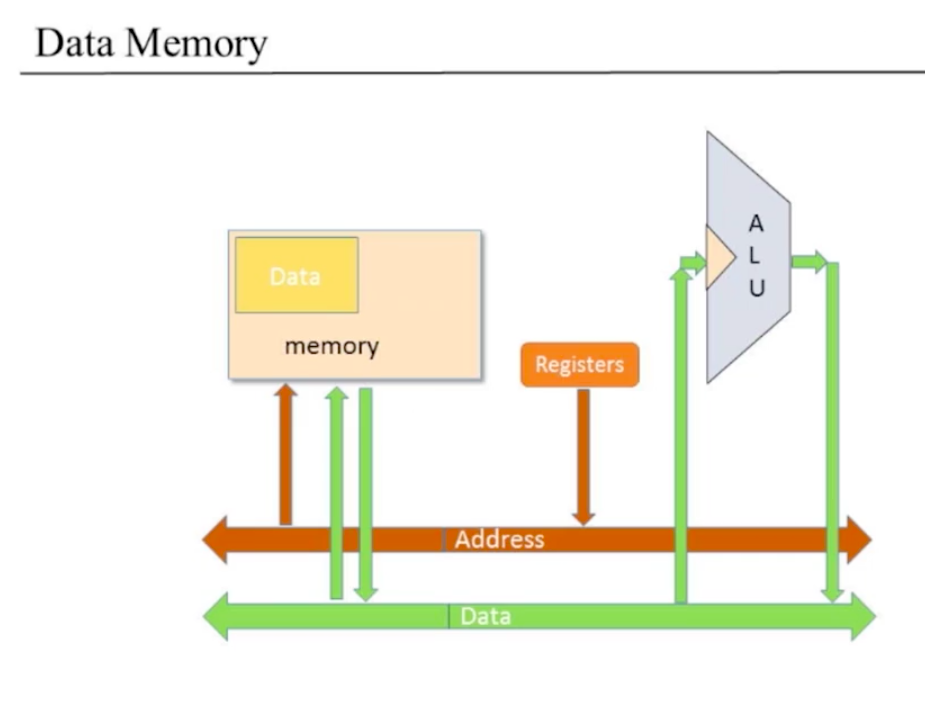

# Computer Architecture

## 주요 개념

폰 노이만, 하버드 아키텍쳐, 저장된(stored) 프로그램 개념, 불러오기 실행하기 사이클(fetch-execute cycle), 데이터 버스, 명령 버스, CPU, 컴퓨터 디자인

## 폰 노이만 아키텍쳐

### 보편성

- 많은 다른 소프트웨어 프로그램을 실행할 수 있는 같은 하드웨어
- 이론
  - 보편적인 튜링 머신
- 실제
  - 폰 노이만 아키텍쳐

### 저장된 프로그램과 컴퓨터

### 컴퓨터의 주요 요소

- CPU
  - ALU(Arithmetic Logic Unit)
  - 레지스터
- 메모리
  - 데이터
  - 프로그램

### 정보의 흐름(컴퓨터 전체)

- 흐름의 주체
  - 데이터
  - 주소
    - 어떠한 명령을 지금 실행하고 있는가
    - 메모리의 어떠한 데이터를 지금 접근할 필요가 있는가
  - 컨트롤
    - 일정한 시점에 무엇을 해야 하는가?
    - 컴퓨터에 부과하는 명령
- 흐름을 도와주는 역할
  - 버스
    - 데이터 버스
    - 주소 버스
    - 컨트롤 버스

### 컴퓨터의 주요요소 설명

#### ALU

- 숫자를 받고, 연산을 행해야 함
- 데이터 버스
  - ALU와 연결된 데이터 버스에게서 데이터를 받음
  - ALU가 연산을 마치고 난 다음의 결과를 데이터 버스에게 전달
- 컨트롤 버스
  - ALU가 어떠한 연산을 해야 하는지 컨트롤 버스에게서 명령을 받음
  - ALU가 연션을 마치고 난 다음의 결과와 함께 다음 연산을 기다림(JMP 등등)

#### 레지스터

- 데이터 버스
  - 데이터로부터 데이터를 받음
  - ALU에게 데이터를 제공, 데이터를 받음
- 주소 버스
  - 일부 레지스터는 주소를 RAM/ROM상의 특정 레지스터의 주소를 나타내는데에 사용
  - 메모리와 연결됨

#### 메모리

- 데이터 메모리
  - 데이터 버스
    - 데이터를 ALU나 다른 곳에 주고 받음
  - 주소 버스
    - 레지스터에게서 주소값을 받음
- 프로그램 메모리
  - 데이터 버스
    - 명령을 보냄
  - 주소 버스
    - 특정 주소에 있는 명령을 요청
  - 컨트롤 버스
    - 명령 자체가 나머지 프로그램들에게 무엇을 해야하는지 명시

## 불러오기 실행하기 사이클(Fetch-Execute Cycle)

### 기본적인 CPU 루프

- 프로그램 메모리에서 명령을 **불러옴**
- **실행함**

#### 불러오기

- 프로그램 메모리의 주소에 다음 명령의 주소를 넣음
- 그 주소에 해당하는 메모리 내용을 읽어서 명령 코드를 불러옴
  - 위의 작업을 수행할때에 PC(Program Counter)를 이용
  - 프로그램 카운터를 주소 버스를 통해서 프로그램 메모리가 읽어서 그 메모리 번호에 맞는 명령을 내보내줌
  - 프로그램 카운터 안에 들어있는 값은 보통 **기존값+1**, 다른 값을 설정하면 점프연산

#### 실행하기

- 명령 코드는 **무엇을 해야하는가**를 명시
  - 어떤 산술, 논리 연산을 해야하는가
  - 무슨 메모리에 접근 해야하는가(읽기/쓰기)
  - if/JMP
  - ...
- 다른 비트의 부분집합은 연산의 다른 부분을 관리
- 명령의 수행은 레지스터(나/와) 데이터 메모리를 접근하는 것을 포함함

### 불러오기-실행 충돌

- 문제
  - 명령을 불러올때에는 메모리를 참조
  - 실행할 때에는 마찬가지로 메모리를 참조
- 해결(폰노이만 아키텍쳐)
  - 하나하나 차례로 함
  - 멀티플렉서를 이용
    - 불러오기 사이클: 메모리의 주소 입력에 멀티플렉서를 plug into함
    - 실행하기 사이클: 접근해야하는 데이터 주소를 가르키게 함
- 해결2(하버드 아키텍쳐)
  - 폰노이만 아키텍쳐의 변형
  - 심플함
  - 프로그램과 데이터를 각각 다른 메모리 모듈에 분리
  - 충돌 회피

## CPU(Central Processing Unit)

- 연산
- 어떠한 연산을 행할 것인가, 어떠한 명령을 갖고 올 것인가(컨트롤)

### 핵 CPU: 추상화

- 추상화된 기능
  - 16비트 프로세서
  - 현재의 명령을 실행
    - 프로그래머가 작성한 정적인 명령을 컴퓨터가 실제로 실행하도록
  - 다음 실행할 명령을 확인

### 핵 CPU 인터페이스

- 입력
  - 데이터 값
  - 명령
  - 리셋 비트
- 출력
  - 데이터 값
  - 데이터값을 메모리에 쓰는가?(예/아니오)
  - 메모리 주소
  - 다음 명령의 주소

### 핵 CPU 구현

#### 명령 컨트롤

- A명령의 경우
  - 명령e.g: (0)000101110111001
  - 명령해석
    - op-코드
    - 15비트 값
  - A레지스터에 값을 저장
  - 값을 CPU밖으로 출력
  - 항상 A명령이 MUX16을 통과한다는 보장이 없다. ALU 연산 결과가 통과할 수 있음
- C명령의 경우
  - 명령e.g: (1)110011111010111
  - 명령해석
    - op-코드
    - ALU 컨트롤 비트
    - destination 로드 비트
    - 점프 비트

#### ALU

- 입력
  - ALU 데이터 입력
    - D레지스터
    - A레지스터 / M레지스터
  - ALU 제어 입력
    - 제어 비트(명령으로 부터)
- 출력
  - ALU 데이터 출력
    - ALU 계산의 결과는 D레지스터, A레지스터, M레지스터에 보내짐
    - 어떠한 레지스터가 값을 실제로 받을지는 **destination 비트** 가 결정
      - 000인 경우, 모든 레지스터가 값을 받지 않음
      - 111인 경우, 모든 레지스터가 값을 받음
  - ALU 제어 출력
    - 음수를 출력?
    - 0을 출력?

#### 제어(Control)

- 리셋 버튼(핵 컴퓨터의 CPU에서)
  - 컴퓨터가 기존에 어떠한 프로그램을 이미 갖고 왔음
  - 리셋 버튼을 누르면 프로그램이 동작하기 시작함

- 추상화
  - 출력: **다음 명령의 주소**
    - 그러므로, 프로그램의 동작을 시작하려면 PC = 0으로
    - 점프
      - 비존재: PC++
      - goto: PC=A (goto)
      - 조건 goto: 조건이 참이면 PC = A 아니면 PC++
- 구현
  - reset == 1
    - PC = 0
  - load = f(jump bits, ALU control outputs)
  - load == 1
    - PC = A
  - PC++

## 핵 컴퓨터

- 추상화
  - 핵 기계어로 작성된 프로그램을 실행할 수 있는 컴퓨터
  - 탑-다운 정의

### 핵 CPU

- 핵 기계어로 작성된 명령들을 실행함
  - 명령이 D와 A를 포함하면, 각각의 값들이 CPU 속에 있는 D레지스터와 A레지스터를 읽거나 쓰게 됨
  - 명령이 @x이면 x가 A레지스터에 저장되고, 그 값이 addressM으로 나오게 됨
  - 명령의 RHS(Right Hand Side)가 M을 포함하면, inM으로 부터 이 값을 읽음
  - 명령의 LHS(Left Hand Side)가 M을 포함하면, ALU 출력값은 outM으로서 나오게 되고, writeM 비트가 1이됨
  - 명령의 예
    - M = D+1;
    - D = M;
    - D = D-1; JEQ
  - 점프
    - reset == 0
      - CPU 로직은 점프가 있어야 하는지를 ALU의 출력 결과와 명령의 점프 비트를 사용하여 판단
      - 점프가 있다면
        - PC가 A레지스터의 값으로 설정
      - 점프가 없다면
        - PC++
    - reset == 1
      - PC는 0으로 설정, pc는 0을 출력(프로그램 재시작)

### 메모리

#### 데이터 메모리

- 영역 분리
  - RAM(데이터 메모리, 0 ~ 16383)
  - 스크린 메모리 맵(16384 ~ 24575)
  - 키보드 메모리 맵(24576)
- 메모리 구현
  - RAM
    - 이미 구현
    - RAM16K
  - 스크린 메모리 맵
    - 일반적인 RAM과 같음
    - refreshing 부작용(side effect)
  - 키보드 메모리 맵
    - 유저 입력 부작용을 감지하는 내장 칩

#### 명령 메모리(ROM32K)

- 프로그램이 실행 되는 과정(추상화)
  - 프로그램을 ROM으로 불러옴
  - 리셋 버튼을 누름
  - 프로그램이 실행
- 프로그램 불러오기
  - 하드웨어 구현
    - 램 칩을(ROM32K) 컴퓨터에 직접 꽂아서 실행
  - 하드웨어 시뮬레이션
    - 프로그램은 텍스트 파일로 저장
    - 프로그램을 불러오는 것은 내장 ROM칩에 의해서 모방됨(emulated)

### 핵 컴퓨터 구현

## 프로젝트5 개요

### 하드웨어 구성: 칩의 계층

### CPU

### 데이터 메모리

### 명령 메모리(ROM32K)

미리 만들어져 있음

## 관점

Q) 폰 노이만 아키텍쳐 vs 하버드 아키텍쳐
R) 핵 컴퓨터는 프로그램을 다루는 읽기전용 메모리와 데이터를 다루는 읽고 쓰는 메모리를 나누었다. 이는 **하버드 아키텍쳐** 데이터를 갖고 오는것과 실행하는 것을 하나의 사이클에서 전부 실행 가능. 임베디드 프로그래밍에서 매우 효과적(일정한 기능을 갖는 이미 작성된 프로그램을 ROM에 넣으면 되므로) 전통적인 **폰노이만 아키텍쳐** 는 데이터와 프로그램 둘다 갖고 있는 하나의 RAM이 존재. 여기서는 데이터를 갖고 오는 것과 실행하는 사이클을 분리해서 다뤄야 하므로 복잡함. 실행하는 프로그램이 다른 일반적인 목적의 컴퓨터에서 많이 사용.

Q) 컴퓨터 사이언스에서 이러한 두가지의 다른 행동을 하는 컴퓨터를 모델링 하는 방법이 있는가?
R) 존재한다. 유한 상태 기계. 각각의 다른 상태에 대하여 이러한 정보(다음 행위)를 상태에 대해서 파악 할 수 있음. 상태 레지스터를 추가해서 연산을 변경 가능.

Q) 핵 컴퓨터는 키보드와 스크린과 상호작용 할 수 있는데, 보다 많은 주변 장치와 연결하면 어떻게 그것들을 제어하는가?
R) 실제 컴퓨터는 키보드, 컴퓨터, 마이크, 디스크 등을 갖음. 이는 메모리 영역을 할당하는 것으로 가능. 이는 각각의 주변 장치에 물리적인 신호로 변경되어 전달됨. CPU에서 이를 모두 관리하는 것은 CPU 오버로드를 야기하므로, 장치 컨트롤러(device controller)를 사용한다. 장치 컨트롤러는 외부에서 설치되는 하드웨어(시디, 다운로드 등)로서 CPU의 명령을 실제 장치가 알 수 있는 명령으로 변환 가능. 핵 컴퓨터는 아주 간단하게 이를 구현해 놓았음. CPU가 모든 것을 관리. 실제로는 그래픽 카드와 같은 하드웨어가 스크린을 관리
