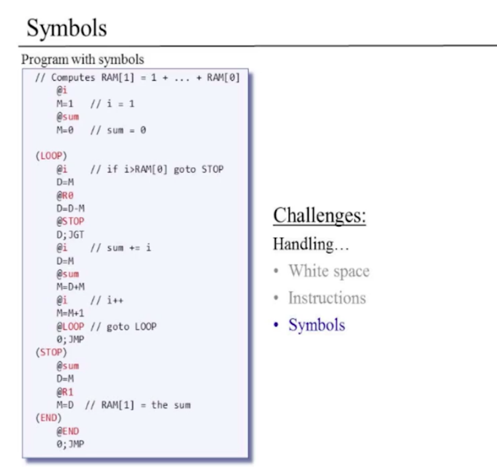
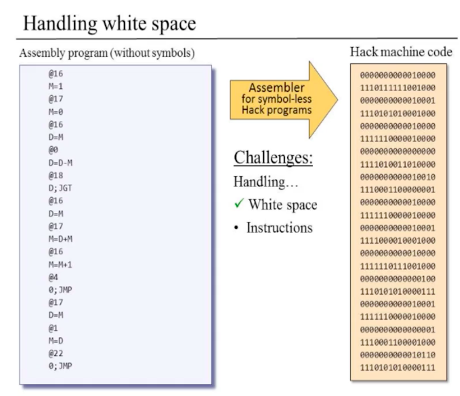
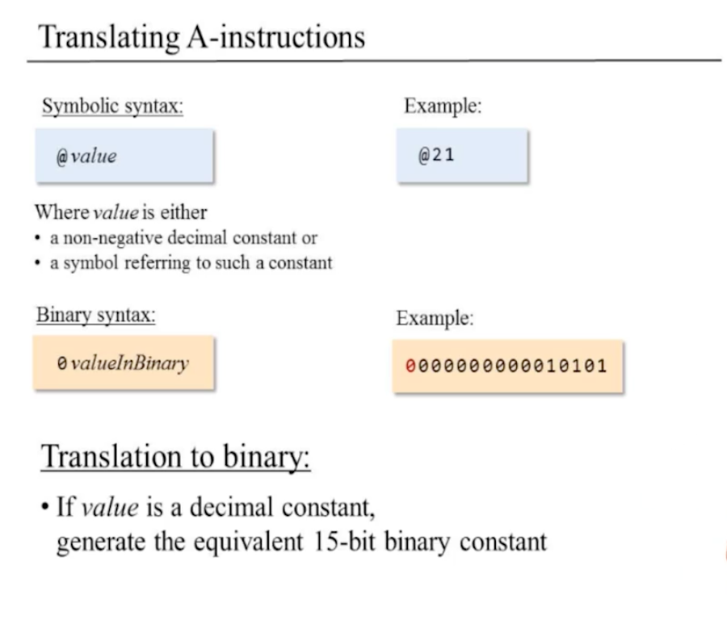
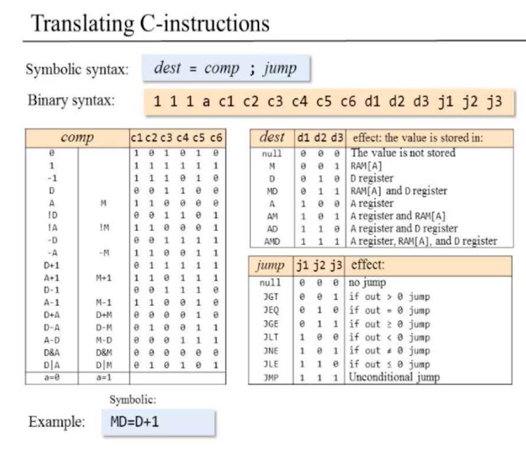
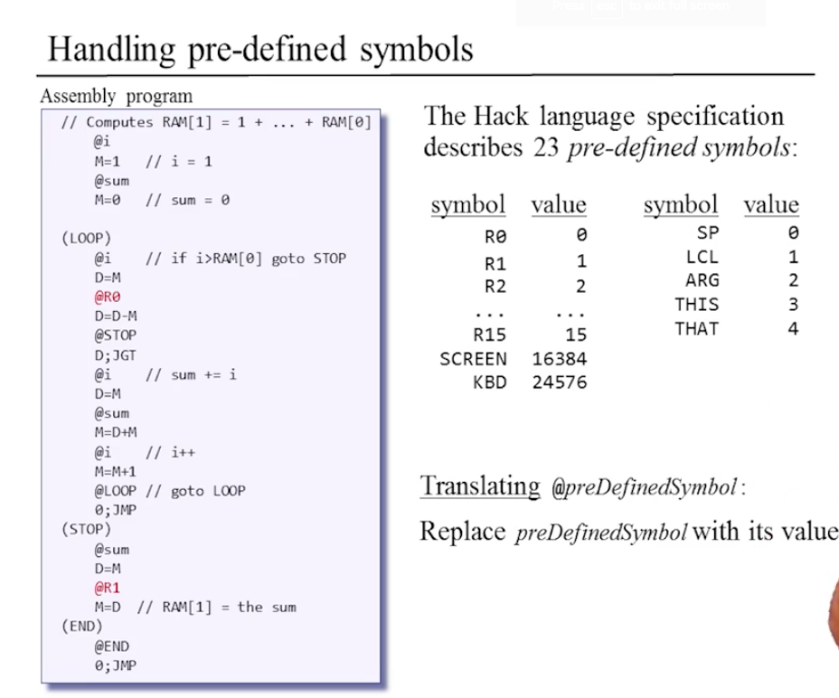
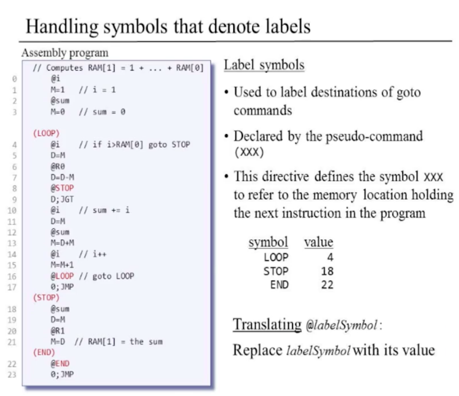
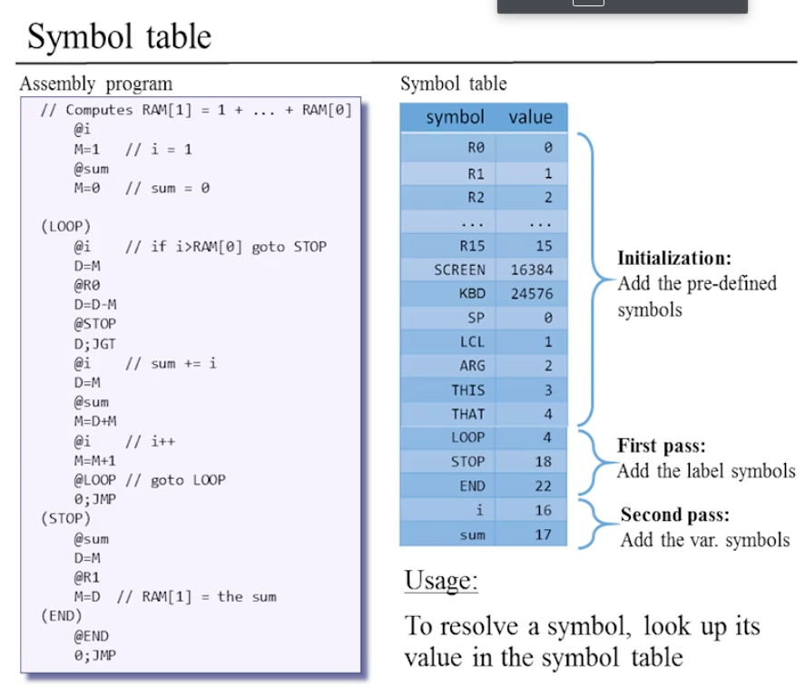
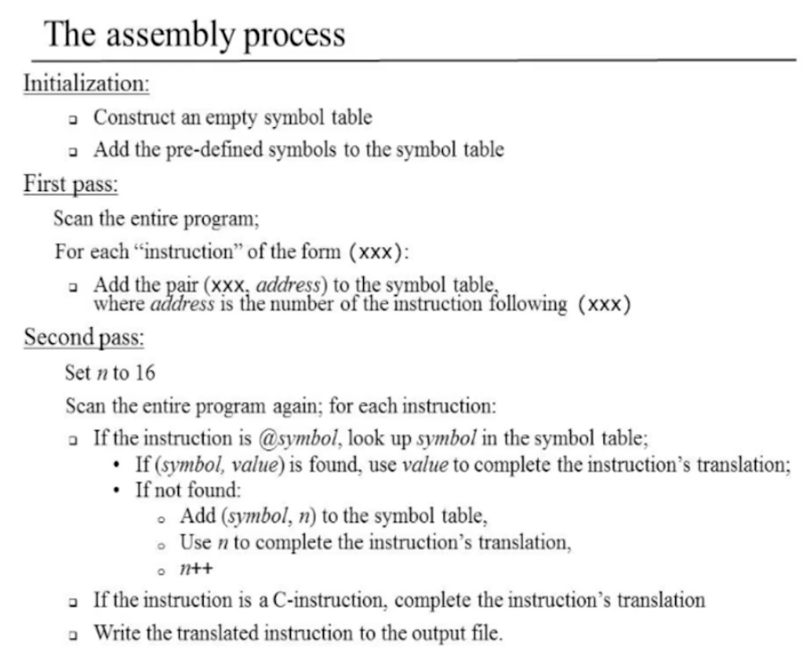
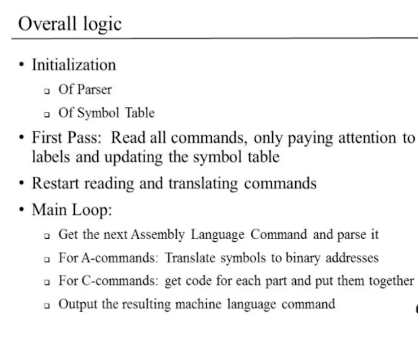

# Assembler

## 일반적인 어셈블리어와 어셈블러

- 어떻게 어셈블리어를 기계어로 변환할 것인가?
  - 어셈블러를 이용
- 어셈블러
  - 소프트웨어
  - 하드웨어 위에 동작하는 첫 소프트웨어 레이어(layer)

### 어셈블러 프로그램이 동작하는 장소

- 기계어로 작성 할 필요 없이 이미 만들어져있는 고차원 언어로 만듬(핵 컴퓨터의 경우)

### 어셈블러 로직

- 다음을 반복(더 이상 읽을 명령이 없을 때 까지)
  - 다음 어셈블리 언어 명령을 읽음
  - 그 명령을 각각 다른 필드(field)로 분해
  - 각각 필드를 바이너리 코드로 변환
  - 각각의 바이너리 코드들을 하나의 기계어 명령으로 결합
  - 기계어 명령을 출력
- 구체적인 방법(How to)
  - 다음 어셈블리 언어 명령을 읽기
    - 화이트 스페이스를 무시
    - 어셈블리 명령을 문자열(array of characters)로 읽어들임
  - 그 명령을 각각 다른 필드로 분해
    - e.g Load R1,18
    - Load / R1 / 18
  - 각각의 필드를 바이너리 코드로 변환
    - Load: 11001
    - R1: 01
    - 18: 000010010
  - 바이너리 코드들을 하나의 기계어 명령으로 결합
    - 1100101000010010

### 심볼들

- 유형
  - 라벨: `JMP loop`
  - 변수: `Load R1, weight`
- 어셈블러는 심볼들이 갖는 이름들을 주소로 변경시켜야 함
  - `Load R1, 5682`
  - `JMP 673`
- 방법
  - 심볼과 주소를 연결하는 테이블을 생성해서 저장
  - 어셈블러는 이를 참조해서 어셈블리 명령을 바이너리 코드로 변경
    - 변수: 테이블에 없는 심볼이 등장하면 자동으로 할당을 해줘야 함
    - 라벨: 라벨이 정의될 때에는 그 심볼에 해당하는 주소를 기록해둬야 함(어디에 라벨에 해당하는 명령어가 존재하는가?)
      - forward reference(라벨이 정의 되기 전에 루프로 점프하라는 경우가 나옴)
      - 1. 라벨은 봤으나 아직 모르는 상태로 둠. 그리고 라벨의 정의를 보았을때 테이블에 생성하고 제대로 실행함.
      - 2. 프로그램을 두 번 읽음. 처음 읽을때에는 라벨에만 신경을 씀. 각각의 라벨이 어디에 있는지를 테이블을 생성해 적어놓음. 그 뒤에 프로그램 다시 읽고 실행

## 핵 어셈블리 언어

### 핵 언어 명세: A명령

- @value
- 0바이너리 값

### 핵 언어 명세: C명령

- dest = comp; jump
- 111, a c1 c2 c3 c4 c5 c6, d1 d2 d3, j1 j2 j3

### 핵 언어 명세: 심볼

### 핵 언어: 번역자의 관점

- 명령
  - A
  - C
- 화이트 스페이스
  - 빈 줄 / 들여쓰기
  - 줄 코멘트
  - 한 줄 코멘트
- 심볼
  - 참조(변수)
  - 라벨 선언

위의 것들을 다 다룰 수 있어야지 어셈블러를 쓸 수 있음

### 심볼

- 나중에 다룸

### 심볼 없는 프로그램

- 어려운 점
  - 화이트 스페이스
    - 그냥 무시
  - 명령

단순한 명령들로만 구성된 핵 어셈블리언어

### 앞으로의 계획

1. 심볼 없는 핵 프로그램을 번역하는 어셈블러를 개발
2. 심볼을 다룰 수 있게 변경
3. 어떠한 핵 프로그램도 번역할 수 있는 어셈블러로 만듬

## 어셈블러: 명령만 존재 하는 경우

### A명령

### C명령

parser를 만들어서 각각의 필드를 분리하고 바이너리 코드로 만들어줌

### 전체 어셈블러 로직

1. 어셈블리 프로그램 파일을 읽음
2. 각각의 줄(명령)마다 A명령이나 C명령의 형식에 맞는 필드로 파싱함. A명령은 십진수 값을 이진수 값으로 변경. C명령은 `comp dest jump`의 각각의 필드로 나누고 그에 대응하는 이진수 코드를 생성
3. 생성된 이진수 코드를 합쳐서 16비트의 기계어 코드를 생성
4. 번역된 내용을 한줄씩 명령으로 나타낸 파일로 생성

## 어셈블러: 명령과 심볼을 다루는 경우

- 심볼의 종류
  - 변수 심볼
    - 프로그래머가 값을 유지하기 위해서 메모리 위치를 나타내는 심볼
  - 라벨 심볼
    - goto 명령의 목적지를 나타내는 심볼
  - 미리 정의된 심볼
    - 특별한 메모리상의 장소를 나타내는 심볼
    - e.g R1, ..., R15, SCREEN, KBD
    - 이는 A명령 에서만 다뤄짐

### 미리 정의된 심볼

- A명령 에서만 다뤄짐

### 라벨 심볼

- goto 명령의 목적지를 나타내기 위해서 사용
- `(XXX)`와 같은 형식(pseudo-command)
  - 이는 프로그램상의 다음 명령을 갖는 메모리의 위치를 심볼 XXX로 정의한다는 것

### 변수 심볼

- 미리 정의된 심볼x, 라벨 심볼x 인 심볼은 변수 심볼임
- 각각의 변수는 유일한 메모리 주소를 할당 함(메모리 주소는 16이상)
- 번역 방법(@variableSymbol)
  - 변수 심볼을 처음 본다면, 유일한 메모리 주소를 할당함
  - 나중에 그 심볼을 다시 보면 전에 할당했던 값을 할당함

### 심볼 테이블

1. 미리 정의된 심볼을 심볼 테이블에 심볼-값 으로 추가
2. 프로그램을 처음부터 전체까지 다 읽으면서 라벨 선언만 확인((로 시작하는 라벨), 그리고 그 라벨 선언이 된 장소를 심볼 테이블에 심볼-값 으로 추가(화이트 스페이스는 무시) **첫 패스**
3. 프로그램을 처음부터 전체까지 다 읽으면서 심볼 테이블에 없는 심볼이 나타나면 이는 변수이므로, 심볼 테이블에 심볼-값의 형태로 추가. 이미 있으면 그냥 단순히 값을 치환하면 됨

### 어셈블러의 해석 과정

## 핵 어셈블러 아키텍처의 제안

- 만들어야 할 부분들
  - 어셈블리 파일을 읽고 명령을 파싱하는 파서
  - 어셈블리어를 기계어로 변환하는 것
  - 심볼을 다루는 것

### 파서

- 파일을 읽고 필드별로 분리만 하면 됨
- 의미를 이해할 필요가 없음
- 구체적 방법
  - 파서의 컨스트럭터가 파일 이름을 받아서 초기화 함
    - 텍스트 파일을 어떻게 읽는지 알아야 함
  - 파일의 다음 명령으로 감
  - 현재 커맨드의 필드를 얻음
    - 어떠한 타입의 명령인가?: A, C, 라벨
    - `dest() string, comp() string, jump() string, label() string`

### 변환기

- 파서에서 얻은 정보(dest, comp, jump)를 바탕으로 기계어로 변환
  - go언어에서는 맵을 이용해서 각각의 비트 영역을 파악하면 쉽게 될 것 같음
  - code오브젝트를 만들고 `code.comp(c), code.dest(d) ... `이런식으로 하면 편리(code에게 변환의 책임을 부여)

### 심볼 테이블

- 심볼 자체에 대해서 이해할 필요가 없음
- 심볼 테이블 작성법
  - 이미 정의된 심볼과 값을 추가
  - 프로그램 전체를 한 번 읽어서 라벨 심볼을 전부 추가
  - 두번째 부터 새로 읽는 변수 심볼은 등록하고(메모리에 16주소 이상에서), 같은 심볼이 등장하면 값을 치환해줌

### 전체 로직

## 핵 어셈블러 개발

고루틴을 이용해서 동시처리 할 수 있도록..?

- 전제
  - 핵 어셈블리 프로그램을 실행가능한 핵 바이너리 코드로 변환시키는 프로그램
  - 소스 프로그램은 `xxx.asm`이라는 형식으로 입력됨
  - 생성된 코드는 `xxx.hack`이라는 형식으로 생성됨
  - `xxx.asm`의 에러는 무시됨
    - 문법 오류 등
- 사용
  - `java HackAssembler xxx.asm`
- 아키텍처 제안
  - 파서(Parser)
    - 각각의 명령을 필드 별로 분리
  - 코드(Code)
    - 각각의 필드를 해당하는 바이너리 값으로 번역
  - 심볼 테이블(SymbolTable)
    - 심봁 테이블을 제어
  - 메인(Main)
    - I/O파일과 드라이버 초기화
- 개발 단계
  - 심볼 없는 어셈블리코드 다루는 어셈블러 개발
  - 심볼을 다룰 수 있는 어셈블러 개발

## 관점

- Q) 심볼릭 핵 언어를 바이너리 코드를 변경하는 일 없이 개선하는 것이 가능한가?
  - A) 심볼릭 언어를 프로그래머가 다루기 쉽게 바꿀 수 있음. 매크로(macro) 어셈블러, 매크로 커맨드 추가 가능. `D=M[100]`(매크로 명령)과 같은 코드를 사용 가능하게. `JUMP LOOP`와 가은 코드도 사용 가능하게.
- Q) 어셈블러 코드를 쓸 일이 있을까?
  - A) 매우매우 드물게 사용할 일이 있을 수 있음. 퍼포먼스가 매우 중요한 경우에는 사용할 수 있음. C에서는 어셈블리어를 사용할 수 있는 환경이 제공됨.
- Q) 맨 처음 어셈블러가 어떻게 만들어졌는가? 고차원 언어 없이
  - A) 맨처음에는 손으로 했다. 한 번 손으로 어셈블리어로 해석하고 그 프로그램으로 다른 프로그램에 만들떄 참고해서 재사용.
- 이번 강의는 컴퓨터라는 거대한 블랙박스를 해체해서 학생들이 어떻게 컴퓨터 내부가 동작되는지 알게하는것이 목적. 아직 OS와 고차원 프로그래밍 언어는 다루지 않음
