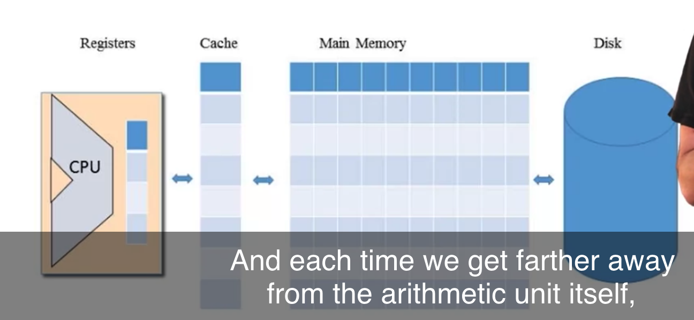
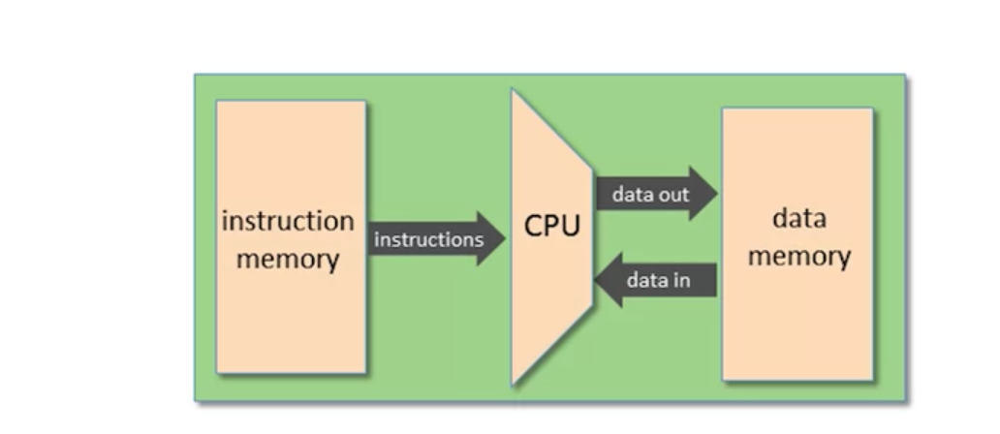

# Overview

- Nand-to-Tetris2에서 배울 수 있는 것들
- 0.2 Machine Language Elements
- 0.3 The Hack Computer and Machine Language
- 0.5 Handling Input and Output

## Nand-to-Tetris2에서 배울 수 있는 것들

## 0.2 Machine Language Elements

### Machine Language

- 개요
  - 하드웨어 / 소프트웨어 인터페이스의 명세
- 특징
  - 하드웨어 아키텍처와 가까운 연관관계를 갖음
  - cost-performance trade-off

### Machine Operations

- 개요
  - 하드웨어에 구현된것에 연관됨
    - Arithmetic Operations
      - add, subtract, ...
    - Logical Operations
      - and, or, ...
    - Flow Control
      - goto instruction X
      - if C then goto instruction Y
- 기계어 사이의 차이
  - operation set의 풍부도
    - divisions?, bulk copy?
  - 데이터 타입
    - data types(width, floating point, ...)

### Memory Hierarchy

Memory Hierarchy diagram

- 배경
  - 메모리에 접근하는건 비쌈
    - need to supply a long address
    - getting the memory contents into the CPU take time
- Memory Hierarchy
  - 개요
    - 메모리에 접근하는게 비싸므로 해당 문제를 해결
  - 구조
    - Registers -> Cache -> main memory -> disk
- Registers
  - 개요
    - CPU가 직접 갖고 있는, 적은 개수의, 쉽게 접근가능한 메모리
    - 기계어의 핵심 부분
  - 종류
    - Data Registers
      - `Add R1, R2`
    - Address Registers
      - `Store R1, @A`
  - Addressing modes
    - Register
      - `Add R1, R2 (R2 <- R2 + R1)`
    - Direct
      - `Add R1, M[200] (Mem[200] <- Mem[200] + R1)`
    - Indirect
      - `Add R1, @A (Mem[A] <- Mem[A] + R1)`
    - Immediate
      - `Add 73, R1 (R1 <- R1 + 73)`

### Input / Output

- Input / Ouput devices
  - 키보드, 마우스, 카메라, 센서, 프린터, 스크린, 사운드, ...
- Drivers
  - 개요
    - CPU가 해당 장치들과 어떤식으로 소통해야하는지 프로토콜을 알아야 하는데, 드라이버가 그것을 제공
  - 일반적인 방식
    - memory mapping
      - e.g)
        - 메모리 위치 12345가 마우스의 마지막 위치를 갖고 있음
        - 메모리 위치 45678은 진짜 메모리 위치는 아니지만, 프린터가 어떤 종이를 사용할지를 결정함

### Flow Control

- jump
- conditional jump

## 0.3 The Hack Computer and Machine Language

Hack computer: hardware

- 간단한 16비트 컴퓨터의 구성
  - CPU
    - 16비트 연산을 수행
  - RAM
    - Data memory
    - 16비트 레지스터들의 시퀀스
  - ROM
    - Instruction memory
    - 16비트 레지스터들의 시퀀스
  - Bus
    - Instruction bus, data bus, address bus
- 레지스터 종류
  - D
  - A
    - 현재 RAM의 address를 나타냄
  - M
    - 현재 RAM address에 해당하는 16비트 RAM 레지스터를 나타냄
      - 메모리

### Instructions

- A-instruction
  - `@value`
  - e.g)
    - Set RAM\[100\] to -1
      - `@100`
      - `M=-1`
- C-instruction
  - `[dest] = comp ; [jump]`
  - e.g)
    - Set RAM\[300\] to the value of the D register -1
      - `@300`
      - `M=D-1`
    - If (D-1==0) jump to execute the instruction stored in ROM\[56\]
      - `@56`
      - `D-1; JEQ`

## 0.5 Handling Input and Output

- Hack computer의 경우, memory map을 이용
  - 특정 메모리 주소군이 screen
  - 특정 메모리 주소가 keyboard
