# Stack Arithmetic

## 키워드

- two-tier compilation, virtualization, virtual machines, VM abstraction, stack processing, pointers, VM implementation, VM translators

## 앞으로의 길

### 헬로 월드의 아래에서

- 의문
  - 프로그램은 어떻게 실행되는가?
  - 어떻게 컴퓨터는 스크린에 문자를 표시하는가?
  - `class`, `function`의 개념은 어떻게 제어하는가?
  - `do`, `while`은 어떻게 제어하는가?
  - 함수는 어떻게 실행되는가?
  - 운영체제는 어떻게 작동하는가?
- 고차원의 언어
  - 위의 질문을 몰라도 고차원의 언어는 **추상화** 되어있으므로 작업할 수 있음
- 추상화
  - 규모가 크고 복잡한 시스템에서 사용자가 쉽게 시스템을 사용할 수 있도록 하기 위해서 정말 중요한 개념. **Not how, what**
  - 하지만 누군가는 반드시 저 수준의 레벨을 생각해야만 함
    - assembler
    - virtual machine
    - compiler
    - operating system

### 고차원에서 저차원 프로그래밍으로

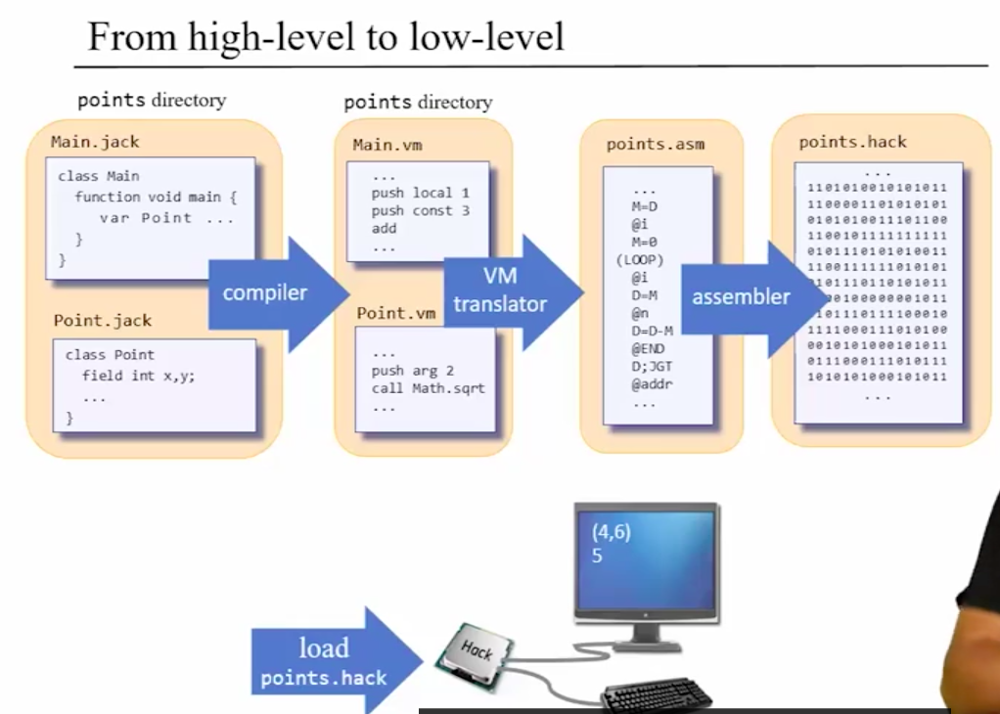

### 시작하기 전에

- 하드웨어 파트보다는 더 어려움
  - 직접 프로그램을 짜야함

## 프로그램 컴파일 프리뷰

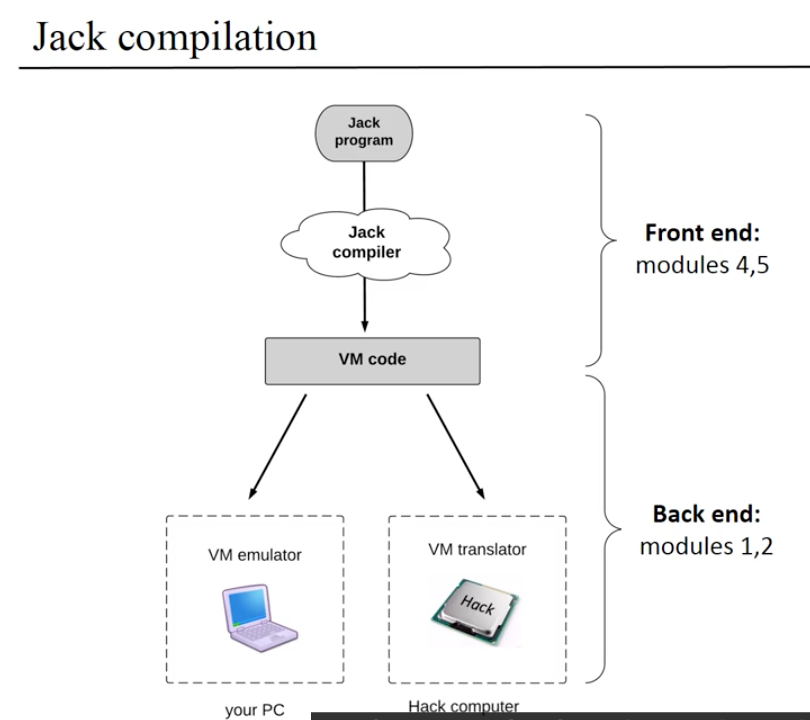

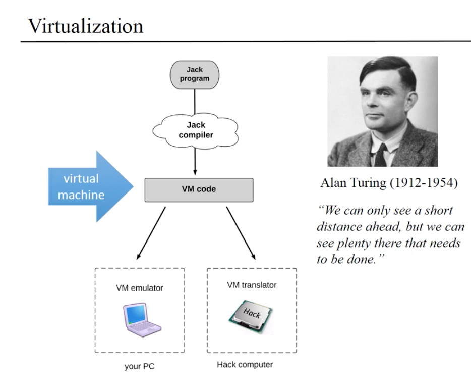

Write once run anywhere

- 티어1: 가상 머신
  - VM코드(바이트 코드) 생산
- 티어2: 가상 머신 구현(추상화)
  - VM코드를 각각의 기계에 맞는 기계어로 변환
  - 플랫폼에 맞춰서 코드를 변환해줌
- 원리
  - 고차원의 언어와 저수준 프로그래밍의 격차가 워낙 크기 때문에, 그 중간의 격차를 두개의 레이어로 추상화 함
    - 컴파일러
    - VM 구현(번역기)
  - 큰 하나의 일을 두개의 간단한일로 분할
- 가상화(Virtualization)
  - 90년전 앨런 튜링의 컴퓨터 구현 논문에서 알 수 있음
  - 다른 기계를 실행하는 기계 / 다른 프로그램을 실행하는 프로그램 => 프로그램은 데이터다
  - 사유(reasoning)하는 것에 대한 사유

## VM 아키텍처의 추상화: 스택

- 가상 머신의 언어는 어떻게 디자인해야할까?
  - 목표의 균형
    - 충분히 높은 추상화가 되어있어서 고레벨의 언어와의 갭이 크지 않아야 함(해석가능함)
    - 충분히 낮은 레벨의 구현이 되어있어서 저레벨의 언어를 다루기 쉬워야 함
  - 스택 머신
    - 아키텍처(스택)
    - 명령

### 스택

- 스택연산
  - push
    - 현재 메모리 포인터에 있는 값을 스택에 추가
  - pop
    - 현재 탑에 있는 스택의 값을 메모리 포인터로 돌려놓음
  - add
    - 스택의 탑 두개의 원소를 추출해서 둘을 더하고 결과를 스택에 추가함
  - neg
    - 스택의 탑 원소를 추출해서 음수로 변환한 뒤에 스택에 다시 추가함
  - eg
    - 스택의 탑 두개의 원소를 추출해서 둘이 같은 원소라면 true를 탑으로 추가
  - or
    - ...
- 일반적인 함수를 스택에 적용하기
  - 스택으로 부터 원소를 pop함
  - 함수에 pop한 원소를 인자로 전달
  - 스택에 그 결과를 push함
- 이러한 연산들은 어디에서 오는가?
  - 일단은 스택 머신의 기능에 집중하자

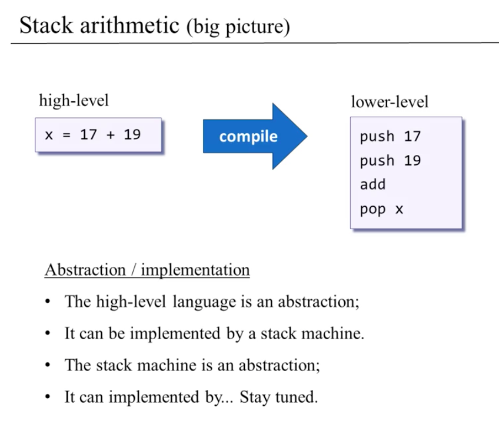

### 스택 머신 모델

- 스택 머신의 조작
  - 산술 / 논리 명령
  - 메모리 영역 명령
  - branching 명령
  - 함수 명령

### 산술 / 논리 명령

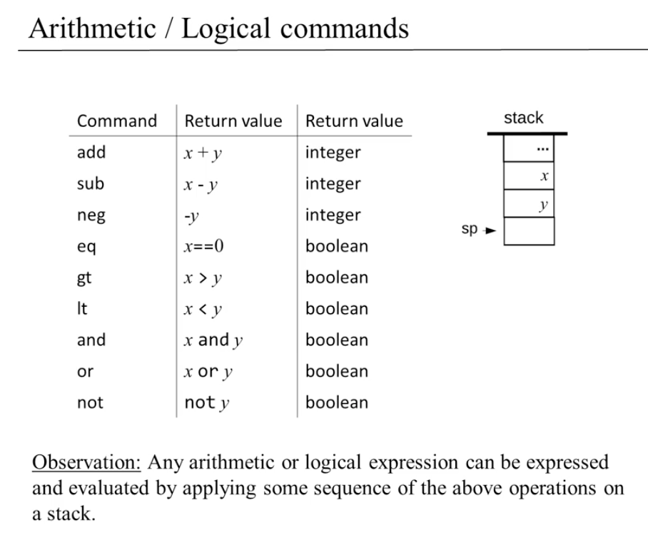

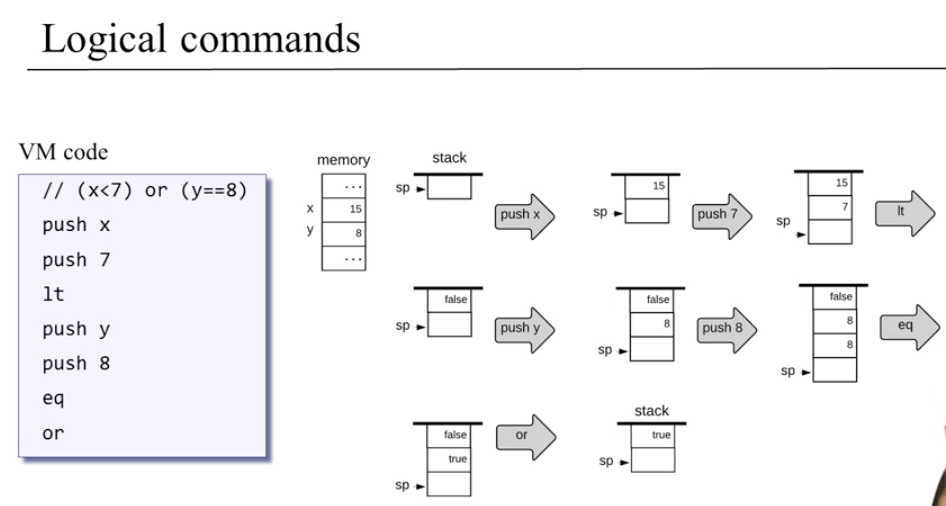

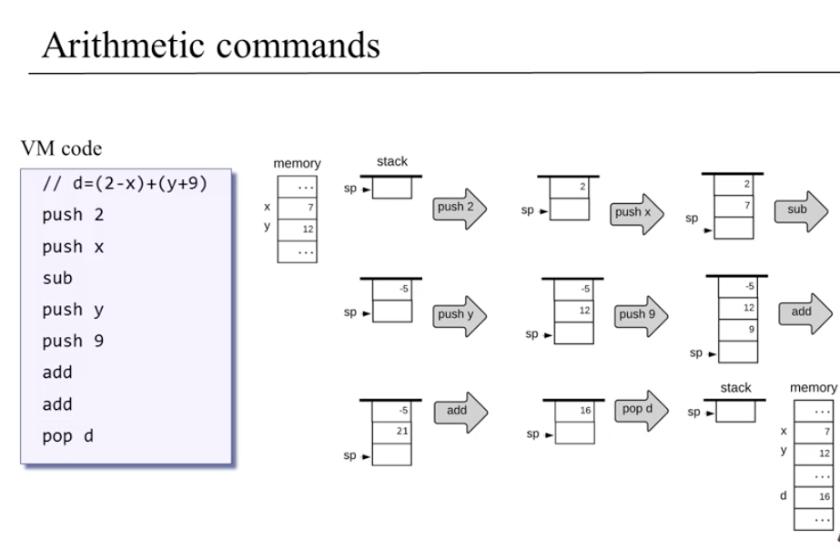

## VM 추상화: 메모리 영역

### 변수의 종류

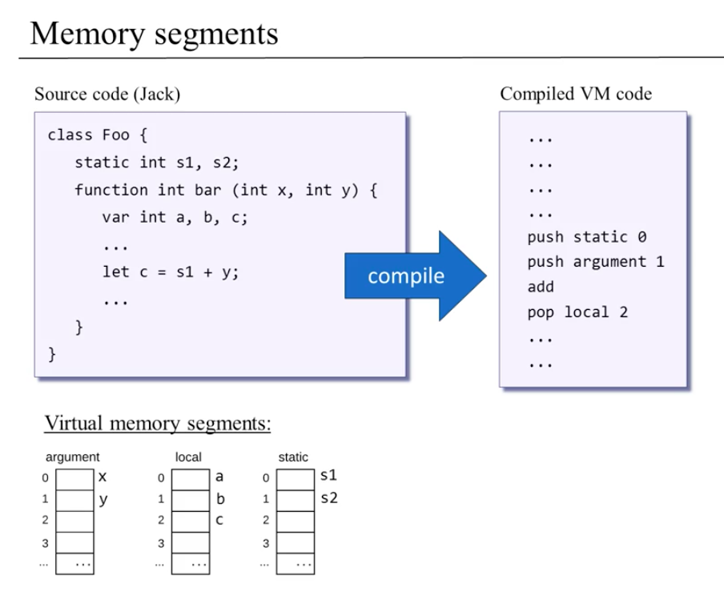

- 변수의 종류
  - 인자
  - 지역 변수
  - 스테틱(static) 변수
- VM은 가상 메모리 영역을 갖음
  - 인자
  - 지역
  - 스테틱
  - 상수
  - ...
- VM 자체는 심볼릭 변수 이름을 알아보지 못함. 모든 변수들은 (가상) 메모리 영역의 참조로 변환됨
  - 이는 모든 가상 머신에서 마찬가지(JVM)

### 메모리 영역

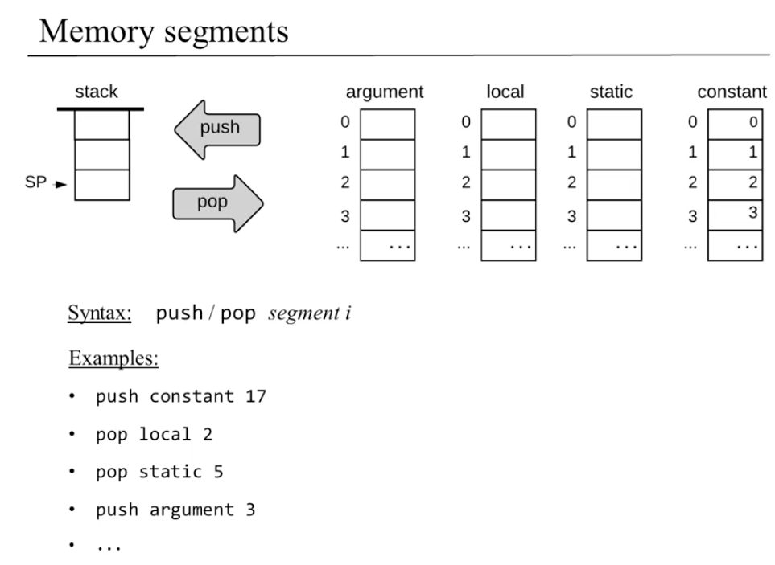

- 정의
  - VM에서 고차원 프로그램의 변수를 분류해서 저장하기 위한 수단
- 종류
  - local
  - argument
  - this
  - that
  - constant
  - static
  - pointer
  - temp
- 문법
  - `push segment i`
    - segment: argument, local, static, constant, this, that, pointer, temp
    - i는 음이 아닌 정수
    - 스택에 추가
  - `pop segment i`
    - segment: 마찬가지
    - i는 음이 아닌 정수
    - 스택에서 탑 요소를 추출

### 숨겨진 코드

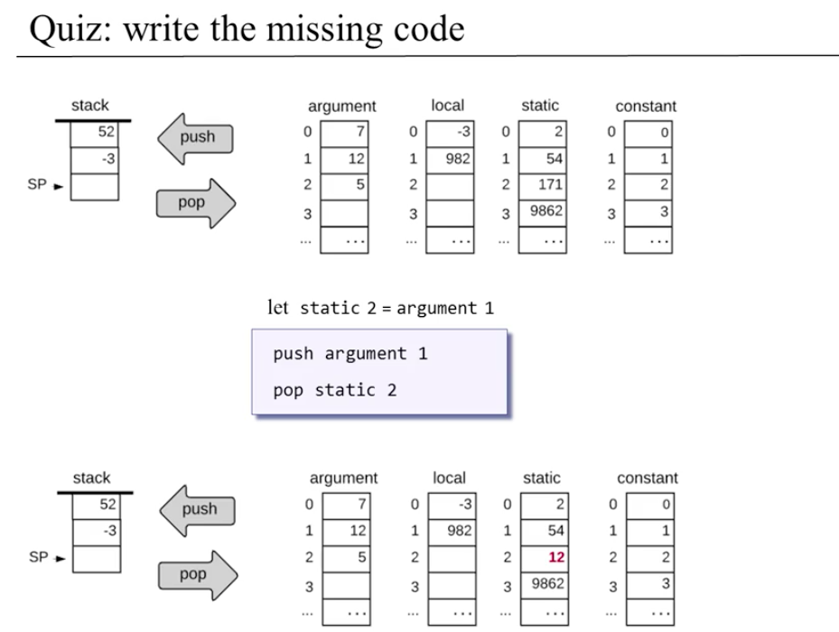

- `let static 2 = argument 1`
  - 이는 다음과 같음:
  - `push argument 1`
  - `pop static 2`
- 스택은 상태가 변하지 않음

## VM 구현: 스택

- 이제까지 했던 연산은 전부 허상(imaginary)임
- 위의 작용을 실제의 폰노이만 기계가 구현할 수 있도록 해야함
- **큰 문제를 한번에 하려고 하지말고, 쪼개려고 생각하자**

### 포인터 조작

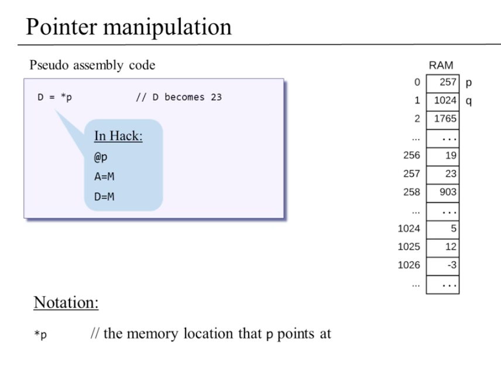

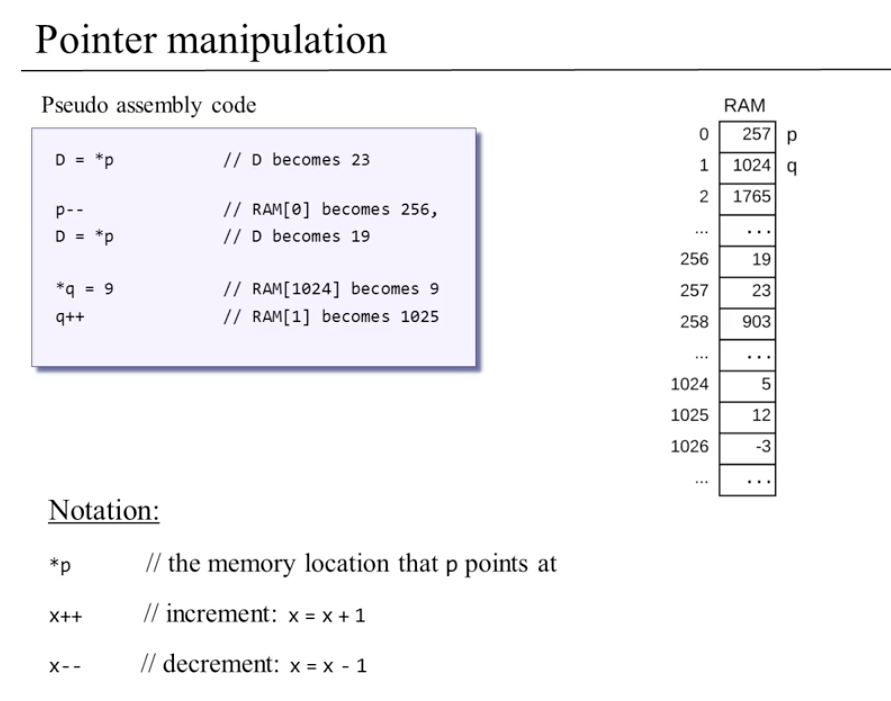

### 스택 머신의 구현

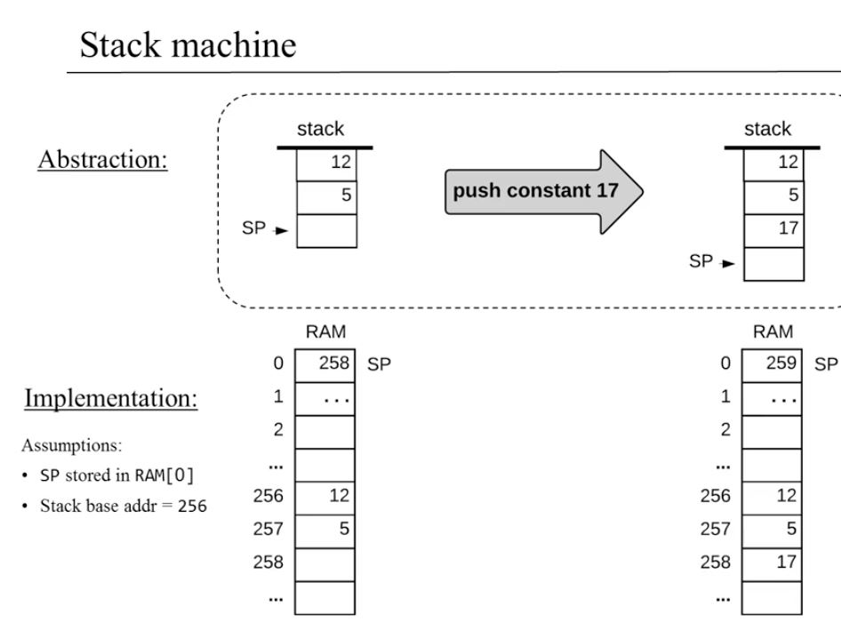

- 전제
  - SP(스택 포인터)는 RAM[0]에 저장됨
  - 스택 베이스 주소는 256
- 예시
  - 스택에 값 17을 추가함
  - 로직
    - `*SP = 17`
    - `SP++`
  - 구현

```
// 스택에 17의 값을 추가
// 이는 17대신 i로 치환하면 일반화 가능
`@17`
`D=A`
`@SP`
`A=M`
`M=D`
`@SP`
`M=M+1`
```

### VM 번역기 관점

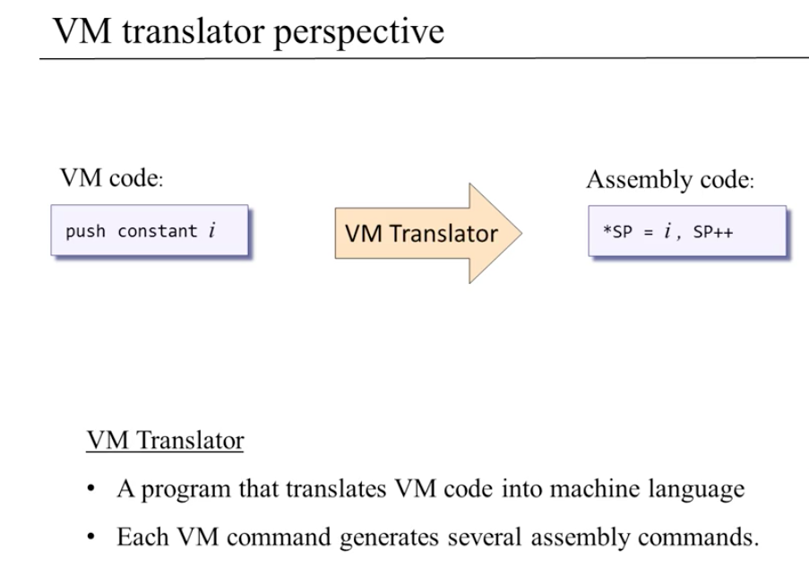

- VM 명령을 핵 어셈블리 코드로 변환
