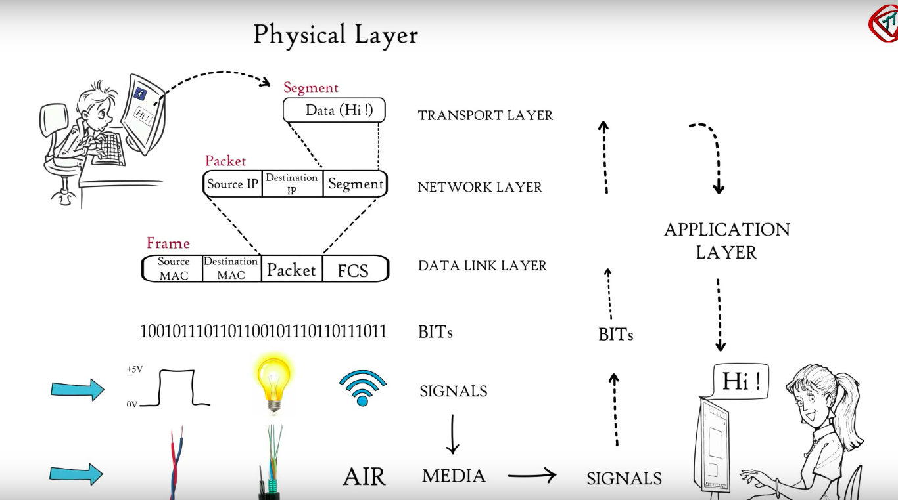
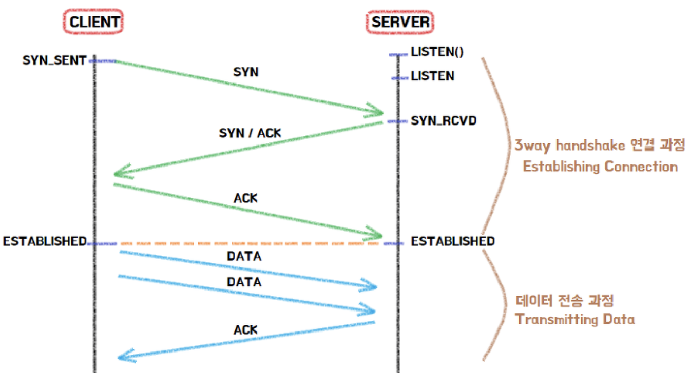

# OSI(Open Systems Interconnection)모델과 TCP모델

- 의문
  - 데이터링크 레이어에서 맥 주소는 Destination의 경우 Source에서 미리 아는것이 불가능하지 않은가?
  - 서브넷의 private IP를 사용하는 노드의 경우 packet의 source IP가 어떻게 정해지는가?
  - 애초에 Data link층을 통해서 데이터를 호스트가 어떻게 수신하는가? 네트워크를 관리하는 데몬 프로그램이 존재하는가?
- 프로토콜에 관한 용어
- 참조
- 개관
- OSI계층
- TCP/IP 5 Layer Model
- 애플리케이션 파일 전송의 예시
- IPv4
- UDP
- TCP

## 의문

- 데이터링크 레이어에서 맥 주소는 Destination의 경우 Source에서 미리 아는것이 불가능하지 않은가?
  - 이는 IP의 Destination의 맥 주소를 데이터 프레임에 넣는 것이 아님
  - Destination까지 가기 위한 경로에서 가장 근접한 장치(중간 노드)의 맥 어드레스를 포함시킴(라우터, 위성, 와이어리스)
    - 그래서 외부 네트워크에 속한 컴퓨터와 커뮤니케이션 할 때, ARP를 이용해서 기본게이트웨이의 맥어드레스를 파악하고 그것을 Data Frame에 포함시킴
    - 기본 게이트웨이 에서 다른 노드로 패킷을 보낼 때도 마찬가지로, 중간목적지의 IP 논리적 주소를 맥 물리적 주소로 바꾸어서 Data Frame에 포함시키는 것을 계속 반복(실제 원하는 주소에 도달하기 까지)
- 서브넷의 private IP를 사용하는 노드의 경우 packet의 source IP가 어떻게 정해지는가?
  - private IP? 아니면 public IP?
  - 먼저 private IP로 두고, gateway에서 public IP로 변환 후 다시 기록해두었던 private IP로 송신?
  - **NAT(Network Address Translator - 보통은 NAPT를 말함)을 이용해서 통신 가능하게 됨**
    - 개요
      - 하나의 글로벌 IP로 복수의 호스트간의 통신이 가능하게 됨
      - IPv4의 IP 주소 고갈 때문에 생긴 기술
      - IPv6에서도 보안의 향상을 위해 사용
      - IPv4와 IPv6 상호 통신을 위한 기술(NAT-PT) 로서 사용됨
    - 원리
      - NAT을 사용하면 NAT 라우터로 source private IP 주소가 글로벌 IP 주소로 변환 된 다음에 패킷을 전송
        - TCP / UDP 헤더의 변경
      - 역으로 패킷을 받을 때는 destination IP 주소가 source private IP주소로 변환된 다음에 전송됨
      - NAT(NAPT) 대응 라우터 내부에는 주소 변환을 위한 테이블이 자동적으로 생성
        - `private source ip 주소:포트1 <=> NAT IP 주소:포트1 <=> destination ip 주소:포트1`
        - `private source ip 주소:포트2 <=> NAT IP 주소:포트2 <=> destination ip 주소:포트2`
        - 위와 같은 식으로 대응(포트를 이용)
        - 위의 테이블은 TCP의 경우 SYN 패킷을 보낼 때, 테이블에 대응관계를 작성하고, FIN 패킷을 보낼 때, 해당 대응이 제거됨(UDP의 경우는 애플리케이션 마다 통신 시작과 종료를 나타내는 신호가 다르므로, 변환 테이블 작성이 용이하지 않음)
  - NAT-PT(NAPT-PT)
    - 개요
      - IPv6와 IPv4 상호 통신을 위한 기술
      - IPv6와 IPv4 헤더를 변환하는 기술
    - 원리
      - private source IP가 IPv6인 것을 포트번호에 대응해서 IPv4로 변환(해당 NAT 라우터의 글로벌 IPv4 IP로)
  - NAT 문제점
    - NAT외부에서 내부의 서버로 접속하는 것이 불가능
      - 사실, 지정한 포트 번호만 내부로 접근할 수 있게 설정 가능하나, 소유하고 있는 글로벌 IP주소의 수와 같은 대수 밖에 설정할 수 없다.
      - *각 포트마다 서버로 대응시키면 되는것 아닌가? - 리버스 프록시처럼*
      - 실제로 일반 공유기의 경우, Portforwarding, DMZ, Super-DMZ 등의 방식으로 외부에서 내부로 통신 가능하게 도와줌
    - 변환 테이블의 작성이나 변환 처리의 오버헤드가 발생
    - 통신중에 NAT에 이상동작으로 재기동 할 경우, 모든 TCP 커넥션이 리셋됨
      - NAT을 2대 준비해서 고장시에도 바꿔서 사용하려고 해도, TCP연결은 반드시 끊김
  - NAT 문제점 해결 방법(NAT 밖에서 안으로 통신하는 법)
    - IPv6을 사용하는 방법
      - 모든 기기에 글로벌 IP를 부여하면 됨
      - 하지만 모든 다른 통신할 네트워크도 IPv6을 사용해야 함
    - *NAT이 있는 환경을 전제로 애플리케이션을 작성하는 것 - 구체적으로 잘 이해가 안됨*
      - 방법 1
        - NAT이 존재해도, 유저가 그것을 의식하지 않고 통신할 수 있도록 하는 방법
        - NAT의 안쪽 호스트에서 동작하는 애플리케이션이, NAT의 변환 테이블을 작성하기 위해서, 더미 패킷을 NAT의 바깥쪽을 향해서 송신함
        - NAT은 더미 데이터인줄 모르고, 변환 테이블에 행을 추가하게 됨
        - 이때에 적절한 형태로 변환 테이블의 행을 작성할 수 있다면, NAT의 바깥 호스트가 NAT의 안쪽 호스트에 접속 할 수 있도록 됨
        - *이러한 방법을 사용하면, 서로 다른 네트워크에 있는 NAT의 안쪽 호스트 끼리의 사이에서도 통신 가능하도록 됨*
          - 구체적으로 어떤 방식으로?
          - NAT안쪽에 서버가 있어도 통신가능?
          - *서로의 합의된 NAT라우터 내의 ip:port를 알아야만 통신가능?*
      - 방법 2
        - 애플리케이션이 NAT 라우터와 통신하여 NAT 테이블의 작성을 함
        - NAT 라우터에 붙어 있는 글로벌 IP 주소를 애플리케이션에 전하는 방법도 있음
        - 대신 구현이 힘들고, 복잡해짐
- *애초에 Data link층을 통해서 데이터를 호스트가 어떻게 수신하는가? 네트워크를 관리하는 데몬 프로그램이 존재하는가?*
  - NIC(Network Interface Card)를 이용하여 한 네트워크 안에서 컴퓨터간 신호를 주고 받음
  - *하지만 이것을 구체적으로 어떻게 이용하고 있는가?*

## 프로토콜에 관한 용어

- 1옥텟 = 1바이트 = 8비트
- word(단어): 복수의 비트의 그룹
  - 16비트 단어, 32비트 단어 등등..
- flag(플래그): 1비트의 제어 함수
  - 1: set, 0: clear

## 참조

- [나무위키 - OSI7 Model](https://namu.wiki/w/OSI%20%EB%AA%A8%ED%98%95)
- [열혈강의 TCP_IP 설명](http://jjoreg.tistory.com/entry/%EC%97%B4%ED%98%88%EA%B0%95%EC%9D%98-TCPIP-%EC%86%8C%EC%BC%93%EC%97%90-%EB%8C%80%ED%95%9C-%EC%84%A4%EB%AA%85)

## 개관

## OSI계층

- 국제표준화기구(ISO)에서 개발한 모델로, 컴퓨터 네트워크 프로토콜 디자인과 통신을, 계층으로 나누어 설명한 것이다.
- 데이터가 한 컴퓨터에서 다른 컴퓨터로 어떻게 전송이 되는가?
  - 레이어로 책임 분담
    - 각 레이어는 프로토콜의 패키지

### 1. Application layer

- 네트워크 애플리케이션에 의해 사용되어지는 프로토콜의 집합(애플리케이션 마다 다른 프로토콜 사용)
  - 웹 브라우저
    - HTTP
    - HTTPS
  - 파일 관리 시스템
    - FTP
  - 메일 관리 프로그램
    - SMTP
  - 가상 터미널
    - SSH
- 역할
  - 받은 데이터로 사용자의 화면에 렌더링 / 사용가능하도록 최종 형태로 변환

단위: Message, Data

대표적 프로토콜: HTTP, SMTP, Telnet, SSH, ...

### 2. Presentational layer

- 개요
  - 해당 레이어의 프로토콜의 역할(Application layer로부터 ASCII 데이터를 받고)
  - 데이터 마다 형태가 다른 차이를 흡수
- 역할
  - Translation
    - EBCDIC
  - Data Compression
    - Lossy
    - Lossless
  - Data Encryption
    - TLS(But application uses TLS as if it were a transport layer)

단위: Message, Data

대표적 프로토콜: JPEG, MPEG, ...

### 3. Session layer

- 개요
  - 컴퓨터 사이의 커넥션 세팅과 관리를 도와줌
    - APIs헬퍼 존재
- 역할
  - Authentication
  - Authorization
  - Session Management

단위: Message, Data

대표적 프로토콜: TLS, SSH, RPC, ...

grpc와 같은 경우, RPC 위에 HTTP/2를 올린 느낌이다.

**여기 까지가 웹 브라우저의 담당 영역**

---

### 4. Transport layer

- 개요
  - 노드간 데이터 전송 관리
- 역할
  - Segmentation
    - 상위 레이어에서 받은 데이터를 Segments라는 단위로 분할
    - Port number
      - 각 세그먼트를 올바른 애플리케이션과 대응 가능하도록 하는 숫자
    - Sequence number
      - 세그먼트들을 올바른 순서대로 조립가능하게 하는 숫자
  - Flow Control
    - 서버에서 클라이언트로 데이터가 어느 속도로 전송되는지를 관리
  - Error Control
    - 누락된 데이터는 Automatic Repeat Request로 다시 요청
    - Checksum을 이용해서 데이터가 오염됐는지 확인

단위: Segment

대표적 프로토콜: TCP, UDP, ...

### 5. Network layer

- 개요
  - 서로 다른 네트워크에 속하는 두 컴퓨터사이의 데이터 패킷을 전송하는 역할 담당
- 역할
  - Logical Addressing
    - IPv4 & IPv6 + Mask(네트워크와 호스트를 분리하기 위함)
    - 상위 레이어에서 받은 각각의 세그먼트에 Source / Destination 아이피 주소를 부여해서 Packet이라는 데이터 단위를 만듬
  - Routing
    - 데이터 패킷을 Source 에서 Destination으로 보내는 것
  - Path determination
    - Source 에서 Destination으로 최단거리로 패킷을 보내는 방법을 찾음
    - OSPF, BGP, IS-IS 프로토콜 사용

단위: Packet, Datagram

대표적 프로토콜: IP, ICMP, IGMP, ARP

### 6. Datalink layer

- 개요
- 역할
  - 상위 레이어에서 받은 각각의 데이터 패킷에 맥주소를 포함시켜서 Frame을 생성(비트의 연속)
    - 여기서의 맥 주소는 중간 노드의 맥주소(e.g 기본 게이트웨이)
  - Access the media(Framing)
    - 데이터가 어떻게 놓여지고, 미디어로부터 전송받는지를 제어
      - Media Access Control
        - 메시지 충돌 방지(CSMA(데이터 미디어를 계속 주시중))
  - Error Detection
    - 체크섬 같이 바이너리를 넣어줘서 데이터 오염 검증에 사용

단위: Frame

대표적 프로토콜: Ethernet, WLAN, PPP, FDDI, CSMA

### 7. Physical layer

- 바이너리의 연속을 물리적 SIGNAL로 변환후 미디어로 전달
  - 전자적 신호
  - 빛 신호
  - 라디오 신호

단위: Bit

대표적 프로토콜: 전선, 전파, 광섬유, 모뎀 ..

## TCP/IP 5 Layer Model

- OSI 7 레이어 모델 보다 더 간단함
- ARPANET 네트워크에 의해 개발되었다.
- DoD 모델로도 불림

### 1. Application Layer

- 애플리케이션 데이터 파일 생성, 받은 데이터 활용
- 다른 두 컴퓨터의 애플리케이션과 서비스들의 의사 소통

### 2. Transport Layer

- 파일을 분해하고 순서를 기록
  - 분해된 파일: TCP Payload Segments
  - 순서: TCP Sequence Numbers
- 데이터를 받는 경우
  - 없어진 조각을 찾는데에 활용
  - 순서를 바로잡는데에 활용
  - 애플리케이션과 연결된 포트를 제공
    - TCP(Transmission Control Protocol)
    - UDP(User Datagram Protocol)

### 3. Internet Layer

- 각각의 조각에다가 출발지와 목적지의 IP주소를 작성
  - 보내는이: Source IP 주소
  - 받는 이: Destination IP 주소
- 이 주소는 라우터가 받는이의 주소를 확인해서 해당하는 아이피가 자신의 서브넷에 속하는지 판단하기 위해서 사용된다.
  - IPv4: 32비트
  - IPv6: 128비트
- 패킷이 다양한 다른 서로 연결된(interconnected) 네트워크로 다닐 수 있게 도와준다.
  - addressing & routing 함수를 도와준다.
  - e.g 이더넷 - 와이파이 - 이더넷 연결이 가능

### 4. Network Access Layer

- 데이터 파일의 타입을 선택
  - 메일의 경우, air mail, surface mail, priority mail 등
  - 위성 커뮤니케이션
  - 모바일 커뮤니케이션: 3G, 4G(LTE), 5G
  - 광 섬유 케이블
- 단일 타입 네트워크의 커뮤니케이션을 제공
  - 이더넷, 와이파이, 블루투스, 모바일 커뮤니케이션(2G, 3G, 4G, 5G) etc
  - 한 네트워크 속에서 기기의 어드레싱, 우선도 관리, 에러 관리, 흐름 관리등을 행한다.
  - LAN(Local Area Networks)에서는 NAL 기기의 주소를 MAC(Medium Access Control)주소라고 부른다.

### 5. Physical Layer

- 네트워크 접근 레이어에서 선택한 타입에 따라서, 어떻게 운반할지를 결정
  - Wired, Wireless, Optical
- 기기나 네트워크의 물리적 인터페이스
  - 신호의 송신 수신을 도와준다.
  - Medium & Channel 특징을 갖음
    - 와이어, 와이어리스, 옵틱
  - Modem(Modulator + Demodulator)
    - 마이크로 웨이브, 밀리미터 웨이브, 빛
  - Antenna
    - 단일 안테나, 다중 안테나

## 애플리케이션 파일 전송의 예시

한 컴퓨터(H1)의 애플리케이션의 파일을 TCP/IP 네트워킹을 통해서 다른 컴퓨터(H5)의 애플리케이션으로 전송하는 예를 생각해보자.

1. 컴퓨터 H1의 애플리케이션은 H5로 전송될 파일을 생성
2. 파일은 IP패킷과 이더넷 프레임 사이즈 기준인 MTU(Maximum Transfer Unit)사이즈에 기반하여 `payload segments`로 분할 된다.
3. TCP 헤더가 데이터의 조각에 추가되고, H1과 H5가 3방향 핸드쉐이크로 TCP 세션을 생성한다. (SYN -> SYN, ACK -> ACK) TCP 흐름과 에러 처리는 H1과 H5에 의해서만 처리된다. 라우터가 끼어들지 못한다.
4. IP헤더가 IP 패킷을 생성하기 위해서 추가된다. IPv4(32비트) IPv6(128비트)은 각각 다른 IP 헤더를 갖으며, 헤더는 `Source`와 `Destination` IP 주소를 포함한다.
5. 이더넷 헤더와 트레일러가 IP 패킷에 추가된다. 이는 이더넷 스위치에 의해 사용되며, 이더넷 스위치는 흐름과 에러 처리를 행한다. 만일 WiFi와 같은 다른 프로토콜을 사용하는 경우에는 그 자신만의 프로토콜 헤더를 넣는다.
6. 송신된 데이터는 송신 중간의 라우터에게 IP 주소를 보여준다. 라우터는 라우팅 테이블을 이용해서 패킷을 어디로 보낼지 결정한다. 최적의 라우팅 경로는 라우팅 알고리즘을 사용해서 설정된다.
7. 제대로된 주소에 도착한 이더넷 프레임은 H5의 네트워크 인터페이스 카드에 의해서 받게 된다. 이더넷 헤더와 트레일러가 프레임 내의 에러를 탐지한다. 만일 에러가 탐지되면 프레임은 버려지고 프레임 재송신 요청이 발급된다.
8. 이더넷 헤더와 트레일러는 IP 패킷을 보여주기 위해서 제거된다. IP 패킷 헤더는 많은 네트워크 제어 함수를 포함한다. e.g ECN(Explicit Congestion Notification)
9. IP 헤더는 TCP 헤더를 보여주기 위해서 제거된다. TCP는 데이터 전송 속도를 증감하기 위해서 윈도우 사이즈를 조절한다. TCP는 데이터를 H5의 앱 X와 연결하기 위해서 포트 주소를 포함한다.
10. TCP 헤더가 제거되고, Payload 조각이 나타난다.
11. Payload 조각은 애플리케이션 데이터 파일을 만들기 위해서 조합된다.
12. 애플리케이션 데이터 파일은 앱 X로 전송된다.

## IPv4

- IP 패킷 == 데이터그램(Datagram)
  - 독립적인 존재(entity)
  - 이전 패킷에 의존하지 않고 라우팅가능한 충분한 데이터 보유
- IPv4 패킷 = `헤더 + 페이로드`
  - 헤더 = IPv4 헤더
  - 페이로드(payload) = TCP/UDP 헤더 + 데이터 (페이로드 조각)
- 중요기능
  - 인터네트워킹(Internetworking)
  - 라우팅

### IPv4 패킷 헤더

- IPv4 패킷을 목적지로 전송하기 위한 모든 정보 제공
  - 그래서 데이터그램으로 불린다.
- 버전(Version)
  - 다른 IP 패킷 버전과 구분하기 위함
  - IPv4 패킷은 버전 값을 4 포함한다(IPv6은 6)
- 인터넷 헤더 길이(Internet Header Length)
  - IPv4헤더를 단어(words)단위로의 길이
  - 1단어 = 4옥텟 = 4바이트 = 32비트
  - 최솟값은 5, 그러므로 최소 헤더 길이는 5 * 4옥텟 = 20옥텟
- DS & ECN (8 비트)
  - DS(Differentiated Services) 부분
    - 첫 6비트
    - 서비스 과제의 우선순위를 나타냄
  - ECN(Explicit Congestion Notification)
    - DS뒤의 2비트
    - 네트워크 속도 지연이 발생한 경우 패킷이 전송되는 속도를 낮추라는 명시적인 시그널링
- Total Length
  - 옥텟을 단위로 하는 IP 패킷의 총 길이
  - 최대 IP패킷의 길이는 (2^16-1) = 65535옥텟 = 524280비트
  - 하지만 IPv4 패킷 사이즈는 `Layer 2`의 프레임 사이즈로 제한된다.
  - MTU
    - IP 패킷이 파편화 없이 전송될 수 있는 최대 사이즈
    - 이더넷의 경우: 1500옥텟(여기에 18~22 옥텟이 추가 오버헤드로 들어간다)
    - Wi-Fi의 경우: 2304옥텟(MPDU Mac Protocol Data Unit역시 포함되는 사이즈)
- 아이덴티티피케이션(Identification)
  - IPv4를 유일하게 식별하기위한 연속된 숫자
  - 패킷 분열이 발생한 경우 조각을다시 결합할때 원래의 데이터를 식별하기 위해서 사용
  - `출발지 주소`, `도착지 주소`, `프로토콜` 필드와 함꼐 사용된다.
- 플레그 & 프레그먼트 오프셋
  - 패킷 파편화에 사용
  - 패킷이 너무 커서 나눌떄 사용
  - 플레그는 3비트
    - 비트0: 예비용
    - 비트1: DF(Don't Fragment) 1은 파편화 하지 말라, 0은 파편화 하라
    - 비트2: MF(More Fragments) 1은 더 파편화 하라, 0은 마지막 파편이다
  - 기존 데이터그램에서 이 파편이 어디에 속하는지를 나타냄
    - 마지막이 아닌 나머지 파편은 64비트 길이의 데이터 필드를 갖는다.
- TTL(Time to Live) (8비트)
  - 인터넷에 한 데이터 그램이 얼마나 남아있을 수 있는지 나타냄
  - IP패킷이 지나가는 모든 라우터는 TTL을 하나씩 줄여나가야 한다(hop count와 비슷함)
  - 패킷이 지나가다가 TTL이 0이 되면 그 패킷은 버려진다.
- Protocol
  - IPv4 헤더 다음으로 오는 다음 헤더의 타입을 구별
  - ICMP / IGMP / TCP / UDP / ENCAP / OSPF / SCTP
- 헤더 체크섬
  - IPv4 패킷 헤더를 에러로부터 보호하기 위해서 에러 감지 코드를 붙인다.
  - 그러나 payload쪽 부분은 지키지 못한다.
  - 각각의 라우터마다 헤더 체크섬을 읽고 에러를 체크한다. 왜냐면 IP 헤더는 패킷이 라우터에서 나갈때 바뀔 수 있으므로.. (e.g. TTL, Flags, Fragmentation, etc)
- 출발지 주소 & 도착지 주소
  - 각각의 주소는 32비트
  - 클래스 가능한 주소: Class A, B, C, D, E가 존재(요즘은 안쓰임)
  - CIDR(Classless Inter-Domain Routing) => 요즘은 이게 더 유행, IP를 더 쉽게 할당하고 IP라우팅을 쉽게 해줌.
    - 서브넷의 보다 효율적인 라우팅
    - 네트워크 사이즈 + 단기 예측 수요로 기관의 IPv4 & IPv6 주소 할당을 함
    - `123.234.100.56/24`
      - IPv4 주소 (32비트) 123.234.100.56
      - 서브넷 마스크는 24개의 1
      - 서브넷 마스크: `255.255.255.0`
      - 서브넷 사이즈: 2^(32-24) = 2^8 = 256
      - 라우팅 접두사 `123.234.100.0`도 IPv4주소 `123.234.100.56`와 서브넷 마스크 `255.255.255.0`을 이용해서 얻을 수 있다.
- 옵션(변수, 패딩)
  - IPv4의 패킷 헤더가 32비트의 배수라는 것을 확인하려고 사용된다.
  - 32 비트의 배수에 맞춰서 추가 비트를 생성해줌

MTU Ethernet

MTU Wi-Fi

### IPv6 패킷 헤더

- IPv6 패킷이 목적지에 도달하기 위한 모든 정보 제공(데이터 그램)
- 버전(Version)
  - IP 패킷의 버전을 구분하기 위함
  - 값은 6
- DS & ECS(8비트)
  - DS(6비트)
    - 서비스의 우선순위를 구별
  - ECN(2비트)
    - 네트워크 속도 지연을 감지
- Flow Label
  - 원래는 실시간 애플리케이션을 위한 레이블
  - 지금은 라우터(스위치)에게 라우팅 경로 변경을 적용하지 말라는 명시적인 레이블(수신자가 이 패킷을 다시 순서를 짜맞추지 않을것이기 때문)
- Payload Length(16비트)
  - 확장 헤더를 포함하는 payload의 길이를 옥텟단위로 표현
  - 최대 payload사이즈는 2^16-1옥텟
  - c.f IPv6 Jumbogram
    - 2^32-1옥텟(4GB)
      - Payload Length필드는 0으로 설정
    - Jumbo Payload Option 확장 헤더를 사용해야함
- Next Header(8비트)
  - 다음 헤더의 타입을 나타냄(확장 헤더 or Transport 레이어 헤더)
  - TCP, UDP, ICMP, IGMP, ENCAP, OSPF, SCTP
  - 확장 헤더
    - IPv6헤더는 여러가지 확장 헤더를 붙일 수 있음
    - 각각의 헤더는 다른 형식을 갖음, 대개는 **TLV(Type Length Value + Padding)** 형식
    - ESP(Encapsulating Security Payload), AH(Authentication Header)는 IPv6 보안을 위해 있음
- Hop Limit(8비트)
  - 중간 노드(라우터)를 거칠 때 마다 1씩 줄어들음
  - HL=0이면 버려짐
- 출발지 & 목적지 주소
  - IPv6 출발지 & 목적지 주소
    - 각각 128비트 주소
    - 8그룹의 16비트(4의 16진수 자릿수)
    - 8그룹 x 4 16진수 자릿수 x 4자리수/16진수
    - e.g   `2ac1:05b8:123e:0000:0000:0000:03a0:c234`
    - 1 : 2 : 3 : 4 : 5 : 6 : 7 : 8 groups
      - 4개의 16진수 자리수앞의 0들은 생략될 수 있다.
      - 1이상의 연속된 0의 그룹은 ::로 대체 될 수 있는데, 이는 IPv6 주소에서 한 번만 할 수 있다.
      - `2ac1:05b8:123e:0000:0000:0000:03a0:c234` == `2ac1:5b8::3a0:c234`
    - Unspecified Address `::/128`(서브넷 마스크가 전부 111)
      - 모든 0인 주소
      - IPv4의 `0.0.0.0/32`와 같음
    - 기본 라우터 주소(Default Router) `::/0`
      - 모든 라우터 주소가 0이고 서브넷 마스크도 모드 0
      - IPv4의 `0.0.0.0/0`과 같음
    - IPv4을 IPv6으로 매핑하기 `::ffff:0:0/96`
      - 약간의 예외가 있음
  - CIDR(Classless Inter-Domain Routing) 표기법이 사용됨

## UDP(User Datagram Protocol)

- UDP는 애플리케이션 연결에 있어서 포트 정보를 제공
- 연결 없음
  - UDP는 엔드 포인트-엔드 포인트 연결에 있어서 별도의 확인을 하지 않는다.
- 포트
  - UDP는 출발지의 목적지 컴퓨터의 애플리케이션 연결을 위한 포트 정보를 제공함.
  - UDP헤더는 출발지 포트와 목적지 포트를 포함함
- 길이
  - 길이 필드는 UDP 부분의 전체 길이를 포함하며, UDP 헤더와 데이터 둘다 포함한다.
- 체크섬
  - UDP 헤더의 비트 에러를 감지
  - TCP와 IPv4헤더의 체크섬과 같은 알고리즘 사용
  - 에러가 감지되면, 그 세그먼트는 버려지며, 복구 기능은 동작하지 않는다.
  - UDP의 체크섬 필드사용은 선택이다(쓰지 않으면 필드 전체가 0이 됨)

## TCP(Transmission Control Protocol)

### TCP 3-way handshake

TCP 통신 연결 시작

### TCP 4-way handshake

TCP 통신 연결 종료

### TCP 헤더

- TCP 헤더의 최소 길이는 20옥텟
- TCP 헤더는 `flow control`의 역할을 담당하는 다양한 데이터 부분이 존재함
- 필드 설명
  - 체크섬
    - 에러 감지 코드
    - 모의 TCP 헤더, TCP 데이터를 갖음
  - 데이터 오프셋(4비트)
    - TCP헤더의 32비트 단어(word)의 숫자
      - 최소 TCP 헤더의 길이는 20옥텟
    - 추가 옵션이 사용되면, TCP헤더가 32비트 단어들의 배수가 되도록 패딩이 추가될 수 있다.
  - 비축(reserved 4비트)
    - 매래의 사용을 위한 비트
  - 출발지 & 목적지 포트(16 비트)
    - 자주 사용되는 포트 번호
      - 20 = FTP(File Transfer Protocol)
      - 21 = FTP Control
      - 23 = Telnet
      - 25 = SMTP(Simple Mail Transfer Protocol)
      - 35 = Private Printer Server Protocol
      - 53 = DNS(Domain Name System)
      - 80 = HTTP(Hypertext Transfer Protocol)
      - 123 = NTP(Network Time Protocol): 시간 동기화
      - 143 = IMAP(Internet Message Access Protocol): 이메일 메시지 관리
  - PSH 플레그(1비트): 푸시 작용
    - `PSH = 1`은 데이터 조각을 받는 애플리케이션으로 푸시함
    - 푸시는 받게되는 데이터 조각들이 빠르게 애플리케이션에 의해서 사용되게 함(원래는 각각 분리된 데이터 조각이 일정 단위로 다시 합쳐져야 애플리케이션이 사용할 수 있으나 이 플레그가 참이면 바로 사용된다)
  - URG(Urgent 긴급한) 플레그(1비트)
    - 헤더의 Urgent Pointer field가 사용됨
  - UP(Urgent Pointer 16비트)
    - Urgent data location을 가르킴
    - 수신자가 얼마나 많은 urgent data가 오는지 확인 가능
    - SN(Sequence number) + UP(Urgent Pointer) = Urgent data의 마지막 sequence number를 나타냄
