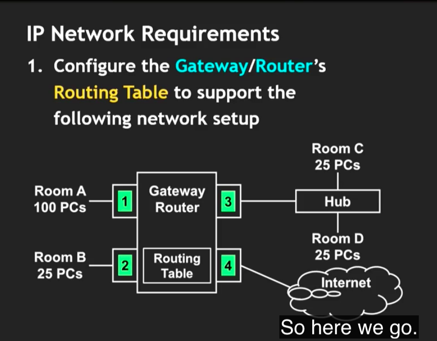
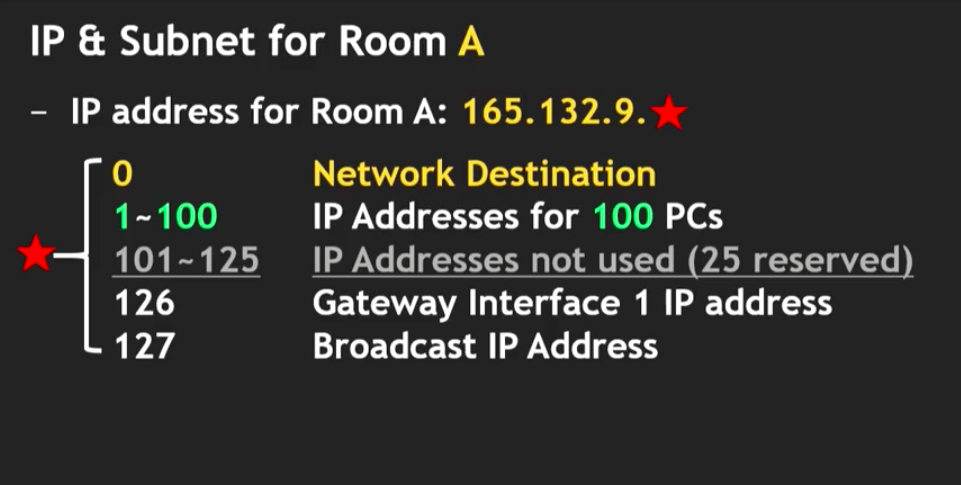
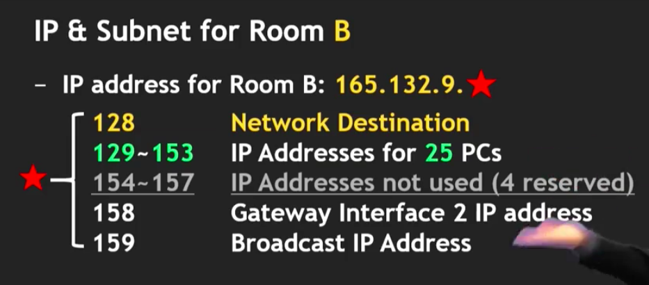
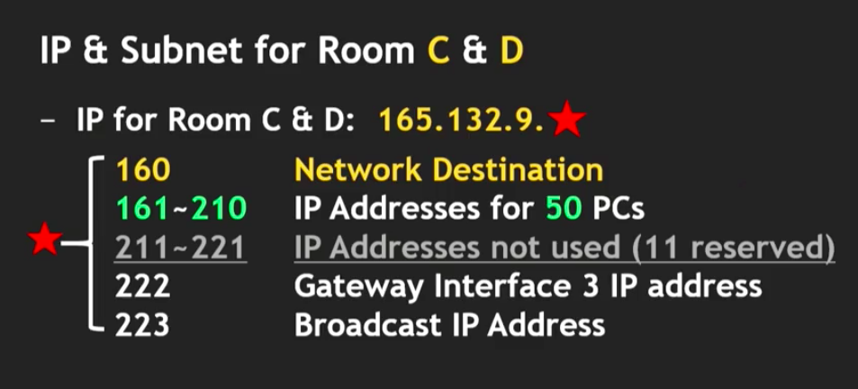
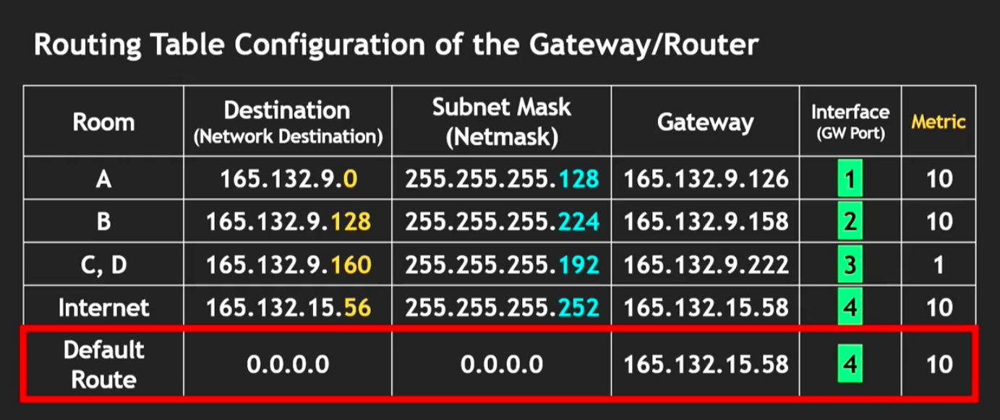
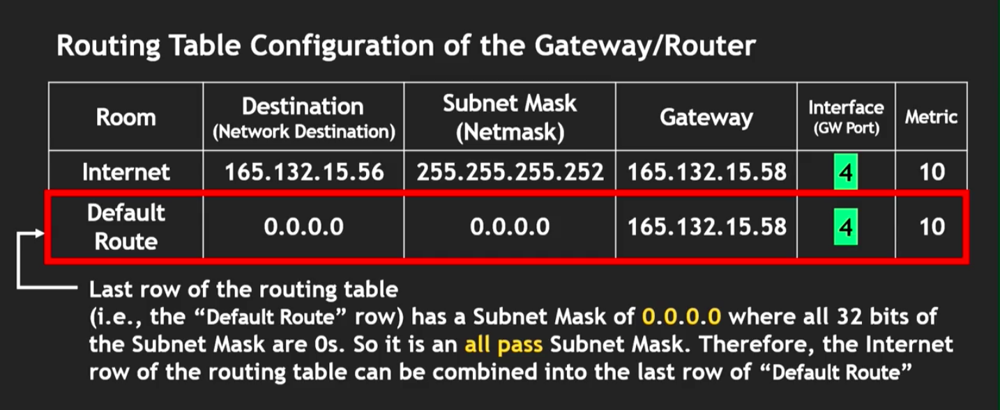

# 네트워크 기초

헷갈리는 것

- 가상 IP?
- 서브넷에 할당되는 IP는 전부 진짜 IP인가?
- VPN?

## 나의 컴퓨터로 보는 네트워크 기초

맥의 경우 시스템 환경설정에서 네트워크를 참조

### IP 주소

- 165.132.126.159와 같은 형태
  - 1바이트.1바이트.1바이트.1바이트
  - IPv4의 경우는 32비트(4바이트)이다.
  - 8비트: 0 ~ 255 = 1바이트 = 1옥텟
- 인터페이스 마다 고유의 IP 주소가 필요하다.
  - e.g 하나의 핸드폰도 2G 3G 4G에 따라 다른 IP주소 사용
  - 이더넷과 와이파이는 같은 컴퓨터라고 해도 기본적으로 다른 IP주소를 사용한다.
  - 그러므로 하나의 전자 제품이 많은 IP 주소를 사용하게 된다.

### Subnet Mask: 서브넷 마스크

- 인터넷은 서브넷으로 나뉘어져 있다.
  - 서브넷은 또 다른 서브넷으로 나누어져 있다.
  - 라우팅 효율화
- 서브넷 마스크는 클라이언트(PC)가 연결된 서브넷의 크기에 기반한다.
- IPv4의 서브넷 마스크는 32비트
  - 왼쪽 MSB(Most Significant Bit)부터 오른쪽 LSB(Least Significant Bit)까지의 0과1의 순열로 구성
- 용도
  - IP주소를 mask(필터링)해서 해당 패킷이 특정 서브넷에 속하는지 아닌지를 빠르게 판단하기 위함
- 255.255.252.0 => 마지막에 10개의 0이 존재
  - 서브넷 마스크는 서브넷 사이즈를 찾는데에 사용되기도 한다.
  - 위의 경우에는 2^10의 IP 주소가 서브넷에 등록되어있다.
  - 하지만 모든 주소를 클라이언트가 사용할 수 있지는 않다.

### Default gateway(router): 기본 게이트웨이

- 클라이언트 컴퓨터가 모든 인터넷 IP 패킷들을 주고 받도록 해준다.
- 다른 말로 IP 라우터 라고도 한다.
- 라우터 == 게이트웨이

### DNS(Domain Name Server): 도메인 네임 서버

- 호스트네임을 IP 주소로 바꾸어주는 서버
  - 호스트네임이란
    - ???@gmail.com 에서 `gmail.com`
    - www.facebook.com 에서 `facebook`
  - 컴퓨터 안에는 메인과 서브가 있어서 메인이 고장나면 서브가 작동한다.

## DHCP(Dynamic Host Configuration Protocol)을 이용한 인터넷 셋업

스타벅스에서 공공 WiFi를 DHCP를 이용해서 제공하고있다.

- DHCP는 컴퓨터나 스마트폰이 로컬 DHCP 서버에 자동적으로 리퀘스트를 보냄
  - 인터넷에 연결하기 위한 IP 주소, 그밖의 네트워킹 인자의 리스폰스를 받고 설정함
  - DHCP 서버가 반드시 존재해야 함
- 셋업이 자동화 되어있어서 로컬 네트워크 관리자에게 인터넷 셋업을 수동으로 요청하지 않아도 됨
  - 그래서 모바일 기기에서 많이 사용
  - IPv4, IPv6에서 사용됨
- 서버에서 전송받는 데이터는 다음과 같음
  - IP 주소
  - 서브넷 마스크
  - 기본 게이트웨이의 IP 주소
  - 다른 인터넷 설정 인자들
- 장점
  - 사용하기 쉬움
  - IP주소의 재사용
    - 컴퓨터나 스마트폰이 인터넷이 필요할 때만 IP 주소를 할당받아서 사용 가능
    - 사용이 끝나면 서버가 그 주소를 다시 회수해서 다른 기기에 사용
    - 효율적인 서브넷 활용
    - IPv4의 한계 극복(2^32 < 43억 IP 주소)
- DHCP의 작용
  - 클라이언트-서버 모델
  - DHCP서버는 다음을 제어
    - IP 주소들의 풀(pools)
    - 클라이언트 정보
      - 기본 게이트웨이
      - 도메인 이름
      - 도메인 이름 서버
      - 타임 서버

### DHCP의 작동 순서

1. 클라이언트가 네트워크에 연결
2. DHCP가 UDP(User Datagram Protocol)를 사용: 클라이언트 포트 68, DHCP 서버포트 67
3. 클라이언트 DHCP 프로그램이 `Server Discovery`메시지를 브로드캐스트에 뿌림
4. 네트워크 내에 존재하는 임의의 DHCP 서버가 `IP Lease Offer`메시지를 클라이언트에게 전송
5. 클라이언트는 `IP Lease Request`메시지를 `IP Lease Offer`메시지를 보낸 서버에게 다시 보냄
6. 그것을 받은 DHCP 서버가 `IP Lease Acknowledgement`메시지를 클라이언트가 인터넷 접속에 필요한 정보들과 함꼐 일정한 `시간 제한(time limitation)`과 함께 보내준다

만일 클라이언트가 인터넷에 다시 연결하려고 하면, 컴퓨터나 스마트폰이 IP주소가 다시 필요하면 DHCP 서버는 이전과 동일한 IP주소를 주려고 하나, 네트워크 관리자의 정책에 따라서 그 주소를 반드시 할당받는다고 보장할 수 없다.

## IP 게이트웨이 라우터 환경 설정

설명 대상의 IP 네트워크의 전제(위의 그림 설명)

1. 게이트웨이(라우터)의 라우팅 테이블을 위의 그림과 같은 네트워크 구조 셋업을 위해서 설정해 나간다.
2. 서브넷(IP 네트워크)에서 각각의 방 A, B, C, D에 있는 모든 컴퓨터들은 개인 IP를 갖는다.
3. 서브넷 `165.132.9.0`에서 256개의 IP 주소를 사용할 것이다.
4. 게이트웨이는 A, B, C, D 네개의 방 + 인터넷과 연결되어 있다.
5. 방 A에는 100개의 컴퓨터가 있는데, 게이트웨이의 인터페이스(게이트웨이 포트)1에 연결되어 있다.
6. 방 B에는 25개의 컴퓨터가 게이트웨이의 인터페이스 2에 연결되어 있다.
7. 방 C와 D는 각각 25개의 컴푸터가 허브(스위치)에 연결되어 있고 이 허브는 게이트웨이 인터페이스 3에 연결되어 있다.
8. 모든 컴퓨터는 인터넷에 연결되어야 하고, 이는 게이트웨이의 4번 포트(인터페이스)에 연결되어 있다.
9. 인터넷 포트 연결은 다음과 같다:
1. IP 주소: `165.132.15.56`
2. 서브넷 마스크: `255.255.255.252`
3. 서브넷 마스크 = 넷 마스크

- IP 네트워크 디자인의 목표
  - 라우터를 환경 설정
  - `165.132.9.0`을 `256`을 사용하여 서브네팅 하기(165.132.9.0 ~ 165.132.9.255)

### 방 A의 서브넷

- 분석
  - 방A(100개의 PC): 100개의 IP 주소
  - 네트워크 목적지(Destination): 1개의 IP 주소, 방 전체를 대표하는 IP <- 가장 작은 IP주소가 할당(0)
  - 브로드캐스트 IP: 1개의 IP 주소 <- 가장 큰 IP주소가 할당(127)
  - 게이트웨이 인터페이스1: 1개의 IP 주소 <- 두번째로 큰 IP주소가 할당(126)
  - 즉 103개의 IP 주소가 필요한데, 서브넷 사이즈는 항상 2의 계승이므로 128이 최소이다.
  - 서브넷 마스크는 `255.255.255.128`
- 결론
  - 방 A의 IP주소: `165.132.9.0` ~ `165.132.9.255`
- CIDR(Classless Inter-Domain Routing)
  - 네트워크 목적지/서브넷 마스크 1의 (32 - 7 = 25)
  - CIDR 네트워크 ID: `165.132.9.0/25`

### 방 B의 서브넷

- 분석
  - 방B(25개의 PC): 25개의 IP 주소
  - 네트워크 목적지: 1개의 IP 주소
  - 브로드캐스트 IP: 1개의 IP 주소
  - 게이트웨이 인터페이스2: 1개의 IP 주소
  - 28개의 IP주소가 필요 -> 32개의 주소가 할당
  - 서브넷 마스크 `255.255.255.224`
- 결론
  - 방 B의 IP주소: `165.132.9.128` ~ `165.132.9.159`
- CIDR
  - 네트워크 목적지/서브넷 마스크 1의 (32 - 5 = 27)
  - CIDR 네트워크 ID: `165.132.9.128/27`

### 방 C와D의 서브넷

- 분석
  - 방 C+D(50개의 PC): 50개의 IP 주소
  - 네트워크 목적지: 1개의 IP 주소
  - 브로드캐스트 IP: 1개의 IP 주소
  - 게이트웨이 인터페이스3: 1개의 IP 주소
  - 53개의 IP주소가 필요 -> 64개의 주소가 할당(64가 서브넷 사이즈)
  - 서브넷 마스크 `255.255.255.192`(서브넷 마스크 + 네트워크 목적지 => 서브넷이 속하는 아이피 주소 범위를 알 수 있음)
- 결론
  - 방 C,D의 IP주소: `165.132.9.160 ~ 165.132.9.223`
- 예외
  - 허브(스위치)에도 IP 주소를 할당해야 할 수도 있지만 그렇지 않을 수도 있으므로 이번에는 고려하지 않음

## IP 라우팅 테이블

앞서 각각의 방에 대한 정보를 라우팅 테이블에 정리하면 다음과 같다:

다음은 ip 라우팅 테이블의 마지막 행에 대한 설명이다:

### IP 패킷이 라우터에 들어 왔을 떄의 행동

1. IP 패킷이 라우터에 들어오면, 라우팅 테이블이 **어디에 이 패킷을 보낼지 결정** 되는데에 사용된다.
2. 전송된 IP 패킷에 대해서, 라우팅 테이블은 **위에서 아래** 로 연속적으로 체크된다.
3. IP 패킷이 들어오면, 첫 행이 가장 먼저 체크된다. (IP 패킷이 해당되는 범위를 찾으면 그 인터페이스 포트로 전송한다)
4. 목적지 IP 주소와 서브넷 마스크를 참고하여 해당 서브넷의 IP주소 범위를 구한다.
5. IP 패킷이 해당되는 서브넷의 IP 범위를 찾으면 그 라우팅 인터페이스 포트로 전송한다.
6. 만일 범위가 해당하지 않으면 다음 행을 체크한다.
7. 마지막 행은 목적지 IP가 `0.0.0.0`이고 서브넷 마스크가 `0.0.0.0`(아무것도 필터 되지 않음)이기 때문에, 모든 아이피가 이 범위에 해당된다. 참고로 마지막 행은 인터페이스 4, 즉, 인터넷으로 연결되어 있으므로 패킷은 인터넷으로 전송된다.
