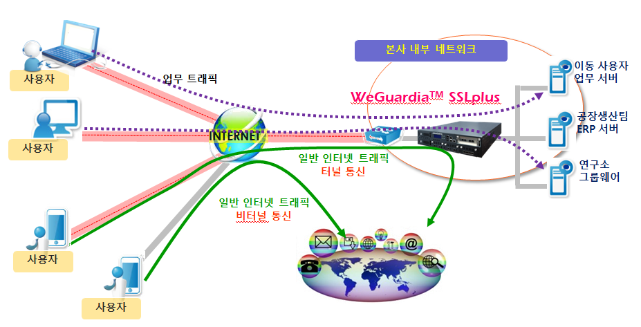

# VPN(Virtual Private Network)

## 의문

- *VPN터널이 구축되고 *router*가 패킷을 암호화 할 때, 해당 암호화는 대칭키 암호인가? 비대칭키 암호인가? 그리고, 만일 대칭키 암호인 경우 어떻게 키를 공유하고 있는가? TLS에서 처럼 비대칭키 암호로 대칭키 키를 래핑 해줘서 운반하는 원리인가?*
- *정확히 네트워크 개념으로서의 터널이란 무엇을 의미하는가?*

## 개요

- 사설 네트워크를 만들 때, 인터넷 네트워크와 암호화 기술을 이용하여 통신 시스템을 구축하는 것
  - 인터넷 회선을 암호화된 규격을 통해 마치 개인 전용선 같이 끌어 쓰는 것이 핵심
- 위의 그림에서
  - 일부 사용자는 vpn 터널링을 설정한 뒤에 본사 내부 네트워크의 사설 node에 접근 가능하다
    - 라우터가 사용자에게 사설 ip를 부여했기 때문(*테이블이 존재?*)
  - 일부 사용자는 vpn 터널링을 설정한 뒤에 인터넷을 접속해서 본사의 라우터의 공인 ip로 인터넷에 접속 가능하다
  - 사용자와 라우터 사이의 통신이 특정 프로토콜로 패킷이 가공되어 암호화가 되는 것임

## 사용 프로토콜

- PPTP(Point to Point Tunneling Protocol)
  - PPP 기술을 확장하여 만든 규격
  - 현재는 보안상의 이슈로 사용되지 않음
- L2TP(Layer 2 Tunneling Protocol)
  - L2F와 PPTP 프로토콜의 결합
  - 터널을 확립해주기만 함
  - OS기본 내장
  - 암호화
    - IPsec
      - 구성
        - *IKE(Internet Key Exchange)*
        - *ESP(Encapsulation Security Payload)*
      - 특징
        - 기밀성
        - 무결성
        - 인증
        - 리플레이방지
- OpenVPN
  - TCP와 UDP 선택 연결을 사용
    - TLS를 이용하여 패킷 암호화
    - CA인증서 필요
  - L2TP가 기초규격이지만 세개의 레이어를 확립할 수 있음
    - 프로파일 하나만 있으면 어떤 운영체제에서도 쉽게 연결할 수 있음
    - VPN 장비나 공유기 없이도 VPN 서버 설정 가능
  - 오픈소스
  - 포트를 자율적으로 설정 가능
  - VPN 서버를 직접 구하는 방식
- SSTP(Secure Socket Tunneling Protocol)
  - SSL v3 규격 사용
    - 보안상으로 괜찮은것인가...?
