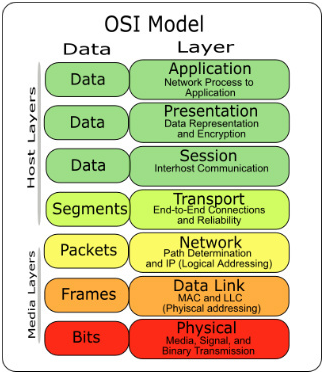
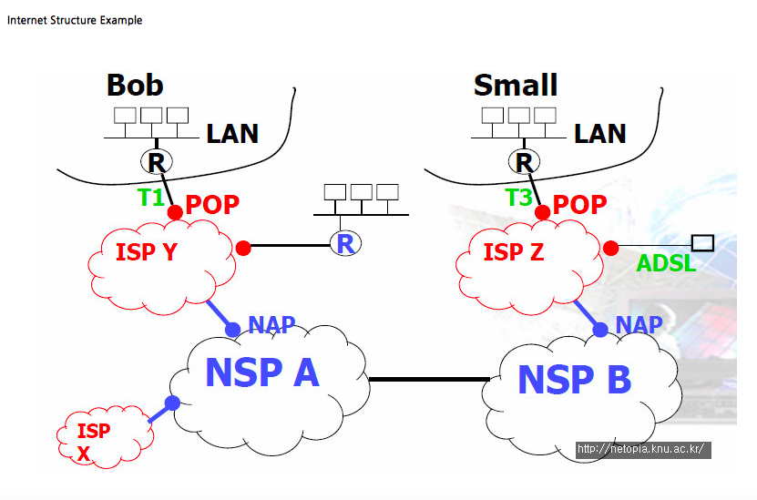
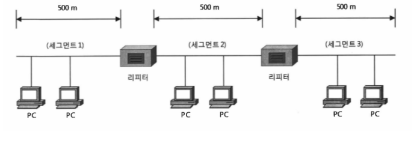
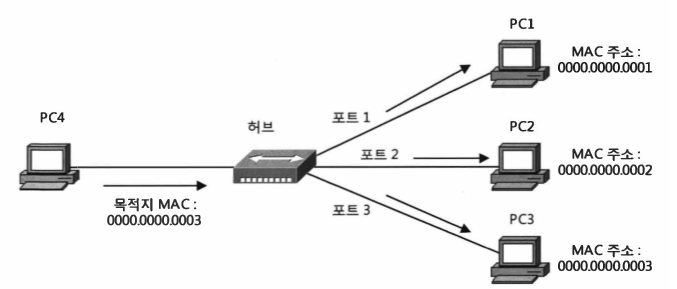
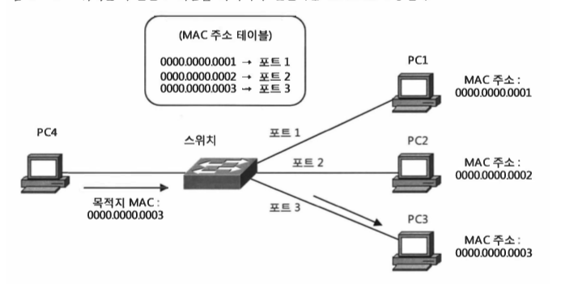
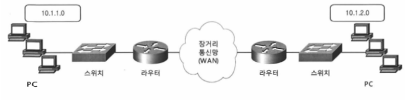
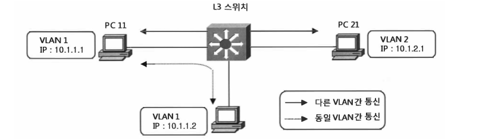

# TCP / IP

- 의문
- 네트워크 기초지식
  - 컴퓨터 네트워크의 등장 배경
  - 컴퓨터와 네트워크 발전의 7가지 단계
  - 프로토콜이란

## 의문

- LAN과 이더넷의 차이?
  - LAN
    - 네트워크의 규모
  - 이더넷
    - 네트워크 구축의 방법론
      - 다른 방식으로는, Token-ring, FDDI, ATM 방식등이 있음
    - CSMA/CD(Carrier Sense Multiple Access / Collision Detection) 프로토콜 사용
      - 네트워크 상에 통신이 일어나는지를 확인(Carrier Sense)
      - 네트워크 통신을 하고 있으면 기다림
      - 통신이 없어지면 자기 데이터를 네트워크 상에 실어서 보냄
      - 동시에 데이터를 보내는 경우
        - Collision 발생
        - 두 PC가 임의의 시간동안 기다린 다음 다시 데이터 전송
        - 너무 많은 Collision이 발생하면 통신 자체가 불가능해지는 경우 발생
    - LAN에서 가장 많이 사용되는 기술 규격
    - MAC주소로 상호간에 데이터 주고 받음

## 네트워크 기초지식

OSI 7 Layer

Internet Structure

### 컴퓨터 네트워크의 등장 배경

#### Standalone에서 Network의 시대로

- Standalone
  - 원래는 각각의 독립된 업무용 단말에서 사람들이 줄을 서면서 작업을 해왔음
- Network
  - 업무용 서버에 복수의 컴퓨터를 서로 동시에 접속하여 사용하는 컴퓨터 네트워크가 고안됨
  - 네트워크의 규모에 따른 분류
    - WAN
      - Wide Area Network
      - 보통 IP 프로토콜 사용
    - LAN
      - Local Area Network
      - 보통 Ethernet 프로토콜 사용

#### 네트워크 통신을 위한 장비들

리피터

허브

- Layer 1
  - MAC주소나 IP주소를 이해하지 못하고 단순히 전기적인 신호만 증폭하는 역할
  - 리피터
    - 전기적인 신호를 증폭시켜 먼 거리까지 도달할 수 있도록 함
    - 전체 LAN에 접속할 수 있는 장비의 수 증가
  - 허브
    - 전기적인 신호를 증폭시켜 LAN의 전송거리를 연장시키고, 여러대의 장비를 LAN에 접속할 수 있도록 함
    - 한꺼번에 많은 장비 연결 가능
    - 수신한 데이터 프레임을 허브로 연결된 모든 장비에게(모든 포트로) 다 전송
      - flooding

- Layer 2
  - MAC 주소와 포트번호가 기록된 MAC 주소 테이블 (MAC address table)이 있어, 목적지 MAC 주소를 가진 장비가 연결된 포트로만 프레임 전송
  - 브리지
    - 이더넷 장비를 물리적으로 연결
    - 프레임의 전송 거리 연장
    - 프레임을 다시 만들어서 전송
    - MAC 주소를 보고 프레임 전송 포트를 결정
  - 스위치
    - MAC주소를 바탕으로 데이터를 올바른 포트에 전송
    - 현대 스위치는 많이 발전해서, MAC주소 뿐 아니라 상위 계층의 정보도 함께 참조하여 스위칭을 결정하도록 함
    - 프레임의 목적지 MAC 주소가 broadcast일 때, 수신한 프레임을 모든 포트로 전송
      - flooding
      - 스위치에 접속한 장비가 많아지면, 브로드캐스트 트래픽도 증가하고, 네트워크 성능저하가 심각해짐
    - VLAN이 도입되어서, 동일한 스위치라도 VLAN이 다르면, 브로드캐스트 프레임이 차단

라우터

L3 스위치

- Layer 3
  - IP주소 등 레이어 3에 있는 주소를 참조하여 목적지와 연결되는 포트로 패킷 전송
  - 서브넷이 다른 IP 주소를 가진 장비간에 통신이 이루어지도록 할 떄 필수적인 장비들이 이 레이어에 속함
  - 스위치는 멀티캐스트, 브로드캐스트 및 목적지를 모르는 유니캐스트 프레임을 수신하면 수신 포트를 제외한 모든 포트로 플러딩 시키나, 레이어 3 장비들은 이런 프레임을 모두 차단
  - VLAN간의 라우팅에 사용됨
  - 라우터
    - OSI에서 3번쨰 계층의 프로토콜을 적용
    - ip주소를 바탕으로 데이터를 올바른 곳에 전송
  - L3 스위치
    - VLAN간의 고속 라우팅을 가능하게 해줌

#### 컴퓨터 네트워크의 역할

- 인간의 신경과 같은 역할

### 컴퓨터와 네트워크 발전의 7가지 단계

- 컴퓨터 네트워크
  - 초기에는 네트워크로 인한 생산성 향상이 목적
  - 지금은 사람과 사람을 연결하는 매개체로서의 목적

#### 1. 배치 처리

- 배치 처리
  - 처리하는 프로그램이나 데이터 등을 모아서 한번에 처리하는 방식
  - 프로그램이나 데이터를 카드나 테이프로 기록하여, 그것을 순서대로 컴퓨터에 읽게 해서 일괄 처리를 하는 형태로 만듬
- 당시에는 컴퓨터가 고액이고 거대해서, 유저가 프로그램을 작성하거나 데이터를 처리하려면 직접 프로그램을 적은 카드나 테이프를 가지고 계산기 센터까지 가야만했음
- 당시에는 컴퓨터가 누구나가 쉽게 쓸 수 있는 기계가 아니었음

#### 2. Time Sharing System(TSS)

- 1대의 컴퓨터에 복수의 단말을 접속하여, 복수의 유저가 동시에 컴퓨터를 이용할 수 있도록 함
  - 단말은, 키보드와 디스플레이를 갖춘 입출력 장치를 말함
- 대화형 프로그래밍이 가능해짐
  - BASIC
  - COBOL
  - FORTRAN
- 네트워크와 컴퓨터의 연결이 시작

#### 3. 컴퓨터 사이의 통신

- TSS에서는 컴퓨터와 단말 사이의 연결에 불과
- 1970년대 부터 컴퓨터와 컴퓨터를 잇는 기술이 탄생
  - 패킷 교환 기술
  - 데이터 이동이 쉬워짐
  - 컴퓨터의 편리함 늘어남
  - 복수의 컴퓨터에서 분산처리함

#### 4. 컴퓨터 네트워크의 등장

- 1980년대 부터 다양한 종류의 컴퓨터를 서로 접속 가능한 컴퓨터 네트워크가 등장
- 윈도우 시스템도 등장
  - 많은 프로그램을 동시에 작업 가능
- 윈도우 시스템과 컴퓨터 네트워크에 의해서 여러 컴퓨터의 자원을 활용하여 다양한 작업을 한번에 가능하게 됨

#### 5. 인터넷의 보급 시대

- 1990년대 개인이 컴퓨터를 갖을 수 있는 환경이 정비
- 다운사이징, 멀티밴더 접속(다른 기종 간 접속)이라는 말이 유행
- E-mail, WWW 붐
- 인터넷 관련 제품이 등장
  - 전세계의 컴퓨터와 커뮤니케이션이 가능

#### 6. 인터넷 기술 중심의 시대

- 전화망 시대를 넘어서 인터넷 망의 시대로
- 네트워크에 연결되는 기계도 휴대전화 뿐 아니라, 가전제품이나 게임기등으로 넓어짐

#### 7. 단순히 이어주는 시대로부터 인전하게 이어주는 시대로

- 컴퓨터 바이러스에 의한 피해, 기업정보 개인정보 노출, 네트워크를 이용한 사기 발생
- 기계의 트러블로 인터넷을 사용할 수 없어지면 큰 장애를 초래

#### 모든 것의 핵심인 TCP/IP

현재 인터넷에서 일어나는 통신들의 핵심은 TCP/IP

### 프로토콜이란

- 정의
  - 컴퓨터나 원거리 통신 장비 사이에서 메시지를 주고 받는 양식과 규칙의 체계
  - 서로 다른 CPU나 OS가 달라도, 같은 프로토콜을 사용하면 서로 통신할 수 있게 됨
- 프로토콜 아키텍처
  - 프로토콜을 체계적으로 정리한 것
  - 예시
    - TCP/IP
      - IP, ICMP, TCP, UDP, HTTP, TELNET, SMTP, ...
      - 용도: 인터넷, LAN
    - IPX/SPX
      - 용도: 컴퓨터 LAN
    - AppleTalk
      - 용도: Apple사제품 LAN

#### 패킷교환에서의 프로토콜

- 패킷 분할
  - 큰 데이터를 패킷이라고 불리는 작은 단위로 분할하여 송신하는 방법
  - 데이터를 패킷으로 분할
  - 발신 컴퓨터와 수신 컴퓨터의 주소를 명시
  - 패킷 번호도 명시
  - 통신 회선에 보냄
- 패킷 헤더
  - 발신 / 수신 컴퓨터 주소
  - 패킷 번호 등
- 통신 프로토콜에서는 헤더에 쓰여진 정보나 그 정보를 어떻게 처리할지를 정해놓음

### 프로토콜은 누가 정하는가?

- ISO(International Organization for Standardization)
  - OSI(Open Systems Interconnection) 이라는 통신체계의 표준화를 진행
  - 표준화
    - 서로 다른 메이커의 제품간에도 호환성을 갖고 이용할 수 있도록 규격을 만드는 것

### 프로토콜의 계층화와 OSI 참조 모델

- OSI 7Layer model
  - 통신에 필요한 기능을 7개의 계층으로 나누어, 기능을 분할
  - 복잡한 네트워크 프로토콜을 단순화
- 계층
  - 하위층과 상위층 사이는 인터페이스
  - 통신 상대사이의 같은 계층과 주고받는 경우의 약속을 프로토콜이라고 부름
- 왜 나누는가
  - 각 계층이 독립적으로 되므로써, 어떠한 계층을 변경해도 그 영향이 전체 시스템에 파급되지 않음
  - 역할이 분담되어 있어서, 각각 구현하기 쉬움
  - 역할의 분별도 쉬움
- 결점
  - 모듈이 너무 나뉘어지면, 처리가 무거워지고, 각 모듈이 비슷한 처리를 하게 되기도 함
- 회화의 예시
  - 현실에서 멀리 떨어진 사람들과 대화를 하기 위해서는
    - 언어 레이어
    - 무선 통신기 레이어
  - 두 레이어화 된 프로토콜을 사용해서 이야기해야한다.
  - 휴대전화에서 무선기로 프로토콜이 바뀌어도 언어 레이어에서는 아무런 영향을 받지 않음
  - 일본어 에서 영어로 바뀐다고 해도 무선 통신기 레이어는 아무런 영향을 받지 않음

#### OSI 참조 모델

- 각 층에서 무엇을 하는가 하는 "역할"을 프로토콜로 정의
- 프로토콜의 내용은 "구현방식"
- 그 프로토콜의 "구현방식"에 준거한 제품 / 통신수단을 이용
- c.f)
  - TCP/IP의 계층 모델은 OSI와는 약간 다르나, OSI 참조 모델을 이용하므로써, 그 이해가 깊어짐
- 계층
  - 7 애플리케이션층
    - 이용되는 애플리케이션 안의 통신에 관계하는 부분 담당
    - 파일 전송, 전자 메일, 원격 로그인 등
  - 6 프레젠테이셔널층
    - 애플리케이션이 다루는 정보를 통신에 적합한 데이터 형식으로 하거나, 하위층의 데이터를 상위층이 처리할 수 있는 데이터 형식으로 바꾸는 등, 데이터 형식에 관한 책임을 갖음
    - 기기 고유의 데이터 형식을 네트워크 공통의 데이터 형식으로 변환
  - 5 세션층
    - 커넥션의 확립 및 절단, 전송하는 데이터의 절단시점의 설정 등, 데이터 전송에 관한 관리
  - 4 트랜스포트층
    - 상대방의 애플리케이션에 데이터를 확실히 전달하는 역할
    - 통신을 하는 양극단의 노드로만 처리(도중의 라우터에서는 처리하지 않음)
  - 3 네트워크층
    - 상대방에게 데이터를 전달하는 역할 담당
    - 전달 경로 선택
  - 2 데이터링크층
    - 물리 층에서 직접 접속 된 노드간, 통신을 가능하게 함
    - 0과 1이ㅡ 숫자열을 의미하는 덩어리(프레임)으로 나눠서, 상대방에게 전달함
  - 1 물리층
    - 비트의 열을 전앞의 고저나 빛의 점멸로 변환하거나, 역으로 전압의 고저나 빛의 점멸을 비트열로 변환함
