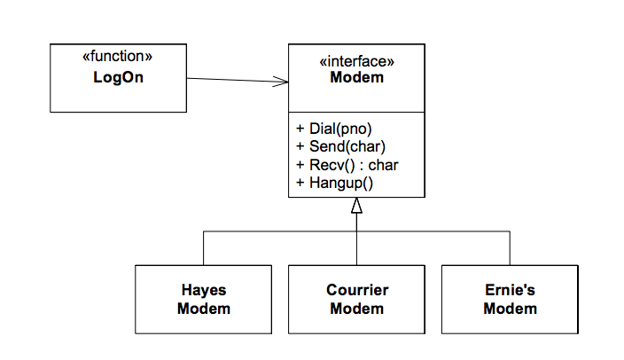
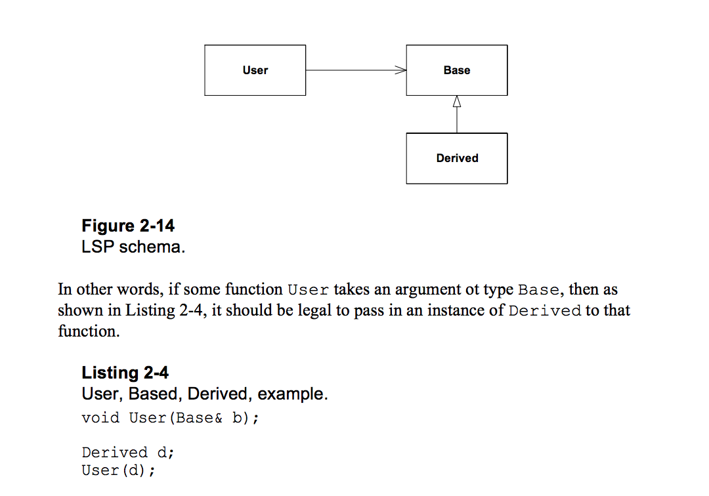

# 오브젝트 지향 디자인이란?(Object-Oriented Design?)

- 참고
  - [What Is Object-Oriented Design?](http://web.archive.org/web/20131031015906/http://www.objectmentor.com:80/omSolutions/oops_what.html)
  - [객체 지향의 사실과 오해 - 메모](https://taehwanno.github.io/post/oop/2016/09/%EA%B0%9D%EC%B2%B4%EC%A7%80%ED%96%A5%EC%9D%98-%EC%82%AC%EC%8B%A4%EA%B3%BC-%EC%98%A4%ED%95%B4)
- 목차
  - Introduction
  - SOLID
  - The principles of Object Oriented Design and Dependency Management
    - 썩은 디자인의 증상
    - 의존성 관리
    - 오브젝트 지향 클래스 디자인의 원칙
  - SRP — The Single Responsibility Principle
  - OCP — The Open Closed Principle
  - LSP — The Liskov Substitution Principle
  - DIP — The Dependency Inversion Principle
  - ISP — The Interface Segregation Principle
  - REP — The Reuse Release Equivalency Principle
  - CCP — The Common Closure Principle Principle
  - CRP — The Common Reuse Principle
  - ADP — The Acyclic Dependencies Principle
  - SDP — The Stable Dependencies Principle
  - SAP — The Stable Abstractions Principle

## Introduction

- 오브젝트 지향 디자인은 60년대 말에 프로그램이 점점 복잡해지면서 생겨난 프로그래밍 패러다임
- 실제 세상의 물체들에 기반한 소프트웨어 시스템 모델링
  - e.g 뱅킹 시스템은 고객, 계좌 오브젝트를 포함하는 등
- 올바르게 사용하는 것이 매우 중요

## SOLID

- 로버트 마틴이 2000년대 초반에 명명한 객체 지향 프로그래밍 및 설계의 다섯 가지 기본 원칙
- Single Responsibility Principle
  - 한 클래스는 하나의 책임만 가져야 한다
- Open / Closed principle
  - 소프트웨어 요소는 확장에는 열려 있으나 변경에는 닫혀 있어야 한다
- Liskov substitution principle
  - 프로그램의 오브젝트는 프로그램의 정확성을 깨뜨리지 않으면서 하위 타입의 인스턴스로 바꿀 수 있어야 한다
  - e.g
    - 원 타원의 모순
- Interface segregation principle
  - 특정 클라이언트를 위한 인터페이스 여러 개가 범용 인터페이스 하나보다 낫다
  - 클라이언트가 자신이 이용하지 않는 메서드에 의존하지 않아야 한다(인터페이스의 분리)
- Dependency inversion principle
  - 프로그래머는 "추상화"에 의존해야지, "구체화"에 의존하면 안된다.
  - 의존성 주입은 이 원칙을 따르는 방법 중 하나다.
  - 내용
    - *상위 모듈은 하위 모듈에 의존해서는 안된다 / 상위 모듈과 하위 모듈 모두 추상화에 의존해야 한다*
    - 추상화는 세부 사항에 의존해서는 안된다. **세부사항이 추상화에 의존해야 한다.**

## The principles of Object Oriented Design and Dependency Management

- 소프트웨어 아키텍처의 정의
  - 높은 수준의 레벨
    - 애플리케이션의 전체적인 모양과 구조를 정의하는 패턴
  - 하나 낮은 레벨
    - 소프트웨어 애플리케이션의 목적과 연관 되어있음
  - 그보다 하나 낮은 레벨
    - 모듈과 그 사이의 연결에 대한 아키텍처
    - 디자인 패턴의 도메인
      - 패키지
      - 컴포넌트
      - 클래스

### 아키텍처와 의존성(Architecture and Dependencies)

- 처음에는 아름답던 소프트웨어 아키텍처가 시간이 지날 수록 못생겨지고 관리하기 어렵게 됨

#### 썩은 디자인의 증상

대표적으로 경직성, 취약성, 이동불가능성, 점성 이라는 네가지 특징을 갖음

- 경직성(Rigidity)
  - 소프트웨어가 변경하기 힘들어지는 특성
  - 하나의 변화가 또 다른 의존하는 모듈의 변화를 가져옴
- 취약성(Fragility)
  - 소프트웨어가 변화할 때마다 많은 다른 부분이 망가지는 특성
  - 시간적 손실이 커짐
  - 버그를 고치는 것이 새로운 버그를 낳음
- 이동불가능성(Immobility)
  - 다른 프로젝트나, 같은 프로젝트의 어떠한 다른 부분으로 부터 재사용 할 수 없는 특성
- 점성(Viscosity)
  - 디자인의 점성
    - 개발자가 디자인을 지기면서 변경을 하는 것 보다 디자인을 어기면서 변경을 하는 것이 더 쉬운 경우
  - 환경의 점성
    - 컴파일 시간이 너무 오래걸리면 엔지니어는, 디자인의 관점에서는 비효율적인 컴파일 시간이 덜 걸리는 방법으로 구현하려 함

#### 변화 요구

- 디자인 퀄리티의 저하는, 초기 디자인이 미래의 변화까지 예측할 수 없기 때문에 발생

#### 의존성 관리

- 디자인을 썩게 만드는 변화
  - **새롭고 계획되지 않은 의존성의 추가**
- 오브젝트 지향 프로그래밍의 핵심

# 오브젝트 지향 클래스의 디자인

## OCP: The Open Closed Principle

> 모듈은 확장에는 열려있고, 변경에는 닫혀있어야 한다.

- 코드의 변경 없이 모듈이 변화하도록 해야함
  - 무조건 확장으로
- 추상화가 키 포인트
- 장점
  - 변경 없이 확장 가능함
    - 현재 코드에 새로운 코드만 작성해서 기능 확장 가능
  - 부분적 OCP원칙이 적용되기만 해도 많은 개선이 될 수 있음
  - **코드의 변경이 현재 작동하고 있는 코드에 영향을 주지 않는 것이 베스트**

### 동적 다형성(Dynamic Polymorphism)



```cpp
class Modem
{
  virtual void Dial(const string& pno) = 0;
  virtual void Send(char) = 0;
  virtual char Recv() = 0;
  virtual void Hangup() = 0;
};

void LogOn(Modem& m, string& pno, string& user, string& pw)
{
  m.Dial(pno);
  // you get the idea.
}
```

### 정적 다형성(Static Polymorphism)

- 템플릿이나 제네릭을 사용

```cpp
template <typename MODEM>
void LogOn(MODEM& m, string& pno, string& user, string& pw)
{
  m.Dial(pno);
  // you get the idea
}
```

## LSP: The Liskov Substitution Principle



- 서브 클래스들은 기본 클래스에 의해서 교체 가능해야만 한다
- 언뜻보면 당연한거 같은데 딜레마가 존재

### 원 / 타원 딜레마

- 원의 속성 / 메서드
  - 속성
    - 중앙 점
    - 반지름
  - 메서드
    - 원주
    - 넓이
- 타원의 속성
  - 초점A, 초점B, 중심축

그러므로 원이 타원을 상속하게 되면, 필요 없는 속성과 메서드를 상속하게 되게 됨

가벼운 공간상의 오버헤드를 무시하면 다음과 같이 설정은 가능

```cpp
void Circle::SetFoci(const Point& a, const Point& b)
{
  itsFocusA = a;
  itsFocusB = a;
}
```

### 클라이언트가 모든 것을 망친다

- 위의 모델은 자기일관성을 유지
- 하지만 다른 엔티티와 상호작용을 해야함
  - 파블릭 인터페이스가 존재함(계약)

```
void f(Ellipse& e)
{
  Point a(-1,0);
  Point b(1,0);
  e.SetFoci(a,b);
  e.SetMajorAxis(3);
  assert(e.GetFocusA() == a);
  assert(e.GetFocusB() == b);
  assert(e.GetMajorAxis() == 3);
}
```

- 위의 코드에 Ellipse의 인스턴스를 넣으면 잘 됨
- Circle의 인스턴스를 넣으면 에러
  - Circle은 명시적 계약

### 계약에 의한 디자인

- 교체 가능하기 위해서는, 기본 클래스의 계약이 반드시 파생 클래스에서도 존중 받아야 함
- `Circle`은 `Ellipse`의 암묵적 계약을 존중하지 않기 때문에, 이는 교체가능하지도 않고 LSP를 위반하는 것이 됨
