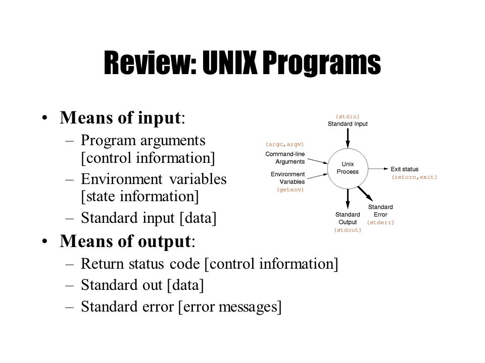
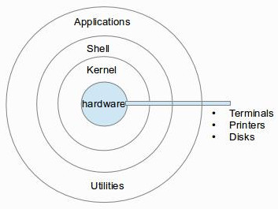
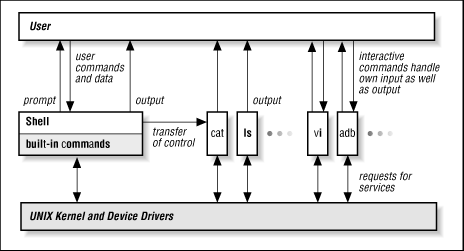
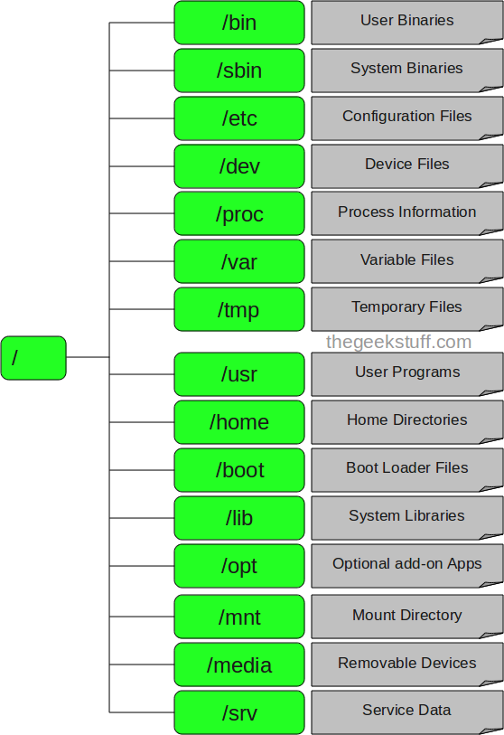
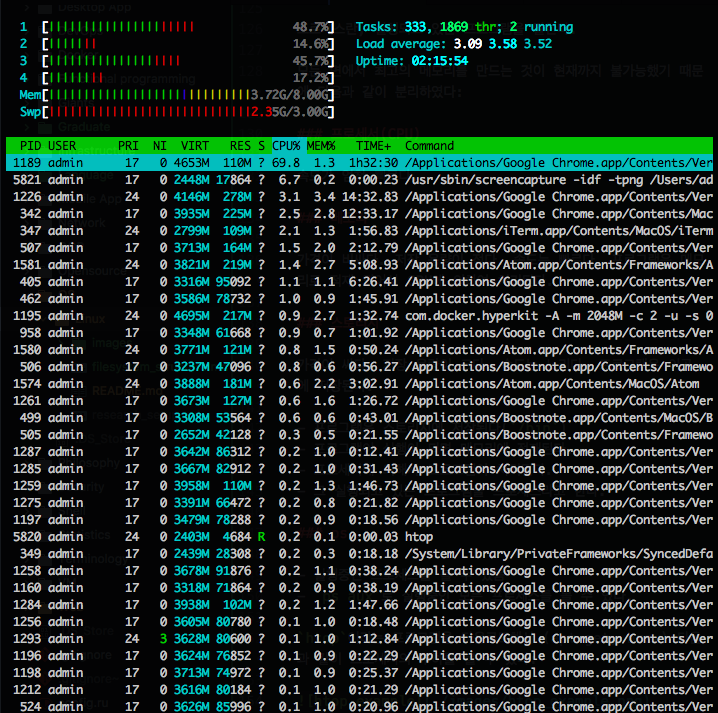

# Linux기초

## 1. ssh사용법

[생활코딩: SSH](https://opentutorials.org/module/432/3738)

아마존 웹 서비스(AWS)의 EC2나 Light-Sail등의 IaaS(Infrastructure as a Service)를 사용하다 보면, 로컬 환경에서 원격 환경으로 커맨드라인 인터페이스를 이용해서 접속해야할 때가 있다.

그럴 때 사용되는 기술이 바로 SSH(Secure SHell)이다.

- SSH는 원격지에 있는 컴퓨터를 안전하게 제어하기 위한 프로토콜
- SSH클라이언트와 SSH서버로 나뉜다.
- Telnet은 암호화가 되어있지 않은 방식이나, SSH는 RSA암호가 적용되어 있다.
- 주로 Unix 계열의 운영체제를 원격에서 운영하기 위한 방법이므로 윈도우는 클라이언트 운영체제로 사용할 수 있다.
- Mac이나 Unix계열의 컴퓨터는 이미 SSH클라이언트와 서버가 미리 설치되어 있다.
- Linux의 경우에는 `Open SSH`를 설치해야 한다.

예시
```sh
ssh -i (keyfile) username@host
# ssh -i example.pem voidsatisfaction@123.456.78.9
```

## 2. sudo

예전의 컴퓨터는 비쌌으므로 하나의 컴퓨터를 많은 사람들이 공유할 수 있도록 했다. 즉 Unix계열의 운영체제에서는 다중사용자 시스템이 있었다. 그래서 각각의 사용자가 다른 사용자가 만든 파일을 쉽게 제어할 수 없도록 권한(permission)을 달리 부여했다. 가장 높은 권한의 유저를 `root user`라고 하는데, `sudo`는 루트권한 유저의 권한을 잠시 빌리는 것이다.

## 3. 패키지 매니저(apt)

스마트폰의 앱스토어와 같은 역할. 프로그램(패키지)를 검색하고 쉽게 설치 할 수 있도록 도와준다.

- `apt-get update`: 패키지 매니저에서 설치할 수 있는 패키지 목록을 최신상태로 갱신
- `apt-cache search 검색어`: 로컬 패키지 매니저가 보유하는 목록에서 다운로드 가능한 패키지를 찾아준다.
- `apt-get install 패키지`: 패키지를 설치
- `apt-get remove 패키지`: 패키지를 삭제

## 4. 파일 다운로드

- wget
  - `wget -O 저장파일이름 url`
- git
  - `git clone 깃허브의url`

## 5. 왜 CLI(Command Line Interface)를 사용하는가?

- CLI가 GUI보다 메모리 사용량이 적음
- CLI는 자동화가 가능(순차 실행이 가능)
- 파이프라인 기능
  - 프로그램의 출력을 다른 프로그램의 입력으로 준다.
  - `ls --help | grep sort | grep file`

## 6. IO Redirection

유닉스에서는 프로그램을 `프로세서`라고 한다. 그리고 기본적으로는 아래와 같은 구성을 갖고 있다:



- `ls -al > result.txt`
  - `ls`의 결과를 `result.txt`라는 파일로 리다이렉션
  - `>`는 표준출력을 리다이렉션 할 수 있도록 한다.
  - `2>`는 표준에러를 리다이렉션 할 수 있도록 한다.
  - c.f) `ls -al >> result.txt`는 result.txt파일의 내용에 추가하는 것이다.
- `cat < hello.txt`
  - hello.txt의 내용을 표준입력을 이용하여 cat의 입력으로 받는다.
  - c.f) `cat hello.txt`는 커맨드라인 인자(commandline argument)로 전달하는 것이다.
- `ls -al > /dev/null`
  - 아무것도 일어나지 않는다(null)

Q) 파이프랑 리다이렉션의 차이는?

## 7. Shell vs Kernel





쉘: 사용자의 명령을 해석하는 곳 => 커널에게 API를 이용해서 전달
커널: 해석된 명령을 하드웨어에 전달

- 쉘과 커널을 분리하므로써, 여러가지 종류의 쉘을 이용해서 커널을 제어할 수 있게된다.
  - bash vs zsh

쉘도 하나의 프로그램이다.

## 8. Shell Script

쉘 스크립트는 복잡한 쉘 명령을 순차적으로 실행할 수 있도록, 스크립트 파일로 남겨둔 것을 말한다.

```sh
# backup
#!/bin/bash

if ! [ -d bak ]; then
   mkdir bak
fi
```

위의 스크립트는 `chmod +x backup`을 통해서 실행가능하게 선언해줘야 한다. `#!/bin/bash`는 리눅스에게 bash로 실행할 수 있는 스크립트라는 것을 알려주는 것이다.

환경변수를 지정하기 위해서는 다음과 같이 하면 된다.

```sh
# filename = .env
#!/bin/bash

export ABC=123
```

그리고 OS에서 `source .env`나 `sh .env`를 해주면 된다.

## 9. 리눅스 파일 시스템 구조

참고: [linux file system structrue](https://www.thegeekstuff.com/2010/09/linux-file-system-structure/)

리눅스 기본적인 파일시스템의 구조는 다음과 같다:



Q) `apt-get`, `tree`와 같은 커맨드는 어디에 존재하는 것인가?(bin, sbin아님)
R) `usr/bin`을 찾아보자

**[파일 시스템 구조](./filesystem_structure.md)참조.**

## 10. 프로세스

프로세스란, 실행되고 있는 프로그램을 말한다.

모든 면에서 최고의 메모리를 만드는 것이 현재까지 불가능했기 때문에 다음과 같이 분리하였다:

### 프로세서(CPU)

속도가 엄청 빠르다.

### 메모리

가격이 비싸다. 저장 용량이 적다. 속도는 빠르다. 프로그램은 메모리로 적재 되어서 CPU에 의하여 처리된다.

### 스토리지

가격이 싸다. 저장 용량이 크다. 속도는 느리다. 프로그램은 이곳에 저장된다.

- 프로그램은 스토리지에 저장된다(`/bin`)
- 프로그램이 실행이 되면 메모리에 적재된다.
- 프로세서에 의해서 프로그램이 처리된다.
- 그 실행되고 있는 프로그램을 프로세스라고 한다.

### ps

- 실행중인 프로세스를 볼 수 있음
- `ps aux`로 실행중인 모든 프로세스를 볼 수 있다.

`htop`이라는 프로그램을 다운로드해서 (apt-get, brew) 다음과 같이 프로세서의 부하를 볼 수 있다:



## 11. 파일 찾기

### find

- 직접 파일 트리를 하나하나 찾아나가서 원하는 파일을 검색.
- `locate`보다는 느림(트리의 탐색이므로)

```sh
# find 디렉터리 -옵션 이름
find ./bin/ -name rm

# 이런 식으로 찾은 파일들에 대해서 명령도 실힝 가능
find . -type f -name "*.log" -exec rm -f {} \;
```

### locate

- 인덱스화 된 파일 시스템을 이용해서 원하는 파일 위치 검색.
- `updatedb`로 정기적으로 파일 시스템 업데이트 시켜줘야 함.
- 인덱스를 사용하므로 빠름.

```sh
updatedb
locate rm
```

### which

- 원하는 커맨드의 위치를 찾아준다.

### whereis

- 원하는 실행파일을 찾아주는 커맨드
- `$PATH`를 참조해서 찾아줌

Q) 어디에서든 `ls`와 같은 프로그램이 실행되는 이유는?
R) `$PATH`에서 정의된 경로들에서 `ls`라는 프로그램을 찾는다.

## 12. 백그라운드 실행

- `ctrl + z`: 실행중인 프로그램을 백그라운드로 보내는 단축키.
  - 이렇게 되면 프로세스가 중단됨
- `fg`: 백그라운드 프로그램을 다시 포그라운드로 돌려놓는 단축키.
  - `fg %2`: 2번째 프로세스를 포그라운드로 돌라놓는다.
- `jobs`: 백그라운드 프로그램을 나열하는 단축키.
- `kill -9 %4`: \[4\]인 프로세스를 종료.
-  \&를 이용해서 프로그램 실행 자체를 백그라운드에서 할 수 있다.
  - `ls -alR / > result.txt 2> error.log&`

## 13. 항상 실행: 데몬(daemon) 서비스(service)

- 항상 실행하는 프로그램을 데몬(서비스)이라고 한다.
  - 웹 서버, 도커 등등..
- 데몬을 부팅때 마다 자동으로 실행할 수 있도록 하는 법.
  - `/etc/rc3.d`로 가서 `ls -l`로 `lrwxrwxrwx 1 root root  17 Dec 31 08:57 S01apache2 -> ../init.d/apache2`와 같이 S로 시작되는 링크파일인지 확인. 없으면 작성.
  - 참고로 K는 Kill, S뒤의 숫자는 우선순위.

```sh
apt-get install apache2 # /etc/init.d(데몬들이 모여있는 곳)에 설치

service apache2 start # 데몬 프로그램을 실행
service apache2 stop # 데몬 프로그램을 멈춤
```

## 14. 정기적 실행: cron

- 리눅스 자체에서 정기적으로 프로그램을 실행할 수 있도록 도와주는 유틸리티 소프트웨어
- `apt-get install cront`
- `crontab -e`: 정기적으로 실행할 프로그램을 지정
- 도커 내에서는 크론을 지정해도 그냥 실행이 되지 않을 수 있으므로 검색이 필요

```sh
m h  dom mon dow   command

# 1분마다 date >> date.log를 실행, 기본적으로 경로가 주어지지 않으면 ~를 지칭
*/1 * * * * date >> date.log
```

## 15. 쉘을 시작할 때 실행: Startup script

c.f) `alias l='ls -al'` l을 입력하면 `ls -al`이 실행됨.

`~/.bashrc`의 내용을 변경하면 쉘이 시작할때 실행된다.

## 16. 다중 사용자

- `id`
  - 나는 누구인가.
  - uid, gid, groups를 알 수 있다.
- `who`
  - 현재 자신의 컴퓨터에 접속한 사람들을 알 수 있다.

- 자기자신이 super user(슈퍼 유저)가 될 수 있다.
- 자신이 어떤 유저인지 확인
  - `#`: 슈퍼유저
  - `$`: 일반유저
  - `root@ef55708f5be5:~#`이는 슈퍼유저이다.

- `su - root`: 슈퍼유저가 될 수 있다.
- `sudo passwd -u root`: 슈퍼유저의 잠금 풀음
- `sudo passwd -l root`: 슈퍼유저의 잠금 걸음
- 일반적인 경우에 루트사용자를 잠금 시켜놓는것이 좋다.
- 루트 사용자의 루트 디렉토리는 `/root`
- 일반 사용자는 `/home/username`

### 사용자 추가

- `sudo useradd -m koro`: koro라는 이름을 가진 사용자를 추가.
- `sudo passwd koro`: koro라는 이름을 가진 사용자의 패스워드를 추가
- `sudo usermod -a -G sudo koro`: koro에게 sudo권한을 부여

### 권한

- 권한의 대상: 파일 & 디렉터리
- 권한의 종류: 읽기 & 쓰기 & 실행
- `-rw-r--r-- 1 root root       6 Jan  4 02:06 perm.txt`
  - 맨 앞의 `-`나 `d`: 타입. 파일인가 디렉터리인가
  - `rw-r--r--`: 접근 모드(access mode)
    - `rw-`: 오너의 권한(owner)
    - `r--`: 그룹의 권한(group)
    - `r--`: 등록된 다른 모든 사용자들(other)
  - `rwx`
    - r: 읽기권한(read)
    - w: 쓰기권한(write)
    - x: 실행권한(execute)
  - `root(소유자) root(그룹)`
- `chmod`로 권한 변경 가능
  - `chmod o+r perm.txt`: 다른 사용자들(other)에게 perm.txt파일에 대하여 읽기권한을 추가하겠다.
  - `chmod u-r perm.txt`: 소유자(user)가 perm.txt를 읽지 못하게 권한 삭제
  - `chmod u+x hi-machine.sh`: 소유자가 hi-machine.sh를 실행할 수 있도록 한다.
    - 실행에 관해서 운영체제는 `./hi-machine.sh`를 보면, 운영체제는 가장 먼저 현재 유저가 실행하는 권한이 있는지 확인한 뒤에, `#!/bin/bash`를 보고 그 파서로 프로그램을 실행한다.
- 디렉터리의 경우 `w`권한이 없으면 그 안에서 파일 작성, 파일 삭제, 파일 편집, 디렉터리 생성 등이 불가능하다. `x`권한이 없으면 `cd`커맨드를 이용해서 들어갈 수 없다.
  - `chmod -R o+w perm`: perm내의 모든 디렉터리와 파일들에 재귀적으로 편집 권한을 부여한다.
- chmod의 팔진수(octal)모드: [참고 - 위키피디아](https://en.wikipedia.org/wiki/Chmod)
  - `chmod 777 perm.txt`

### 그룹

c.f) `!!`는 직전에 입력했던 명령어를 의미

그룹 단위로 권한을 제어

- `sudo groupadd developer`: developer이라는 그룹 추가
- `sudo usermod -a -G developer momo`: momo라는 사용자를 developer그룹에 추가
- `chown`: 파일이나 디렉터리의 소유자나 그룹을 바꿀 수 있다.
