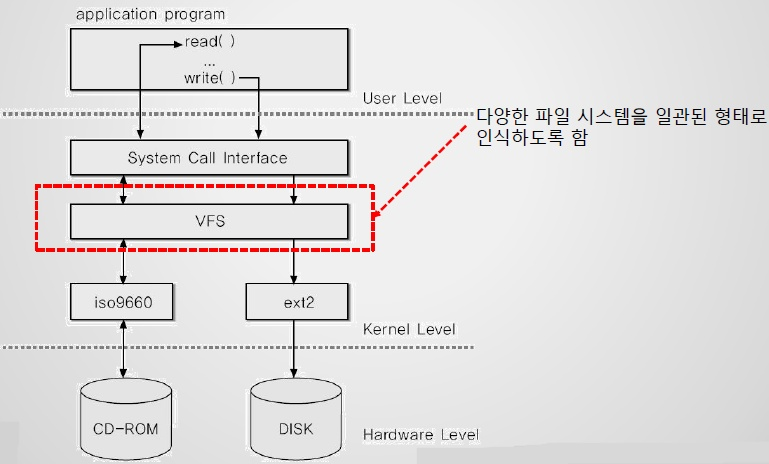

# 리눅스 디스크와 파일 시스템

- 의문
- 개요
- 파일 시스템
  - 개요
  - 유형
  - 마운팅

## 의문

## 개요

- 블록
  - 전체 디스크를 나타내는 것
- 파티션
  - 전체 디스크를 세분화한 구획들
  - `sda1`, `sda2`처럼 블록 장치 뒤에 숫자를 붙여 표시
  - 각 파티션들을 마치 전체 디스크인 것 처럼 블록 장치로 보여줌
  - 과거에는 디스크의 특정 부분에만 부팅을 할 수 있었기 때문에 파티션이 존재. 운영체제를 위한 공간으로 파티션 사용
- 파티션 테이블
  - 파티션들을 정의하는 디스크의 한 영역
- 파일 시스템
  - 파일과 디렉터리의 데이터베이스
  - 단순한 블록 장치를 사용자들이 이해할 수 있는 파일과 서브 디렉터리들로 이루어진 복잡한 계층 형식으로 전환시키는 구조 제공
    - 디스크는 단순히 선형적이지만, 파일 구조는 tree구조이다
- VFS(Virtual File System)
  - 가상 파일 시스템 추상화 계층은, 모든 파일 시스템 구현들이 표준 인터페이스를 지원하도록 함으로써, 사용자 응용 프로그램들이 동일한 방식으로 파일과 디렉터리에 접근할 수 있게 함
  - 리눅스가 엄청나메 많은 파일 시스템을 지원할 수 있게 만든 계기
- 파일의 데이터에 접근하려면
  - 파티션 테이블로부터 적절한 파티션 위치를 받아야 함
  - 파티션상의 파일 시스템 데이터베이스에서 원하는 파일 데이터 검색

Virtual File System

## 파일 시스템

### 개요

- **데이터가 어떻게 저장되고 retrieve 되는가를 제어함**
  - 데이터를 조각과 조각의 이름으로 분리해서 관리를 쉽게 할 수 있도록
- 사용자와 보조기억장치의 인터페이스 역할
  - 논리주소(파일명)을 물리주소(블록번호)로 매핑
- 파일과 디렉터리의 데이터베이스
- 단순한 블록 장치를 사용자들이 이해할 수 있는 파일과 서브 디렉터리들로 이루어진 복잡한 계층 형식으로 전환시키는 구조 제공
  - 디스크는 단순히 선형적이지만, 파일 구조는 tree구조이다

### 유형

- **Fourth Extended filesystem(ext4)**
  - Linux를 위해 만들어진 파일 시스템 최신판
- **ISO 9660**
  - CD-ROM 표준
- **FAT 파일 시스템**
  - 윈도우즈 시스템과 관련이 깊음
- **HFS**
  - 매킨토시 시스템에서 사용되는 애플 표준

### 마운팅

- 개요
  - 파일 시스템을 연결하는 과정
- 마운트 하기 위한 필요 조건
  - 파일 시스템의 장치
    - 디스크 파티션 처럼 실질적인 파일 시스템 데이터가 있는 장소
  - 파일 시스템 타입
  - 마운트 포인트
    - 현재 시스템 디렉터리 계층 구조에서 파일 시스템이 연결될 위치
- `mount`
  - `mount -t ext4 /dev/sdf2 /home/extra`
    - ext4 파일 시스템 `/dev/sdf2`를 `/home/extra`에 장착
    - 보통은 -t로 타입을 지정하지 않더라도 괜찮음
- `unmount`
  - 마운트 분리
