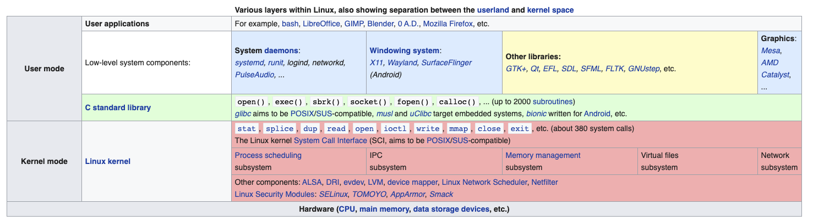
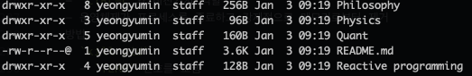
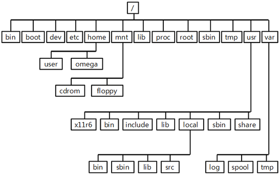

# Linux

해당 책을 다 읽고 공룡책을 보면 좋을 듯 싶다.

- 의문
- 1\. 리눅스 빅 픽쳐
  - 1\.1 리눅스 시스템의 추상화 레벨과 레이어
  - 1\.2 하드웨어
  - 1\.3 커널
    - 역할
  - 1\.4 사용자 공간
  - 1\.5 사용자
- 2\. 기본 명령어와 디렉터리 계층 구조

## 의문

- *스트림이란 무엇인가?*
  - 표준 입력, 표준 출력은?
- *파일 시스템은 정확히 무엇인가? 왜 시스템인가?*

## 1. 리눅스 빅 픽쳐

### 1.1 리눅스 시스템의 추상화 레벨과 레이어

Linux abstraction level overview

- 레벨, 레이어
  - 해당 구성요소가 사용자와 하드웨어 사이의 어디에 위치하는지에 따라서 구성요소를 구분할 때의 단위
  - 예시
    - 웹 브라우저, 게임은 최상위 레이어
    - 하드웨어의 메모리, 0과 1은 최하위 레이어
    - 운영체제는 그 사이에 있는 대부분의 레이어
- 리눅스 시스템의 레이어
  - 사용자 프로세스
    - 프로세스는 사용자 공간(user space)라고 불리는 시스템의 상위 레벨 구성
    - 커널 vs 사용자 프로세스
      - 커널은 커널 모드에서 동작
      - 사용자 프로세스는 사용자 모드에서 동작
    - 사용자 모드
      - **사용자 공간**: 사용자 프로세스가 접근할 수 있는 주기억 공간의 일부 + 안전한 CPU 작업에만 접근 가능하게 제한
      - 예시
        - 웹 브라우저에 문제가 생겨도 백그라운드에서 돌아가던 딥러닝 모델 학습은 무사함
  - 커널
    - 운영체제의 핵심
    - 메모리 안에 존재
    - CPU가 해야 할 일이 무엇인지 전달
    - 하드웨어 관리
    - 커널 모드
      - 커널 모드에서 동작하는 코드는 프로세서나 주기억 장치에 제한 없이 접근 가능(아주 강력하고 위험)
      - **커널 공간**: 커널만이 접근할 수 있는 영역
  - 하드웨어
    - CPU, 메모리, 디스크, 네트워크 인터페이스

### 1.2 하드웨어

- 주기억 장치
  - 실행 중인 커널과 프로세스가 상주하는 공간이자, 커다란 비트의 집합체
- CPU
  - 명령들과 메모리의 데이터를 읽고 메모리에 다시 데이터를 기록

### 1.3 커널

- 커널
  - 거의 모든 작업이 주기억 장치를 위주로 진행
  - 메모리를 여러 개의 구획으로 분리 & 구획에 대한 상태(비트의 특정 배열) 정보를 항상 보유
  - 프로세스는 메모리에서 각자의 구획을 갖게 되고, 커널은 프로세스가 각자의 구획을 유지하는지 확인
- 작업 유지 임무
  - 프로세스
    - 어떤 프로세스가 CPU의 사용을 허용 받았는가 파악
  - 메모리
    - 모든 메모리를 지속적으로 파악
    - 현재 특정 프로세스에 할당된 메모리가 무엇인가 파악
    - 프로세스 간에 공유할 수 있는 메모리가 무엇인가 파악
    - 할당되지 않은 것은 무엇인가 파악
  - 장치 드라이버
    - 커널은 하드웨어와 프로세스 사이의 인터페이스로 동작
    - 하드웨어의 운영
  - 시스템 콜과 지원
    - **프로세스가 커널과 소통할 때, 시스템 콜을 사용**

#### 1.3.1 프로세스 관리

- 개요
  - 프로세스의 시작, 멈춤, 재개, 종료에 관한 것들
- 현대 운영체제
  - concurrency(context switch)
    - time slice가 매우 작게 나뉘어져있고, 주어진 작은 시간동안에 진행중인 작업을 마칠 수 있으므로 인간이 계속해서 context switching이 일어나는 지 인지하지 못함(multitasking)
- **커널이 동작하는 타이밍**
  - **타임 슬라이스 사이사이**
  - 커널은 context switch를 책임짐
  - 예시(context switch - 사용자 모드에서 실행되는 프로세스의 타임 슬라이스가 종료된 경우)
    - ① CPU는 내부 타이머를 기초로 하여 현재 프로세스를 중단하고 커널 모드로 전환(CPU 통제권을 커널에 넘김)
    - ② CPU와 메모리의 현재 상태를 기록
      - *CPU와 메모리의 현재 상태를 기록하면, 그 자원만큼 똑같은 크기의 공간을 준비해야 한다는 소리인가?*
      - *그리고 그 공간은 하드 디스크에 저장하는 것인가? 아니면 메모리의 다른 부분에 격리시키는 것인가?*
    - ③ *커널은 이전 타임 슬라이스 동안 발생해야 했던 작업들을 실행(입력과 풀력, I/O, 여러 활동들로부터 데이터를 수집하는 작업)*
      - *왜 이전 타임슬라이스에서 하지 않고, 커널모드가 됐을 때 작업하는 것인지?*
    - ④ 다른 프로세스가 동작할 수 있도록 준비. 커널이 실행할 준비가 된 프로세스 목록을 분석하고 하나 선택
    - ⑤ 새 프로세스를 위한 메모리 준비 및 CPU 준비(자원 준비)
    - ⑥ 새 프로세스를 위한 타임 슬라이스가 얼마나 걸릴 것인지 CPU에 보고
    - ⑦ 사용자 모드로 CPU를 전환하고, CPU 통제권을 프로세스에 넘김
  - *다수의 CPU를 갖고 있는 경우는 어떻게 스케쥴링되고, 커널은 어떤식으로 동작할까?*

#### 1.3.2 메모리 관리

- 개요
  - Context switch를 하는 동안 메모리를 관리하기 때문에, 매우 복잡한 작업 수행
- Context switch시에 커널의 조건
  - 사용자 프로세스가 접근할 수 없는 전용 영역을 메모리 안에 보유하고 있어야 함
  - 각 사용자 프로세스는 자신만의 메모리 구역이 있어야 함
  - 하나의 사용자 프로세스는 다른 프로세스의 전용 영역에 접근할 수 없음
  - 사용자 프로세스들은 메모리르 공유할 수 있음
  - 사용자 프로세스에서 일부 메모리는 읽기 전용이 될 수 있음
  - 시스템은 보조로 디스크 공간을 사용함으로써 물리적으로 존재하는 것보다 더 많은 메모리를 사용할 수 있음
- 현대의 CPU
  - 가상 메모리 라고 하는 메모리 관리 유닛(Memory Management Unit - MMU)을 포함
  - 가상 메모리
    - 프로세스는 직접 하드웨어 내의 물리적 위치로 메모리에 접근하지 않음
    - 프로세스가 머신 전체를 점유하고 있는 것처럼 동작하도록 해당 프로세스를 설정
    - 프로세스가 메모리 일정 부분에 접근할 때, MMU가 그 접근을 가로채서 memory address map을 사용하여, 프로세스의 메모리 위치를 머신상의 실질적인 물리적 메모리 위치로 변환
    - **커널은 memory address map을 초기화시키고, 지속적으로 유지하며 변경해야 함**
      - context switch가 이뤄지는 동안 이전 프로세스 맵으로부터 새로운 프로세스 맵으로 맵을 변경
      - memory address map을 구현하는 것을 **page table**이라 함

#### 1.3.3 장치 드라이버와 관리

- 개요
  - 장치는 커널 모드에서만 접근 가능
  - 장치 드라이버 관리
    - *장치 드라이버가 정확히 무엇인가?*

#### 1.3.4 시스템 콜과 지원

- 사용자 프로세스가 사용할 수 있는 커널의 몇가지 특징
  - 시스템 콜(사용자 프로세스와 커널 간의 상호작용)
    - e.g)
      - 파일 열고 읽고 쓰기
      - `fork()`
        - 프로세스가 호출하면 커널은 프로세스와 거의 일치하는 복사본을 만들어 냄
      - `exec()`
        - `exec(program)`을 호출하면, 커널은 program을 시작하여 현재 프로세스를 대신함
    - `ls`를 호출하면
      - shell이 `fork()`를 호출하여 shell의 복사본 생성
      - shell의 복사본이 `exec(ls)`를 호출
    - *커널에게 다른 프로세스를 생성하도록 요청하는 프로세스는 반드시 `fork()`시스템 호출을 실행해야 한다?*
      - python multiprocessing모듈의 start method 중에서 `spawn`은 무엇인지?
  - 의사 장치(pseudodevices)
    - 사용자 프로세스의 입장에서는 장치 처럼 보여지나, 순전히 소프트웨어로 구현되어 있음
    - 기술적으로는 커널에 있을 이유가 없으나, 실질적인 이유 때문에 커널에 존재
    - 시스템 콜을 사용해서 사용자 프로세스에서 접근 가능
    - e.g)
      - 난수 생성 장치(`/dev/random`)

### 1.4 사용자 공간

- 개요
  - 커널이 사용자 프로세스에게 할당하는 *주요 메모리(?)*
  - 실행중인 프로세스의 전체 메모리
  - 리눅스 시스템에서 대부분의 실제 동작은 사용자 공간에서 발생
    - 사용자 공간도 레벨이 존재

### 1.5 사용자

- 개요
  - 프로세스들을 실행할 수 있고 파일들을 소유할 수 있는 독립체
  - 커널은 userid 라고 하는 숫자로 구성된 식별자를 이용하여 사용자 인식
    - 사용자 이름과 다른 개념
  - 접근 권한과 한계를 설정
    - 모든 사용자 공간 프로세스는 `owner`라는 사용자를 갖고 있고, 프로세스들은 owner로서 실행 됨
    - 사용자는 다른 사용자의 프로세스를 방해할 수 없음
    - 사용자들은 파일을 소유할 수 있고, 다른 사용자들과 파일을 공유할 것인지 선택할 수 있음
- 종류
  - 루트(수퍼 사용자, 관리자)
    - 다른 사용자의 프로세스 종료 / 변경 가능 로컬 시스템상의 파일 읽을 수 있음
- 그룹
  - 다수의 사용자들로 구성된 집합
  - 그룹 내의 다른 사용자들과 파일 접근을 공유할 수 있음

## 2. 기본 명령어와 디렉터리 계층 구조

### Bourn Shell `/bin/sh`

- 셸
  - 개요
    - 사용자가 입력하는 명령어들을 실행하는 프로그램(프로그램 환경처럼 사용됨)
    - shell script 사용
  - 참고) 터미널
    - = 셸 윈도우
  - 종류
    - Bourn shell(`/bin/sh`)
      - 개요
        - 가장 기초적인 유닉스 셸
    - bash(Bourn-again shell)
      - Linux에서 기본적으로 사용되는 보강된 Bourn shell
    - 등등..
      - fish, zsh, ...
- 셸 윈도우 구성
  - `name@host:path$`
    - 사용자
      - `$`: 일반
      - `#`: 루트

### 표준 입력과 표준 출력

*스트림이란 무엇인가?*

- 개요
  - 유닉스 프로세스는 데이터를 읽고 쓰는 데 I/O stream을 사용
  - 프로세스는 Input stream으로 부터 데이터를 읽고, Output stream으로 데이터를 씀
    - 입력 스트림의 출처가 파일, 장치, 터미널이 될 수 있고, 다른 프로세스의 출력 스트림이 될 수도 있음
  - 쉽게 다른 파일이나 프로세스에 연결 가능
- `ctrl d` vs `ctrl c`
  - `ctrl d`: 현재 표준 입력을 멈춤
  - `ctrl c`: 입력이나 출력에 상관하지 않고 프로그램 종료
- stdin
  - 표준 입력
  - 리눅스 커널에서 제공
- stdout
  - 표준 출력
- stderr
  - 표준 에러

### 환경변수 vs 셸변수

- shell variable
  - 개요
    - 텍스트 문자열의 값을 포함하는 임시변수
    - `STUFF=blah`
- environment variable
  - 개요
    - 운영체제가 셸의 모든 환경 변수들을 셸이 실행하는 프로그램으로 전달
    - `export STUFF=blah`
  - e.g)
    - `less` 명령줄 옵션들을 `LESS` 환경 변수에 부여할 수 있음
- `PATH`
  - 개요
    - 명령어 path(명령어 위치를 찾으려고 할 때 shell이 검색하는 시스템 디렉터리 목록)를 포함하는 특별한 환경 변수
    - 동일한 프로그램들이 여러 경로의 디렉터리 안에서 발견되면, shell은 맨 처음 일치하는 프로그램 실행

### shell 입력과 출력

- 출력을 파일로 redirection
  - `command > file`
    - 출력을 터미널 대신 파일로 보냄(redirection) 파일에 덮어씀
  - `command >> file`
    - 파일에 출력을 덧붙임
- 출력을 다른 명령의 표준 입력으로 redirection
  - `head /proc/cpuinfo | tr a-z A-Z`
- 표준 오류 redirection
  - `ls /fffffffff > f 2> e`
  - `ls /fffffffff > f 2>&1`
    - 표준 출력과 표준 오류를 f라는 이름의 파일로 둘 다 보내기

### 에러

- Segmentation fault, Bus error
  - 프로그램이 접속이 허용되지 않은 메모리의 일부에 접근하려 했고, 운영체제가 이를 죽임

### 프로세스(`ps`, `kill`)

- `ps`
  - 필드 설명
    - PID
      - 프로세스 ID
    - TTY
      - 프로세스가 동작하고 있는 터미널 장치
    - STAT
      - 프로세스의 상태
      - S: Sleep
      - R: Run
    - TIME
      - 프로세스가 지금까지 사용했던 CPU 시간
    - COMMAND
      - 본래 값과 다르게 변경할 수 있으므로 주의
  - BSD 스타일 명령
    - `ps aux`
      - 동작하고 있는 모든 시스템상의 프로세스들을 상세하게 보여줌
    - `ps u $$`
      - 현재 shell의 PID에 해당하는(`$$`) 프로세스 검색
- `kill`
  - 개요
    - 프로세스 종료시키기 위해서 `kill`명령으로 커널로부터 프로세스에 신호를 전달하도록 함
    - 신호에는 여러 종류가 있음
    - `CTRL-C`와 마찬가지 역할
    - 운영체제가 프로세스를 종료하고 강제적으로 메모리로부터 제거
  - 방법
    - `kill pid`
      - `TERM` 신호를 보냄
    - `kill -9 PID`
      - 커널의 신호 숫자를 직접적으로 아는 경우
- 백그라운드 프로세스
  - 개요
    - 프로그램 실행과 동시에 프롬프트로 되돌아 가게 만듬
  - `gunzip file.gz &`

### 파일 접근 권한

리눅스 파일 권한

- `drwxr-xr-x`
  - `d`: 데릭터리 타입, 일반 파일은 `-`
    - 장치 파일
      - `b`
        - block
      - `c`
        - character
      - `p`
        - pipe
      - `s`
        - socket
  - `rwx`: 사용자 접근 권한이 읽고 쓰고 실행 가능
  - `r-x`: 그룹 접근 권한이 읽고 실행 가능
  - `r-x`: 기타 접근 권한(world permission)이 읽고 실행 가능
  - 권한 비트로 설정 가능
- 참고
  - 디렉터리가
    - readable: 디렉터리 내용을 목록으로 작성 가능
    - *executable: 디렉터리 안에 있는 파일에 접근만 가능*
      - 정확히 둘은 무슨 차이?

### 압축

- gzip
  - 파일 하나만 압축
- tar
  - 파일들의 아카이브 압축 가능
  - 압축하기
    - `tar cvf archive.tar file1 file2 directory1 ...`
  - 압축풀기
    - `tar xvf archive.tar`
  - 압축파일 내용 확인
    - `tar -tvf hello.tar`
- `.tar.gz` or `.tgz`
  - 개요
    - 압축 아카이브
  - 내부 파일 얻는 방법
    - 방법1
      - `gunzip file.tar.gz`
      - `tar xvf file.tar`
    - 방법2
      - `zcat(or gunzip -dc) file.tar.gz | tar xvf -`

### 파일 시스템 계층 구조(FHS - Filesystem Hierarchy System)

리눅스 파일 시스템 계층 구조

- *`/usr`*
  - 대부분의 리눅스 시스템과 큰 규모의 디렉터리 계층 구조를 담고 있음
  - 루트 디렉터리 안에 들어있는 이름들과 같고, 동일한 타입의 파일들을 갖고 있음
  - 유저 파일은 전혀 포함되지 않음
  - `/include`
    - C컴파일러가 사용하는 헤더 파일들을 보관
  - `/info`
    - GNU 정보 메뉴얼 포함
  - `/local`
    - 관리자가 자신의 소프트웨어를 설치할 수 있는 장소
  - `/share`
    - 과거에 리눅스 머신들의 네트워크가 이 디렉터리를 공유하곤 했음
    - 참고
      - `share/ca-certificates/mozilla/` 여기에 ca 정보들이 들어가있음
- `/bin`
  - 기본적인 유닉스 명령의 대부분을 포함하고 있는 프로그램(또는 실행파일)을 포함
  - 컴파일된 C프로그램과 셸 스크립트로 이루어짐
- *`/dev`*
  - 장치 파일
- `/etc`(core system configuration directory)
  - 핵심 시스템 설정 디렉터리
  - "그 외"가 아니다!
  - `/etc/sudoers`
    - 수퍼유저 권한이 있는 사용자 설정
- `/home`
  - 일반 사용자를 위한 개인 디렉터리
- *`/lib`*
  - 실행 파일이 사용할 수 있는 코드를 포함하는 라이브러리 파일들
    - static library
    - shared library
- `/proc`
  - 현재 가동되는 프로세스들에 대한 정보
- *`/sys`*
  - 장치와 시스템 인터페이스 제공
- *`/sbin`*
  - 시스템 실행 파일들을 위한 장소
  - 시스템 관리와 연관
- `/tmp`
  - 임시 파일들을 위한 저장 공간
  - 컴퓨터를 부팅할 때 `/tmp`를 정리하거나, 정기적으로 오래된 파일을 삭제하는 경우가 존재
- *`/var`*
  - 변수 서브디렉터리, 프로그램의 런타임 정보 기록
    - 시스템 로깅, 사용자 트래킹, 캐시, 기타 시스템 파일이 생성하고 관리하는 파일들
- `/boot`
  - 커널 부트 로더 파일들을 포함
- `/media`
  - 제거가 가능한 미디어를 위한 기본 마운트 지점(attachment point)
- `/opt`
  - 추가적인 제3자 소프트웨어 포함
- `/vmlinuz` or `/boot/vmlinuz`
  - 커널의 위치
  - 부트 로더가 이 파일을 메모리로 로딩하고 시스템이 부팅할 때 가동 시킴
  - 커널이 동적으로 로딩해서 사용하는 모듈
    - `/lib/modules`
