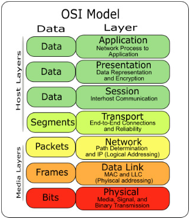
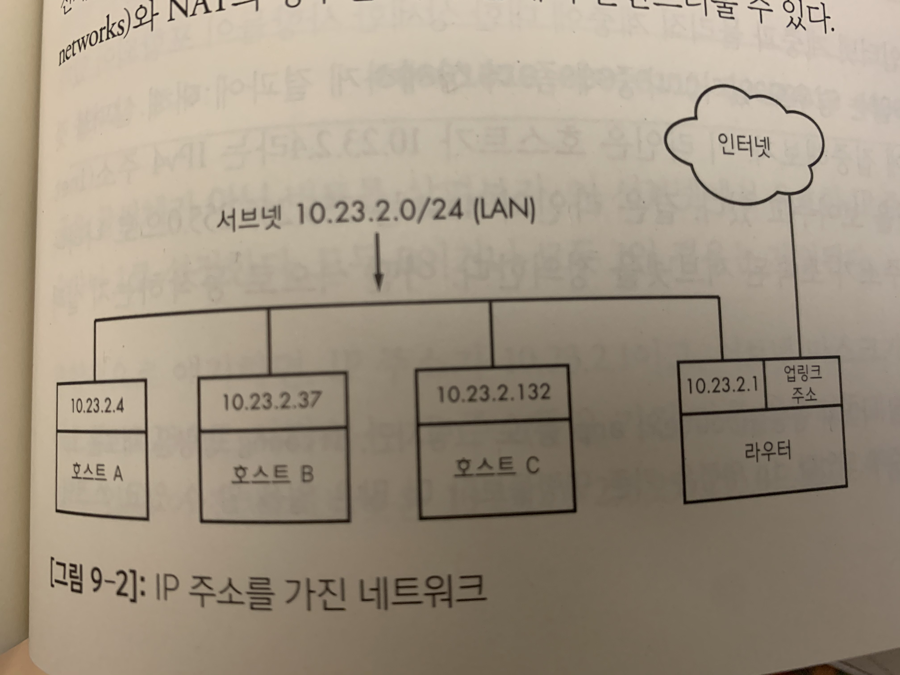
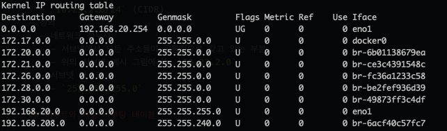

# 네트워크

## 의문

## 개요

### 중요한 질문

- 그 데이터를 어디로 보낼 것인지 어떻게 알 수 있는가?(what)
  - Network
  - Datalink
- 받은 데이터가 무엇인지 어떻게 알 수 있는가?(where)
  - Application

## 네트워크 기본 개념

### 등장인물

- 호스트
  - 네트워크에 연결된 머신
- 라우터
  - 데이터를 하나의 네트워크에서 다른 네트워크로 이동시킬 수 있는 호스트

### 데이터

- 데이터
- 세그먼트
- 패킷
  - 구성
    - header
      - 발신지/목적지 호스트와 식별을 위한 정보를 포함
    - payload
      - 컴퓨터가 전송하기 원하는 실제 응용 데이터(e.g image, HTML)
- 프레임
- 비트

## 네트워크 계층

- Application layer
  - what에 관련된 레이어
  - 응용프로그램과 서버들이 통신하는 데 사용하는 "언어"를 포함
  - **HTTP의 경우는, TCP 연결이 된 후에, application layer에서 어떤 데이터를 어떤 형식으로 주고 받을지에 대한 프로토콜**
    - 클라이언트와 서버가 존재하여, 서로 Request, Response 형식으로 커뮤니케이션
    - Request
      - Req header
      - Req body
    - Response
      - Res header
      - Res body
  - *그렇다면 RPC의 경우, TCP 연결이 된 후에, 특정 데이터를 받을 경우, 원격에서 remote procedure를 호출하고 그 결과를 반환하는 프로토콜인가?*
    - RPC
      - 별도의 원격 제어를 위한 코딩 없이, 다른 주소 공간에서 함수나 프로시저를 실행할 수 있게 하는 **프로세스간 통신 기술**
- Transport layer
  - what에 관련된 레이어
  - End-to-End connection
  - Reliability
- Network layer
  - where에 관련된 레이어
  - 패킷을 옮기는 방법 정의
    - IP(Internet Protocol)
  - Path determination
  - Logical Address
- Datalink layer
  - where에 관련된 레이어
- Physical layer
  - how에 관련된 레이어

### Network layer

서브넷 예시

- 인터넷의 연결 형태는 분산되어 있음
  - **서브넷** 이라고 불리는 좀 더 작은 네트워크들로 구성
  - 모든 서브넷들은 상호 연결되어 있음
  - LAN은 단일 서브넷
- 라우터(게이트웨어)
  - 하나 이상의 서브넷과 연결된 호스트로, 데이터를 하나의 서브넷에서 다른 서브넷으로 전송 가능
  - 기본적으로 라우터는 근거리 서브넷과 인터넷으로 연결되는 링크 주소(uplink address) 두가지 주소를 갖음
- 한 호스트가 다른 호스트와 통신하기 위해서는 다른 호스트의 IP 주소를 알아야 함

### 컴퓨터의 IP 주소 검색

- 하나의 호스트가 여러 IP 주소를 가질 수 있음
- `ifconfig(interface configuration)`
  - 개요
    - Unix 계열의 운영체제에서 네트워크 인터페이스 설정을 위한 관리 소프트웨어
    - 리눅스 머신상에 활성화 된 주소들을 보기 위한 커맨드
  - 용도
    - IP 주소 / netmask 세팅
    - 인터페이스의 enabling & disabling
    - MAC(medium access control) address의 변경

### 서브넷

- 개요
  - 일정 순서에 따르는 IP주소들을 가진 소흐트들로 연결된 그룹
  - 보통 호스트들은 물리적 네트워크 상에 존재
- 표현
  - `10.23.2.0/255.255.255.0` (Subnetmask)
  - `10.23.2.0/24` (CIDR)
- 정의
  - 네트워크 접두사
    - 서브넷에서 모든 주소들이 공통적으로 갖고 있는 부분
    - 위의 서브넷 예시 그림에서는 `10.23.2.0`
  - 서브넷 마스크
    - `255.255.255.0`

## 라우트와 커널 라우팅 테이블

리눅스 커널 라우팅 테이블(`route -n`) 예시

- 위의 라우팅 테이블 해석
  - 총 9개의 네트워크
- 참고
  - `ifconfig`
    - 해당 컴퓨터의 interface configuration
  - `route`
    - 해당 컴퓨터가 네트워크 커뮤니케이션을 하기 위한 서브넷에 대한 연결정보

---

- 배경(앞서 서브넷 예시에서)
  - 서브넷 내부의 호스트가 다른 서브넷 내부의 호스트와 연결하는 것은 직접적으로 가능
  - 인터넷상의 다른 호스트들에 도달하려면 `10.23.2.1`의 라우터를 통해 통신해야 함
- 리눅스 커널이 위의 배경에 해당하는 두가지 경우를 구별하는 방법
  - 라우팅 테이블(`route -n`)
    - Destination
      - 네트워크 접두사
    - Genmask
      - 그 네트워크에 해당하는 넷마스크
    - Gateway
      - Gateway 주소가 존재하는 경우 + Flags `G`
        - Destination/CIDR의 서브넷과 네트워크 통신을 하기 위해서는 데이터를 게이트웨이를 통해서 전송해야 함
      - Gateway 주소가 `0.0.0.0`
        - 서브넷과 직접 연결이 가능
  - 참고
    - 호스트가 특정 주소로 데이터를 보낼 때, route table 상에서 여러 서브넷 주소와 일치하면, 커널은 **일치하는 가장 긴 목적지 접두사를 선택함**
    - 예시
      - 위의 라우팅 테이블 예시에서, 만약 호스트가 `192.168.20.22`로 데이터를 보내려고 하면, `0.0.0.0/0`보다 더 긴 목적지 접두사를 가진 `192.168.20.0/24`로 데이터를 보냄

### Default gateway

- 개요
  - `0.0.0.0/0`을 담당하는 Gateway

## 기본 ICMP와 DNS툴

- ICMP(Internet Control Message Protocol)
  - 연결과 라우팅에 관한 문제 해결 서포트
- DNS(Domain Name Service)
  - 여러 이름들과 IP 주소를 연결시켜서 숫자로 된 많은 주소들을 기억할 필요가 없게 해줌

### Ping

- 개요
  - 가장 기본적인 네트워크 디버깅 툴중 하나
  - ICMP echo request 패킷을 호스트로 보내서, 송신 호스트로 패킷을 돌려 보내도록 수신 호스트에 요청
    - 수신 호스트가 패킷을 받고 이에 응답하도록 설정된다면, ICMP 에코 요청 패킷을 되돌려보냄
- 특징
  - `ping`을 하였을 때, 순차적으로 패킷이 다시 도달하는 것이 일반적으로 순차적으로 도달하나, 문제가 있는 경우, `icmp_req`의 값이 중간에 건너뛰는 경우가 발생
  - 보안 유지를 위해서 일부 호스트들은 ICMP echo request에 response를 하지 않음

### DNS와 host

- `host domain_name`
  - 도메인 네임에 대응되는 IPv4 주소 출력
- `host ip`
  - ip주소에 대응되는 호스트네임 출력
  - 도메인 관리자가 설정해주지 않는 경우가 많음

## 물리적 계층과 이더넷

- **인터넷은 소프트웨어 네트워크**
  - 하지만, 네트워크 계층은 일종의 하드웨어 위에 놓여야 함
- 이더넷의 특징
  - 이더넷 네트워크상의 모든 장치는 MAC(Media Access Control) 주소를 갖음 == hardware address
    - 호스트의 IP 주소와는 별개로, 호스트의 이더넷 네트워크 안에서 고유한 주소여야 함
    - 예시
      - `10:78:d2:eb:76:97`
  - 이더넷 네트워크상의 장치들은 **frame** 으로 메시지를 전송
    - source, dest mac address와 같은 메타 데이터를 포함
  - 이더넷은 단일 네트워크상의 하드웨어라는 범주를 벗어나지 않음
    - **한 호스트에 두 개의 다른 이더넷 네트워크를 갖고 있는데, 그 호스트가 두 개의 네트워크에 연결되어 있는 경우, 프레임을 하나의 이더넷 네트워크에서 다른 이더넷 네트워크로 직접 전송 불가능**
      - **단, 특별한 이더넷 브릿지를 설정하는 경우에 한하여 가능**
      - 따라서, 인터넷과 같이 더 높은 네트워크 계층이 필요함
    - 관례상 각각의 이더넷 네트워크는 보통의 인터넷 서브넷
    - 프레임이 물리적 네트워크를 떠날 수 없더라도, 라우터는 프레임 밖으로 데이터를 꺼내서 다시 포장하고, 이를 다른 물리적 네트워크상의 호스트로 전송 가능
      - 인터넷에서 일어나는 일
    - 참고
      - *도커의 경우에는 docker network로 브릿지 구성이 가능*
