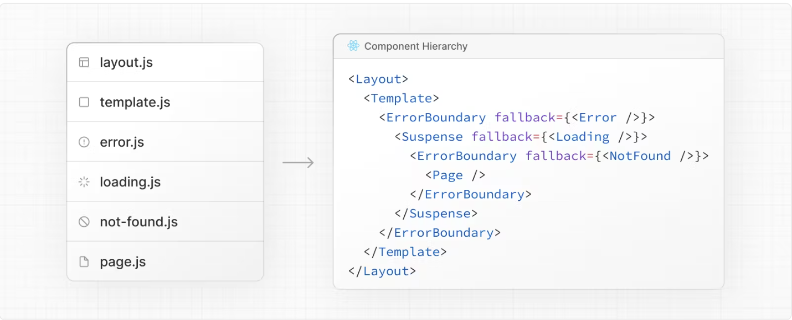

# NextJS

- 의문
- 개요

## 의문

## 개요

## App Routing

- 파일 컨벤션
  - **layout**
    - children과 공유되는 UI 세그먼트
  - **page**
    - 하나의 라우트에 유니크한 UI
    - public하게 접근 가능
  - loading
    - children과 공유되는 loading UI
  - not-found
    - children과 공유되는 not found UI
  - error
    - children과 공유되는 error UI
  - global-error
    - global error UI
  - route
    - _Server-side API 엔드포인트_
      - 무슨 의미인가?
  - template
    - _?_
  - default
    - _Parallel Routes의 fallback UI_
- 위의 파일들은 렌더링 순서가 다름

## Data Fetching

- Server Side
  - `fetch`
    - 개요
      - Web API의 fetch를 확장해서, caching, revalidating기능을 행함
      - Server component에서 사용가능
    - 특징
      - Caching
        - `fetch('https://...', { cache: 'force-cache' })`
      - Revalidating Data
        - cache데이터가 stale인지 보고, 다시 최신 데이터를 가져오는 것
        - Time-based
          - `fetch('https://...', { next: { revalidate: 3600 } })`
        - On-demand
          - `  const res = await fetch('https://...', { next: { tags: ['collection'] } })`
  - 서드파티 라이브러리
    - 개요 `fetch`라이브러리를 사용하지 않는 경우
      - e.g) database, ORM, ...
- Client Side
  - `Route Handler`
    - 개요
      - 데이터를 클라이언트 컴포넌트에서 가져와야 할때
      - Route Handler는 서버에서 실행되고, 클라이언트에 데이터를 돌려줌
        - sensitive information을 노출시키고 싶지 않을떄 유용(e.g) API tokens)
  - 서드파티 라이브러리
    - 개요
      - 데이터를 클라이언트 컴포넌트에서 가져와야 할때
      - e.g) React Query
