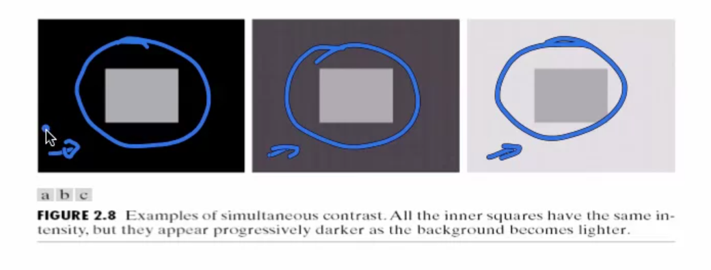
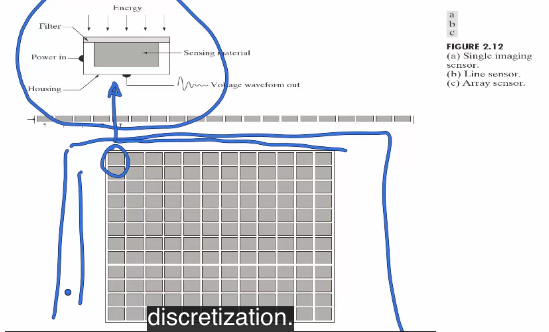
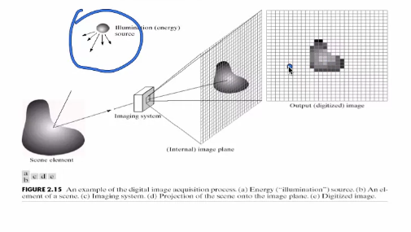
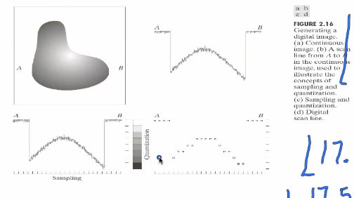
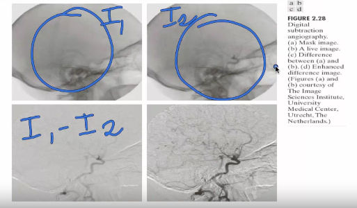
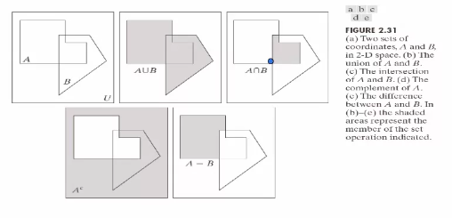
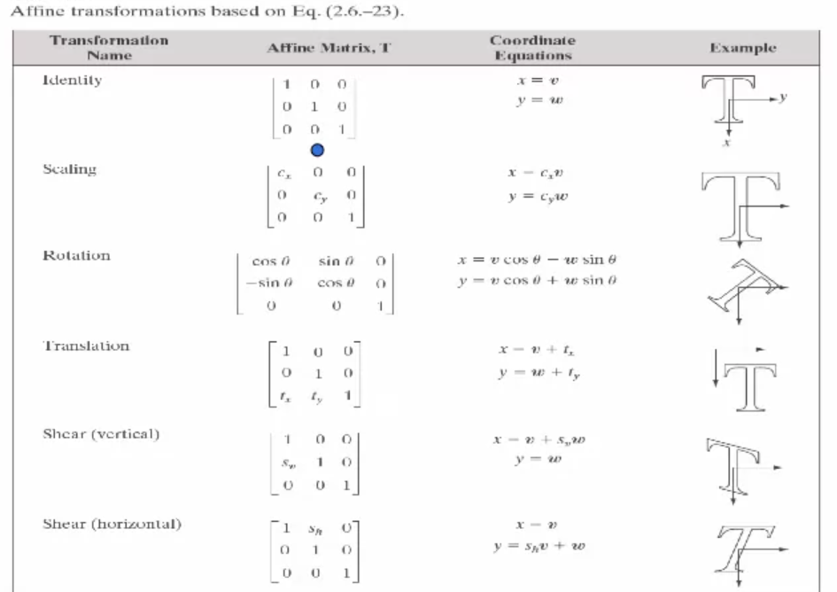
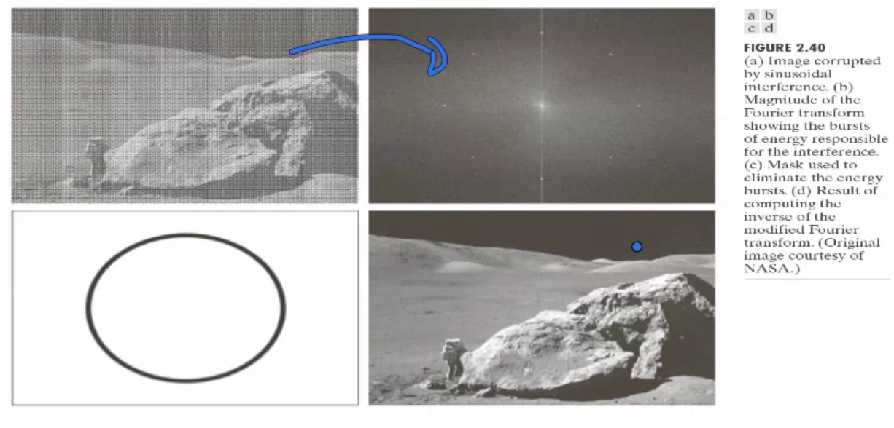

# Image processing introduction

- 의문
- 개요
- Human and visual system
- Image formation - Sampling & Quantization
- Simple image operations
- Python image processing with Pillow

## 의문

## 개요

- 인간의 눈은 가시광선밖에 볼 수 없으나, 이미지 자체는 매우 스펙트럼이 넓은 영역을 나타낼 수 있음
- 가끔은 여러 modality를 사용하여 하나의 대상을 이미지를 얻을 수도 있음

## Human and visual system

weber's law



- 인간은 adapt가 필요함
- weber law
  - 어떤 두 대상의 뒷 배경이 매우 어두우면, 두 대상을 구분하기 위해서는 많은 빛의 강도 차이가필요
  - 어떤 두 대상의 뒷 배경이 매우 밝으면, 두 대상을 구분하기 위해서는 아주 적은 빛의 강도 차이가필요

## Image formation - Sampling & Quantization

### 디지털 이미지의 생성

카메라와 센서 디지털 이미지화1



카메라와 센서 디지털 이미지화2



- 사람의 눈이 빛을 인식하는 센서가 존재하는 것 처럼, 디지털 카메라에도 빛을 인지하는 센서가 존재
  - continuous
- 빛 에너지를 2차원 배열로 생성
  - discrete
- **즉, 디지털 이미지는 continuous한 대상을 discrete하게 변경시키는 과정**
  - spatial domain
  - gray value

### Sampling & Quantization (Gray value의 결정)

Sampling & Quantization



- sampling
  - 특정 discrete interval의 값을 선택해야 함(연속적인 모든 색 값을 추출할 수 없음)
  - **spatial discretization**
- quantization
  - 샘플링한 시점 중에서도 특정 색감 값을 round해서 선택해야 함
  - **quantization**
- 좋은 카메라의 조건
  - 밀도가 높은 sampling
  - 민감한 quantization
    - 애초에 discrete한 것을 못 느끼게
- 참고 용어)
  - pixel
    - picture element
  - channel
    - grayscale image
      - 한개의 채널을 갖음
    - color image
      - R, G, B 세개의 채널을 갖음
      - 세개의 채널을 complete해야지 하나의 컬러 이미지를 볼 수 있음
  - resolution
    - 표시되는 distinct pixel의 개수

### 실제 예시

- 디지털 카메라(예시)
  - 512 x 512 (픽셀)
    - spatial discretization
  - 흑백 사진
    - 256 gray value
      - quantization
  - 컬러 사진
    - 3개의 512 x 512 픽셀의 이미지를 보유(이론적으로, 비싼 카메라)
      - R, G, B
    - 1개의 512 x 512 픽셀의 이미지를 보유(현실적으로, 싼 카메라)
      - R, G, B픽셀을 inverleaving(교차 배치)함
        - interpolate
      - 데이터를 이론의 3개의 채널을 쓰는 것 보다 1/3 만 사용
- 디지털 비디오(예시)
  - FPS = 30인 경우
    - `30 x (RGB images) per second`
    - 즉, 1초에 90개의 이미지가 생성됨
    - `90 x 512 x 512 x 8bits(quantization)`
      - `512 x 512`
        - low resolution
      - `8bits` quantization
        - standard

## Simple image operations

### Neighborhood

- 개요
  - 특정 픽셀의 neighborhood의 개념
- 종류
  - 4th-neighborhood
    - 상하좌우
  - 8th-neighborhood
    - 상하좌우대각선
    - 요즘 가장 많이 사용하는 neighborhood개념

### Basic image operation

Image operation: minus



Image operation: variation1



Image operation: linear transformation



Image operation: Fourier transformation



- plus
  - 이미지의 색조를 강하게 하고 싶은 경우(*노이즈 경감?*)
  - `I1` + `I2`
- minus
  - 이미지에서 보고싶은 부분만 추출하는 경우
  - 실제 이미지 - 마스크 이미지 = 실제 이미지에서 마스크 이미지를 제거한 것
    - c.f) 서브넷 마스킹
  - *mask?*
- 기본적으로 2차원 배열에 행할 수 있는 모든 연산은 이미지에도 적용 가능
- neighbor linear combination
  - 해당 픽셀의 neighborhood의 픽셀들의 linear combination으로 값을 변화 시키는 연산
  - 구체적인 예시로는 평균이 있음
- *푸리에 필터로 노이즈 제거 가능*
  - *푸리에 필터가 뭐니?*

## Python image processing with Pillow

pillow python image processing example

```py
import os

from PIL import Image
import numpy as np

CURRENT_DIRECTORY = os.path.dirname(os.path.realpath(__file__))
IMAGE_DIRECTORY = os.path.join(CURRENT_DIRECTORY, 'images')
FILE_PATH = os.path.join(IMAGE_DIRECTORY, 'gaejook.jpeg')
DEST_FILE_PATH = os.path.join(IMAGE_DIRECTORY, 'converted_gaejook.jpeg')
DIFF_FILE_PATH = os.path.join(IMAGE_DIRECTORY, 'diff_gaejook.jpeg')

def convert_brighter_image(picture_array, unit: int):
    intensified_picture_array = picture_array + 100
    intensified_picture_array[intensified_picture_array < 100] = 255

    return intensified_picture_array

def convert_darker_image(picture_array, unit: int):
    intensified_picture_array = picture_array - 100
    intensified_picture_array[intensified_picture_array > 155] = 0

    return intensified_picture_array

def convert_nxn_average_image(picture_array, n: int):
    assert n % 2 == 1

    # when n = 3
    # [(-1, 1), (-1, 0), (-1. -1), ..., (1, 1)]
    position = []
    start, end = int(-n/2), int(n/2)+1
    for i in range(start, end):
        for j in range(start, end):
            position.append((i, j))

    Y, X, rgb = picture_array.shape

    new_picture_array = np.zeros((Y, X, rgb))

    for y in range(Y):
        for x in range(X):
            converted_rgb_pixel = np.zeros((3, ))

            for pos in position:
                pos_y, pos_x = pos

                y_neighborhood = y + pos_y
                x_neighborhood = x + pos_x

                if y_neighborhood < 0 or y_neighborhood >= Y or x_neighborhood < 0 or x_neighborhood >= X:
                    neighborhood_rgb_pixel = np.zeros((3, ))
                else:
                    neighborhood_rgb_pixel = picture_array[y_neighborhood][x_neighborhood]

                converted_rgb_pixel += neighborhood_rgb_pixel

            #  9 to n * n
            converted_rgb_pixel /= n*n

            new_picture_array[y][x] = converted_rgb_pixel

    return np.uint8(new_picture_array)

def convert_rotation_image(picture_array, radian):
    (Y, X, rgb) = picture_array.shape

    rotated_picture_array = np.zeros((Y, X, rgb))

    rotation_transform_matrix = (
        np.array((round(-np.sin(radian), 3), round(np.cos(radian), 3))),
        np.array((round(np.cos(radian), 3), round(np.sin(radian), 3)))
    )

    for y in range(Y):
        for x in range(X):
            y_basis, x_basis = rotation_transform_matrix

            print('hi')
            print(y_basis, x_basis)
            print(y, x)

            rotated_vertex_x, rotated_vertex_y = y * y_basis + x * x_basis

            print(rotated_vertex_x, rotated_vertex_y)


def create_diff_picture_array(picture_array1, picture_array2):
    (Y, X, rgb) = picture_array1.shape

    diff_picture_array = np.zeros((Y, X, rgb))

    for y in range(Y):
        for x in range(X):
            for channel in range(rgb):
                target_value1 = picture_array1[y][x][channel]
                target_value2 = picture_array2[y][x][channel]

                if target_value1 < target_value2:
                    diff_picture_array[y][x][channel] = 0
                else:
                    diff_picture_array[y][x][channel] = target_value1 - target_value2

    return np.uint8(diff_picture_array)

if __name__ == '__main__':
    picture = Image.open(FILE_PATH)
    # for numpy array, it is three dimentional array
    # y axis -> x axis -> r,g,b value
    original_picture_array = np.array(picture)

    print(original_picture_array.shape)

    # make brighter image
    intensified_picture_array = convert_brighter_image(original_picture_array, 100)

    # make darker image
    intensified_picture_array = convert_darker_image(original_picture_array, 100)

    print(intensified_picture_array)

    # make blur image
    # intensified_picture_array = convert_nxn_average_image(
    #     original_picture_array,
    #     7
    # )

    intensified_picture_array = convert_rotation_image(
        original_picture_array,
        np.pi/2
    )

    print(intensified_picture_array)
    print(intensified_picture_array.shape)

    converted_picture = Image.fromarray(intensified_picture_array)
    converted_picture.save(DEST_FILE_PATH)

    diff_picture_array = create_diff_picture_array(
        intensified_picture_array,
        original_picture_array
    )
    diff_picture = Image.fromarray(diff_picture_array)
    diff_picture.save(DIFF_FILE_PATH)
```
