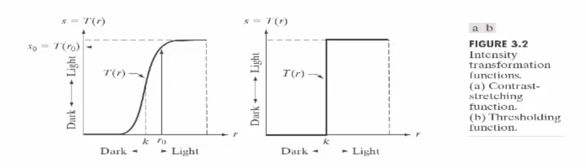
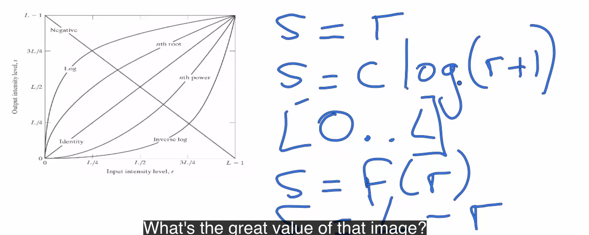
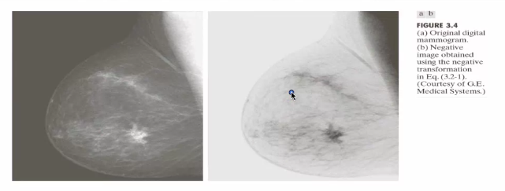
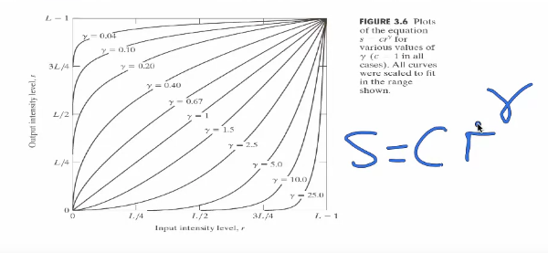
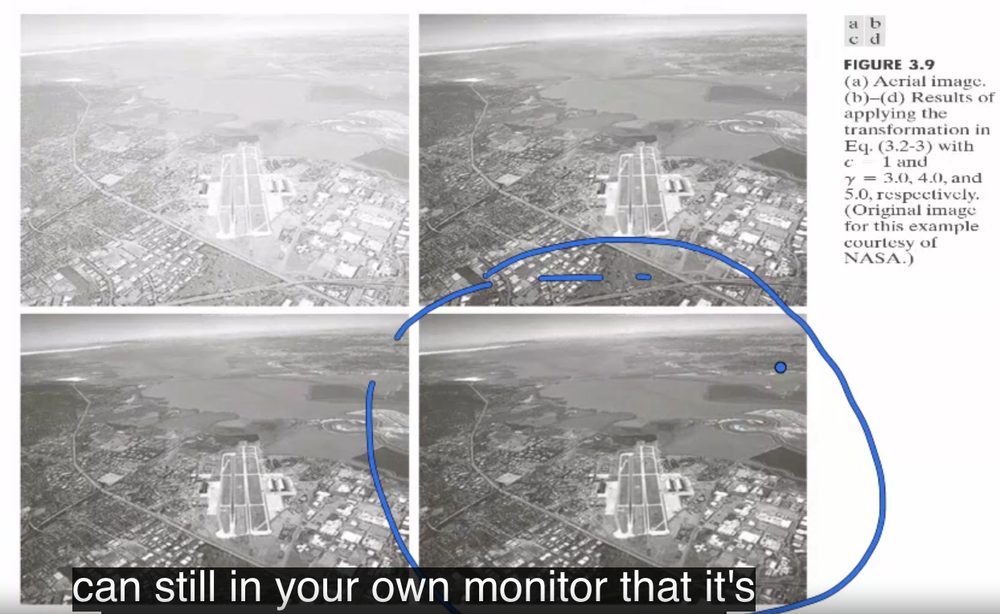
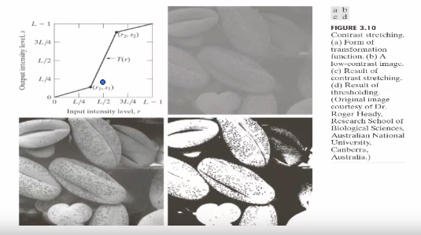
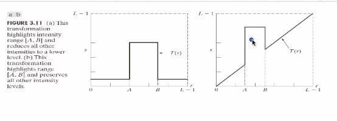
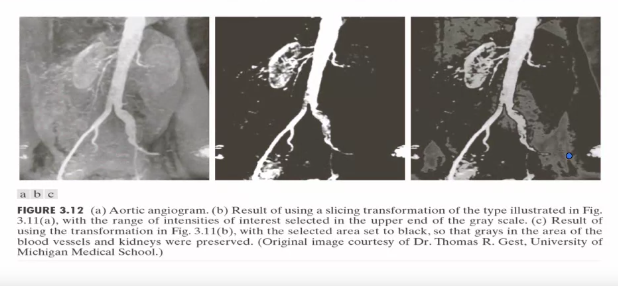

# Week3: Spetial Processing

## 의문

- *Hounsfield scale 역시 Pointwise operation인가?*

## 3.1 Introduction to image enhancement

- 배경
  - 이미지가 너무 어둡다면?
  - 이미지가 너무 밝다면?
  - 노이즈가 있다면?

### Pointwise operation

Pointwise operation

Various Pointwise operation

Reverse operation example(`s = L - r`)

- 활용
  - 이미지를 negative함

exponential operation example: gamma correction(`s = cr^sigma?`)

gamma correction의 구체적 예시

contrast stretching

또 다른 operation

ROI concentration

- 개요
  - pixel value histogram을 stretch시켜줌
- 활용
  - 일부 모니터에서 사용
    - 모니터에서 어둡게 나오는 이미지를 좀더 밝게 보이게 함
  - 너무 밝은 이미지를 적당히 사물이 구분되는 이미지로 보이게 함
- 특징
  - 일부 국소적인 부분에만 적용하는것도 가능

---

- 정의
  - 각 점의 빛의 강도에 대한 연산(주변 점에 영향을 받지 않음)
